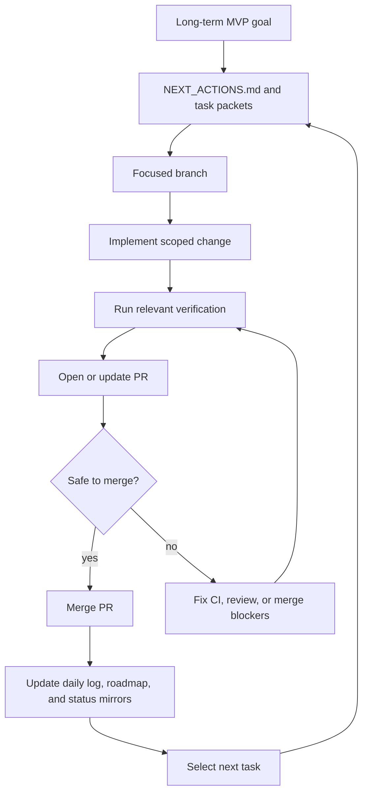

# AI-First Roadmap

Last updated: 2026-04-19

## Purpose

This document explains how the repository should operate when AI is expected to finish work, complete pull requests, merge safely, and continue toward the contest MVP with minimal manual orchestration.

## Long-Term Goal

Build a stable VnExpress Sáng kiến Khoa học 2026 MVP:

Teacher creates Knowledge Pack -> AI generates assessment -> Student learns with Tutor Agent -> Teacher sees dashboard.

## Autonomous Loop

## Merge Policy

- Docs, task, and workflow PRs may be auto-merged when mergeable, non-draft, and not blocked by review.
- Runtime and product PRs may be auto-merged only when relevant tests or required checks pass and no review blocks the PR.
- CI failures and blocking reviews are the next task until fixed.
- AI must not push directly to `main`.

## How AI Chooses Next Work

1. Fix active PR blockers.
2. Continue active task packets in `docs/superpowers/tasks/`.
3. Use the compact queue in `ai_first/NEXT_ACTIONS.md`.
4. Derive the next short task from the MVP goal only after creating or updating a task packet.

## Human Checkpoints

Human review remains important for product direction, contest story, irreversible scope changes, credential or deployment decisions, and any PR marked as blocked or requiring human judgment.

## Development Direction

### Near Term

- Keep issue state aligned with merged PRs so completed work does not stay in the active queue.
- Add a compact execution queue/status board packet for the next AI worker to implement.
- Keep every PR tied to an architecture note with Mermaid.

### Mid Term

- Keep evidence, demo scripts, and screenshots current for the contest.
- Tighten issue labels and PR status conventions for autonomous selection.
- Use the execution queue/status board to surface blockers, latest merges, and next recommended task.

### Later

- Consider GitHub Actions or scripts for queue reporting after the manual loop is proven stable.
- Add stronger automation only after merge gates, CI expectations, review signals, and queue hygiene are reliable.
