# Main System Map

Last updated: 2026-04-28

This is the required top-level Mermaid map for the project. Any PR that adds, removes, or materially changes product features, capabilities, tools, routers, routes, data models, or AI-first workflow must update this map.

```mermaid
flowchart TD
  Project["Multiagent Learning Platform"]

  Project --> Entry["Entry Points"]
  Entry --> Web["Next.js Web App"]
  Entry --> API["FastAPI API"]
  Entry --> CLI["Typer CLI"]
  Entry --> SDK["Python SDK"]

  Project --> Runtime["Agent-native Runtime"]
  Runtime --> Orchestrator["ChatOrchestrator"]
  Runtime --> ToolRegistry["ToolRegistry"]
  Runtime --> CapabilityRegistry["CapabilityRegistry"]
  Runtime --> StreamBus["StreamBus"]
  Runtime --> RuntimePolicy["Runtime Policy Compiler"]
  Runtime --> RuntimePolicy["Runtime Policy Assembly"]
  RuntimePolicy --> PolicyCompiler["services/runtime_policy/compiler.py"]
  RuntimePolicy --> PolicyAudit["Inspectable audit trace: slices + sources + version"]
  RuntimePolicy --> PolicySlices["SOUL/RULES/WORKFLOW/ASSESSMENT/KNOWLEDGE"]
  RuntimePolicy --> SourcePriority["teacher_kb > curriculum_excerpt > teacher_rules > llm_prior_knowledge"]

  ToolRegistry --> Tools["Built-in Tools"]
  Tools --> RagTool["rag"]
  Tools --> WebSearch["web_search"]
  Tools --> CodeExecution["code_execution"]
  Tools --> Reason["reason"]
  Tools --> Brainstorm["brainstorm"]

  CapabilityRegistry --> Capabilities["Capabilities"]
  Capabilities --> Chat["chat"]
  Capabilities --> DeepSolve["deep_solve"]
  Capabilities --> DeepQuestion["deep_question"]
  RuntimePolicy --> Chat
  RuntimePolicy --> DeepSolve
  RuntimePolicy --> DeepQuestion
  RuntimePolicy --> PolicyBoundary["Teacher Spec / Student State / Session State"]
  RuntimePolicy --> TurnBinding["Bounded turn binding: chat + deep_question + deep_solve"]

  Project --> Product["Contest MVP Product Layer"]
  Product --> TeacherWorkspace["Teacher Workspace"]
  TeacherWorkspace --> AgentSpecAuthoring["Agent Spec Authoring"]
  AgentSpecAuthoring --> AgentSpecUI["/agents authoring tab"]
  AgentSpecAuthoring --> AgentSpecAPI["/api/v1/agent-specs"]
  AgentSpecAuthoring --> AgentSpecAuditAPI["/api/v1/agent-specs/{agent_id}/runtime-policy-audit"]
  AgentSpecAuthoring --> AgentSpecStorage["Versioned Markdown spec packs"]
  AgentSpecStorage --> RuntimePolicy
  AgentSpecAuditAPI --> RuntimePolicy
  Product --> KnowledgePack["Knowledge Pack"]
  KnowledgePack --> KPMetaFlow["Metadata Create/Edit/Update Flow"]
  KnowledgePack --> KPVersions["Versioned teacher-pack metadata: current_version + version_history"]
  
  Product --> Marketplace["Knowledge Pack Marketplace"]
  Marketplace --> MarketplaceAPI["/api/v1/marketplace"]
  Marketplace --> MarketplaceUI["/marketplace"]
  Marketplace --> MarketplaceFilters["Search/Subject/Owner Filters"]
  Marketplace --> MarketplacePreview["GET /api/v1/marketplace/{pack_name}/preview"]
  MarketplacePreview --> PreviewModal["Preview modal: metadata + sample documents"]
  MarketplacePreview --> PackRatings["Average rating + recent reviews"]
  Marketplace --> MarketplaceImport["POST /api/v1/marketplace/import/{pack_name}"]
  Marketplace --> MarketplaceBatchImport["POST /api/v1/marketplace/import-batch"]
  Marketplace --> MarketplaceReviewAPI["POST /api/v1/marketplace/{pack_name}/reviews"]
  MarketplaceReviewAPI --> ReviewStorage["KB config: marketplace_reviews metadata"]
  MarketplaceImport --> ImportedClone["Imported KB clone: <pack>__imported"]
  MarketplaceBatchImport --> BatchSelectUI["Multi-select cards + import selected action bar"]
  MarketplaceBatchImport --> ImportedClone
  ImportedClone --> OfflinePackManifest["Browser offline imported-pack manifest"]
  
  Product --> AssessmentBuilder["Assessment Builder"]
  AssessmentBuilder --> QuizGrounding["Knowledge Pack Grounded Quiz Config"]
  AssessmentBuilder --> AdaptiveDifficulty["Adaptive Difficulty from Recent Quiz Performance"]
  AssessmentBuilder --> AssessmentRecommendAPI["POST /api/v1/assessment/recommend"]
  AssessmentBuilder --> AssessmentDiagnosisAPI["GET /api/v1/assessment/diagnosis/{session_id}"]
  AssessmentRecommendAPI --> RecommendEngine["Assessment Recommendation Engine"]
  RecommendEngine --> AssessmentSignals["Weak topics + score trend + KB context"]
  AssessmentDiagnosisAPI --> EvidenceExtractor["Observation extractor (assessment + tutoring runtime)"]
  EvidenceExtractor --> ObservationStore["SQLite observations + student_states (+ enriched rollups)"]
  ObservationStore --> DiagnosisEngine["Rule-first diagnosis + action selection"]
  DiagnosisEngine --> DiagnosisTaxonomy["Diagnosis taxonomy scoring: misconception patterns + state boosts"]
  DiagnosisEngine --> EvidenceGate["Evidence sufficiency gate: thin / stale / mixed"]
  DiagnosisEngine --> ConfidenceCalibration["Confidence calibration: evidence density + recency + support burden"]
  ObservationStore --> StudentModel["Student model signals: mastery + support + misconception"]
  StudentModel --> DiagnosisEngine
  AdaptiveDifficulty --> QuizHistory["[Quiz Performance] session context"]
  AdaptiveDifficulty --> DeepQuestion
  
  Product --> StudentTutor["Student Tutor Workspace"]
  StudentTutor --> TutorKBContext["Knowledge Pack Tutoring Context"]
  StudentTutor --> TutorKBBadges["KB Context Badges in Chat Messages"]
  StudentTutor --> TutorFollowups["Optional follow-up questions in tutor replies"]
  TutorKBBadges --> SnapshotKBs["Message requestSnapshot.knowledgeBases"]
  TutorFollowups --> ChatResponse["Agentic chat final response section: Follow-up questions"]
  
  Product --> TeacherDashboard["Teacher Dashboard"]
  TeacherDashboard --> DashboardSummary["Session Activity Summary"]
  DashboardSummary --> DashboardFilters["History filters: type + KB + search + min score"]
  DashboardSummary --> TeacherAnalytics["Teacher Analytics Signals"]
  TeacherDashboard --> TeacherInsights["Teacher Insight Panel"]
  TeacherAnalytics --> EngagementSignals["Engagement: active days + streak + KB usage"]
  TeacherAnalytics --> AssessmentTrend["Assessment trend: average + latest + delta"]
  TeacherAnalytics --> DifficultySignals["Learning signals: focus topics + strong areas"]
  TeacherInsights --> InsightsAPI["GET /api/v1/dashboard/insights"]
  TeacherInsights --> DiagnosisFeedbackAPI["POST/PATCH /api/v1/dashboard/diagnosis-feedback"]
  TeacherInsights --> RecommendationAckAPI["POST/PATCH /api/v1/dashboard/recommendation-acks"]
  TeacherInsights --> RecommendationFeedbackAPI["POST/PATCH /api/v1/dashboard/recommendation-feedback"]
  TeacherInsights --> TeacherOverrideAPI["POST/PATCH /api/v1/dashboard/teacher-overrides"]
  TeacherInsights --> TeacherActionAPI["POST/PATCH /api/v1/dashboard/teacher-actions"]
  TeacherInsights --> InterventionAssignmentAPI["POST/PATCH /api/v1/dashboard/intervention-assignments"]
  InsightsAPI --> DiagnosisEngine
  EvidenceGate --> InsightsAPI
  InsightsAPI --> DiagnosisFeedback["Diagnosis feedback records"]
  InsightsAPI --> SmallGroupRecommendations["Small-group recommendation clusters"]
  InsightsAPI --> RecommendationAcks["Recommendation acknowledgement records"]
  InsightsAPI --> RecommendationFeedback["Recommendation quality feedback records"]
  InsightsAPI --> TeacherOverrides["Teacher override records"]
  InsightsAPI --> TeacherActions["Teacher action records"]
  InsightsAPI --> InterventionAssignments["Intervention assignment records"]
  InsightsAPI --> InterventionEffectiveness["Observational intervention effectiveness summaries"]
  DiagnosisFeedbackAPI --> DiagnosisFeedback
  RecommendationAckAPI --> RecommendationAcks
  RecommendationFeedbackAPI --> RecommendationFeedback
  TeacherOverrideAPI --> TeacherOverrides
  DiagnosisFeedback --> RecommendationAckAPI
  RecommendationAcks --> RecommendationFeedbackAPI
  RecommendationFeedback --> TeacherOverrideAPI
  TeacherOverrides --> TeacherActionAPI
  RecommendationFeedback --> TeacherActionAPI
  RecommendationAcks --> TeacherActionAPI
  TeacherActionAPI --> TeacherActions
  TeacherActions --> InterventionAssignmentAPI
  InterventionAssignmentAPI --> InterventionAssignments
  TeacherDashboard --> StudentDashboard["Student Progress Dashboard"]
  TeacherDashboard --> AssessmentReview["Assessment Review Drill-down"]
  StudentDashboard --> StudentRoute["/dashboard/student"]
  StudentDashboard --> StudentProgressAPI["GET /api/v1/dashboard/student-progress"]
  StudentDashboard --> TrendCards["Streak + average score + recent assessments"]
  StudentDashboard --> TopicSignals["Focus topics + mastered topics"]
  StudentDashboard --> LearningPathSignals["Suggested learning path sequence"]
  StudentDashboard --> DiagnosisFeedbackDetail["Diagnosis feedback summary"]
  StudentDashboard --> RecommendationAckDetail["Recommendation acknowledgement summary"]
  StudentDashboard --> TeacherActionDetail["Teacher actions section + status updates"]
  StudentDashboard --> AssignmentDetail["Intervention assignments section + status updates"]
  StudentDashboard --> InterventionHistoryDetail["Intervention history timeline across acknowledgement, action, assignment, and diagnosis feedback"]
  InterventionHistoryDetail --> InterventionEffectiveness
  LearningPathSignals --> PathEngine["Deterministic learning-path helper"]
  PathEngine --> FocusTopicInputs["Focus topics from assessment analysis"]
  PathEngine --> ObjectiveInputs["Knowledge-pack learning_objectives metadata"]
  AssessmentReview --> ReviewRoute["/dashboard/assessments/[sessionId]"]
  AssessmentReview --> ReviewAPI["/api/v1/sessions/{session_id}/assessment-review"]
  AssessmentReview --> AssessmentRubricAPI["POST/PATCH /api/v1/sessions/{session_id}/assessment-rubric-review"]
  AssessmentReview --> OfflineQuizQueue["Browser offline quiz-result sync queue"]
  AssessmentReview --> ProgressIndicator["ProgressIndicator Component"]
  AssessmentReview --> LearningJourney["LearningJourneySummary Component"]
  AssessmentReview --> AssessmentRubricReview["Teacher rubric review card"]
  AssessmentReview --> TimeMetrics["Timing metrics: total + average + per-question response time"]
  AssessmentReview --> AssessErrorBoundary["Route Error Boundary: /dashboard/assessments/error.tsx"]
  ReviewAPI --> QuizTranscript["[Quiz Performance] transcript with optional time: Ns suffix"]
  ProgressIndicator --> ScoreViz["Score Progress Bar + Recommendations"]
  LearningJourney --> TopicBadges["Mastered/Recommended Topics"]
  Marketplace --> MarketErrorBoundary["Route Error Boundary: /marketplace/error.tsx"]

  Project --> Localization["Internationalization (i18n)"]
  Localization --> UITranslations["UI Translations"]
  UITranslations --> EnglishUI["web/locales/en/"]
  UITranslations --> ChineseUI["web/locales/zh/"]
  UITranslations --> VietnameseUI["web/locales/vi/"]
  Localization --> PromptSystem["Prompt Localization"]
  PromptSystem --> PromptManager["PromptManager (unified)"]
  PromptManager --> VietnameseFallback["vi → en fallback chain"]
  Localization --> LanguageSettings["Settings: en/zh/vi"]

  Product --> ValidationOps["Validation Ops"]
  ValidationOps --> ValidationStatus["Contest validation status surfaces"]
  ValidationStatus --> PilotStatusDoc["docs/contest/PILOT_STATUS.md"]
  ValidationStatus --> PilotStatusAPI["GET /api/v1/system/pilot-feedback-status"]
  ValidationStatus --> PilotFeedbackAPI["POST/GET /api/v1/system/pilot-feedback"]
  PilotFeedbackAPI --> PilotFeedbackStore["Pilot feedback records (bounded validation-ops storage)"]

  Project --> Data["Data Layer"]
  Data --> SQLite["data/user/chat_history.db"]
  Data --> KnowledgeBases["data/knowledge_bases"]
  Data --> Memory["data/memory"]
  Data --> Settings["data/user/settings"]
  Data --> Workspace["data/user/workspace"]
  Workspace --> AgentSpecWorkspace["agent_specs/<agent_id>/ + versions/"]

  Project --> AIFirst["AI-first Operating Layer"]
  AIFirst --> OperatingPrompt["ai_first/AI_OPERATING_PROMPT.md"]
  AIFirst --> Roadmap["ai_first/AI_FIRST_ROADMAP.md"]
  AIFirst --> CurrentState["ai_first/CURRENT_STATE.md"]
  AIFirst --> NextActions["ai_first/NEXT_ACTIONS.md"]
  AIFirst --> Specs["docs/superpowers/specs"]
  AIFirst --> Plans["docs/superpowers/plans"]
  AIFirst --> Tasks["docs/superpowers/tasks"]
  AIFirst --> Evidence["ai_first/evidence"]
  AIFirst --> AutoLoop["Autonomous completion loop"]
  AutoLoop --> MergeGates["Safe merge gates"]
  AutoLoop --> NextTask["Next task selection"]

  Project --> GitHub["GitHub Execution Layer"]
  GitHub --> Issues["Issues"]
  GitHub --> Labels["pod-a / pod-b / blocked / needs-review"]
  GitHub --> PRs["Pull Requests"]
  GitHub --> CI["CI Checks"]
  GitHub --> Reviews["Review blockers"]
  PRs --> PRNotes["docs/superpowers/pr-notes"]
  PRs --> CI
  PRs --> Reviews
  API --> APISecurity["API Security Middleware"]
  APISecurity --> RateLimit["Rate limiting + 429 Retry-After"]
  MergeGates --> PRs
  MergeGates --> CI
  MergeGates --> Reviews
  NextTask --> Issues
  NextTask --> Tasks
  NextTask --> NextActions
```

