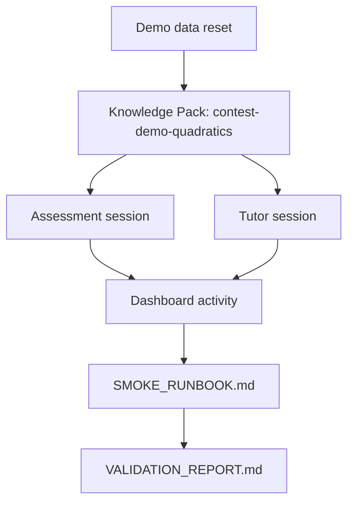

# Demo Data Reset Runbook

Use this runbook before a smoke run or evidence refresh when the local demo state may be missing, stale, or private. It defines the demo-safe state required for the contest MVP path:

Teacher creates Knowledge Pack -> AI generates assessment -> Student learns with Tutor Agent -> Teacher sees dashboard.

This is a docs/workflow runbook. It does not add a seed script yet. If a future lane adds automation, keep this file as the human-readable contract.

## Demo-Safe State Inventory

| State | Required value | Why it exists |
| --- | --- | --- |
| Knowledge Pack identifier | `contest-demo-quadratics` | Shared context for Knowledge Pack, assessment, tutor, and dashboard evidence. |
| Subject | `Mathematics` | Keeps the assessment and tutor story consistent. |
| Grade | `Grade 9` | Gives the demo a realistic classroom level. |
| Curriculum | `Vietnam secondary algebra` | Makes the contest story local and teacher-oriented. |
| Learning objective | Solve quadratic equations and explain common mistakes | Connects generated assessment, feedback, and tutoring. |
| Owner | `Contest Demo Teacher` | Shows teacher-owned pack metadata without private data. |
| Sharing status | `demo` or equivalent non-private status | Makes clear that this is safe public demo data. |
| Assessment session | `contest-assessment-demo` | Lets smoke checks confirm assessment activity exists. |
| Tutor session | `contest-tutor-demo` | Lets smoke checks confirm student tutoring activity exists. |
| Dashboard activity | Assessment and tutor records referencing the demo Knowledge Pack | Proves the teacher can review recent learning activity. |

Do not use real student names, private class data, API keys, or provider credentials in demo data.

## Reset Modes

Use the safest available mode for the environment.

| Mode | Current status | Use when |
| --- | --- | --- |
| Manual UI reset | Available | You are preparing an interactive demo and can use the web app. |
| Manual API/database reset | Allowed only for local demo data | You need to recreate demo-safe sessions before smoke. |
| Scripted seed/reset | Future lane | The manual process is proven and should be automated. |

## Manual UI Reset

1. Start the backend using the repository-local environment.
2. Start or build the frontend with `NEXT_PUBLIC_API_BASE=http://localhost:8001`.
3. Open the Knowledge page.
4. Create or update the `contest-demo-quadratics` Knowledge Pack with the inventory above.
5. Reload the Knowledge page and confirm metadata persists.
6. Open the assessment workflow and generate or verify a demo assessment using the same Knowledge Pack.
7. Open the Tutor workspace and ask one student-style follow-up question using the same Knowledge Pack.
8. Open the Dashboard and confirm recent assessment and tutor activity is visible.
9. Run `SMOKE_RUNBOOK.md`.
10. Update `VALIDATION_REPORT.md` only after smoke passes.

## Manual Local Data Reset

Use this only for local demo data that can be safely recreated.

1. Back up any local data you may need before changing `data/`.
2. Remove or replace only demo-specific records for:
   - Knowledge Pack `contest-demo-quadratics`;
   - session `contest-assessment-demo`;
   - session `contest-tutor-demo`.
3. Recreate the inventory in this runbook through the UI or local API.
4. Re-run the smoke runbook.
5. If smoke fails, record the failure as `Blocked` in the validation report instead of marking evidence current.

This repository intentionally does not commit local `data/` changes as evidence.

## Future Script Contract

If this lane is automated later, the script should:

- create or update only demo-safe records;
- be idempotent;
- avoid provider credentials and private data;
- print the Knowledge Pack id and session ids it created;
- refuse to run against production or unknown environments;
- leave screenshots and optional video as manual refresh steps.

Recommended future location:

- runbook stays here: `docs/contest/DEMO_DATA_RESET.md`;
- script, if added later: `scripts/contest/reset_demo_data.py` or another explicit contest/demo path.

## Verification Checklist

| Check | Expected result | Evidence file |
| --- | --- | --- |
| Knowledge Pack exists | `contest-demo-quadratics` appears with demo-safe metadata | `VALIDATION_REPORT.md` |
| Assessment session exists | `contest-assessment-demo` can be fetched locally | `VALIDATION_REPORT.md` |
| Tutor session exists | `contest-tutor-demo` can be fetched locally | `VALIDATION_REPORT.md` |
| Dashboard sees activity | Dashboard overview and recent endpoints show demo context | `VALIDATION_REPORT.md` |
| Screenshots remain meaningful | Existing screenshot status is `Current`, or updated to `Stale`/`Blocked` | `EVIDENCE_CHECKLIST.md` |

## Mermaid Flow

