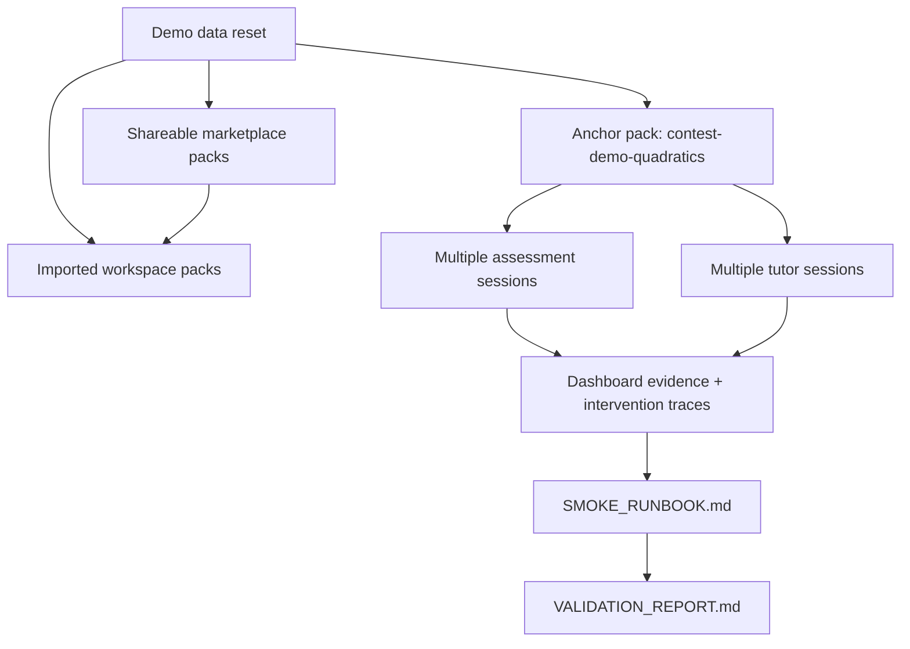

# Demo Data Reset Runbook

Use this runbook before a smoke run or evidence refresh when the local demo state may be missing, stale, or private. It defines the demo-safe state required for the contest MVP path:

Teacher creates Knowledge Pack -> AI generates assessment -> Student learns with Tutor Agent -> Teacher sees dashboard.

This runbook is backed by a local demo-safe reset utility. It writes only local demo data under the selected repository root.

## Demo-Safe State Inventory

| State | Required value | Why it exists |
| --- | --- | --- |
| Anchor Knowledge Pack identifier | `contest-demo-quadratics` | Shared context for the flagship contest algebra story. |
| Shareable marketplace packs | At least `6` public/team packs with varied metadata | Makes marketplace search, sort, preview, and import look real during video capture. |
| Imported workspace packs | At least `2` private `__imported` packs | Shows that a teacher has already brought packs into the local workspace. |
| Subject | `Mathematics` | Keeps the assessment and tutor story consistent. |
| Grade | `Grade 9` | Gives the demo a realistic classroom level. |
| Curriculum | `Vietnam secondary algebra` | Makes the contest story local and teacher-oriented. |
| Learning objective | Solve quadratic equations and explain common mistakes | Connects generated assessment, feedback, and tutoring. |
| Owner | `Contest Demo Teacher` | Shows teacher-owned pack metadata without private data. |
| Sharing status | Public/team for marketplace packs, private for imported packs | Separates browseable packs from teacher-owned workspace copies. |
| Assessment sessions | `contest-assessment-demo` plus additional classroom sessions | Lets review and dashboard pages show believable trends instead of one stub. |
| Tutor sessions | `contest-tutor-demo` plus additional follow-up sessions | Gives replay pages multiple realistic teacher/student conversations. |
| Dashboard activity | Observations, student states, acknowledgements, feedback, overrides, actions, and intervention assignments | Proves the teacher can review and act on evidence across the full loop. |

Do not use real student names, private class data, API keys, or provider credentials in demo data.

## Reset Modes

Use the safest available mode for the environment.

| Mode | Current status | Use when |
| --- | --- | --- |
| Manual UI reset | Available | You are preparing an interactive demo and can use the web app. |
| Manual API/database reset | Allowed only for local demo data | You need to recreate demo-safe sessions before smoke. |
| Scripted seed/reset | Available | You need a repeatable local reset before smoke or evidence refresh. |

## Scripted Local Reset

Run this from the repository root:

```bash
/Users/nguyenhuuloc/Documents/Multiagent-learning-platform/.venv/bin/python -m scripts.contest.reset_demo_data --project-root . --api-base http://localhost:8001
```

The command:

- validates that `--api-base` is local;
- creates or updates a richer set of shareable and imported demo-safe Knowledge Packs;
- creates or replaces the anchor sessions `contest-assessment-demo` and `contest-tutor-demo`;
- seeds additional assessment and tutor sessions for the same classroom story;
- seeds dashboard evidence tables so recommendation, acknowledgement, feedback, override, and intervention cards are non-empty;
- prints the ids and local paths it touched;
- can be run repeatedly without duplicating demo sessions.

After reset plus smoke, the automation helper can write a machine-readable command-evidence snapshot:

```bash
PATH="/Users/nguyenhuuloc/Documents/Multiagent-learning-platform/.venv/bin:$PATH" \
  /Users/nguyenhuuloc/Documents/Multiagent-learning-platform/.venv/bin/python -m scripts.contest.refresh_evidence_status --project-root . --api-base http://localhost:8001
```

This `PATH` prefix matters because the helper currently invokes `python3` internally for the reset check.

Generated local `data/` changes are not committed.

## Manual UI Reset

1. Start the backend using the repository-local environment.
2. Start or build the frontend with `NEXT_PUBLIC_API_BASE=http://localhost:8001`.
3. Open the Knowledge page.
4. Create or update the `contest-demo-quadratics` Knowledge Pack with the inventory above.
5. Reload the Knowledge page and confirm metadata persists.
6. Open the assessment workflow and generate or verify a demo assessment using the same Knowledge Pack.
7. Open the Tutor workspace and ask one student-style follow-up question using the same Knowledge Pack.
8. Open the Dashboard and confirm recent assessment and tutor activity is visible.
9. Run `SMOKE_RUNBOOK.md`.
10. Update `VALIDATION_REPORT.md` only after smoke passes.

## Manual Local Data Reset

Use this only for local demo data that can be safely recreated.

1. Back up any local data you may need before changing `data/`.
2. Remove or replace only demo-specific records for:
   - demo-safe Knowledge Packs created by the reset utility;
   - all `contest-...` sessions created by the reset utility;
   - demo student observations and teacher-evidence rows created by the reset utility.
3. Recreate the inventory in this runbook through the UI or local API.
4. Re-run the smoke runbook.
5. If smoke fails, record the failure as `Blocked` in the validation report instead of marking evidence current.

This repository intentionally does not commit local `data/` changes as evidence.

## Script Contract

The reset script must:

- create or update only demo-safe records;
- be idempotent;
- avoid provider credentials and private data;
- print the anchor Knowledge Pack id and the session ids it created;
- refuse to run against production or unknown environments;
- leave screenshots and optional video as manual refresh steps.

Current location:

- runbook stays here: `docs/contest/DEMO_DATA_RESET.md`;
- script: `scripts/contest/reset_demo_data.py`.

## Verification Checklist

| Check | Expected result | Evidence file |
| --- | --- | --- |
| Marketplace breadth exists | At least 6 public/team packs and at least 2 imported private packs exist locally | `VALIDATION_REPORT.md` |
| Anchor Knowledge Pack exists | `contest-demo-quadratics` appears with demo-safe metadata | `VALIDATION_REPORT.md` |
| Assessment sessions exist | `contest-assessment-demo` and additional classroom assessments can be fetched locally | `VALIDATION_REPORT.md` |
| Tutor sessions exist | `contest-tutor-demo` and additional replay sessions can be fetched locally | `VALIDATION_REPORT.md` |
| Dashboard sees full evidence | Overview, recent activity, and teacher-insight cards show demo context with non-empty intervention traces | `VALIDATION_REPORT.md` |
| Screenshots remain meaningful | Existing screenshot status is `Current`, or updated to `Stale`/`Blocked` | `EVIDENCE_CHECKLIST.md` |

## Mermaid Flow


