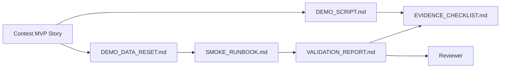

# Contest Evidence Bundle

This folder is the entry point for VnExpress Sang kien Khoa hoc 2026 demo evidence.

## MVP Story

Teacher creates Knowledge Pack -> AI generates assessment -> Student learns with Tutor Agent -> Teacher sees dashboard.

## Hybrid Proof Scope

This evidence bundle now supports a hybrid contest narrative:

- Teacher authoring proof: the teacher can structure Agent Specs on `/agents` and export a spec pack.
- Learning evidence-loop proof: Knowledge Pack -> assessment -> tutoring follow-up -> dashboard activity.

Teacher-value framing for presenters:

- `IDENTITY` lets a teacher choose who the tutor is for: subject, grade band, tone, and language.
- `SOUL` lets a teacher decide how the tutor reacts when a student is wrong, stuck, or discouraged.
- `RULES` lets a teacher keep classroom boundaries such as no direct answers, hint limits, or escalation expectations.
- The dashboard is not only reporting activity; it helps the teacher decide what to reteach, who needs follow-up, and which students can be grouped around the same misconception.

The repository now includes bounded proof that the unified live turn path can carry `config.agent_spec_id` into Tutor runtime policy assembly and produce a visible behavior difference between two spec packs. Do not expand that claim into universal coverage across every entry point unless a fresh smoke run verifies those additional paths.

## Evidence Files

- [`SUBMISSION_PACKAGE.md`](./SUBMISSION_PACKAGE.md): compact final review path for contest submission.
- [`DEMO_SCRIPT.md`](./DEMO_SCRIPT.md): step-by-step demo path for a reviewer or presenter.
- [`EVIDENCE_CHECKLIST.md`](./EVIDENCE_CHECKLIST.md): required screenshots, optional video, and pass/fail evidence fields.
- [`VALIDATION_REPORT.md`](./VALIDATION_REPORT.md): local validation commands, results, limitations, and remaining capture work.
- [`DIAGNOSIS_CASE_STUDIES.md`](./DIAGNOSIS_CASE_STUDIES.md): judge-facing diagnosis examples and teacher-review framing.
- [`SMOKE_RUNBOOK.md`](./SMOKE_RUNBOOK.md): smoke lane used to verify the MVP path before any evidence refresh.
- [`DEMO_DATA_RESET.md`](./DEMO_DATA_RESET.md): demo-safe data inventory and reset runbook before smoke/evidence refresh.

## Current Status

- Product MVP path is implemented through merged PRs for Knowledge Pack, Assessment Builder, Student Tutor context, and Teacher Dashboard.
- Teacher Agent Spec authoring UI/API and runtime policy assembly contracts are merged on `main` and documented as hybrid-proof context.
- Diagnosis and recommendation outputs are framed as rule-assisted, confidence-tagged, teacher-reviewed hypotheses rather than benchmarked autonomous judgments.
- The latest scripted-reset smoke-backed MVP verification passed on 2026-04-26 and is recorded in [`VALIDATION_REPORT.md`](./VALIDATION_REPORT.md).
- Screenshot evidence is captured in [`screenshots/`](./screenshots/), including the 2026-04-26 dashboard evidence-first refresh and the `/agents` authoring proof refresh.
- Hybrid `/agents` screenshots are current, and the codebase now also carries automated bounded runtime-binding proof for the unified Tutor turn path. Keep the claim narrower than universal entry-point coverage.
- Video capture is optional and deferred to avoid storing large media in the repository.

## Judge-Friendly Use Cases

1. A teacher can create one tutoring style for a lower-confidence class and another for an exam-prep class without changing the underlying lesson materials.
2. A teacher can draft an assessment from a Knowledge Pack, review it, then reuse the same knowledge source during tutoring.
3. A teacher can move from observed errors to a recommended next action instead of reading raw activity logs alone.

## Evidence Refresh Rules

Run [`DEMO_DATA_RESET.md`](./DEMO_DATA_RESET.md) first when local demo data may be stale, then run [`SMOKE_RUNBOOK.md`](./SMOKE_RUNBOOK.md), then refresh evidence using these rules:

- Auto-refresh evidence: smoke-backed command results, API reachability checks, and the evidence status table in [`VALIDATION_REPORT.md`](./VALIDATION_REPORT.md).
- Browser-triggered refresh: screenshots and any optional video, because they require an interactive capture step.
- Status vocabulary:
  - `Current`: evidence still matches the latest successful smoke run.
  - `Stale`: the MVP path changed after the last capture or validation.
  - `Blocked`: the evidence could not be refreshed because smoke failed or the environment was unavailable.
- Source of truth for freshness:
  - [`VALIDATION_REPORT.md`](./VALIDATION_REPORT.md) records the latest smoke-backed evidence status.
  - [`EVIDENCE_CHECKLIST.md`](./EVIDENCE_CHECKLIST.md) records which artifacts are current versus still awaiting manual recapture.

## Update Rules

- Update this folder whenever the demo flow, API behavior, or UI route changes.
- After every successful smoke pass, update the evidence status in [`VALIDATION_REPORT.md`](./VALIDATION_REPORT.md) before starting another docs or demo lane.
- Keep evidence free of secrets, private data, local credentials, and real student information.
- Store large videos outside the repository and link them from the checklist or validation report.

## Screenshot Index

- [`01-knowledge-pack-metadata.png`](./screenshots/01-knowledge-pack-metadata.png)
- [`02-knowledge-pack-after-reload.png`](./screenshots/02-knowledge-pack-after-reload.png)
- [`04-assessment-config.png`](./screenshots/04-assessment-config.png)
- [`07-assessment-generated-questions.png`](./screenshots/07-assessment-generated-questions.png)
- [`08-assessment-common-mistakes.png`](./screenshots/08-assessment-common-mistakes.png)
- [`06-tutor-agent-answer.png`](./screenshots/06-tutor-agent-answer.png)
- [`05-dashboard-evidence-first-overview.png`](./screenshots/05-dashboard-evidence-first-overview.png)
- [`09-dashboard-recent-activity-evidence-first.png`](./screenshots/09-dashboard-recent-activity-evidence-first.png)
- [`10-agents-spec-pack-authoring.png`](./screenshots/10-agents-spec-pack-authoring.png)
- [`11-agents-spec-pack-export.png`](./screenshots/11-agents-spec-pack-export.png)

## Evidence Flow

