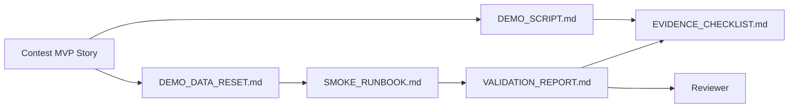

# Contest Evidence Bundle

This folder is the entry point for VnExpress Sang kien Khoa hoc 2026 demo evidence.

Current framing: this repository is a validated prototype with smoke-backed evidence and contest-safe walkthrough artifacts. It is not positioned as a deployed classroom system.

Official contest framing: a teacher-controlled adaptive tutoring platform for Vietnamese classrooms.

## MVP Story

Knowledge Pack -> Assessment -> Tutor -> Diagnosis -> Intervention.

The teacher dashboard is the operating surface that helps a teacher inspect diagnosis and choose interventions. It supports the loop; it is not a substitute for the loop.

## Anchor Classroom Case

Use one bounded classroom story throughout the contest package:

- Teacher: a Grade 9 math teacher
- Topic: quadratic equations in `Vietnam secondary algebra`
- Shared Knowledge Pack: `contest-demo-quadratics`
- Learning objective: solve quadratic equations and explain common mistakes
- Student weakness pattern: repeated confusion around factoring steps and checking both roots against the original equation
- Teacher move: review the dashboard signals, then assign one bounded remediation step or small-group follow-up instead of accepting the diagnosis as an autonomous verdict

This case is intentionally narrow. It is not a claim about broad classroom coverage; it is the single demo-safe story already backed by the repository reset runbook, smoke validation, and casepack framing.

## Bounded Metric Card

What is evidenced today for the anchor case:

| Metric | Current bounded claim | Source |
| --- | --- | --- |
| Demo-safe Knowledge Packs in the anchor story | `1` (`contest-demo-quadratics`) | `DEMO_DATA_RESET.md`, `VALIDATION_REPORT.md` |
| Verified demo sessions tied to that pack | `2` (`contest-assessment-demo`, `contest-tutor-demo`) | `VALIDATION_REPORT.md` |
| Verified command-backed loop surfaces | `4` (Knowledge Pack presence, assessment session, tutor session, dashboard review endpoints) | `VALIDATION_REPORT.md` |
| Verified session grounding coverage | `2/2` verified sessions carry the same Knowledge Pack context | `VALIDATION_REPORT.md` |
| Teacher-action framing present | `Yes` — recommendation, remediation, and intervention remain teacher-reviewed surfaces | `DEMO_SCRIPT.md`, `CASEPACK_AND_EVALUATION_DATASET.md`, `DIAGNOSIS_CASE_STUDIES.md` |

What this metric card does **not** claim:

- diagnosis accuracy percentages
- learning-gain or classroom-outcome impact
- pilot-scale effectiveness
- autonomous intervention quality without teacher review

## Submission Scope Freeze

Core submission scope:

- teacher-controlled adaptive tutoring for Vietnamese classrooms
- a single five-step loop: `Knowledge Pack -> Assessment -> Tutor -> Diagnosis -> Intervention`
- teacher-owned tutor control through `/agents` identity, style, and guardrails
- validated-prototype proof through smoke-backed walkthroughs, screenshots, and submission docs

Secondary proof that can be mentioned but should not replace the core story:

- marketplace reuse and batch import
- export, replay, timing, and offline-resilience helpers
- architecture readiness for deeper role separation later

Out of scope for contest claims:

- classroom outcome evidence
- school-scale deployment claims
- autonomous diagnosis without teacher review
- universal capability coverage beyond the currently documented proof paths

## Hybrid Proof Scope

This evidence bundle now supports a hybrid contest narrative:

- Teacher authoring proof: the teacher can structure Agent Specs on `/agents` and export a spec pack.
- Learning evidence-loop proof: `Knowledge Pack -> Assessment -> Tutor -> Diagnosis -> Intervention`, with dashboard activity as the teacher-facing operating surface around the last two stages.

Teacher-value framing for presenters:

- `IDENTITY` lets a teacher choose who the tutor is for: subject, grade band, tone, and language.
- `SOUL` lets a teacher decide how the tutor reacts when a student is wrong, stuck, or discouraged.
- `RULES` lets a teacher keep classroom boundaries such as no direct answers, hint limits, or escalation expectations.
- The dashboard is not only reporting activity; it helps the teacher review diagnosis, decide what to reteach, who needs follow-up, and which students can be grouped around the same misconception.

The repository now includes bounded proof that the unified live turn paths for `chat`, `deep_question`, and `deep_solve` can carry `config.agent_spec_id` into runtime policy assembly. Do not expand that claim into universal coverage across every capability or entry point unless a fresh verification run proves those additional paths.

The current product can be described as `agent-native` today and `multi-agent by design` as a future role-separation direction. Do not describe the current merged repository as a fully autonomous multi-agent deployment.

## Evidence Files

- [`SUBMISSION_PACKAGE.md`](./SUBMISSION_PACKAGE.md): compact final review path for contest submission.
- [`DEMO_SCRIPT.md`](./DEMO_SCRIPT.md): step-by-step demo path for a reviewer or presenter.
- [`EVIDENCE_CHECKLIST.md`](./EVIDENCE_CHECKLIST.md): required screenshots, optional video, and pass/fail evidence fields.
- [`VALIDATION_REPORT.md`](./VALIDATION_REPORT.md): local validation commands, results, limitations, and remaining capture work.
- [`PILOT_STATUS.md`](./PILOT_STATUS.md): explicit status of pilot or external-feedback evidence.
- [`DIAGNOSIS_CASE_STUDIES.md`](./DIAGNOSIS_CASE_STUDIES.md): judge-facing diagnosis examples and teacher-review framing.
- [`CASEPACK_AND_EVALUATION_DATASET.md`](./CASEPACK_AND_EVALUATION_DATASET.md): structured validation casepack guide backed by `ai_first/evidence/casepack.json`.
- `../../ai_first/evidence/evidence_status.json`: machine-readable status snapshot for command-backed evidence refresh.
- [`SMOKE_RUNBOOK.md`](./SMOKE_RUNBOOK.md): smoke lane used to verify the MVP path before any evidence refresh.
- [`DEMO_DATA_RESET.md`](./DEMO_DATA_RESET.md): demo-safe data inventory and reset runbook before smoke/evidence refresh.

## Current Status

- Product MVP path is implemented through merged PRs for Knowledge Pack, Assessment Builder, Student Tutor context, and Teacher Dashboard.
- Teacher Agent Spec authoring UI/API and runtime policy assembly contracts are merged on `main` and documented as hybrid-proof context.
- Diagnosis and recommendation outputs are framed as rule-assisted, confidence-tagged, teacher-reviewed hypotheses rather than benchmarked autonomous judgments.
- The latest scripted-reset smoke-backed MVP verification passed on 2026-04-26 and is recorded in [`VALIDATION_REPORT.md`](./VALIDATION_REPORT.md).
- Screenshot evidence is captured in [`screenshots/`](./screenshots/), including the 2026-04-26 dashboard evidence-first refresh and the `/agents` authoring proof refresh.
- Hybrid `/agents` screenshots are current, and the codebase now also carries automated bounded runtime-binding proof for the unified `chat`, `deep_question`, and `deep_solve` turn paths. Keep the claim narrower than universal entry-point coverage.
- Video capture is optional and deferred to avoid storing large media in the repository.
- No pilot evidence is currently bundled; the strongest current proof is structured walkthrough validation plus smoke-backed and screenshot-backed artifacts.
- Judge-safe validation examples now have both prose case studies and a reusable machine-readable casepack for future evaluation reuse.
- Command-backed evidence refresh now also has a machine-readable status artifact; screenshots and video remain manual artifacts.

## Judge-Friendly Use Cases

1. A teacher can create one tutoring style for a lower-confidence class and another for an exam-prep class without changing the underlying lesson materials.
2. A teacher can draft an assessment from a Knowledge Pack, review it, then reuse the same knowledge source during tutoring.
3. A teacher can move from observed errors to a recommended next action instead of reading raw activity logs alone.

## Dashboard Story Cards

1. A student misses several items on one topic and needs repeated support, so the teacher move is to reteach one prerequisite with one more scaffolded example.
2. A student answers quickly but inconsistently, so the teacher move is to slow the next check and require one reasoning step before another hint.
3. A small group shares the same misconception, so the teacher move is to pull them into one remediation mini-group before the next assessment.

## Evidence Refresh Rules

Run [`DEMO_DATA_RESET.md`](./DEMO_DATA_RESET.md) first when local demo data may be stale, then run [`SMOKE_RUNBOOK.md`](./SMOKE_RUNBOOK.md), then refresh evidence using these rules:

- Auto-refresh evidence: smoke-backed command results, API reachability checks, and the evidence status table in [`VALIDATION_REPORT.md`](./VALIDATION_REPORT.md).
- Browser-triggered refresh: screenshots and any optional video, because they require an interactive capture step.
- Status vocabulary:
  - `Current`: evidence still matches the latest successful smoke run.
  - `Stale`: the MVP path changed after the last capture or validation.
  - `Blocked`: the evidence could not be refreshed because smoke failed or the environment was unavailable.
- Source of truth for freshness:
  - [`VALIDATION_REPORT.md`](./VALIDATION_REPORT.md) records the latest smoke-backed evidence status.
  - [`EVIDENCE_CHECKLIST.md`](./EVIDENCE_CHECKLIST.md) records which artifacts are current versus still awaiting manual recapture.

## Update Rules

- Update this folder whenever the demo flow, API behavior, or UI route changes.
- After every successful smoke pass, update the evidence status in [`VALIDATION_REPORT.md`](./VALIDATION_REPORT.md) before starting another docs or demo lane.
- Keep evidence free of secrets, private data, local credentials, and real student information.
- Store large videos outside the repository and link them from the checklist or validation report.

## Screenshot Index

Recommended review order for judges:

1. [`10-agents-spec-pack-authoring.png`](./screenshots/10-agents-spec-pack-authoring.png) - teacher sets audience, coaching style, and guardrails
2. [`11-agents-spec-pack-export.png`](./screenshots/11-agents-spec-pack-export.png) - tutor setup is portable and reviewable
3. [`01-knowledge-pack-metadata.png`](./screenshots/01-knowledge-pack-metadata.png) - teacher sets trusted classroom source material
4. [`02-knowledge-pack-after-reload.png`](./screenshots/02-knowledge-pack-after-reload.png) - the configured context persists
5. [`04-assessment-config.png`](./screenshots/04-assessment-config.png) - assessment drafting stays grounded in the same pack
6. [`07-assessment-generated-questions.png`](./screenshots/07-assessment-generated-questions.png) - the platform drafts practice items from that context
7. [`08-assessment-common-mistakes.png`](./screenshots/08-assessment-common-mistakes.png) - assessment output includes feedback signals
8. [`06-tutor-agent-answer.png`](./screenshots/06-tutor-agent-answer.png) - the tutor gives adaptive support on the same topic
9. [`05-dashboard-evidence-first-overview.png`](./screenshots/05-dashboard-evidence-first-overview.png) - the teacher reviews signals and next actions
10. [`09-dashboard-recent-activity-evidence-first.png`](./screenshots/09-dashboard-recent-activity-evidence-first.png) - the teacher can inspect the activity underneath the dashboard layer

## Evidence Flow

