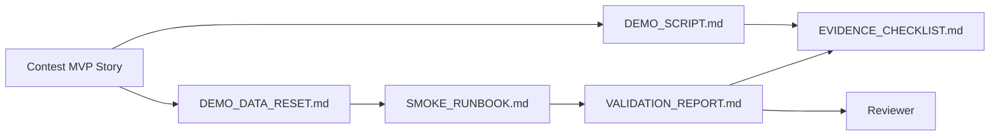

# Contest Evidence Bundle

This folder is the entry point for VnExpress Sang kien Khoa hoc 2026 demo evidence.

## MVP Story

Teacher creates Knowledge Pack -> AI generates assessment -> Student learns with Tutor Agent -> Teacher sees dashboard.

## Hybrid Proof Scope

This evidence bundle now supports a hybrid contest narrative:

- Teacher authoring proof: the teacher can structure Agent Specs on `/agents` and export a spec pack.
- Learning evidence-loop proof: Knowledge Pack -> assessment -> tutoring follow-up -> dashboard activity.

Runtime wiring between a selected `agent_spec_id` and every live turn request is still treated as a known limitation unless explicitly re-verified by smoke.

## Evidence Files

- [`SUBMISSION_PACKAGE.md`](./SUBMISSION_PACKAGE.md): compact final review path for contest submission.
- [`DEMO_SCRIPT.md`](./DEMO_SCRIPT.md): step-by-step demo path for a reviewer or presenter.
- [`EVIDENCE_CHECKLIST.md`](./EVIDENCE_CHECKLIST.md): required screenshots, optional video, and pass/fail evidence fields.
- [`VALIDATION_REPORT.md`](./VALIDATION_REPORT.md): local validation commands, results, limitations, and remaining capture work.
- [`SMOKE_RUNBOOK.md`](./SMOKE_RUNBOOK.md): smoke lane used to verify the MVP path before any evidence refresh.
- [`DEMO_DATA_RESET.md`](./DEMO_DATA_RESET.md): demo-safe data inventory and reset runbook before smoke/evidence refresh.

## Current Status

- Product MVP path is implemented through merged PRs for Knowledge Pack, Assessment Builder, Student Tutor context, and Teacher Dashboard.
- Teacher Agent Spec authoring UI/API and runtime policy assembly contracts are merged on `main` and documented as hybrid-proof context.
- The latest scripted-reset smoke-backed MVP verification passed on 2026-04-26 and is recorded in [`VALIDATION_REPORT.md`](./VALIDATION_REPORT.md).
- Screenshot evidence is captured in [`screenshots/`](./screenshots/), but the dashboard rows are now `Stale` because Lane 5 changed the teacher insight workflow after the refreshed `T037` re-run on 2026-04-25.
- Hybrid `/agents` screenshots are intentionally marked `Stale` until a dedicated recapture run is completed.
- Video capture is optional and deferred to avoid storing large media in the repository.

## Evidence Refresh Rules

Run [`DEMO_DATA_RESET.md`](./DEMO_DATA_RESET.md) first when local demo data may be stale, then run [`SMOKE_RUNBOOK.md`](./SMOKE_RUNBOOK.md), then refresh evidence using these rules:

- Auto-refresh evidence: smoke-backed command results, API reachability checks, and the evidence status table in [`VALIDATION_REPORT.md`](./VALIDATION_REPORT.md).
- Browser-triggered refresh: screenshots and any optional video, because they require an interactive capture step.
- Status vocabulary:
  - `Current`: evidence still matches the latest successful smoke run.
  - `Stale`: the MVP path changed after the last capture or validation.
  - `Blocked`: the evidence could not be refreshed because smoke failed or the environment was unavailable.
- Source of truth for freshness:
  - [`VALIDATION_REPORT.md`](./VALIDATION_REPORT.md) records the latest smoke-backed evidence status.
  - [`EVIDENCE_CHECKLIST.md`](./EVIDENCE_CHECKLIST.md) records which artifacts are current versus still awaiting manual recapture.

## Update Rules

- Update this folder whenever the demo flow, API behavior, or UI route changes.
- After every successful smoke pass, update the evidence status in [`VALIDATION_REPORT.md`](./VALIDATION_REPORT.md) before starting another docs or demo lane.
- Keep evidence free of secrets, private data, local credentials, and real student information.
- Store large videos outside the repository and link them from the checklist or validation report.

## Screenshot Index

- [`01-knowledge-pack-metadata.png`](./screenshots/01-knowledge-pack-metadata.png)
- [`02-knowledge-pack-after-reload.png`](./screenshots/02-knowledge-pack-after-reload.png)
- [`04-assessment-config.png`](./screenshots/04-assessment-config.png)
- [`07-assessment-generated-questions.png`](./screenshots/07-assessment-generated-questions.png)
- [`08-assessment-common-mistakes.png`](./screenshots/08-assessment-common-mistakes.png)
- [`06-tutor-agent-answer.png`](./screenshots/06-tutor-agent-answer.png)
- [`05-dashboard-summary-and-activity.png`](./screenshots/05-dashboard-summary-and-activity.png)

## Evidence Flow

