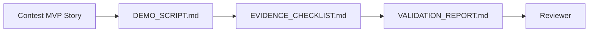

# Contest Evidence Bundle

This folder is the entry point for VnExpress Sang kien Khoa hoc 2026 demo evidence.

## MVP Story

Teacher creates Knowledge Pack -> AI generates assessment -> Student learns with Tutor Agent -> Teacher sees dashboard.

## Evidence Files

- [`DEMO_SCRIPT.md`](./DEMO_SCRIPT.md): step-by-step demo path for a reviewer or presenter.
- [`EVIDENCE_CHECKLIST.md`](./EVIDENCE_CHECKLIST.md): required screenshots, optional video, and pass/fail evidence fields.
- [`VALIDATION_REPORT.md`](./VALIDATION_REPORT.md): local validation commands, results, limitations, and remaining capture work.

## Current Status

- Product MVP path is implemented through merged PRs for Knowledge Pack, Assessment Builder, Student Tutor context, and Teacher Dashboard.
- Local command validation is recorded in [`VALIDATION_REPORT.md`](./VALIDATION_REPORT.md).
- Screenshot and video capture are still pending and should be completed after starting the backend and frontend locally.

## Update Rules

- Update this folder whenever the demo flow, API behavior, or UI route changes.
- Keep evidence free of secrets, private data, local credentials, and real student information.
- Store large videos outside the repository and link them from the checklist or validation report.

## Evidence Flow

