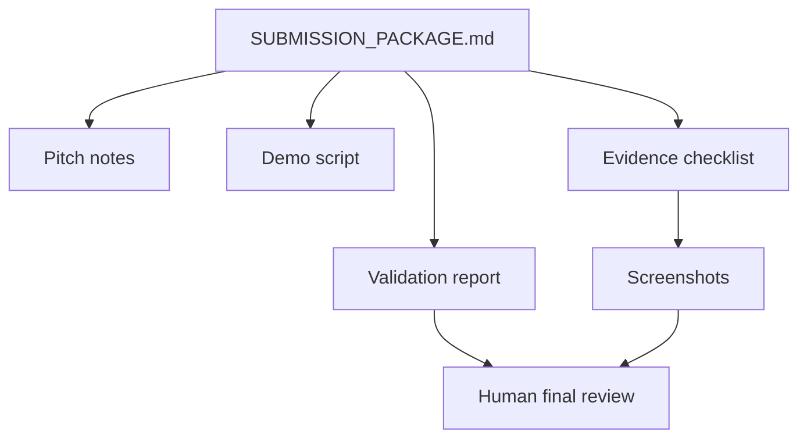

# Contest Submission Package

Use this as the short review path before submitting the VnExpress Sang kien Khoa hoc 2026 MVP.

## Submission Story

Teacher creates Knowledge Pack -> AI generates assessment -> Student learns with Tutor Agent -> Teacher sees dashboard.

One-line pitch:

An AI-first learning platform where Vietnamese teachers create Knowledge Packs and teaching skills, then AI Tutor Agents help students learn, practice, and improve from teacher-approved materials.

Hybrid proof calibration:

- Teacher authoring capability on `/agents` is part of the merged product story.
- Contest evidence-loop proof remains anchored to smoke-backed Knowledge Pack -> assessment -> tutor -> dashboard artifacts.
- You may claim bounded automated proof that the unified Tutor turn path accepts `config.agent_spec_id` and changes behavior across two contrasting spec packs. Do not expand that into universal live turn-time binding unless broader paths are re-verified in the target demo environment.
- Diagnosis claims should stay at: rule-assisted, confidence-tagged, teacher-reviewed hypothesis layer. Do not present the diagnosis engine as a benchmarked autonomous assessor.

Primary pitch source: [`ai_first/competition/pitch-notes.md`](../../ai_first/competition/pitch-notes.md).

## Ready Evidence

| Item | Status | Source |
| --- | --- | --- |
| Demo script | Ready | [`DEMO_SCRIPT.md`](./DEMO_SCRIPT.md) |
| Smoke-backed validation | Ready | [`VALIDATION_REPORT.md`](./VALIDATION_REPORT.md) |
| Evidence checklist | Ready | [`EVIDENCE_CHECKLIST.md`](./EVIDENCE_CHECKLIST.md) |
| Diagnosis credibility cases | Ready | [`DIAGNOSIS_CASE_STUDIES.md`](./DIAGNOSIS_CASE_STUDIES.md) |
| Screenshot bundle | Ready | [`screenshots/`](./screenshots/) |
| Demo-safe reset command | Ready | [`DEMO_DATA_RESET.md`](./DEMO_DATA_RESET.md) |
| Smoke procedure | Ready | [`SMOKE_RUNBOOK.md`](./SMOKE_RUNBOOK.md) |
| Contest rules summary | Ready | [`ai_first/competition/vnexpress-rules-summary.md`](../../ai_first/competition/vnexpress-rules-summary.md) |
| Product description draft | Ready for human review | [`ai_first/competition/product-description.md`](../../ai_first/competition/product-description.md) |
| Fork modifications note | Ready | [`ai_first/competition/fork-modifications.md`](../../ai_first/competition/fork-modifications.md) |
| Human review handoff | Ready | [`HUMAN_REVIEW_HANDOFF.md`](./HUMAN_REVIEW_HANDOFF.md) |
| Optional video runbook | Ready if needed | [`VIDEO_CAPTURE_RUNBOOK.md`](./VIDEO_CAPTURE_RUNBOOK.md) |
| Final checklist | Partially verified | [`ai_first/competition/submission-checklist.md`](../../ai_first/competition/submission-checklist.md) |
| Optional video | Deferred | Record only if final submission requires a video artifact. |

## Latest Validation

The latest smoke-backed refresh passed on 2026-04-26 after running the scripted local reset. It verified:

- demo-safe Knowledge Pack `contest-demo-quadratics`;
- assessment session `contest-assessment-demo`;
- tutor session `contest-tutor-demo`;
- dashboard overview and recent activity including the contest sessions;
- dashboard evidence-first and `/agents` authoring screenshots were recaptured on 2026-04-26;
- frontend production build with `NEXT_PUBLIC_API_BASE=http://localhost:8001`.

Detailed command evidence lives in [`VALIDATION_REPORT.md`](./VALIDATION_REPORT.md). The refresh lanes are `#96` and `#128` for smoke-backed evidence, and `#99` plus `#130` for the screenshot bundle.

## Human Review Checklist

Before final submission, a human should review:

- product description and category fit for the Education field;
- intellectual property commitment;
- whether optional video is required;
- screenshots for clarity and absence of private data;
- known limitations and environment notes in [`VALIDATION_REPORT.md`](./VALIDATION_REPORT.md);
- Apache 2.0 license and HKUDS/DeepTutor attribution.

AI-verifiable checklist items are tracked in [`ai_first/competition/submission-checklist.md`](../../ai_first/competition/submission-checklist.md). Human-only items stay unchecked until a final manual review happens.
Use [`HUMAN_REVIEW_HANDOFF.md`](./HUMAN_REVIEW_HANDOFF.md) for the shortest remaining manual review path.
If the submission requires video, use [`VIDEO_CAPTURE_RUNBOOK.md`](./VIDEO_CAPTURE_RUNBOOK.md) before recording.

## Known Limitations

- Optional video is deferred to avoid storing large media in the repository.
- Provider-backed AI quality depends on configured model credentials.
- Hybrid authoring evidence for `/agents` now has dedicated screenshots in the contest bundle.
- The backend `deeptutor.api.run_server` path has a reload/absolute-pattern incompatibility with the installed `uvicorn`; latest smoke used the CLI server path with reload disabled.
- Frontend build may need network access to fetch Google Fonts.
- Knowledge, assessment, and tutor screenshots remain current from the 2026-04-25 `T037` re-run; dashboard evidence-first and hybrid `/agents` authoring screenshots were refreshed on 2026-04-26.

## Review Flow

