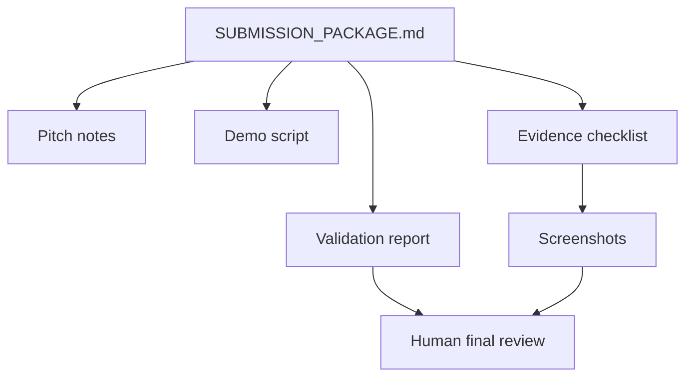

# Contest Submission Package

Use this as the short review path before submitting the VnExpress Sang kien Khoa hoc 2026 MVP.

## Submission Story

Knowledge Pack -> Assessment -> Tutor -> Diagnosis -> Intervention.

One-line pitch:

A teacher-controlled adaptive tutoring platform where Vietnamese teachers turn their own materials into practice, tutoring, diagnosis review, and follow-up intervention while staying in control of how the AI teaches.

## Scope Freeze

Primary contest scope:

- one official product loop: `Knowledge Pack -> Assessment -> Tutor -> Diagnosis -> Intervention`
- teacher control over source knowledge, tutor behavior, and intervention choice
- validated prototype proof only

Secondary supporting scope:

- `/agents` authoring as teacher-control proof
- marketplace reuse, batch import, export, replay, and offline helpers
- dashboard evidence as the operator surface around diagnosis and intervention

Out-of-scope claims:

- classroom outcome proof
- school-scale deployment
- autonomous final judgment without teacher review
- universal runtime-binding proof across every entry point

Hybrid proof calibration:

- Teacher authoring capability on `/agents` is part of the merged product story.
- Contest evidence-loop proof remains anchored to smoke-backed `Knowledge Pack -> Assessment -> Tutor -> Diagnosis -> Intervention` walkthrough artifacts, with the dashboard serving as the teacher-facing operating surface around the last two stages.
- You may claim bounded automated proof that the unified Tutor turn path accepts `config.agent_spec_id` and changes behavior across two contrasting spec packs. Do not expand that into universal live turn-time binding unless broader paths are re-verified in the target demo environment.
- Diagnosis claims should stay at: rule-assisted, confidence-tagged, teacher-reviewed hypothesis layer. Do not present the diagnosis engine as a benchmarked autonomous assessor.
- Assessment claims should stay at: AI can draft questions and feedback, but teacher review is the primary safety gate before student-facing reuse.
- Overall product framing should stay at: validated prototype, not school-scale deployment.
- Architecture framing should stay at: agent-native today, prepared for deeper multi-agent role separation later.

## Claim And Proof Contract

Use these pairings when preparing the final package:

| Claim | Allowed proof source | Guardrail |
| --- | --- | --- |
| Teacher-controlled adaptive tutoring loop | [`docs/contest/README.md`](./README.md), [`ai_first/competition/product-description.md`](../../ai_first/competition/product-description.md), screenshots, smoke-backed demo flow | Keep the loop at `Knowledge Pack -> Assessment -> Tutor -> Diagnosis -> Intervention` |
| `/agents` improves teacher control | `/agents` screenshots, pitch notes, bounded runtime-binding wording already documented in this package | Do not expand bounded proof into universal entry-point coverage |
| Diagnosis and recommendations help teacher follow-up | [`DIAGNOSIS_CASE_STUDIES.md`](./DIAGNOSIS_CASE_STUDIES.md), dashboard screenshots, validation-backed walkthrough | Present them as teacher-reviewed hypotheses, not autonomous grading |
| Submission package is reviewable end to end | this file, [`HUMAN_REVIEW_HANDOFF.md`](./HUMAN_REVIEW_HANDOFF.md), checklist, validation report | Keep Session B validation status authoritative |

Teacher-value shorthand for Q&A:

- `IDENTITY` = who this tutor is for.
- `SOUL` = how this tutor teaches and encourages.
- `RULES` = what this tutor is not allowed to do.
- Dashboard value = which student or small group needs what next.

Primary pitch source: [`ai_first/competition/pitch-notes.md`](../../ai_first/competition/pitch-notes.md).

## Ready Evidence

| Item | Status | Source |
| --- | --- | --- |
| Demo script | Ready | [`DEMO_SCRIPT.md`](./DEMO_SCRIPT.md) |
| Smoke-backed validation | Ready | [`VALIDATION_REPORT.md`](./VALIDATION_REPORT.md) |
| Evidence checklist | Ready | [`EVIDENCE_CHECKLIST.md`](./EVIDENCE_CHECKLIST.md) |
| Diagnosis credibility cases | Ready | [`DIAGNOSIS_CASE_STUDIES.md`](./DIAGNOSIS_CASE_STUDIES.md) |
| Structured validation casepack | Ready | [`CASEPACK_AND_EVALUATION_DATASET.md`](./CASEPACK_AND_EVALUATION_DATASET.md) |
| Screenshot bundle | Ready | [`screenshots/`](./screenshots/) |
| Demo-safe reset command | Ready | [`DEMO_DATA_RESET.md`](./DEMO_DATA_RESET.md) |
| Smoke procedure | Ready | [`SMOKE_RUNBOOK.md`](./SMOKE_RUNBOOK.md) |
| Pilot / external feedback status | Ready | [`PILOT_STATUS.md`](./PILOT_STATUS.md) |
| Contest rules summary | Ready | [`ai_first/competition/vnexpress-rules-summary.md`](../../ai_first/competition/vnexpress-rules-summary.md) |
| Product description draft | Ready for human review | [`ai_first/competition/product-description.md`](../../ai_first/competition/product-description.md) |
| Fork modifications note | Ready | [`ai_first/competition/fork-modifications.md`](../../ai_first/competition/fork-modifications.md) |
| Human review handoff | Ready | [`HUMAN_REVIEW_HANDOFF.md`](./HUMAN_REVIEW_HANDOFF.md) |
| Optional video runbook | Ready if needed | [`VIDEO_CAPTURE_RUNBOOK.md`](./VIDEO_CAPTURE_RUNBOOK.md) |
| Final checklist | Partially verified | [`ai_first/competition/submission-checklist.md`](../../ai_first/competition/submission-checklist.md) |
| Optional video | Deferred | Record only if final submission requires a video artifact. |

## Recommended Judge Visual Order

If a reviewer wants the shortest screenshot-driven proof path, present the visual bundle in this order:

1. `/agents` authoring to establish teacher control
2. Knowledge Pack metadata to establish grounded source material
3. Assessment screenshots to show AI-generated practice and feedback
4. Tutor screenshot to show adaptive support on the same topic
5. Dashboard screenshots to show teacher-reviewed diagnosis and next action

Use the screenshots as validated-prototype support only. They show teacher control, adaptive support, and review surfaces; they do not establish classroom outcome proof or autonomous teacher replacement.

## Latest Validation

The latest command-backed smoke refresh passed on 2026-04-28 after running the scripted local reset. It verified:

- demo-safe Knowledge Pack `contest-demo-quadratics`;
- assessment session `contest-assessment-demo`;
- tutor session `contest-tutor-demo`;
- dashboard overview and recent activity including the contest sessions;
- frontend production build with `NEXT_PUBLIC_API_BASE=http://localhost:8001`;
- retained screenshot freshness authority from the last real browser captures on 2026-04-25 and 2026-04-26.

Detailed command evidence lives in [`VALIDATION_REPORT.md`](./VALIDATION_REPORT.md). The refresh lanes are `#96` and `#128` for the earlier smoke-backed evidence foundation, `#99` plus `#130` for the screenshot bundle, and `#212` for the latest Session B validation/evidence refresh. This validation record supports a validated prototype claim. It does not, by itself, establish classroom deployment or outcome evidence.

## Operator Read Path

Read in this order before final submission:

1. [`docs/contest/SUBMISSION_PACKAGE.md`](./SUBMISSION_PACKAGE.md)
2. [`docs/contest/HUMAN_REVIEW_HANDOFF.md`](./HUMAN_REVIEW_HANDOFF.md)
3. [`ai_first/competition/product-description.md`](../../ai_first/competition/product-description.md)
4. [`ai_first/competition/fork-modifications.md`](../../ai_first/competition/fork-modifications.md)
5. [`docs/contest/VALIDATION_REPORT.md`](./VALIDATION_REPORT.md)
6. [`docs/contest/EVIDENCE_CHECKLIST.md`](./EVIDENCE_CHECKLIST.md)

## Validation Authority

These items remain authoritative outside the Session A narrative files and are already merged through the Session B refresh:

| Dependency | Source of truth | Current handling |
| --- | --- | --- |
| Core-loop revalidation wording | [`VALIDATION_REPORT.md`](./VALIDATION_REPORT.md) | current after Session B refresh on 2026-04-28 |
| Smoke/reset contract wording | [`SMOKE_RUNBOOK.md`](./SMOKE_RUNBOOK.md), [`DEMO_DATA_RESET.md`](./DEMO_DATA_RESET.md) | current after Session B refresh on 2026-04-28 |
| Evidence freshness rows | [`EVIDENCE_CHECKLIST.md`](./EVIDENCE_CHECKLIST.md), [`VALIDATION_REPORT.md`](./VALIDATION_REPORT.md) | current after Session B refresh on 2026-04-28 |
| Final package readiness call | this file plus the files above | unblocked for human review; keep Session B files authoritative if wording diverges |

## Human Review Checklist

Before final submission, a human should review:

- product description and category fit for the Education field;
- intellectual property commitment;
- whether optional video is required;
- screenshots for clarity and absence of private data;
- known limitations and environment notes in [`VALIDATION_REPORT.md`](./VALIDATION_REPORT.md);
- Apache 2.0 license and HKUDS/DeepTutor attribution.

AI-verifiable checklist items are tracked in [`ai_first/competition/submission-checklist.md`](../../ai_first/competition/submission-checklist.md). Human-only items stay unchecked until a final manual review happens.
Use [`HUMAN_REVIEW_HANDOFF.md`](./HUMAN_REVIEW_HANDOFF.md) for the shortest remaining manual review path.
If the submission requires video, use [`VIDEO_CAPTURE_RUNBOOK.md`](./VIDEO_CAPTURE_RUNBOOK.md) before recording.
The package is now ready for final human review, not automatic final sign-off.

## Known Limitations

- Optional video is deferred to avoid storing large media in the repository.
- Provider-backed AI quality depends on configured model credentials.
- Hybrid authoring evidence for `/agents` now has dedicated screenshots in the contest bundle.
- The backend `deeptutor.api.run_server` path has a reload/absolute-pattern incompatibility with the installed `uvicorn`; latest smoke used the CLI server path with reload disabled.
- Frontend build may need network access to fetch Google Fonts.
- Knowledge, assessment, and tutor screenshots remain current from the 2026-04-25 `T037` re-run; dashboard evidence-first and hybrid `/agents` authoring screenshots were refreshed on 2026-04-26.

## Review Flow

