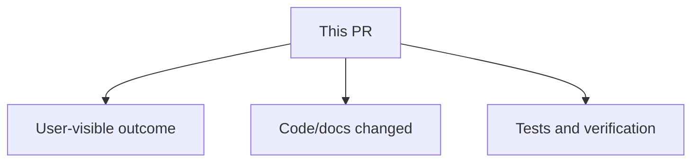
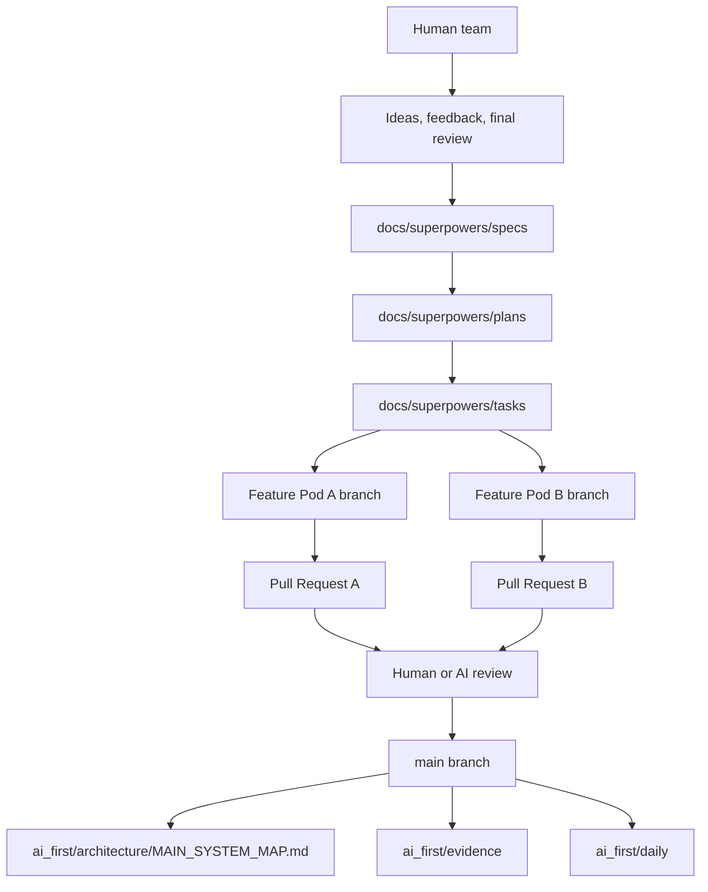

# AI-first Project OS Implementation Plan

> **For agentic workers:** REQUIRED SUB-SKILL: Use superpowers:subagent-driven-development (recommended) or superpowers:executing-plans to implement this plan task-by-task. Steps use checkbox (`- [ ]`) syntax for tracking.

**Goal:** Build the repository-level AI-first operating system so two AI Feature Pods can implement the contest MVP safely through Markdown specs, GitHub Issues, PRs, Mermaid architecture maps, and daily handoff logs.

**Architecture:** This is a documentation and workflow layer. `AGENTS.md` injects mandatory repo behavior, `ai_first/` stores long-term project memory and competition evidence, `docs/superpowers/` stores approved specs/plans/tasks, and `.github/pull_request_template.md` enforces PR architecture notes and Mermaid updates.

**Tech Stack:** Markdown, Mermaid, GitHub Issues/PRs, existing DeepTutor Python/FastAPI/Next.js repository conventions.

---

## Scope Notes

This plan implements Milestone 0 and the documentation shell for Milestone 1. It does not implement Teacher Knowledge Pack, Assessment Builder, Student Tutor Workspace, or Dashboard product features. Those will get separate specs/plans after the operating system is in place.

The current worktree has unrelated existing changes:

```text
M docs/package-lock.json
M web/package-lock.json
?? ai_first/
```

Workers must not revert those files. If implementing this plan, inspect the existing `ai_first/` content first and merge with it instead of deleting it.

## File Structure

Create or modify these files:

- Modify: `AGENTS.md`  
  Responsibility: inject AI-first behavior at the top while preserving existing DeepTutor architecture instructions.

- Create/merge: `ai_first/README.md`  
  Responsibility: explain the AI-first project memory layout.

- Create: `ai_first/AI_OPERATING_PROMPT.md`  
  Responsibility: mandatory behavior for every AI worker.

- Create: `ai_first/CURRENT_STATE.md`  
  Responsibility: compact project snapshot for new AI sessions.

- Create: `ai_first/NEXT_ACTIONS.md`  
  Responsibility: short ordered action queue.

- Create: `ai_first/architecture/README.md`  
  Responsibility: explain architecture-map rules.

- Create: `ai_first/architecture/MAIN_SYSTEM_MAP.md`  
  Responsibility: main Mermaid system map, mandatory update target for structural PRs.

- Create: `ai_first/architecture/feature-maps/README.md`  
  Responsibility: explain feature-level Mermaid maps.

- Create: `ai_first/competition/vnexpress-rules-summary.md`  
  Responsibility: summarize contest criteria and timeline.

- Create: `ai_first/competition/submission-checklist.md`  
  Responsibility: checklist for the eventual contest submission package.

- Create: `ai_first/competition/pitch-notes.md`  
  Responsibility: seed product narrative for the contest.

- Create: `ai_first/decisions/ADR-0001-ai-first-operating-model.md`  
  Responsibility: record the approved hybrid operating model decision.

- Create: `ai_first/daily/2026-04-12.md`  
  Responsibility: first daily log and handoff note.

- Create: `ai_first/evidence/demo-script.md`  
  Responsibility: initial demo script skeleton for the contest MVP.

- Create: `ai_first/evidence/screenshots.md`  
  Responsibility: evidence checklist for screenshots/video.

- Create: `ai_first/evidence/technical-runbook.md`  
  Responsibility: technical runbook skeleton for judges and team members.

- Create/merge: `ai_first/prompts/README.md`  
  Responsibility: describe how important prompts are stored.

- Create: `ai_first/templates/daily-log.md`  
  Responsibility: reusable daily log template.

- Create: `ai_first/templates/feature-pod-task.md`  
  Responsibility: reusable Feature Pod task packet template.

- Create: `ai_first/templates/handoff-note.md`  
  Responsibility: reusable handoff template.

- Create: `ai_first/templates/pr-architecture-note.md`  
  Responsibility: required PR architecture note template with Mermaid.

- Create: `docs/superpowers/plans/README.md`  
  Responsibility: explain implementation plan folder.

- Create: `docs/superpowers/tasks/README.md`  
  Responsibility: explain task packet folder.

- Create: `docs/superpowers/tasks/templates/feature-pod-task.md`  
  Responsibility: mirror task template for execution planning.

- Create: `docs/superpowers/tasks/templates/pr-checklist.md`  
  Responsibility: PR checklist template.

- Create: `docs/superpowers/tasks/templates/handoff-note.md`  
  Responsibility: execution handoff template.

- Create: `docs/superpowers/pr-notes/README.md`  
  Responsibility: explain PR architecture notes.

- Modify: `.github/pull_request_template.md`  
  Responsibility: require Mermaid PR note, main map update decision, tests, and handoff.

- Modify/create: `.gitignore`  
  Responsibility: ignore `.superpowers/` visual companion artifacts if not already ignored.

---

### Task 1: Inject AI-first Instructions Into `AGENTS.md`

**Files:**
- Modify: `AGENTS.md`

- [ ] **Step 1: Inspect the existing file**

Run:

```bash
sed -n '1,80p' AGENTS.md
```

Expected: the file starts with `# DeepTutor — Agent-Native Architecture`.

- [ ] **Step 2: Prepend the AI-first section**

Insert this exact section at the very top of `AGENTS.md`, before `# DeepTutor — Agent-Native Architecture`:

```markdown
# AI-first Project Operating Instructions

This is an AI-first competition project for VnExpress Sáng kiến Khoa học 2026.

Before making changes, every AI worker must:

1. Read `ai_first/AI_OPERATING_PROMPT.md`.
2. Read `ai_first/CURRENT_STATE.md`.
3. Read `ai_first/NEXT_ACTIONS.md`.
4. Check `git status --short --branch`.
5. Confirm the assigned task scope, owned files, and do-not-touch files.

While working:

- Do not push directly to `main`.
- Work on a branch named `pod-a/<feature>`, `pod-b/<feature>`, `docs/<topic>`, or `fix/<topic>`.
- Do not modify files outside the assigned task scope unless the task packet is updated first.
- Preserve Apache 2.0 license and upstream HKUDS/DeepTutor credit.
- If adding, removing, or materially changing a feature, update `ai_first/architecture/MAIN_SYSTEM_MAP.md`.
- Every PR must include a Markdown architecture note under `docs/superpowers/pr-notes/` with at least one Mermaid diagram.

After making changes:

1. Run relevant tests or explain why they could not be run.
2. Update `ai_first/daily/YYYY-MM-DD.md`.
3. Update `ai_first/CURRENT_STATE.md` or `ai_first/NEXT_ACTIONS.md` if project status changed.
4. Leave handoff notes in the PR and task packet.

---
```

- [ ] **Step 3: Verify existing DeepTutor instructions remain**

Run:

```bash
rg -n "DeepTutor|ChatOrchestrator|ToolRegistry|CapabilityRegistry" AGENTS.md
```

Expected: matches still exist below the inserted section.

- [ ] **Step 4: Commit**

Run:

```bash
git add AGENTS.md
git commit -m "docs: inject AI-first operating instructions"
```

Expected: commit succeeds and only `AGENTS.md` is included.

---

### Task 2: Create Core `ai_first` Operating Files

**Files:**
- Create/merge: `ai_first/README.md`
- Create: `ai_first/AI_OPERATING_PROMPT.md`
- Create: `ai_first/CURRENT_STATE.md`
- Create: `ai_first/NEXT_ACTIONS.md`

- [ ] **Step 1: Inspect existing `ai_first` content**

Run:

```bash
find ai_first -maxdepth 3 -type f | sort
```

Expected: existing discussion artifacts may include `ai_first/2026-04-12-deeptutor-slimming/prompt.md` and `report.md`. Keep them.

- [ ] **Step 2: Create `ai_first/README.md`**

Write this content:

```markdown
# AI-first Project Memory

This directory stores the long-term memory for the AI-first development process.

AI workers must read these files before making changes:

1. `AI_OPERATING_PROMPT.md`
2. `CURRENT_STATE.md`
3. `NEXT_ACTIONS.md`

Directory responsibilities:

- `architecture/`: Mermaid architecture maps and feature diagrams.
- `competition/`: VnExpress contest rules, submission checklist, and pitch notes.
- `decisions/`: ADR-style decisions.
- `daily/`: daily progress and handoff logs.
- `evidence/`: demo scripts, screenshots, video notes, technical runbook.
- `prompts/`: important prompts and AI collaboration transcripts worth preserving.
- `templates/`: reusable templates for AI workers and PRs.

Do not store secrets, API keys, private student data, or unlicensed third-party content here.
```

- [ ] **Step 3: Create `ai_first/AI_OPERATING_PROMPT.md`**

Write this content:

```markdown
# AI Operating Prompt

You are working on an AI-first competition project built from HKUDS/DeepTutor under Apache 2.0.

## Mission

Build a stable VnExpress Sáng kiến Khoa học 2026 MVP:

Teacher creates Knowledge Pack -> AI generates assessment -> Student learns with Tutor Agent -> Teacher sees dashboard.

## Required startup sequence

Before edits:

1. Read `AGENTS.md`.
2. Read `ai_first/CURRENT_STATE.md`.
3. Read `ai_first/NEXT_ACTIONS.md`.
4. Read the relevant spec, plan, or task packet.
5. Run `git status --short --branch`.

## Work rules

- Never push directly to `main`.
- Use a focused branch.
- Respect `Owned files/modules` and `Do-not-touch files/modules`.
- Do not revert user or other-agent changes.
- Do not remove Apache 2.0 license or upstream credit.
- Do not modify lockfiles unless dependency changes require it.
- Prefer small, reviewable commits.

## Architecture rules

- `ai_first/architecture/MAIN_SYSTEM_MAP.md` is the main system map.
- Every PR must include a PR architecture note in `docs/superpowers/pr-notes/`.
- Every PR architecture note must include a Mermaid diagram.
- Update `MAIN_SYSTEM_MAP.md` when adding, removing, or materially changing features, tools, capabilities, routers, routes, data models, or the AI-first workflow.

## Completion rules

Before handing off:

1. Run relevant tests.
2. Record tests and failures.
3. Update `ai_first/daily/YYYY-MM-DD.md`.
4. Update `CURRENT_STATE.md` or `NEXT_ACTIONS.md` if status changed.
5. Add handoff notes with changed files, risks, and next recommended read path.
```

- [ ] **Step 4: Create `ai_first/CURRENT_STATE.md`**

Write this content:

```markdown
# Current State

Last updated: 2026-04-12

## Repository

- GitHub: `Creative-Science-Contest-2026/Multiagent-learning-platform`
- Base project: HKUDS/DeepTutor
- License: Apache 2.0
- Main branch policy: use PRs, do not push directly to `main`

## Product Goal

Build a stable contest MVP:

Teacher creates Knowledge Pack -> AI generates assessment -> Student learns with Tutor Agent -> Teacher sees dashboard.

## Operating Model

- Hybrid AI-first OS is approved.
- Markdown in repo is long-term source of truth.
- GitHub Issues and PRs coordinate active execution.
- Two Feature Pods may work in parallel after shared operating files land.

## Active Design

- Spec: `docs/superpowers/specs/2026-04-12-ai-first-project-os-design.md`
- Plan: `docs/superpowers/plans/2026-04-12-ai-first-project-os.md`

## Known Worktree Notes

Before this operating system work, the repository had existing local changes:

- `docs/package-lock.json`
- `web/package-lock.json`
- `ai_first/`

Do not revert unrelated changes.

## Near-term Milestones

1. Milestone 0: AI-first Project OS.
2. Milestone 1: Competition demo narrative.
3. Milestone 2: Teacher Knowledge Pack MVP.
4. Milestone 3: Assessment Builder MVP.
5. Milestone 4: Student Tutor Workspace MVP.
6. Milestone 5: Teacher Dashboard MVP.
```

- [ ] **Step 5: Create `ai_first/NEXT_ACTIONS.md`**

Write this content:

```markdown
# Next Actions

Last updated: 2026-04-12

## Immediate

1. Implement Milestone 0 operating files from `docs/superpowers/plans/2026-04-12-ai-first-project-os.md`.
2. Add required Mermaid architecture map and PR architecture note templates.
3. Update PR template to enforce architecture notes, tests, and handoff.
4. Create competition evidence skeleton for VnExpress submission.

## After Milestone 0

1. Create task packet for Pod A: Teacher Knowledge Pack MVP.
2. Create task packet for Pod B: Assessment Builder + Student Tutor Workspace MVP.
3. Mirror active task packets to GitHub Issues.
4. Start feature implementation branches.

## Human Review Needed

- Review the AI-first operating files after Milestone 0 PR.
- Confirm the first two Feature Pod task packets before implementation.
```

- [ ] **Step 6: Verify files exist**

Run:

```bash
test -f ai_first/README.md
test -f ai_first/AI_OPERATING_PROMPT.md
test -f ai_first/CURRENT_STATE.md
test -f ai_first/NEXT_ACTIONS.md
```

Expected: all commands exit with code 0.

- [ ] **Step 7: Commit**

Run:

```bash
git add ai_first/README.md ai_first/AI_OPERATING_PROMPT.md ai_first/CURRENT_STATE.md ai_first/NEXT_ACTIONS.md
git commit -m "docs: add AI-first project memory"
```

Expected: commit succeeds. Existing `ai_first/2026-04-12-deeptutor-slimming/` files may remain untracked unless intentionally added separately.

---

### Task 3: Add Architecture Map and Mermaid Rules

**Files:**
- Create: `ai_first/architecture/README.md`
- Create: `ai_first/architecture/MAIN_SYSTEM_MAP.md`
- Create: `ai_first/architecture/feature-maps/README.md`

- [ ] **Step 1: Create `ai_first/architecture/README.md`**

Write this content:

```markdown
# Architecture Maps

This folder stores Mermaid diagrams that keep the AI-first project understandable as multiple AI agents make changes.

## Main map

`MAIN_SYSTEM_MAP.md` is the top-level system map. Update it when a PR adds, removes, or materially changes:

- capabilities;
- tools;
- API routers;
- major frontend routes;
- data models or storage locations;
- Teacher -> Student -> Dashboard flows;
- AI-first workflow rules.

## Feature maps

Feature-specific diagrams live in `feature-maps/`.

Every PR must include a PR architecture note under `docs/superpowers/pr-notes/` with at least one Mermaid diagram.
```

- [ ] **Step 2: Create `ai_first/architecture/MAIN_SYSTEM_MAP.md`**

Write this content:

````markdown
# Main System Map

Last updated: 2026-04-12

This is the required top-level Mermaid map for the project. Any PR that adds, removes, or materially changes product features, capabilities, tools, routers, routes, data models, or AI-first workflow must update this map.

```mermaid
flowchart TD
  Project["Multiagent Learning Platform"]

  Project --> Entry["Entry Points"]
  Entry --> Web["Next.js Web App"]
  Entry --> API["FastAPI API"]
  Entry --> CLI["Typer CLI"]
  Entry --> SDK["Python SDK"]

  Project --> Runtime["Agent-native Runtime"]
  Runtime --> Orchestrator["ChatOrchestrator"]
  Runtime --> ToolRegistry["ToolRegistry"]
  Runtime --> CapabilityRegistry["CapabilityRegistry"]
  Runtime --> StreamBus["StreamBus"]

  ToolRegistry --> Tools["Built-in Tools"]
  Tools --> RagTool["rag"]
  Tools --> WebSearch["web_search"]
  Tools --> CodeExecution["code_execution"]
  Tools --> Reason["reason"]
  Tools --> Brainstorm["brainstorm"]

  CapabilityRegistry --> Capabilities["Capabilities"]
  Capabilities --> Chat["chat"]
  Capabilities --> DeepSolve["deep_solve"]
  Capabilities --> DeepQuestion["deep_question"]

  Project --> Product["Contest MVP Product Layer"]
  Product --> TeacherWorkspace["Teacher Workspace"]
  Product --> KnowledgePack["Knowledge Pack"]
  Product --> AssessmentBuilder["Assessment Builder"]
  Product --> StudentTutor["Student Tutor Workspace"]
  Product --> TeacherDashboard["Teacher Dashboard"]

  Project --> Data["Data Layer"]
  Data --> SQLite["data/user/chat_history.db"]
  Data --> KnowledgeBases["data/knowledge_bases"]
  Data --> Memory["data/memory"]
  Data --> Settings["data/user/settings"]
  Data --> Workspace["data/user/workspace"]

  Project --> AIFirst["AI-first Operating Layer"]
  AIFirst --> OperatingPrompt["ai_first/AI_OPERATING_PROMPT.md"]
  AIFirst --> CurrentState["ai_first/CURRENT_STATE.md"]
  AIFirst --> NextActions["ai_first/NEXT_ACTIONS.md"]
  AIFirst --> Specs["docs/superpowers/specs"]
  AIFirst --> Plans["docs/superpowers/plans"]
  AIFirst --> Tasks["docs/superpowers/tasks"]
  AIFirst --> PRNotes["docs/superpowers/pr-notes"]
  AIFirst --> Evidence["ai_first/evidence"]
```


````

- [ ] **Step 3: Create `ai_first/architecture/feature-maps/README.md`**

Write this content:

```markdown
# Feature Maps

Create one Markdown file per major feature.

Required sections:

- Summary
- Mermaid Diagram
- Data/API contract
- Related task packets
- Related PRs

Feature maps should be updated when the feature's architecture changes.
```

- [ ] **Step 4: Verify Mermaid fences exist**

Run:

```bash
rg -n "```mermaid|MAIN_SYSTEM_MAP|Feature Maps" ai_first/architecture
```

Expected: output includes `MAIN_SYSTEM_MAP.md` and `feature-maps/README.md`.

- [ ] **Step 5: Commit**

Run:

```bash
git add ai_first/architecture
git commit -m "docs: add main Mermaid architecture map"
```

Expected: commit succeeds.

---

### Task 4: Add Competition and Evidence Skeleton

**Files:**
- Create: `ai_first/competition/vnexpress-rules-summary.md`
- Create: `ai_first/competition/submission-checklist.md`
- Create: `ai_first/competition/pitch-notes.md`
- Create: `ai_first/evidence/demo-script.md`
- Create: `ai_first/evidence/screenshots.md`
- Create: `ai_first/evidence/technical-runbook.md`

- [ ] **Step 1: Create `ai_first/competition/vnexpress-rules-summary.md`**

Write this content:

```markdown
# VnExpress Sáng kiến Khoa học 2026 Rules Summary

Source: https://vnexpress.net/khoa-hoc-cong-nghe/cuoc-thi-sang-kien-khoa-hoc/the-le

Fetched and summarized on: 2026-04-12

## Timeline

- Submission window: 2026-02-09 to 2026-04-30.
- Preliminary round: 2026-06-15 to 2026-07-15.
- Final round: 2026-07-20 to 2026-08-20.
- Awards gala: 2026-10-01.

## Relevant field

Education.

## Evaluation criteria

1. Creativity, novelty, and technology.
2. Practical applicability in Vietnam.
3. Efficiency and productivity improvement.
4. Development and commercialization potential.
5. Community value, especially underserved communities.

## Submission materials

- Product registration and description.
- Intellectual property commitment.
- Detailed supporting documents if available.
- Technical requirements for running/testing the product.
- Product images or video.

## Project implication

The MVP should prioritize a reliable, easy-to-understand demo that shows practical value for Vietnamese teachers and students.
```

- [ ] **Step 2: Create `ai_first/competition/submission-checklist.md`**

Write this content:

```markdown
# Submission Checklist

## Product

- [ ] Stable local demo runs.
- [ ] Teacher Knowledge Pack flow works.
- [ ] Assessment generation flow works.
- [ ] Student Tutor flow works.
- [ ] Teacher Dashboard flow works.

## Evidence

- [ ] Demo script complete.
- [ ] Screenshots captured.
- [ ] Demo video recorded.
- [ ] Technical runbook complete.
- [ ] Architecture map up to date.

## Legal and attribution

- [ ] Apache 2.0 license retained.
- [ ] HKUDS/DeepTutor credit retained.
- [ ] Fork modifications described.
- [ ] No secrets committed.
- [ ] Uploaded sample data is licensed or self-created.

## Submission

- [ ] Product description drafted.
- [ ] Technical requirements drafted.
- [ ] IP commitment reviewed.
- [ ] Final package reviewed by humans.
```

- [ ] **Step 3: Create `ai_first/competition/pitch-notes.md`**

Write this content:

```markdown
# Pitch Notes

## One-line pitch

An AI-first learning platform where Vietnamese teachers create Knowledge Packs and teaching skills, then AI Tutor Agents help students learn, practice, and improve from those teacher-approved materials.

## Problem

Teachers have learning materials but limited time to convert them into personalized practice, tutoring, and progress tracking.

## Solution

The platform turns teacher-owned materials into Knowledge Packs, generates assessments, supports student tutoring, and gives teachers a simple dashboard.

## Why now

LLM agents, RAG, and AI-assisted content generation make it possible to reduce lesson preparation cost while keeping teachers in control of knowledge sources.

## MVP demo story

1. Teacher creates a Knowledge Pack.
2. Teacher generates questions from the pack.
3. Student studies with Tutor Agent grounded in the pack.
4. Teacher views dashboard evidence.
```

- [ ] **Step 4: Create evidence files**

Write `ai_first/evidence/demo-script.md`:

```markdown
# Demo Script

## Goal

Show one reliable end-to-end learning loop:

Teacher creates Knowledge Pack -> AI generates assessment -> Student learns with Tutor Agent -> Teacher views dashboard.

## Scene 1: Teacher creates Knowledge Pack

- Open Teacher or Knowledge page.
- Upload or select sample learning material.
- Add subject, grade, curriculum, and learning objectives.
- Save pack.

## Scene 2: Teacher generates assessment

- Select the Knowledge Pack.
- Choose topic, question count, difficulty, and question type.
- Generate assessment.
- Show answer explanations and common mistakes.

## Scene 3: Student learns with Tutor Agent

- Open Student Tutor Workspace.
- Select the Knowledge Pack.
- Ask a question.
- Show grounded answer and learning guidance.

## Scene 4: Teacher views dashboard

- Open dashboard.
- Show sessions, generated questions, studied topics, and progress signals.
```

Write `ai_first/evidence/screenshots.md`:

```markdown
# Screenshots and Video Checklist

## Required screenshots

- [ ] Knowledge Pack creation.
- [ ] Assessment Builder result.
- [ ] Student Tutor conversation.
- [ ] Teacher Dashboard.
- [ ] Main architecture Mermaid map rendered.

## Required video clips

- [ ] End-to-end demo under 3 minutes.
- [ ] Short technical walkthrough under 2 minutes.

## Storage

Store final images and video outside the repository unless the files are small and explicitly needed for docs.
```

Write `ai_first/evidence/technical-runbook.md`:

```markdown
# Technical Runbook

## Project

Multiagent Learning Platform, derived from HKUDS/DeepTutor under Apache 2.0.

## Local run prerequisites

- Python 3.11+
- Node.js compatible with Next.js 16
- Backend dependencies from `requirements/server.txt`
- Frontend dependencies in `web/package.json`
- LLM and embedding provider settings

## Local run commands

```bash
pip install -r requirements/server.txt
pip install -e .
cd web && npm install && cd ..
python scripts/start_web.py
```

## Runtime data

- Chat/session SQLite: `data/user/chat_history.db`
- Knowledge bases: `data/knowledge_bases/`
- Memory: `data/memory/`
- Settings: `data/user/settings/`

## Demo notes

Use a prepared sample document and avoid relying on live external web search during the judged demo unless network access is confirmed.
```

- [ ] **Step 5: Commit**

Run:

```bash
git add ai_first/competition ai_first/evidence
git commit -m "docs: add competition evidence skeleton"
```

Expected: commit succeeds.

---

### Task 5: Add Decision Log, Daily Log, and Prompt Instructions

**Files:**
- Create: `ai_first/decisions/ADR-0001-ai-first-operating-model.md`
- Create: `ai_first/daily/2026-04-12.md`
- Create/merge: `ai_first/prompts/README.md`

- [ ] **Step 1: Create ADR**

Write `ai_first/decisions/ADR-0001-ai-first-operating-model.md`:

```markdown
# ADR-0001: Hybrid AI-first Operating Model

Date: 2026-04-12

## Status

Accepted.

## Context

The project will be implemented by two humans and two AI agents running on two machines. The goal is to submit a reliable MVP to VnExpress Sáng kiến Khoa học 2026.

The team needs a process where AI can propose, implement, test, and document work while humans review product behavior and major decisions.

## Decision

Use a hybrid model:

- Repository Markdown stores long-term truth: specs, plans, tasks, architecture maps, prompts, evidence, and daily logs.
- GitHub Issues and Pull Requests coordinate active execution.
- Each AI works in a separate branch and owns clearly defined files/modules.
- Every PR includes a Markdown architecture note with Mermaid.
- Structural PRs update `ai_first/architecture/MAIN_SYSTEM_MAP.md`.

## Consequences

The project gains durable context for AI workers and a clear review trail for humans.

The cost is additional documentation discipline. This cost is accepted because two AI agents working in parallel need explicit contracts.
```

- [ ] **Step 2: Create daily log**

Write `ai_first/daily/2026-04-12.md`:

```markdown
# Daily Log: 2026-04-12

## Summary

AI-first operating system design was approved. Implementation planning started for Milestone 0.

## Decisions

- Use hybrid Markdown + GitHub execution model.
- Use Two Feature Pods.
- Use balanced automation: AI implements, tests, opens PR; humans review large PRs.
- Every PR must include Mermaid architecture note.
- Structural PRs must update `ai_first/architecture/MAIN_SYSTEM_MAP.md`.

## Work Completed

- Added approved design spec: `docs/superpowers/specs/2026-04-12-ai-first-project-os-design.md`.
- Added implementation plan: `docs/superpowers/plans/2026-04-12-ai-first-project-os.md`.

## Tests

- Documentation-only planning work. No runtime tests required.

## Next

- Implement Milestone 0 operating files.
- Create first PR with architecture note and main system map.
```

- [ ] **Step 3: Create prompts README**

Write `ai_first/prompts/README.md`:

```markdown
# Prompt Archive

Store important prompts and AI collaboration records here when they affect product direction, architecture, or contest strategy.

Do not archive every chat turn. Archive prompts that future AI workers should understand.

Recommended naming:

```text
YYYY-MM-DD-<topic>/prompt.md
YYYY-MM-DD-<topic>/result.md
```

Current archived discussion:

- `ai_first/2026-04-12-deeptutor-slimming/`
```

- [ ] **Step 4: Commit**

Run:

```bash
git add ai_first/decisions ai_first/daily ai_first/prompts
git commit -m "docs: add AI-first decision and daily logs"
```

Expected: commit succeeds.

---

### Task 6: Add Reusable Templates

**Files:**
- Create: `ai_first/templates/daily-log.md`
- Create: `ai_first/templates/feature-pod-task.md`
- Create: `ai_first/templates/handoff-note.md`
- Create: `ai_first/templates/pr-architecture-note.md`
- Create: `docs/superpowers/tasks/templates/feature-pod-task.md`
- Create: `docs/superpowers/tasks/templates/pr-checklist.md`
- Create: `docs/superpowers/tasks/templates/handoff-note.md`

- [ ] **Step 1: Create `ai_first/templates/daily-log.md`**

Write this content:

```markdown
# Daily Log: YYYY-MM-DD

## Pod A

- Branch:
- Task:
- Done:
- Tests:
- Blockers:
- Next:

## Pod B

- Branch:
- Task:
- Done:
- Tests:
- Blockers:
- Next:

## Human Review Needed

- 

## Architecture Map Updates

- 
```

- [ ] **Step 2: Create `ai_first/templates/feature-pod-task.md`**

Write this content:

```markdown
# Feature Pod Task: <feature name>

Owner:
Branch:
GitHub Issue:

## Goal

## User-visible outcome

## Owned files/modules

## Do-not-touch files/modules

## API/data contract

## Acceptance criteria

## Required tests

## Manual verification

## PR architecture note

- Must include Mermaid diagram.
- Must update `ai_first/architecture/MAIN_SYSTEM_MAP.md` if feature structure changes.

## Handoff notes
```

- [ ] **Step 3: Create `ai_first/templates/handoff-note.md`**

Write this content:

```markdown
# Handoff Note

## Changed

## Why

## Tests run

## Tests not run

## Risks

## Next AI should read

## Suggested next action
```

- [ ] **Step 4: Create `ai_first/templates/pr-architecture-note.md`**

Write this content:

````markdown
# PR Architecture Note: <feature/change>

## Summary

## Scope

## Mermaid Diagram



## Architecture Impact

## Data/API Changes

## Tests

## Main System Map Update

- [ ] Not needed, because:
- [ ] Updated `ai_first/architecture/MAIN_SYSTEM_MAP.md`
````

- [ ] **Step 5: Mirror task templates under `docs/superpowers/tasks/templates/`**

Copy the same content from:

```text
ai_first/templates/feature-pod-task.md -> docs/superpowers/tasks/templates/feature-pod-task.md
ai_first/templates/handoff-note.md -> docs/superpowers/tasks/templates/handoff-note.md
```

Create `docs/superpowers/tasks/templates/pr-checklist.md` with:

```markdown
# PR Checklist

- [ ] PR description includes summary.
- [ ] PR description includes user-visible changes.
- [ ] PR description lists files/modules touched.
- [ ] PR description lists tests run.
- [ ] UI changes include screenshots or video notes.
- [ ] Added or updated PR architecture note with Mermaid.
- [ ] Updated `ai_first/architecture/MAIN_SYSTEM_MAP.md` if structure changed.
- [ ] Updated daily log.
- [ ] Added handoff notes.
- [ ] Did not modify files outside task scope unless task packet was updated.
```

- [ ] **Step 6: Verify templates**

Run:

```bash
rg -n "Mermaid|MAIN_SYSTEM_MAP|Owned files|Handoff" ai_first/templates docs/superpowers/tasks/templates
```

Expected: output shows matches across all template files.

- [ ] **Step 7: Commit**

Run:

```bash
git add ai_first/templates docs/superpowers/tasks/templates
git commit -m "docs: add AI-first workflow templates"
```

Expected: commit succeeds.

---

### Task 7: Add `docs/superpowers` Folder READMEs and PR Notes Folder

**Files:**
- Create: `docs/superpowers/plans/README.md`
- Create: `docs/superpowers/tasks/README.md`
- Create: `docs/superpowers/pr-notes/README.md`

- [ ] **Step 1: Create `docs/superpowers/plans/README.md`**

Write:

```markdown
# Implementation Plans

Plans translate approved specs into executable task sequences.

Rules:

- One plan per scoped feature or operating-system milestone.
- Plans use checkbox steps.
- Plans name exact files and tests.
- Implementation should use `superpowers:subagent-driven-development` or `superpowers:executing-plans`.
```

- [ ] **Step 2: Create `docs/superpowers/tasks/README.md`**

Write:

```markdown
# Task Packets

Task packets are the execution contract for Feature Pods.

Each task packet must define:

- owner;
- branch;
- GitHub issue;
- goal;
- user-visible outcome;
- owned files/modules;
- do-not-touch files/modules;
- API/data contract;
- acceptance criteria;
- required tests;
- manual verification;
- handoff notes.

Mirror active task packets to GitHub Issues when two AI agents are working in parallel.
```

- [ ] **Step 3: Create `docs/superpowers/pr-notes/README.md`**

Write:

```markdown
# PR Architecture Notes

Every pull request must include a Markdown architecture note in this folder.

Rules:

- Include at least one Mermaid diagram.
- Explain architecture impact.
- Explain data/API changes.
- Record tests.
- State whether `ai_first/architecture/MAIN_SYSTEM_MAP.md` was updated.

Use `ai_first/templates/pr-architecture-note.md` as the source template.
```

- [ ] **Step 4: Commit**

Run:

```bash
git add docs/superpowers/plans/README.md docs/superpowers/tasks/README.md docs/superpowers/pr-notes/README.md
git commit -m "docs: document superpowers workflow folders"
```

Expected: commit succeeds.

---

### Task 8: Update GitHub PR Template

**Files:**
- Modify: `.github/pull_request_template.md`

- [ ] **Step 1: Inspect current template**

Run:

```bash
sed -n '1,220p' .github/pull_request_template.md
```

Expected: existing template content is visible.

- [ ] **Step 2: Replace or extend with AI-first PR sections**

If the current template is short, replace it with this content. If it contains important project-specific sections, keep them and append the AI-first sections below them.

```markdown
## Summary

## User-visible changes

## Files/modules touched

## Architecture note

- [ ] Added or updated a PR architecture note under `docs/superpowers/pr-notes/`
- [ ] The PR architecture note includes at least one Mermaid diagram
- [ ] Updated `ai_first/architecture/MAIN_SYSTEM_MAP.md`
- [ ] Main system map update is not needed because:

PR architecture note path:

## Data/API changes

## Tests run

```bash

```

## Manual verification

## Screenshots/video

## Risk and rollback notes

## AI handoff notes

## Checklist

- [ ] I checked `git status --short --branch` before starting.
- [ ] I stayed within the task packet scope.
- [ ] I did not revert unrelated user or other-agent changes.
- [ ] I preserved Apache 2.0 license and upstream credit.
- [ ] I updated `ai_first/daily/YYYY-MM-DD.md`.
- [ ] I updated `ai_first/CURRENT_STATE.md` or `ai_first/NEXT_ACTIONS.md` if status changed.
```

- [ ] **Step 3: Verify required phrases**

Run:

```bash
rg -n "Mermaid|MAIN_SYSTEM_MAP|AI handoff|Tests run" .github/pull_request_template.md
```

Expected: all required phrases are present.

- [ ] **Step 4: Commit**

Run:

```bash
git add .github/pull_request_template.md
git commit -m "docs: require AI-first PR architecture notes"
```

Expected: commit succeeds.

---

### Task 9: Ignore Visual Companion Runtime Artifacts

**Files:**
- Modify/create: `.gitignore`

- [ ] **Step 1: Check whether `.superpowers/` is ignored**

Run:

```bash
test -f .gitignore && rg -n "^\\.superpowers/" .gitignore || true
```

Expected: no output if not ignored yet.

- [ ] **Step 2: Add `.superpowers/` if missing**

Append this block to `.gitignore` only if `.superpowers/` is not already present:

```gitignore

# Superpowers visual brainstorming companion runtime artifacts
.superpowers/
```

- [ ] **Step 3: Verify ignore rule**

Run:

```bash
rg -n "^\\.superpowers/" .gitignore
```

Expected: one matching line.

- [ ] **Step 4: Commit**

Run:

```bash
git add .gitignore
git commit -m "chore: ignore superpowers runtime artifacts"
```

Expected: commit succeeds.

---

### Task 10: Add First PR Architecture Note for This Operating-System Change

**Files:**
- Create: `docs/superpowers/pr-notes/docs-ai-first-project-os.md`

- [ ] **Step 1: Create PR note**

Write this content:

````markdown
# PR Architecture Note: AI-first Project OS

## Summary

Adds the repository operating layer for AI-first development: injected AI instructions, project memory files, architecture maps, task templates, competition evidence skeleton, and PR documentation rules.

## Scope

Documentation and workflow only. No runtime backend or frontend behavior changes.

## Mermaid Diagram



## Architecture Impact

Creates an explicit operating layer around the existing DeepTutor architecture. The runtime remains unchanged.

## Data/API Changes

No application data or API changes.

## Tests

Documentation verification:

```bash
rg -n "```mermaid|MAIN_SYSTEM_MAP|AI_OPERATING_PROMPT|Feature Pod" ai_first docs/superpowers .github
```

## Main System Map Update

- [ ] Not needed, because:
- [x] Updated `ai_first/architecture/MAIN_SYSTEM_MAP.md`
````

- [ ] **Step 2: Verify PR note has Mermaid**

Run:

```bash
rg -n "```mermaid|MAIN_SYSTEM_MAP" docs/superpowers/pr-notes/docs-ai-first-project-os.md
```

Expected: both terms are present.

- [ ] **Step 3: Commit**

Run:

```bash
git add docs/superpowers/pr-notes/docs-ai-first-project-os.md
git commit -m "docs: add PR architecture note for AI-first OS"
```

Expected: commit succeeds.

---

### Task 11: Final Verification

**Files:**
- Verify all files changed by previous tasks.

- [ ] **Step 1: Verify required operating files exist**

Run:

```bash
for path in \
  AGENTS.md \
  ai_first/AI_OPERATING_PROMPT.md \
  ai_first/CURRENT_STATE.md \
  ai_first/NEXT_ACTIONS.md \
  ai_first/architecture/MAIN_SYSTEM_MAP.md \
  ai_first/templates/pr-architecture-note.md \
  docs/superpowers/pr-notes/docs-ai-first-project-os.md \
  .github/pull_request_template.md; do
  test -f "$path" || { echo "missing $path"; exit 1; }
done
```

Expected: no output and exit code 0.

- [ ] **Step 2: Verify Mermaid contract**

Run:

```bash
rg -n "```mermaid" ai_first/architecture docs/superpowers/pr-notes ai_first/templates
```

Expected: Mermaid fences exist in main map, PR note, and PR architecture template.

- [ ] **Step 3: Verify no runtime code changed**

Run:

```bash
git diff --name-only HEAD~10..HEAD | rg -v '^(AGENTS.md|ai_first/|docs/superpowers/|\\.github/|\\.gitignore)' || true
```

Expected: no output except possibly if the range includes earlier unrelated commits. If output appears, inspect it before PR.

- [ ] **Step 4: Run docs grep verification**

Run:

```bash
rg -n "AI-first|Feature Pod|MAIN_SYSTEM_MAP|Mermaid|VnExpress" AGENTS.md ai_first docs/superpowers .github/pull_request_template.md
```

Expected: matching references across operating files.

- [ ] **Step 5: Check worktree**

Run:

```bash
git status --short --branch
```

Expected: branch is ahead by the documentation commits. Pre-existing unrelated changes may still show:

```text
M docs/package-lock.json
M web/package-lock.json
```

Do not include unrelated lockfile changes in the operating-system PR unless intentionally addressed.

---

## Self-Review

Spec coverage:

- Hybrid Markdown + GitHub model: Tasks 1, 2, 7, 8.
- AI injection: Task 1 and Task 2.
- Current state and next actions: Task 2.
- Architecture map and PR Mermaid contract: Tasks 3, 6, 8, 10.
- Competition evidence skeleton: Task 4.
- Decisions, prompts, daily logs: Task 5.
- Reusable templates: Task 6.
- PR and GitHub execution workflow: Tasks 6, 7, 8, 10.
- Guardrail for `.superpowers/`: Task 9.
- Verification: Task 11.

Placeholder scan:

- Angle-bracket placeholders appear only inside reusable templates where the worker is expected to replace them for future tasks.
- No `TBD`, `TODO`, or incomplete implementation steps are required to execute Milestone 0.

Type consistency:

- Paths match the approved spec.
- Main map path is consistently `ai_first/architecture/MAIN_SYSTEM_MAP.md`.
- PR notes path is consistently `docs/superpowers/pr-notes/`.
