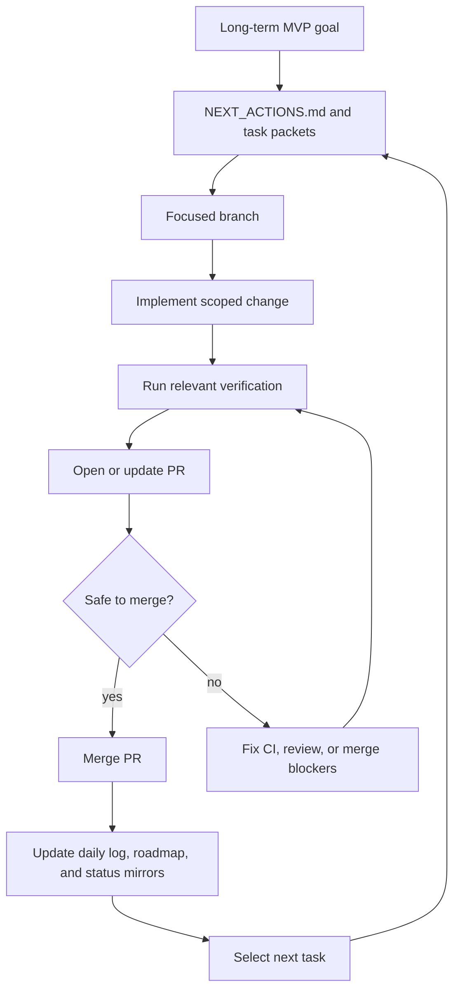

# Autonomous AI Loop Implementation Plan

> **For agentic workers:** REQUIRED SUB-SKILL: Use superpowers:subagent-driven-development (recommended) or superpowers:executing-plans to implement this plan task-by-task. Steps use checkbox (`- [ ]`) syntax for tracking.

**Goal:** Add the safe autonomous AI-first loop so AI workers know how to complete, fix, merge, record, and continue work without waiting for manual orchestration.

**Architecture:** This is a documentation and workflow change. `ai_first/AI_OPERATING_PROMPT.md` remains the control plane, `ai_first/AI_FIRST_ROADMAP.md` becomes the human-facing roadmap, compatibility snapshots mirror only compact status, and `ai_first/architecture/MAIN_SYSTEM_MAP.md` records the workflow change.

**Tech Stack:** Markdown, Mermaid, GitHub PR workflow, `gh` CLI for PR inspection, `rg` and `git diff --check` for validation.

---

### Task 1: Add the Roadmap Document

**Files:**
- Create: `ai_first/AI_FIRST_ROADMAP.md`

- [ ] **Step 1: Create the roadmap document**

Add `ai_first/AI_FIRST_ROADMAP.md` with these sections:

````markdown
# AI-First Roadmap

Last updated: 2026-04-19

## Purpose

This document explains how the repository should operate when AI is expected to finish work, complete pull requests, merge safely, and continue toward the contest MVP with minimal manual orchestration.

## Long-Term Goal

Build a stable VnExpress Sáng kiến Khoa học 2026 MVP:

Teacher creates Knowledge Pack -> AI generates assessment -> Student learns with Tutor Agent -> Teacher sees dashboard.

## Autonomous Loop



## Merge Policy

- Docs, task, and workflow PRs may be auto-merged when mergeable, non-draft, and not blocked by review.
- Runtime and product PRs may be auto-merged only when relevant tests or required checks pass and no review blocks the PR.
- CI failures and blocking reviews are the next task until fixed.
- AI must not push directly to `main`.

## How AI Chooses Next Work

1. Fix active PR blockers.
2. Continue active task packets in `docs/superpowers/tasks/`.
3. Use the compact queue in `ai_first/NEXT_ACTIONS.md`.
4. Derive the next short task from the MVP goal only after creating or updating a task packet.

## Human Checkpoints

Human review remains important for product direction, contest story, irreversible scope changes, credential or deployment decisions, and any PR marked as blocked or requiring human judgment.

## Development Direction

### Near Term

- Merge the first task packet workflow PR.
- Start Pod A and Pod B from their task packets.
- Keep every PR tied to an architecture note with Mermaid.

### Mid Term

- Add reliable CI checks for backend and frontend changes.
- Tighten issue labels and PR status conventions for autonomous selection.
- Keep evidence, demo scripts, and screenshots current for the contest.

### Later

- Consider GitHub Actions or scripts for queue reporting after the manual loop is proven stable.
- Add stronger automation only after merge gates, CI expectations, and review signals are reliable.
````

- [ ] **Step 2: Confirm roadmap contains Mermaid**

Run: `rg -n "```mermaid|AI-First Roadmap|Merge Policy" ai_first/AI_FIRST_ROADMAP.md`

Expected: matches for the heading, Mermaid fence, and merge policy section.

### Task 2: Update the Operating Control Plane

**Files:**
- Modify: `ai_first/AI_OPERATING_PROMPT.md`
- Modify: `ai_first/USAGE_GUIDE.md`

- [ ] **Step 1: Update `AI_OPERATING_PROMPT.md`**

Add concise autonomous completion rules covering PR classification, merge gates, blocker handling, syncing, recording, and next-task selection.

- [ ] **Step 2: Update `USAGE_GUIDE.md`**

Add a human-friendly section pointing readers to `ai_first/AI_FIRST_ROADMAP.md` and summarizing what AI does after a PR is ready.

- [ ] **Step 3: Validate operating text**

Run: `rg -n "Autonomous|auto-merge|blocking review|AI_FIRST_ROADMAP|Safe merge" ai_first/AI_OPERATING_PROMPT.md ai_first/USAGE_GUIDE.md`

Expected: both files mention the autonomous loop or roadmap.

### Task 3: Update Mirrors, Architecture Map, PR Note, and Daily Log

**Files:**
- Modify: `ai_first/NEXT_ACTIONS.md`
- Modify: `ai_first/CURRENT_STATE.md`
- Modify: `ai_first/architecture/MAIN_SYSTEM_MAP.md`
- Create: `ai_first/daily/2026-04-19.md`
- Modify: `docs/superpowers/pr-notes/docs-first-task-packets.md`

- [ ] **Step 1: Update compact status mirrors**

Update `NEXT_ACTIONS.md` and `CURRENT_STATE.md` so they mention the autonomous loop, roadmap document, and current PR state without duplicating the full operating contract.

- [ ] **Step 2: Update the main system map**

Add `AI_FIRST_ROADMAP.md`, autonomous merge gates, and next-task selection to the Mermaid map.

- [ ] **Step 3: Update PR architecture note**

Update `docs/superpowers/pr-notes/docs-first-task-packets.md` so PR #4 describes the autonomous loop docs and marks the main system map as updated.

- [ ] **Step 4: Create daily log**

Create `ai_first/daily/2026-04-19.md` with the docs workflow task, validation commands, blockers, and next read path.

### Task 4: Validate, Commit, Push, and Apply Merge Policy

**Files:**
- Validate all modified docs.

- [ ] **Step 1: Run docs validation**

Run: `rg -n "auto-merge|Autonomous|AI_FIRST_ROADMAP|blocking review|task packet" ai_first docs/superpowers`

Expected: matches in the roadmap, operating prompt, usage guide, status mirrors, spec, plan, and PR note.

- [ ] **Step 2: Run diff validation**

Run: `git diff --check`

Expected: no whitespace errors.

- [ ] **Step 3: Inspect active PR**

Run: `gh pr view 4 --json number,title,state,isDraft,mergeable,reviewDecision,statusCheckRollup,headRefName,baseRefName,url`

Expected: PR #4 is open; merge gate details are visible.

- [ ] **Step 4: Commit only scoped docs changes**

Run:

```bash
git add ai_first/AI_FIRST_ROADMAP.md \
  ai_first/AI_OPERATING_PROMPT.md \
  ai_first/USAGE_GUIDE.md \
  ai_first/NEXT_ACTIONS.md \
  ai_first/CURRENT_STATE.md \
  ai_first/architecture/MAIN_SYSTEM_MAP.md \
  ai_first/daily/2026-04-19.md \
  docs/superpowers/pr-notes/docs-first-task-packets.md \
  docs/superpowers/plans/2026-04-19-autonomous-ai-loop.md
git commit -m "docs: add autonomous AI loop"
```

Expected: unrelated dirty files remain unstaged.

- [ ] **Step 5: Push branch**

Run: `git push origin docs/first-task-packets`

Expected: PR #4 updates with the new docs commits.

- [ ] **Step 6: Apply safe merge policy if eligible**

If PR #4 is mergeable, non-draft, and has no blocking review, merge it because this is a docs/task/workflow PR.

Run: `gh pr merge 4 --squash --delete-branch`

Expected: PR #4 merges into `main`. If GitHub rejects the merge, record the reason and leave the PR open.
