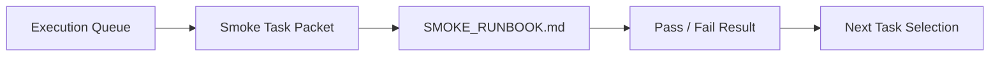

# Demo Readiness Smoke Lane Implementation Plan

> **For agentic workers:** REQUIRED SUB-SKILL: Use superpowers:subagent-driven-development (recommended) or superpowers:executing-plans to implement this plan task-by-task. Steps use checkbox (`- [ ]`) syntax for tracking.

**Goal:** Add a docs-first demo-readiness smoke lane that tells AI workers how to verify the contest MVP path, record pass/fail, and turn failures into the next task.

**Architecture:** This plan adds one task packet, one compact smoke runbook under `docs/contest/`, and a small set of AI-first queue updates. The prompt remains authoritative; the smoke lane plugs into the existing `EXECUTION_QUEUE.md`, `CURRENT_STATE.md`, `NEXT_ACTIONS.md`, and daily log instead of creating another control plane.

**Tech Stack:** Markdown docs, repo AI-first operating files, existing contest evidence docs, git, ripgrep.

---

### Task 1: Add The Smoke Lane Task Packet

**Files:**
- Create: `docs/superpowers/tasks/2026-04-19-demo-readiness-smoke.md`
- Test: `docs/superpowers/specs/2026-04-19-demo-readiness-smoke-design.md`

- [ ] **Step 1: Create the GitHub issue for the smoke lane**

Run:

```bash
gh issue create --repo Creative-Science-Contest-2026/Multiagent-learning-platform --title "docs: add demo readiness smoke lane packet" --body $'## Goal\nAdd a docs-first smoke lane packet and runbook that verifies the contest MVP path and turns failures into the next task.\n\n## Expected output\n- A smoke task packet.\n- A compact smoke runbook under docs/contest.\n- Queue and status mirrors updated to point to the smoke lane.\n\n## Constraints\n- Docs/workflow only.\n- Do not touch runtime/product code in this packet PR.\n- Reuse existing contest evidence docs and AI-first mirrors.' 
```

Expected: `gh` returns a new issue URL. Copy the issue number for the next step.

- [ ] **Step 2: Draft the task packet header and scope**

Write this initial structure into `docs/superpowers/tasks/2026-04-19-demo-readiness-smoke.md`:

```md
# Feature Pod Task: Demo Readiness Smoke Lane

Owner: Documentation / Workflow AI worker
Branch: `docs/demo-readiness-smoke`
GitHub Issue: `#<issue-number-from-step-1>`

## Goal

Add a docs-first smoke lane that verifies the contest MVP demo path end to end and turns failures into the next task.

## User-visible outcome

A human or AI worker can run one compact smoke flow and know whether the contest MVP path is still alive.
```

- [ ] **Step 3: Add owned files and do-not-touch files**

Append these sections to the task packet:

```md
## Owned files/modules

- `docs/superpowers/tasks/2026-04-19-demo-readiness-smoke.md`
- `docs/contest/SMOKE_RUNBOOK.md`
- `docs/superpowers/pr-notes/demo-readiness-smoke-packet.md`
- `ai_first/EXECUTION_QUEUE.md`
- `ai_first/CURRENT_STATE.md`
- `ai_first/NEXT_ACTIONS.md`
- `ai_first/daily/2026-04-19.md`
- `ai_first/AI_OPERATING_PROMPT.md` only if the queue or operating rules change

## Do-not-touch files/modules

- `deeptutor/`
- `web/`
- `.github/workflows/`
- `requirements/`
- `package-lock.json`
- `docs/package-lock.json`
- `web/package-lock.json`
- `web/next-env.d.ts`
- `.env*`
- `data/`
```

- [ ] **Step 4: Add the smoke contract and acceptance criteria**

Append the contract and acceptance text:

```md
## Smoke contract

The smoke lane must verify this path in order:

1. backend startup path works;
2. frontend startup or build path works;
3. Knowledge Pack metadata is available;
4. assessment generation works with Knowledge Pack context;
5. Tutor workspace answers with Knowledge Pack context;
6. Dashboard shows recent activity.

For each stage, the lane must define:

- the command or manual action;
- the expected success condition;
- whether failure stops the lane immediately;
- where to record the outcome.

If the smoke lane fails:

- product/runtime failures become the next task;
- environment or credential blockers must be recorded clearly in `ai_first/EXECUTION_QUEUE.md` and `ai_first/daily/2026-04-19.md`.

## Acceptance criteria

- There is one explicit smoke-lane task packet.
- The task packet points to one compact smoke execution doc.
- Pass/fail and blocker behavior are explicit.
- The task remains docs/workflow-only.
```

- [ ] **Step 5: Add required validation, manual verification, and handoff**

Append this exact text:

```md
## Required validation

- `rg -n "smoke|demo readiness|Knowledge Pack|assessment|Tutor|Dashboard|Mermaid" docs/contest docs/superpowers/tasks docs/superpowers/pr-notes ai_first`
- `git diff --check`

## Manual verification

- Open the smoke runbook without reading old chat history.
- Confirm a new AI worker can identify the smoke path and stop conditions.
- Confirm the runbook says what becomes the next task if smoke fails.

## PR architecture note

- Must include Mermaid diagram.
- State that `ai_first/architecture/MAIN_SYSTEM_MAP.md` does not need an update because this packet adds queue/reporting docs, not product/runtime architecture.

## Handoff notes

- Keep round 1 docs-first.
- Do not add deployment, staging, or CI smoke automation in this packet.
- Reuse existing contest evidence docs instead of creating another evidence tree.
```

- [ ] **Step 6: Run diff-format validation**

Run: `git diff --check`

Expected: exit code `0` and no whitespace errors.

- [ ] **Step 7: Commit the task packet**

Run:

```bash
git add docs/superpowers/tasks/2026-04-19-demo-readiness-smoke.md
git commit -m "docs: add demo readiness smoke task packet"
```

Expected: one commit that contains only the new task packet.

### Task 2: Add The Smoke Runbook And PR Note

**Files:**
- Create: `docs/contest/SMOKE_RUNBOOK.md`
- Create: `docs/superpowers/pr-notes/demo-readiness-smoke-packet.md`
- Test: `docs/contest/README.md`
- Test: `docs/contest/VALIDATION_REPORT.md`

- [ ] **Step 1: Write the smoke runbook structure**

Create `docs/contest/SMOKE_RUNBOOK.md` with this opening:

```md
# Smoke Runbook

This runbook verifies the contest MVP path in the same order as the demo story:

Teacher creates Knowledge Pack -> AI generates assessment -> Student learns with Tutor Agent -> Teacher sees dashboard.

Stop the lane on the first hard failure. Record the result in `ai_first/EXECUTION_QUEUE.md` and `ai_first/daily/YYYY-MM-DD.md`.
```

- [ ] **Step 2: Add the execution stages**

Add these sections to `docs/contest/SMOKE_RUNBOOK.md`:

```md
## Stage 1: Backend

- Command: use the existing backend startup path for local validation.
- Success: the API starts cleanly and the Knowledge, question, unified workspace, and dashboard routes are reachable.
- Stop condition: backend does not start or required routes fail.

## Stage 2: Frontend

- Command: use the existing frontend startup path or production build path for local validation.
- Success: the workspace routes render and the app can reach the backend using the expected local base URL.
- Stop condition: frontend does not build or cannot start.

## Stage 3: Knowledge Pack

- Action: confirm Knowledge Pack metadata is visible and matches the expected demo data shape.
- Success: metadata is present after load or reload.
- Stop condition: Knowledge Pack metadata is missing or broken.

## Stage 4: Assessment

- Action: generate assessment content from a selected Knowledge Pack.
- Success: generated questions appear with answer, explanation, and common-mistake content when available.
- Stop condition: assessment generation fails or loses Knowledge Pack grounding.

## Stage 5: Tutor

- Action: ask a Tutor workspace question using the same Knowledge Pack context.
- Success: the tutor answer reflects the selected Knowledge Pack context.
- Stop condition: the Tutor response ignores or loses context.

## Stage 6: Dashboard

- Action: open the Dashboard after the assessment and tutor steps.
- Success: recent activity reflects assessment and tutor usage with Knowledge Pack context where available.
- Stop condition: dashboard activity is empty, broken, or missing the expected context.
```

- [ ] **Step 3: Add pass/fail recording rules**

Append this section:

```md
## Result handling

- If all stages pass: refresh any affected contest evidence docs, then move to the next queued task.
- If a product/runtime stage fails: create or update a follow-up task packet before starting broad new work.
- If an environment or credential blocker prevents completion: record the blocker clearly and do not report smoke as passing.
```

- [ ] **Step 4: Write the PR architecture note with Mermaid**

Create `docs/superpowers/pr-notes/demo-readiness-smoke-packet.md` with this content:

```md
# PR Architecture Note: Demo Readiness Smoke Packet

## Summary

This PR adds the first docs-first smoke lane packet and runbook for the contest MVP path.

## Mermaid Diagram



## Main System Map Update

`ai_first/architecture/MAIN_SYSTEM_MAP.md` is not updated. This PR adds docs/workflow guidance for smoke validation without changing product/runtime architecture.
```
```

- [ ] **Step 5: Run targeted docs validation**

Run:

```bash
rg -n "smoke|demo readiness|Knowledge Pack|assessment|Tutor|Dashboard|Mermaid" docs/contest docs/superpowers/tasks docs/superpowers/pr-notes ai_first
git diff --check
```

Expected:

- `rg` returns matches in the new smoke files;
- `git diff --check` exits `0`.

- [ ] **Step 6: Commit the runbook and PR note**

Run:

```bash
git add docs/contest/SMOKE_RUNBOOK.md docs/superpowers/pr-notes/demo-readiness-smoke-packet.md
git commit -m "docs: add smoke runbook and pr note"
```

Expected: one commit with the runbook and PR note only.

### Task 3: Update The AI-First Queue And Mirrors

**Files:**
- Modify: `ai_first/EXECUTION_QUEUE.md`
- Modify: `ai_first/CURRENT_STATE.md`
- Modify: `ai_first/NEXT_ACTIONS.md`
- Modify: `ai_first/daily/2026-04-19.md`
- Modify: `ai_first/AI_OPERATING_PROMPT.md` only if needed

- [ ] **Step 1: Point the execution queue to the smoke lane**

Update `ai_first/EXECUTION_QUEUE.md` so the active queue section says:

```md
## Active queue

- Open issue: `#<issue-number-from-task-1-step-1> docs: add demo readiness smoke lane packet`
- Active task packet: `docs/superpowers/tasks/2026-04-19-demo-readiness-smoke.md`
- Expected branch: `docs/demo-readiness-smoke`

## Next recommended task

Land the docs-first smoke lane packet and use its runbook to validate the contest MVP path before opening new runtime or product work.
```

- [ ] **Step 2: Update the compact state mirrors**

Edit `ai_first/CURRENT_STATE.md` and `ai_first/NEXT_ACTIONS.md` so they reflect:

```md
- current purpose: establish the demo-readiness smoke lane
- current next task: land the smoke lane packet and runbook
- next actions: keep smoke status current and turn failures into the next task
```

- [ ] **Step 3: Record the smoke lane in the daily log**

Append a new section to `ai_first/daily/2026-04-19.md` using this shape:

```md
## Demo Readiness Smoke Lane

- Branch: `docs/demo-readiness-smoke`
- Task: add the first docs-first smoke lane packet and runbook.
- Done:
  - added the smoke task packet;
  - added the smoke runbook;
  - updated the queue and status mirrors.
- Tests:
  - Passed: `rg -n "smoke|demo readiness|Knowledge Pack|assessment|Tutor|Dashboard|Mermaid" docs/contest docs/superpowers/tasks docs/superpowers/pr-notes ai_first`
  - Passed: `git diff --check`
- Blockers:
  - None known.
- Next:
  - Open the docs PR, merge when eligible, then execute the smoke lane.
```

- [ ] **Step 4: Decide whether the operating prompt needs a narrow update**

Check `ai_first/AI_OPERATING_PROMPT.md`.

If the queue text already supports “derive the next short task from the MVP goal and create a task packet”, leave it unchanged.

If the prompt still points to an outdated next step, update only the `Current snapshot` and `Next actions` bullets to mention the smoke lane.

- [ ] **Step 5: Run final docs/workflow validation**

Run:

```bash
rg -n "smoke|demo readiness|Knowledge Pack|assessment|Tutor|Dashboard|Mermaid" docs/contest docs/superpowers/tasks docs/superpowers/pr-notes ai_first
git diff --check
git status --short --branch
```

Expected:

- smoke references appear in the queue/runbook/task packet files;
- no diff formatting errors;
- only the planned docs/workflow files are modified.

- [ ] **Step 6: Commit the queue and mirror updates**

Run:

```bash
git add ai_first/EXECUTION_QUEUE.md ai_first/CURRENT_STATE.md ai_first/NEXT_ACTIONS.md ai_first/daily/2026-04-19.md ai_first/AI_OPERATING_PROMPT.md
git commit -m "docs: queue demo readiness smoke lane"
```

If `ai_first/AI_OPERATING_PROMPT.md` was not changed, omit it from `git add`.

Expected: one commit containing only the AI-first queue/mirror updates.

## Self-Review

- Spec coverage: Task 1 covers the smoke task packet; Task 2 covers the smoke runbook and required PR note; Task 3 covers the queue, daily log, and status mirror updates.
- Placeholder scan: no unresolved placeholders remain; the plan creates the GitHub issue before the task packet is written and reuses that issue number in later steps.
- Type consistency: File names, branch names, and lane names are consistent across the packet, runbook, queue, and daily log.
