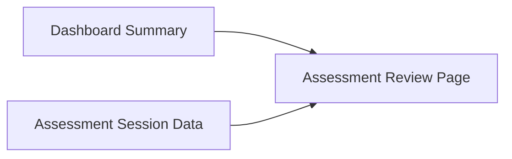
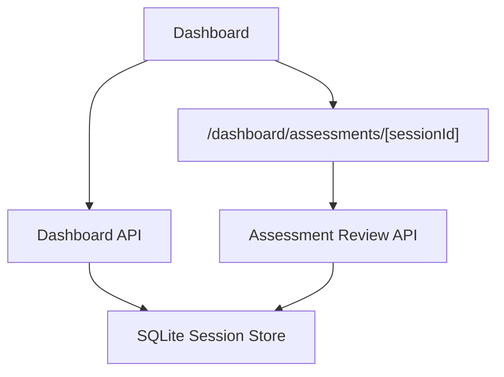

# Teacher Assessment Review MVP Implementation Plan

> **For agentic workers:** REQUIRED SUB-SKILL: Use superpowers:subagent-driven-development (recommended) or superpowers:executing-plans to implement this plan task-by-task. Steps use checkbox (`- [ ]`) syntax for tracking.

**Goal:** Add a teacher-facing assessment review flow where Dashboard stays summary-first and drills down into a dedicated review page for one assessment session.

**Architecture:** Reuse the existing SQLite session store and quiz-result write path, add one shared backend extraction layer for assessment review data, expose that data through dashboard APIs, and render it through a new workspace route under Dashboard. Keep the Dashboard compact and push detailed per-question review into the dedicated page.

**Tech Stack:** FastAPI, SQLite session store, React/Next.js App Router, TypeScript, existing dashboard/session API clients, pytest

---

## File Structure

- Create: `docs/superpowers/tasks/2026-04-19-teacher-assessment-review-mvp.md`
- Create: `docs/superpowers/pr-notes/teacher-assessment-review-packet.md`
- Create: `deeptutor/services/session/assessment_review.py`
- Modify: `deeptutor/api/routers/dashboard.py`
- Modify: `deeptutor/api/routers/sessions.py`
- Modify: `deeptutor/services/session/__init__.py`
- Modify: `tests/api/test_dashboard_router.py`
- Create: `tests/api/test_session_review_router.py`
- Modify: `web/lib/dashboard-api.ts`
- Modify: `web/app/(workspace)/dashboard/page.tsx`
- Create: `web/app/(workspace)/dashboard/assessments/[sessionId]/page.tsx`
- Create: `ai_first/daily/2026-04-19.md` entry update
- Modify: `ai_first/AI_OPERATING_PROMPT.md` only if repo-level next actions or ownership rules change
- Modify: `ai_first/CURRENT_STATE.md` and `ai_first/NEXT_ACTIONS.md` only if compact mirrors are still useful after the feature starts
- Modify: `ai_first/architecture/MAIN_SYSTEM_MAP.md` if the new review route/API is treated as a material product structure change

### Task 1: Create The Shared Feature Packet

**Files:**
- Create: `docs/superpowers/tasks/2026-04-19-teacher-assessment-review-mvp.md`
- Create: `docs/superpowers/pr-notes/teacher-assessment-review-packet.md`

- [ ] **Step 1: Write the failing docs validation expectation**

```bash
test -f docs/superpowers/tasks/2026-04-19-teacher-assessment-review-mvp.md
```

Expected: FAIL with exit code `1` because the task packet does not exist yet.

- [ ] **Step 2: Run test to verify it fails**

Run: `test -f docs/superpowers/tasks/2026-04-19-teacher-assessment-review-mvp.md`
Expected: non-zero exit status

- [ ] **Step 3: Write the minimal packet and packet PR note**

Create `docs/superpowers/tasks/2026-04-19-teacher-assessment-review-mvp.md` with:

```markdown
# Feature Pod Task: Teacher Assessment Review MVP

Owner: Pod A + Pod B coordinated AI workers
Branch: `docs/teacher-assessment-review-packet` for packet; implementation branches should be `pod-a/teacher-assessment-review-backend` and `pod-b/teacher-assessment-review-ui`
GitHub Issue: `#<fill when created>`

## Goal

Add a teacher-facing review flow from Dashboard into a dedicated assessment session review page.

## User-visible outcome

Teachers can open Dashboard, identify assessment sessions, and drill into one review page that shows score, correct/incorrect counts, question-level results, and Knowledge Pack context.

## Owned files/modules

- `deeptutor/api/routers/dashboard.py`
- `deeptutor/api/routers/sessions.py`
- `deeptutor/services/session/assessment_review.py`
- `deeptutor/services/session/__init__.py`
- `tests/api/test_dashboard_router.py`
- `tests/api/test_session_review_router.py`
- `web/app/(workspace)/dashboard/page.tsx`
- `web/app/(workspace)/dashboard/assessments/[sessionId]/page.tsx`
- `web/lib/dashboard-api.ts`
- `docs/superpowers/pr-notes/teacher-assessment-review-*.md`
- `ai_first/daily/YYYY-MM-DD.md`
- `ai_first/architecture/MAIN_SYSTEM_MAP.md` if route/API structure changes materially

## Do-not-touch files/modules

- `deeptutor/knowledge/`
- `deeptutor/services/rag/`
- `web/app/(utility)/knowledge/page.tsx`
- lockfiles unless dependency installation proves they must change
- `.env*`
- `data/`

## Acceptance criteria

- Dashboard keeps summary-first behavior.
- Assessment rows link to a dedicated review page.
- Review page shows score, correct count, incorrect count, per-question results, and Knowledge Pack names when available.
- Legacy sessions without structured review data fail gracefully.
```

Create `docs/superpowers/pr-notes/teacher-assessment-review-packet.md` with:

```markdown
# PR Architecture Note: Teacher Assessment Review Packet

## Summary

Adds the feature packet for teacher-facing assessment review from Dashboard into a dedicated assessment session page.

## Mermaid Diagram



## Main System Map Update

- [ ] Updated `ai_first/architecture/MAIN_SYSTEM_MAP.md`
- [x] Not needed for packet-only docs PR
```

- [ ] **Step 4: Run docs validation to verify it passes**

Run: `rg -n "Teacher Assessment Review MVP|Assessment Review Page|Mermaid" docs/superpowers/tasks docs/superpowers/pr-notes`
Expected: PASS with matches in the new packet and PR note

- [ ] **Step 5: Commit**

```bash
git add docs/superpowers/tasks/2026-04-19-teacher-assessment-review-mvp.md docs/superpowers/pr-notes/teacher-assessment-review-packet.md
git commit -m "docs: add teacher assessment review packet"
```

### Task 2: Add Backend Assessment Review Extraction

**Files:**
- Create: `deeptutor/services/session/assessment_review.py`
- Modify: `deeptutor/services/session/__init__.py`
- Test: `tests/api/test_session_review_router.py`

- [ ] **Step 1: Write the failing backend test**

Create `tests/api/test_session_review_router.py` with:

```python
from __future__ import annotations

import pytest

try:
    from fastapi import FastAPI
    from fastapi.testclient import TestClient
except Exception:
    FastAPI = None
    TestClient = None

from deeptutor.services.session.sqlite_store import SQLiteSessionStore

pytestmark = pytest.mark.skipif(FastAPI is None or TestClient is None, reason="fastapi not installed")


def _build_app(store: SQLiteSessionStore, monkeypatch: pytest.MonkeyPatch) -> FastAPI:
    from deeptutor.api.routers import sessions

    app = FastAPI()
    app.include_router(sessions.router, prefix="/api/v1/sessions")
    monkeypatch.setattr(sessions, "get_sqlite_session_store", lambda: store)
    return app


@pytest.mark.asyncio
async def test_get_assessment_review_returns_structured_score(tmp_path, monkeypatch: pytest.MonkeyPatch) -> None:
    store = SQLiteSessionStore(tmp_path / "chat_history.db")
    await store.create_session(session_id="quiz-review-session")
    await store.update_session_preferences(
        "quiz-review-session",
        {
            "capability": "deep_question",
            "tools": ["rag"],
            "knowledge_bases": ["math-pack"],
            "language": "en",
        },
    )
    await store.add_message(
        "quiz-review-session",
        "user",
        "[Quiz Performance]\\n1. [q1] Q: 2+2 -> Answered: 4 (Correct)\\n2. [q2] Q: 5-1 -> Answered: 3 (Incorrect, correct: 4)\\nScore: 1/2 (50%)",
        capability="deep_question",
    )

    with TestClient(_build_app(store, monkeypatch)) as client:
        response = client.get("/api/v1/sessions/quiz-review-session/assessment-review")

    assert response.status_code == 200
    payload = response.json()
    assert payload["session_id"] == "quiz-review-session"
    assert payload["knowledge_bases"] == ["math-pack"]
    assert payload["summary"]["total_questions"] == 2
    assert payload["summary"]["correct_count"] == 1
    assert payload["summary"]["incorrect_count"] == 1
    assert payload["summary"]["score_percent"] == 50
    assert payload["results"][0]["question_id"] == "q1"
```

- [ ] **Step 2: Run test to verify it fails**

Run: `pytest tests/api/test_session_review_router.py::test_get_assessment_review_returns_structured_score -v`
Expected: FAIL with `404` for the missing route or import error for missing helper

- [ ] **Step 3: Write minimal extraction helper**

Create `deeptutor/services/session/assessment_review.py` with:

```python
from __future__ import annotations

import re
from typing import Any


QUIZ_PREFIX = "[Quiz Performance]"
QUESTION_RE = re.compile(
    r"^\d+\.\s+(?:\[(?P<question_id>[^\]]*)\]\s+)?Q:\s+(?P<question>.+?)\s+->\s+Answered:\s+(?P<answer>.+?)\s+\((?P<status>Correct|Incorrect)(?:,\s+correct:\s+(?P<correct_answer>.+?))?\)$"
)
SCORE_RE = re.compile(r"^Score:\s+(?P<correct>\d+)/(?P<total>\d+)\s+\((?P<percent>\d+)%\)$")


def extract_assessment_review(session: dict[str, Any]) -> dict[str, Any] | None:
    messages = session.get("messages", [])
    review_message = None
    for message in reversed(messages):
        content = str(message.get("content") or "")
        if content.startswith(QUIZ_PREFIX):
            review_message = content
            break
    if review_message is None:
        return None

    results: list[dict[str, Any]] = []
    score_percent = 0
    correct_count = 0
    total_questions = 0

    for raw_line in review_message.splitlines()[1:]:
        line = raw_line.strip()
        if not line:
            continue
        score_match = SCORE_RE.match(line)
        if score_match:
            correct_count = int(score_match.group("correct"))
            total_questions = int(score_match.group("total"))
            score_percent = int(score_match.group("percent"))
            continue
        question_match = QUESTION_RE.match(line)
        if not question_match:
            continue
        status = question_match.group("status") == "Correct"
        results.append(
            {
                "question_id": (question_match.group("question_id") or "").strip(),
                "question": question_match.group("question").strip(),
                "user_answer": question_match.group("answer").strip(),
                "correct_answer": (question_match.group("correct_answer") or "").strip(),
                "is_correct": status,
            }
        )

    if total_questions == 0:
        total_questions = len(results)
        correct_count = sum(1 for item in results if item["is_correct"])
        score_percent = round((correct_count / total_questions) * 100) if total_questions else 0

    incorrect_count = max(total_questions - correct_count, 0)
    preferences = session.get("preferences") or {}

    return {
        "session_id": session.get("session_id"),
        "title": session.get("title") or "Untitled session",
        "timestamp": session.get("updated_at", session.get("created_at", 0)),
        "status": session.get("status", "idle"),
        "knowledge_bases": list(preferences.get("knowledge_bases") or []),
        "summary": {
            "total_questions": total_questions,
            "correct_count": correct_count,
            "incorrect_count": incorrect_count,
            "score_percent": score_percent,
        },
        "results": results,
    }
```

Update `deeptutor/services/session/__init__.py` to export the helper:

```python
from .assessment_review import extract_assessment_review
from .sqlite_store import SQLiteSessionStore, get_sqlite_session_store

__all__ = [
    "SQLiteSessionStore",
    "get_sqlite_session_store",
    "extract_assessment_review",
]
```

- [ ] **Step 4: Run test to verify helper still fails only on missing route**

Run: `pytest tests/api/test_session_review_router.py::test_get_assessment_review_returns_structured_score -v`
Expected: FAIL with `404` for the missing `/assessment-review` route

- [ ] **Step 5: Commit**

```bash
git add deeptutor/services/session/assessment_review.py deeptutor/services/session/__init__.py tests/api/test_session_review_router.py
git commit -m "feat: add assessment review extractor"
```

### Task 3: Expose Backend Review Endpoints And Dashboard Summary

**Files:**
- Modify: `deeptutor/api/routers/sessions.py`
- Modify: `deeptutor/api/routers/dashboard.py`
- Modify: `tests/api/test_dashboard_router.py`
- Test: `tests/api/test_session_review_router.py`

- [ ] **Step 1: Write the failing dashboard summary test**

Append to `tests/api/test_dashboard_router.py`:

```python
@pytest.mark.asyncio
async def test_dashboard_overview_includes_assessment_summary(tmp_path, monkeypatch: pytest.MonkeyPatch) -> None:
    store = SQLiteSessionStore(tmp_path / "chat_history.db")
    await _seed_session(
        store,
        session_id="quiz-session",
        capability="deep_question",
        message="Generate a quiz on fractions",
        knowledge_bases=["fractions-pack"],
    )
    await store.add_message(
        "quiz-session",
        "user",
        "[Quiz Performance]\\n1. [q1] Q: 1+1 -> Answered: 2 (Correct)\\nScore: 1/1 (100%)",
        capability="deep_question",
    )

    with TestClient(_build_app(store, monkeypatch)) as client:
        response = client.get("/api/v1/dashboard/overview")

    payload = response.json()
    assessment_row = payload["recent_activity"][0]
    assert assessment_row["assessment_summary"]["score_percent"] == 100
    assert assessment_row["assessment_summary"]["total_questions"] == 1
```

- [ ] **Step 2: Run tests to verify they fail**

Run: `pytest tests/api/test_dashboard_router.py::test_dashboard_overview_includes_assessment_summary tests/api/test_session_review_router.py::test_get_assessment_review_returns_structured_score -v`
Expected: FAIL because overview rows do not include `assessment_summary` and the session review route does not exist

- [ ] **Step 3: Add the review route and enrich dashboard rows**

Update `deeptutor/api/routers/sessions.py` by importing the helper and adding:

```python
from deeptutor.services.session import extract_assessment_review, get_sqlite_session_store


@router.get("/{session_id}/assessment-review")
async def get_assessment_review(session_id: str):
    store = get_sqlite_session_store()
    session = await store.get_session_with_messages(session_id)
    if session is None:
        raise HTTPException(status_code=404, detail="Session not found")
    review = extract_assessment_review(session)
    if review is None:
        raise HTTPException(status_code=404, detail="Assessment review not found")
    return review
```

Update `deeptutor/api/routers/dashboard.py` by importing the helper and enriching `_activity_from_session`:

```python
from deeptutor.services.session import extract_assessment_review, get_sqlite_session_store


def _activity_from_session(session: dict[str, Any]) -> dict[str, Any]:
    capability = str(session.get("capability") or "chat")
    knowledge_bases = _session_knowledge_bases(session)
    review = extract_assessment_review(session) if capability == "deep_question" else None
    return {
        "id": session.get("session_id"),
        "type": _activity_type(capability),
        "capability": capability,
        "title": session.get("title", "Untitled"),
        "timestamp": session.get("updated_at", session.get("created_at", 0)),
        "summary": (session.get("last_message") or "")[:160],
        "session_ref": f"sessions/{session.get('session_id')}",
        "message_count": session.get("message_count", 0),
        "status": session.get("status", "idle"),
        "active_turn_id": session.get("active_turn_id"),
        "knowledge_bases": knowledge_bases,
        "assessment_summary": review["summary"] if review else None,
        "review_ref": f"dashboard/assessments/{session.get('session_id')}" if review else None,
    }
```

- [ ] **Step 4: Run tests to verify they pass**

Run: `pytest tests/api/test_dashboard_router.py tests/api/test_session_review_router.py -v`
Expected: PASS

- [ ] **Step 5: Commit**

```bash
git add deeptutor/api/routers/dashboard.py deeptutor/api/routers/sessions.py tests/api/test_dashboard_router.py tests/api/test_session_review_router.py
git commit -m "feat: add assessment review api"
```

### Task 4: Add Frontend Dashboard Drill-down And Review Page

**Files:**
- Modify: `web/lib/dashboard-api.ts`
- Modify: `web/app/(workspace)/dashboard/page.tsx`
- Create: `web/app/(workspace)/dashboard/assessments/[sessionId]/page.tsx`

- [ ] **Step 1: Write the failing frontend contract expectation**

Add the following interface extensions to `web/lib/dashboard-api.ts` as the target shape:

```ts
export interface AssessmentSummary {
  total_questions: number;
  correct_count: number;
  incorrect_count: number;
  score_percent: number;
}

export interface AssessmentReviewResult {
  question_id: string;
  question: string;
  user_answer: string;
  correct_answer: string;
  is_correct: boolean;
}

export interface AssessmentReview {
  session_id: string;
  title: string;
  timestamp: number;
  status: string;
  knowledge_bases: string[];
  summary: AssessmentSummary;
  results: AssessmentReviewResult[];
}
```

Expected current state before implementation: imports/usages for these types do not exist yet.

- [ ] **Step 2: Run frontend build to verify it fails after dashboard/review references are added**

After adding imports in the new page and dashboard update, run:
`cd web && NEXT_PUBLIC_API_BASE=http://localhost:8001 npm run build`
Expected: FAIL before the API client functions and UI code are complete

- [ ] **Step 3: Write minimal frontend API client support**

Update `web/lib/dashboard-api.ts` with:

```ts
export interface AssessmentSummary {
  total_questions: number;
  correct_count: number;
  incorrect_count: number;
  score_percent: number;
}

export interface AssessmentReviewResult {
  question_id: string;
  question: string;
  user_answer: string;
  correct_answer: string;
  is_correct: boolean;
}

export interface AssessmentReview {
  session_id: string;
  title: string;
  timestamp: number;
  status: string;
  knowledge_bases: string[];
  summary: AssessmentSummary;
  results: AssessmentReviewResult[];
}

export interface DashboardActivity {
  id: string;
  type: "assessment" | "tutoring" | string;
  capability: string;
  title: string;
  timestamp: number;
  summary: string;
  session_ref: string;
  message_count: number;
  status: string;
  active_turn_id?: string | null;
  knowledge_bases: string[];
  assessment_summary?: AssessmentSummary | null;
  review_ref?: string | null;
}

export async function getAssessmentReview(sessionId: string): Promise<AssessmentReview> {
  const response = await fetch(apiUrl(`/api/v1/sessions/${sessionId}/assessment-review`), {
    cache: "no-store",
  });
  return expectJson<AssessmentReview>(response);
}
```

- [ ] **Step 4: Write minimal dashboard drill-down UI**

Update the assessment row block in `web/app/(workspace)/dashboard/page.tsx` so that assessment rows render a link:

```tsx
import Link from "next/link";
```

Inside the activity map:

```tsx
const reviewHref =
  activity.type === "assessment" && activity.review_ref
    ? `/${activity.review_ref}`
    : null;
```

Replace the title block with:

```tsx
{reviewHref ? (
  <Link href={reviewHref} className="text-[14px] font-medium text-[var(--foreground)] underline-offset-4 hover:underline">
    {activity.title || t("Untitled session")}
  </Link>
) : (
  <div className="text-[14px] font-medium text-[var(--foreground)]">
    {activity.title || t("Untitled session")}
  </div>
)}
```

Render summary badge when available:

```tsx
{activity.assessment_summary && (
  <div className="mt-2 text-[12px] text-[var(--muted-foreground)]">
    {t("Score")}: {activity.assessment_summary.score_percent}% · {activity.assessment_summary.correct_count}/{activity.assessment_summary.total_questions}
  </div>
)}
```

- [ ] **Step 5: Write minimal dedicated review page**

Create `web/app/(workspace)/dashboard/assessments/[sessionId]/page.tsx` with:

```tsx
"use client";

import Link from "next/link";
import { useEffect, useState } from "react";
import { useParams } from "next/navigation";
import { ArrowLeft, CheckCircle2, XCircle } from "lucide-react";
import { getAssessmentReview, type AssessmentReview } from "@/lib/dashboard-api";

export default function AssessmentReviewPage() {
  const { sessionId } = useParams<{ sessionId: string }>();
  const [review, setReview] = useState<AssessmentReview | null>(null);
  const [loading, setLoading] = useState(true);
  const [error, setError] = useState<string | null>(null);

  useEffect(() => {
    let cancelled = false;
    setLoading(true);
    getAssessmentReview(sessionId)
      .then((data) => {
        if (!cancelled) {
          setReview(data);
          setError(null);
        }
      })
      .catch((err) => {
        if (!cancelled) setError(err instanceof Error ? err.message : String(err));
      })
      .finally(() => {
        if (!cancelled) setLoading(false);
      });
    return () => {
      cancelled = true;
    };
  }, [sessionId]);

  if (loading) return <main className="p-6">Loading assessment review...</main>;
  if (error) return <main className="p-6">Failed to load assessment review: {error}</main>;
  if (!review) return <main className="p-6">Assessment review not found.</main>;

  return (
    <main className="mx-auto max-w-[1080px] px-6 py-8">
      <Link href="/dashboard" className="inline-flex items-center gap-2 text-sm text-[var(--muted-foreground)] hover:text-[var(--foreground)]">
        <ArrowLeft size={16} />
        Back to Dashboard
      </Link>

      <h1 className="mt-4 text-3xl font-semibold text-[var(--foreground)]">{review.title}</h1>
      <p className="mt-2 text-sm text-[var(--muted-foreground)]">
        Score: {review.summary.score_percent}% · Correct {review.summary.correct_count} · Incorrect {review.summary.incorrect_count}
      </p>
      {review.knowledge_bases.length > 0 && (
        <div className="mt-3 flex flex-wrap gap-2">
          {review.knowledge_bases.map((kb) => (
            <span key={kb} className="rounded-md bg-[var(--muted)] px-2 py-1 text-xs text-[var(--muted-foreground)]">
              {kb}
            </span>
          ))}
        </div>
      )}

      <section className="mt-6 space-y-4">
        {review.results.map((result, index) => (
          <article key={result.question_id || `${index}`} className="rounded-lg border border-[var(--border)] bg-[var(--card)] p-4">
            <div className="flex items-start justify-between gap-3">
              <h2 className="text-base font-medium text-[var(--foreground)]">{result.question}</h2>
              {result.is_correct ? (
                <CheckCircle2 className="text-emerald-600" size={18} />
              ) : (
                <XCircle className="text-red-600" size={18} />
              )}
            </div>
            <p className="mt-3 text-sm text-[var(--muted-foreground)]">Student answer: {result.user_answer || "(blank)"}</p>
            <p className="mt-1 text-sm text-[var(--muted-foreground)]">Correct answer: {result.correct_answer || "(not recorded)"}</p>
          </article>
        ))}
      </section>
    </main>
  );
}
```

- [ ] **Step 6: Run frontend build to verify it passes**

Run: `cd web && NEXT_PUBLIC_API_BASE=http://localhost:8001 npm run build`
Expected: PASS

- [ ] **Step 7: Commit**

```bash
git add web/lib/dashboard-api.ts web/app/'(workspace)'/dashboard/page.tsx web/app/'(workspace)'/dashboard/assessments/[sessionId]/page.tsx
git commit -m "feat: add assessment review ui"
```

### Task 5: Update AI-First Records And Final Verification

**Files:**
- Modify: `ai_first/daily/2026-04-19.md`
- Modify: `ai_first/AI_OPERATING_PROMPT.md` only if next-task ordering changes
- Modify: `ai_first/CURRENT_STATE.md`
- Modify: `ai_first/NEXT_ACTIONS.md`
- Modify: `ai_first/architecture/MAIN_SYSTEM_MAP.md` if route/API shape changed materially
- Create: `docs/superpowers/pr-notes/teacher-assessment-review-mvp.md`

- [ ] **Step 1: Write the PR architecture note**

Create `docs/superpowers/pr-notes/teacher-assessment-review-mvp.md` with:

```markdown
# PR Architecture Note: Teacher Assessment Review MVP

## Summary

Adds Dashboard drill-down into a dedicated assessment session review page backed by structured assessment review data extracted from session history.

## Mermaid Diagram



## Main System Map Update

- [ ] Updated `ai_first/architecture/MAIN_SYSTEM_MAP.md`
- [x] Not needed if the route/API addition is considered a contained MVP extension
```

- [ ] **Step 2: Run final verification**

Run:

```bash
pytest tests/api/test_dashboard_router.py tests/api/test_session_review_router.py -v
python3 -m compileall deeptutor
cd web && NEXT_PUBLIC_API_BASE=http://localhost:8001 npm run build
git diff --check
rg -n "Assessment Review|assessment-review|dashboard/assessments|Mermaid" docs/superpowers/pr-notes ai_first web deeptutor tests
```

Expected: PASS

- [ ] **Step 3: Update AI-first records**

Append a new section in `ai_first/daily/2026-04-19.md` describing:

```markdown
## Teacher Assessment Review MVP

- Branch: `<implementation branch>`
- Task: Add Dashboard drill-down and dedicated assessment review page.
- Done:
  - Added structured assessment review extraction from session data.
  - Added backend assessment review endpoint and dashboard summary enrichment.
  - Added Dashboard drill-down and review page UI.
- Tests:
  - Passed: `pytest tests/api/test_dashboard_router.py tests/api/test_session_review_router.py -v`
  - Passed: `python3 -m compileall deeptutor`
  - Passed: `cd web && NEXT_PUBLIC_API_BASE=http://localhost:8001 npm run build`
- Blockers:
  - None known after local validation.
- Next:
  - Open PR and treat any CI failure as the highest-priority blocker.
```

- [ ] **Step 4: Commit**

```bash
git add ai_first/daily/2026-04-19.md docs/superpowers/pr-notes/teacher-assessment-review-mvp.md
git commit -m "docs: record teacher assessment review mvp"
```

## Self-Review

- Spec coverage: The plan covers Dashboard summary behavior, dedicated review route, structured backend review contract, Knowledge Pack context, empty/error handling, and testing.
- Placeholder scan: No `TODO`, `TBD`, or deferred implementation markers remain in executable steps.
- Type consistency: `assessment_summary`, `AssessmentReview`, and `/assessment-review` are used consistently across backend and frontend tasks.
