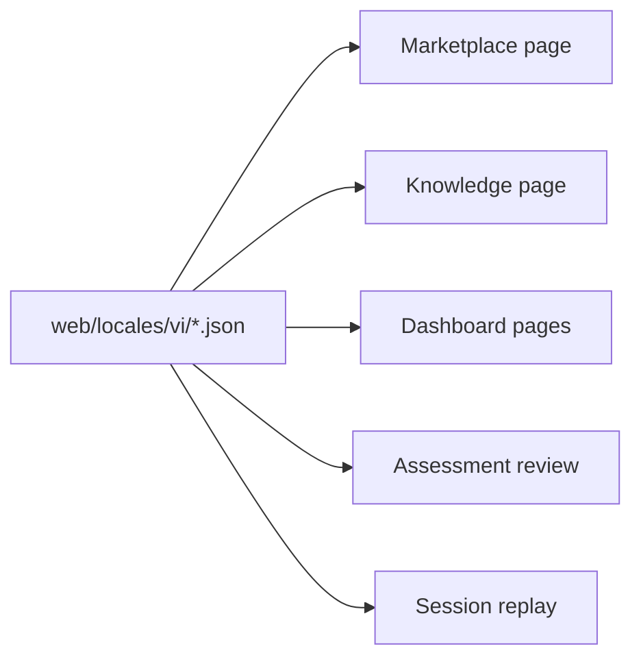

# T044 Contest Vietnamese Coverage Implementation Plan

> **For agentic workers:** REQUIRED SUB-SKILL: Use superpowers:subagent-driven-development (recommended) or superpowers:executing-plans to implement this plan task-by-task. Steps use checkbox (`- [ ]`) syntax for tracking.

**Goal:** Remove obvious English leakage from contest MVP screens and make Vietnamese wording consistent across marketplace, knowledge, dashboard, assessment review, and tutoring replay.

**Architecture:** Keep the slice frontend-only. Update the six owned page entrypoints to rely on explicit Vietnamese copy keys, and extend the existing `web/locales/vi/` dictionaries only where those pages currently fall back to English or surface raw backend errors without context.

**Tech Stack:** Next.js App Router, React 19, `react-i18next`, TypeScript, locale JSON dictionaries

---

### Task 1: Audit the owned pages and record missing Vietnamese keys

**Files:**
- Modify: `web/app/(utility)/marketplace/page.tsx`
- Modify: `web/app/(utility)/knowledge/page.tsx`
- Modify: `web/app/(workspace)/dashboard/page.tsx`
- Modify: `web/app/(workspace)/dashboard/student/page.tsx`
- Modify: `web/app/(workspace)/dashboard/assessments/[sessionId]/page.tsx`
- Modify: `web/app/(workspace)/dashboard/sessions/[sessionId]/page.tsx`
- Modify: `web/locales/vi/app.json`
- Modify: `web/locales/vi/common.json`

- [ ] **Step 1: Run the required leakage search and capture current hotspots**

```bash
rg -n "Loading|Error|Back to Dashboard|Assessment Review|Tutoring Session Replay|Create Knowledge Pack|Marketplace|Knowledge Pack|Failed to|No |Try " \
  'web/app/(utility)/marketplace/page.tsx' \
  'web/app/(utility)/knowledge/page.tsx' \
  'web/app/(workspace)/dashboard/page.tsx' \
  'web/app/(workspace)/dashboard/student/page.tsx' \
  'web/app/(workspace)/dashboard/assessments/[sessionId]/page.tsx' \
  'web/app/(workspace)/dashboard/sessions/[sessionId]/page.tsx' \
  web/locales/vi/app.json \
  web/locales/vi/common.json -S
```

Expected: multiple English labels and state strings are reported inside the six owned pages.

- [ ] **Step 2: Group the leaks by surface and terminology**

```text
Marketplace:
- page title/subtitle, empty state, preview loading, review prompts, import errors

Knowledge:
- create/upload failures, empty states, metadata editor labels that still read English-first

Dashboard:
- teacher dashboard headers, filters, weak/strong topic placeholders, activity empty states

Assessment + Replay:
- loading/error/not-found states, headers, time labels, replay copy
```

- [ ] **Step 3: Lock the terminology table before editing**

```text
Knowledge Pack -> Gói kiến thức
Assessment -> Bài đánh giá
Tutor / Tutoring -> Trợ lý học tập / phiên học với trợ lý
Dashboard -> Bảng điều khiển
Review -> Xem lại
Replay -> Phát lại
```

- [ ] **Step 4: Commit the audit baseline**

```bash
git add docs/superpowers/plans/2026-04-25-t044-contest-vietnamese-coverage.md
git commit -m "docs: add t044 vietnamese coverage plan"
```

### Task 2: Add the missing Vietnamese dictionary entries first

**Files:**
- Modify: `web/locales/vi/app.json`
- Modify: `web/locales/vi/common.json`

- [ ] **Step 1: Add failing coverage by introducing the keys the pages will need**

```json
{
  "Teacher Dashboard": "Bảng điều khiển giáo viên",
  "Class activity": "Hoạt động lớp học",
  "Review recent assessments, tutoring sessions, and Knowledge Pack usage.": "Xem các bài đánh giá gần đây, phiên học với trợ lý và mức sử dụng Gói kiến thức.",
  "Knowledge Marketplace": "Chợ Gói kiến thức",
  "Discover & Import Knowledge Packs": "Khám phá và nhập các Gói kiến thức",
  "Loading session replay...": "Đang tải bản phát lại phiên học...",
  "Tutoring Session Replay": "Phát lại phiên học với trợ lý"
}
```

- [ ] **Step 2: Run i18n audit to confirm the new keys are valid JSON and reachable**

```bash
cd web && npm run i18n:check
```

Expected: parity/audit complete without JSON parse errors.

- [ ] **Step 3: If the audit fails because a key is still missing, add the exact missing key and rerun**

```json
{
  "No learning activity yet. Generate an assessment or start a tutoring chat.": "Chưa có hoạt động học tập nào. Hãy tạo bài đánh giá hoặc bắt đầu cuộc trò chuyện với trợ lý.",
  "No learning path suggestions yet. Complete an assessment or add pack objectives to unlock the next-step sequence.": "Chưa có lộ trình học tập được đề xuất. Hãy hoàn thành một bài đánh giá hoặc thêm mục tiêu của gói để mở khóa bước tiếp theo."
}
```

- [ ] **Step 4: Commit the locale expansion**

```bash
git add web/locales/vi/app.json web/locales/vi/common.json
git commit -m "feat: add vietnamese contest mvp copy keys"
```

### Task 3: Update owned pages to use consistent Vietnamese-first copy

**Files:**
- Modify: `web/app/(utility)/marketplace/page.tsx`
- Modify: `web/app/(utility)/knowledge/page.tsx`
- Modify: `web/app/(workspace)/dashboard/page.tsx`
- Modify: `web/app/(workspace)/dashboard/student/page.tsx`
- Modify: `web/app/(workspace)/dashboard/assessments/[sessionId]/page.tsx`
- Modify: `web/app/(workspace)/dashboard/sessions/[sessionId]/page.tsx`

- [ ] **Step 1: Replace hardcoded English state fallbacks with localized `t(...)` calls**

```tsx
setError(err instanceof Error ? err.message : t("Failed to load marketplace"));
setError(err instanceof Error ? err.message : t("Failed to load more packs"));
setError(err instanceof Error ? err.message : t("Failed to load pack preview"));
```

- [ ] **Step 2: Normalize page headers, CTA labels, and empty states to the terminology table**

```tsx
<p>{t("Teacher Dashboard")}</p>
<h1>{t("Class activity")}</h1>
<p>{t("Review recent assessments, tutoring sessions, and Knowledge Pack usage.")}</p>
<button>{t("Open student progress")}</button>
```

- [ ] **Step 3: Fix replay/review/detail screens so loading and not-found states never leak English**

```tsx
{t("Loading assessment review...")}
{t("Assessment review not found.")}
{t("Loading session replay...")}
{t("Session replay not found.")}
```

- [ ] **Step 4: Run the original leakage search again**

```bash
rg -n "Loading|Error|Back to Dashboard|Assessment Review|Tutoring Session Replay|Create Knowledge Pack|Marketplace|Knowledge Pack|Failed to|No |Try " \
  'web/app/(utility)/marketplace/page.tsx' \
  'web/app/(utility)/knowledge/page.tsx' \
  'web/app/(workspace)/dashboard/page.tsx' \
  'web/app/(workspace)/dashboard/student/page.tsx' \
  'web/app/(workspace)/dashboard/assessments/[sessionId]/page.tsx' \
  'web/app/(workspace)/dashboard/sessions/[sessionId]/page.tsx' \
  web/locales/vi/app.json \
  web/locales/vi/common.json -S
```

Expected: owned pages only show intentional English identifiers such as type names or non-UI implementation details.

- [ ] **Step 5: Commit the page-level copy cleanup**

```bash
git add \
  'web/app/(utility)/marketplace/page.tsx' \
  'web/app/(utility)/knowledge/page.tsx' \
  'web/app/(workspace)/dashboard/page.tsx' \
  'web/app/(workspace)/dashboard/student/page.tsx' \
  'web/app/(workspace)/dashboard/assessments/[sessionId]/page.tsx' \
  'web/app/(workspace)/dashboard/sessions/[sessionId]/page.tsx'
git commit -m "feat: localize contest mvp screens for vietnamese"
```

### Task 4: Verify the slice and prepare handoff

**Files:**
- Modify: `docs/superpowers/pr-notes/2026-04-25-t044-contest-vietnamese-coverage.md`

- [ ] **Step 1: Run the required build**

```bash
cd web && npm run build
```

Expected: Next.js production build succeeds.

- [ ] **Step 2: Run whitespace validation**

```bash
git diff --check
```

Expected: no output.

- [ ] **Step 3: Write the PR architecture note with Mermaid**

```md
# T044 Contest Vietnamese Coverage


```

- [ ] **Step 4: Commit the verification artifacts**

```bash
git add docs/superpowers/pr-notes/2026-04-25-t044-contest-vietnamese-coverage.md
git commit -m "docs: add t044 architecture note"
```
