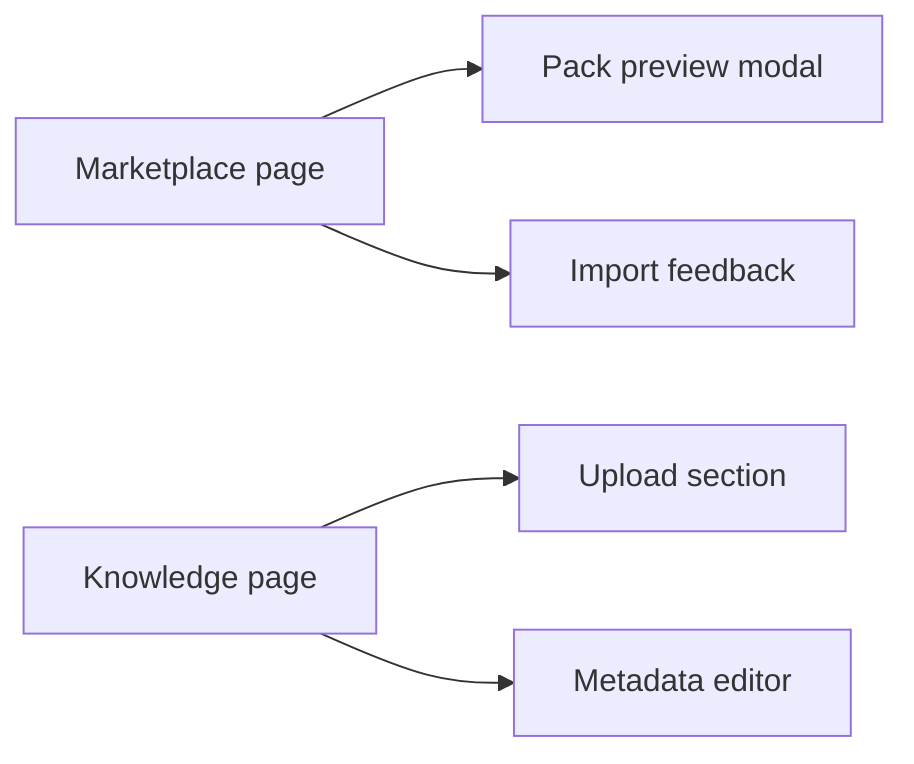

# T045 Marketplace Knowledge Polish Implementation Plan

> **For agentic workers:** REQUIRED SUB-SKILL: Use superpowers:subagent-driven-development (recommended) or superpowers:executing-plans to implement this plan task-by-task. Steps use checkbox (`- [ ]`) syntax for tracking.

**Goal:** Make marketplace discovery, pack preview/import feedback, and knowledge-pack metadata editing feel more intentional without changing backend contracts or locale files.

**Architecture:** Keep the work inside the three owned frontend files. Improve information hierarchy, status affordances, and action grouping by reorganizing the existing JSX and deriving small UI-only summaries from current page state rather than adding new API fields.

**Tech Stack:** Next.js App Router, React 19, TypeScript, `react-i18next`, Tailwind CSS, lucide-react

---

### Task 1: Polish the marketplace landing and card grid

**Files:**
- Modify: `web/app/(utility)/marketplace/page.tsx`

- [ ] **Step 1: Write the failing audit command for current marketplace polish gaps**

```bash
rg -n "Filters|Showing|No knowledge packs found|Batch import result|Pack Preview|Ratings & Reviews" 'web/app/(utility)/marketplace/page.tsx' -S
```

Expected: all strings exist, but the surrounding sections still render as flat stacked blocks with limited hierarchy.

- [ ] **Step 2: Add derived UI-only summary values before the return block**

```tsx
  const activeFilterBadges = [
    searchFilter,
    subjectFilter,
    ownerFilter,
    sharingStatus,
  ].filter(Boolean);

  const selectedCount = selectedPacks.length;
  const importedCount = batchImportResult?.imported ?? 0;
```

- [ ] **Step 3: Rework the header and filter container to surface current state more clearly**

```tsx
        <div className="rounded-2xl border border-[var(--border)] bg-[var(--card)] p-4 sm:p-5">
          <div className="flex flex-col gap-3 lg:flex-row lg:items-start lg:justify-between">
            <div>
              <div className="mb-3 flex items-center gap-2 text-[13px] font-medium text-[var(--muted-foreground)]">
                <Filter size={14} />
                {t("Filters")}
              </div>
              <div className="flex flex-wrap gap-2">
                {activeFilterBadges.length > 0 ? (
                  activeFilterBadges.map((badge) => (
                    <span key={String(badge)} className="rounded-full bg-[var(--background)] px-3 py-1 text-[11px] text-[var(--muted-foreground)]">
                      {badge}
                    </span>
                  ))
                ) : (
                  <span className="rounded-full bg-[var(--background)] px-3 py-1 text-[11px] text-[var(--muted-foreground)]">
                    {t("All")}
                  </span>
                )}
              </div>
            </div>
          </div>
```

- [ ] **Step 4: Restructure each marketplace card into clearer metadata and action zones**

```tsx
                <div className="flex h-full flex-col rounded-2xl border border-[var(--border)] bg-[var(--card)] p-4 shadow-sm transition-colors hover:border-[var(--foreground)]/30">
                  <div className="mb-4 flex items-start justify-between gap-3">
                    ...
                  </div>
                  <div className="grid gap-2 rounded-xl bg-[var(--background)]/80 p-3 text-[12px] text-[var(--muted-foreground)]">
                    ...
                  </div>
                  <div className="mt-4 grid gap-2 sm:grid-cols-2">
                    ...
                  </div>
                </div>
```

- [ ] **Step 5: Run a build after the marketplace-only pass**

```bash
cd web && npm run build
```

Expected: build passes and the marketplace page remains on the route list.

### Task 2: Polish preview, import feedback, and route-level error state

**Files:**
- Modify: `web/app/(utility)/marketplace/page.tsx`
- Modify: `web/app/(utility)/marketplace/error.tsx`

- [ ] **Step 1: Add stronger visual feedback for batch import and in-flight states**

```tsx
        {batchImportResult && (
          <div className="rounded-2xl border border-[var(--border)] bg-[var(--card)] p-4">
            <div className="flex items-start justify-between gap-3">
              <div>
                <div className="text-[13px] font-medium text-[var(--foreground)]">
                  {t("Batch import result")}
                </div>
                <div className="mt-1 text-[12px] text-[var(--muted-foreground)]">
                  {importedCount}/{batchImportResult.requested} {t("packs imported")}
                </div>
              </div>
              <div className="rounded-full bg-[var(--background)] px-3 py-1 text-[11px] text-[var(--muted-foreground)]">
                {selectedCount} {t("selected")}
              </div>
            </div>
          </div>
        )}
```

- [ ] **Step 2: Reorganize the preview modal into summary, assets, and review sections**

```tsx
            <div className="max-h-[calc(100vh-8rem)] space-y-5 overflow-y-auto px-4 py-4 sm:px-5">
              <section className="grid gap-3 sm:grid-cols-2 md:grid-cols-3">...</section>
              <section className="rounded-xl border border-[var(--border)] bg-[var(--background)] p-4">...</section>
              <section className="grid gap-4 rounded-xl border border-[var(--border)] bg-[var(--background)] p-4">...</section>
            </div>
```

- [ ] **Step 3: Upgrade the route error screen to match the marketplace visual language**

```tsx
    <main className="mx-auto flex min-h-[60vh] w-full max-w-[920px] flex-col items-center justify-center gap-5 px-6 py-12 text-center">
      <div className="rounded-3xl border border-[var(--border)] bg-[var(--card)] px-6 py-8 shadow-sm">
        ...
      </div>
    </main>
```

- [ ] **Step 4: Re-run formatting safety**

```bash
git diff --check
```

Expected: no whitespace or conflict marker issues.

### Task 3: Polish knowledge-pack metadata editing and upload clarity

**Files:**
- Modify: `web/app/(utility)/knowledge/page.tsx`

- [ ] **Step 1: Write the failing audit command for the current metadata editor structure**

```bash
rg -n "Upload documents|Knowledge bases|Edit Knowledge Pack Metadata|Save metadata|No knowledge bases yet" 'web/app/(utility)/knowledge/page.tsx' -S
```

Expected: the current flow is present but reads as a long undifferentiated form with limited guidance and status grouping.

- [ ] **Step 2: Add small UI-only helpers to surface metadata completeness**

```tsx
  const metadataFieldCount = [
    editKbSubject,
    editKbGrade,
    editKbCurriculum,
    editKbOwner,
  ].filter((value) => value.trim().length > 0).length;
```

- [ ] **Step 3: Rework upload and knowledge-base cards into clearer sections**

```tsx
              <section className="rounded-2xl border border-[var(--border)] bg-[var(--card)] p-5 shadow-sm">
                <div className="mb-4 flex items-start justify-between gap-3">
                  ...
                </div>
                <div className="grid gap-3">...</div>
              </section>
```

- [ ] **Step 4: Reframe the metadata editor with helper summary and grouped fields**

```tsx
                        <div className="mt-3 space-y-4 rounded-xl border border-[var(--border)] bg-[var(--card)] p-4">
                          <div className="flex flex-wrap items-center justify-between gap-2">
                            <div className="text-[12px] font-medium text-[var(--foreground)]">
                              {t("Edit Knowledge Pack Metadata")}
                            </div>
                            <div className="rounded-full bg-[var(--background)] px-3 py-1 text-[11px] text-[var(--muted-foreground)]">
                              {metadataFieldCount}
                            </div>
                          </div>
                          ...
                        </div>
```

- [ ] **Step 5: Run the required verification**

```bash
cd web && npm run build
git diff --check
```

Expected: both commands pass after the knowledge-page polish is complete.

### Task 4: Document the T045 architecture note

**Files:**
- Create: `docs/superpowers/pr-notes/2026-04-25-t045-marketplace-knowledge-polish.md`

- [ ] **Step 1: Write the PR note with a Mermaid diagram**

```md
# T045 Marketplace and Knowledge Polish

## Scope

- Improve marketplace filter/card/preview hierarchy using existing frontend state.
- Improve knowledge-pack upload and metadata-edit feedback without changing API contracts.
- `ai_first/architecture/MAIN_SYSTEM_MAP.md` not updated because route structure is unchanged.


```

- [ ] **Step 2: Commit the architecture note with the implementation**

```bash
git add docs/superpowers/pr-notes/2026-04-25-t045-marketplace-knowledge-polish.md
git commit -m "docs: add t045 architecture note"
```
