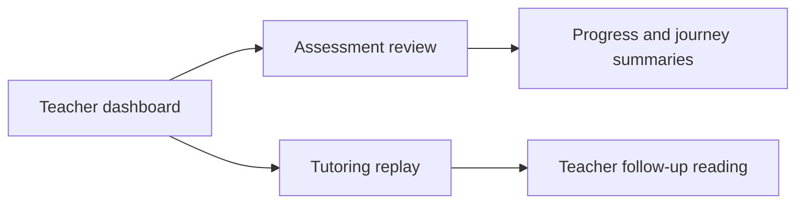

# T046 Dashboard Review Polish Implementation Plan

> **For agentic workers:** REQUIRED SUB-SKILL: Use superpowers:subagent-driven-development (recommended) or superpowers:executing-plans to implement this plan task-by-task. Steps use checkbox (`- [ ]`) syntax for tracking.

**Goal:** Refine dashboard, assessment review, and tutor replay surfaces so the contest demo path reads like one coherent teacher workflow.

**Architecture:** Keep the slice frontend-only and work entirely inside the six owned files. Improve information hierarchy, next-step guidance, and teacher-facing framing by reorganizing existing sections and deriving small UI-only summaries from current route state.

**Tech Stack:** Next.js App Router, React 19, TypeScript, `react-i18next`, Tailwind CSS, lucide-react

---

### Task 1: Strengthen dashboard overview hierarchy

**Files:**
- Modify: `web/app/(workspace)/dashboard/page.tsx`
- Modify: `web/app/(workspace)/dashboard/student/page.tsx`

- [ ] **Step 1: Audit the teacher dashboard hotspots**

```bash
rg -n "History filters|Engagement|Assessment trend|Learning signals|Recent activity|Knowledge Packs" \
  'web/app/(workspace)/dashboard/page.tsx' \
  'web/app/(workspace)/dashboard/student/page.tsx' -S
```

Expected: overview sections are present but still read as separate cards rather than a guided teacher workflow.

- [ ] **Step 2: Add small derived summaries above the return blocks**

```tsx
  const nextActionLabel =
    (analytics?.learning_signals.focus_topics?.length ?? 0) > 0
      ? t("Review the weakest topics first")
      : t("Open the latest session and confirm the student is ready for the next pack");
```

- [ ] **Step 3: Rework dashboard hero and section headers so they explain why each block matters**

```tsx
        <header className="rounded-2xl border border-[var(--border)] bg-[var(--card)] p-5 shadow-sm">
          ...
          <div className="rounded-xl bg-[var(--background)] px-4 py-3 text-[12px] text-[var(--muted-foreground)]">
            {nextActionLabel}
          </div>
        </header>
```

- [ ] **Step 4: Reframe student dashboard cards and empty states as progress coaching**

```tsx
            <TopicList
              title={t("Focus next")}
              ...
              emptyLabel={t("No weak topics detected yet. The student is ready for a stretch goal.")}
            />
```

- [ ] **Step 5: Verify the dashboard pass**

```bash
cd web && npm run build
```

Expected: build passes after the dashboard-only polish.

### Task 2: Polish assessment review as a teacher debrief surface

**Files:**
- Modify: `web/app/(workspace)/dashboard/assessments/[sessionId]/page.tsx`
- Modify: `web/components/assessment/ProgressIndicator.tsx`
- Modify: `web/components/assessment/LearningJourneySummary.tsx`

- [ ] **Step 1: Add a teacher-facing summary panel near the review header**

```tsx
        <section className="grid gap-3 md:grid-cols-3">
          <div className="rounded-xl border border-[var(--border)] bg-[var(--card)] p-4">...</div>
        </section>
```

- [ ] **Step 2: Rework `ProgressIndicator` so recommendations read like explicit next actions**

```tsx
      <div className="rounded-2xl border border-[var(--border)] bg-gradient-to-br ...">
        ...
        <h3>{t("Teacher review summary")}</h3>
      </div>
```

- [ ] **Step 3: Rework `LearningJourneySummary` to present a review timeline instead of a generic learner card**

```tsx
      <div className="rounded-2xl border border-[var(--border)] bg-[var(--card)] p-6">
        <h3>{t("Session recap")}</h3>
        ...
      </div>
```

- [ ] **Step 4: Tighten question-review cards with clearer verdict and action framing**

```tsx
                <div className="mt-3 rounded-xl bg-[var(--background)] p-3 text-[13px] text-[var(--muted-foreground)]">
                  ...
                </div>
```

- [ ] **Step 5: Re-run the required verification**

```bash
cd web && npm run build
git diff --check
```

Expected: both commands pass after review-surface changes.

### Task 3: Polish tutoring replay as a deliberate follow-up surface

**Files:**
- Modify: `web/app/(workspace)/dashboard/sessions/[sessionId]/page.tsx`

- [ ] **Step 1: Add replay-level framing and a short teacher summary**

```tsx
        <section className="rounded-2xl border border-[var(--border)] bg-[var(--card)] p-4">
          <p className="text-[12px] ...">{t("Teacher replay note")}</p>
        </section>
```

- [ ] **Step 2: Rework message cards to make role, timestamp, and content easier to scan**

```tsx
                <article className="rounded-2xl border border-[var(--border)] bg-[var(--card)] p-4 shadow-sm">
                  ...
                </article>
```

- [ ] **Step 3: Upgrade the empty state so it suggests the intended follow-up**

```tsx
            <div className="rounded-2xl border border-[var(--border)] bg-[var(--card)] p-6 text-center ...">
              {t("This tutoring session does not have replayable message content yet.")}
            </div>
```

- [ ] **Step 4: Run final verification**

```bash
cd web && npm run build
git diff --check
```

Expected: build and diff check pass for the full T046 slice.

### Task 4: Document the T046 architecture note

**Files:**
- Create: `docs/superpowers/pr-notes/2026-04-25-t046-dashboard-review-polish.md`

- [ ] **Step 1: Write the PR note with Mermaid**

```md
# T046 Dashboard Review Polish

## Scope

- Improve dashboard hierarchy and next-step framing.
- Improve assessment review and tutoring replay readability without changing contracts.
- `ai_first/architecture/MAIN_SYSTEM_MAP.md` not updated because route behavior is unchanged.


```

- [ ] **Step 2: Commit the architecture note with the implementation**

```bash
git add docs/superpowers/pr-notes/2026-04-25-t046-dashboard-review-polish.md
git commit -m "docs: add t046 architecture note"
```
