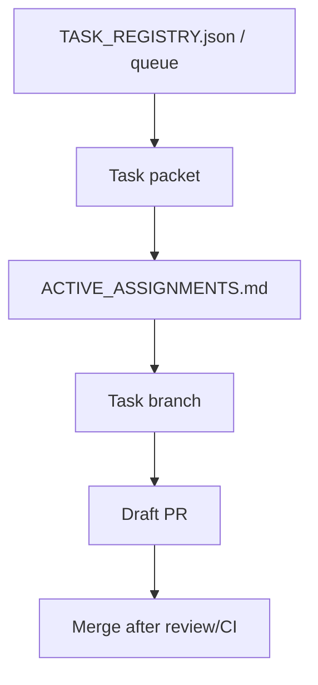

# Two-Person AI-First Collaboration Implementation Plan

> **For agentic workers:** REQUIRED SUB-SKILL: Use superpowers:subagent-driven-development (recommended) or superpowers:executing-plans to implement this plan task-by-task. Steps use checkbox (`- [ ]`) syntax for tracking.

**Goal:** Add a minimal, repo-native coordination workflow so two people on two machines can work on separate tasks in parallel without losing context or stepping on each other.

**Architecture:** Keep the current AI-first operating model intact and add only one new short-lived coordination artifact, `ai_first/ACTIVE_ASSIGNMENTS.md`. Tighten the operating prompt and shared templates so assignment-before-code, owned-file scope, and short handoff become explicit rules instead of tribal knowledge.

**Tech Stack:** Markdown, git workflow, existing AI-first docs/templates, GitHub Draft PR flow

---

## File Structure

- Create: `ai_first/ACTIVE_ASSIGNMENTS.md`
  Single short-lived coordination board for active work.
- Modify: `ai_first/AI_OPERATING_PROMPT.md`
  Add repo-level collaboration rules for two-person parallel work.
- Modify: `ai_first/templates/feature-pod-task.md`
  Keep task packet template aligned with assignment-first and explicit scope rules.
- Modify: `docs/superpowers/tasks/templates/feature-pod-task.md`
  Mirror the same task packet template change in the docs-facing copy.
- Modify: `ai_first/templates/handoff-note.md`
  Make the handoff template capture files in scope and blockers explicitly.
- Modify: `docs/superpowers/tasks/README.md`
  Add the active-assignment workflow to the task packet read path.
- Create: `docs/superpowers/pr-notes/2026-04-25-two-person-ai-first-collaboration.md`
  Required PR architecture note with Mermaid diagram.
- Modify: `ai_first/daily/2026-04-25.md`
  Record the operating change and adoption notes.

### Task 1: Add The Active Assignment Board

**Files:**
- Create: `ai_first/ACTIVE_ASSIGNMENTS.md`
- Test: repo-root validation commands only

- [ ] **Step 1: Verify the board does not already exist**

Run:

```bash
test -f ai_first/ACTIVE_ASSIGNMENTS.md && echo "exists" || echo "missing"
```

Expected: `missing`

- [ ] **Step 2: Add the board with a short template**

```md
# Active Assignments

Use this file as the short-lived coordination board for active work.

Rules:

- Add an assignment before starting code work.
- One person should hold one active task at a time.
- Keep entries short and factual.
- Update the entry when blocked, paused, moved to review, or merged.

## Template

### Assignment

- Owner:
- Machine:
- Task:
- Status:
- Branch:
- Task packet:
- Owned files:
- PR:
- Last update:
- Next action:
- Blocker:
```

- [ ] **Step 3: Verify the new board contains the required fields**

Run:

```bash
rg -n "Owner:|Machine:|Task:|Owned files:|Next action:|Blocker:" ai_first/ACTIVE_ASSIGNMENTS.md
```

Expected: six matches in `ai_first/ACTIVE_ASSIGNMENTS.md`

- [ ] **Step 4: Check formatting**

Run:

```bash
git diff --check -- ai_first/ACTIVE_ASSIGNMENTS.md
```

Expected: no output

- [ ] **Step 5: Commit**

```bash
git add ai_first/ACTIVE_ASSIGNMENTS.md
git commit -m "docs: add active assignments board"
```

### Task 2: Encode Collaboration Rules In Shared Operating Docs

**Files:**
- Modify: `ai_first/AI_OPERATING_PROMPT.md`
- Modify: `ai_first/templates/feature-pod-task.md`
- Modify: `docs/superpowers/tasks/templates/feature-pod-task.md`
- Modify: `ai_first/templates/handoff-note.md`
- Modify: `docs/superpowers/tasks/README.md`
- Test: repo-root validation commands only

- [ ] **Step 1: Verify the collaboration rule section is not already present**

Run:

```bash
rg -n "## Collaboration rules|ACTIVE_ASSIGNMENTS.md" ai_first/AI_OPERATING_PROMPT.md docs/superpowers/tasks/README.md ai_first/templates/feature-pod-task.md docs/superpowers/tasks/templates/feature-pod-task.md ai_first/templates/handoff-note.md
```

Expected: either no matches or only historical references that do not define the new workflow

- [ ] **Step 2: Add the collaboration rules to the operating prompt**

Insert this block after `## AI-first operating rules` and before `## Autonomous completion loop`:

```md
## Collaboration rules

- For two-person collaboration, prefer one person, one active task, one branch, and one PR.
- Do not start code work until the task is reflected in `ai_first/ACTIVE_ASSIGNMENTS.md`.
- Keep task packets current with owned files and do-not-touch scope before parallel work begins.
- Do not split one feature across two people unless it has been decomposed into separate task packets with separate ownership.
- Treat `ai_first/ACTIVE_ASSIGNMENTS.md` as the short-term coordination memory for active work.
```

- [ ] **Step 3: Tighten both task packet templates**

Replace the template body in both `ai_first/templates/feature-pod-task.md` and `docs/superpowers/tasks/templates/feature-pod-task.md` with:

```md
# Feature Pod Task: <feature name>

Owner:
Branch:
GitHub Issue:
Active assignment:

## Goal

## User-visible outcome

## Owned files/modules

## Do-not-touch files/modules

## API/data contract

## Acceptance criteria

## Required tests

## Manual verification

## Parallel-work notes

- Confirm `ai_first/ACTIVE_ASSIGNMENTS.md` is updated before code starts.
- Keep owned files concrete; do not use broad labels like "frontend" or "backend".
- Update this packet before scope expands.

## PR architecture note

- Must include Mermaid diagram.
- Must update `ai_first/architecture/MAIN_SYSTEM_MAP.md` if feature structure changes.

## Handoff notes
```

- [ ] **Step 4: Tighten the handoff note and task README**

Replace `ai_first/templates/handoff-note.md` with:

```md
# Handoff Note

## Changed

## Why

## Owned files in scope

## Tests run

## Tests not run

## Current blocker

## Risks

## Next AI should read

## Suggested next action
```

Append this section to `docs/superpowers/tasks/README.md`:

```md
## Active assignment workflow

Before code work starts on a task:

1. Confirm the task packet is current.
2. Add the task to `ai_first/ACTIVE_ASSIGNMENTS.md`.
3. Create or switch to the task branch.
4. Work only inside the packet's owned-file scope.

Use `ai_first/ACTIVE_ASSIGNMENTS.md` for short-lived active coordination and the task packet for the execution contract.
```

- [ ] **Step 5: Run validation**

Run:

```bash
rg -n "Collaboration rules|one person, one active task|Active assignment:|Owned files in scope|Active assignment workflow" ai_first/AI_OPERATING_PROMPT.md ai_first/templates/feature-pod-task.md docs/superpowers/tasks/templates/feature-pod-task.md ai_first/templates/handoff-note.md docs/superpowers/tasks/README.md
```

Expected: matches in all five files

Run:

```bash
git diff --check -- ai_first/AI_OPERATING_PROMPT.md ai_first/templates/feature-pod-task.md docs/superpowers/tasks/templates/feature-pod-task.md ai_first/templates/handoff-note.md docs/superpowers/tasks/README.md
```

Expected: no output

- [ ] **Step 6: Commit**

```bash
git add ai_first/AI_OPERATING_PROMPT.md ai_first/templates/feature-pod-task.md docs/superpowers/tasks/templates/feature-pod-task.md ai_first/templates/handoff-note.md docs/superpowers/tasks/README.md
git commit -m "docs: add two-person collaboration rules"
```

### Task 3: Record The Change In PR And Daily History

**Files:**
- Create: `docs/superpowers/pr-notes/2026-04-25-two-person-ai-first-collaboration.md`
- Modify: `ai_first/daily/2026-04-25.md`
- Test: repo-root validation commands only

- [ ] **Step 1: Verify the PR note does not already exist**

Run:

```bash
test -f docs/superpowers/pr-notes/2026-04-25-two-person-ai-first-collaboration.md && echo "exists" || echo "missing"
```

Expected: `missing`

- [ ] **Step 2: Add the PR architecture note**

```md
# PR Note - Two-Person AI-First Collaboration

## Summary

This PR adds the minimal coordination layer for two people working on separate tasks in parallel on the same AI-first repository.

## Why

The repo already had task packets, branches, and PRs, but it lacked one short-lived coordination surface showing who currently owns which active task. This PR fills that gap without introducing a larger distributed scheduler.

## Scope

- added `ai_first/ACTIVE_ASSIGNMENTS.md`
- added collaboration rules to the operating prompt
- updated task packet and handoff templates
- updated the task packet README
- recorded the change in the daily log

## Architecture impact

- no runtime or API behavior changes
- no `MAIN_SYSTEM_MAP.md` update required
- active coordination now lives in `ai_first/ACTIVE_ASSIGNMENTS.md`



## Validation

- `rg -n "ACTIVE_ASSIGNMENTS|Collaboration rules|Active assignment workflow|Owned files in scope" ai_first docs/superpowers`
- `git diff --check`
```

- [ ] **Step 3: Update the daily log entry**

Use this content for `ai_first/daily/2026-04-25.md`:

```md
# Daily Log - 2026-04-25

## Summary

- Added a design baseline for two-person AI-first collaboration on one shared repository.
- Added a lightweight active-assignment template under `ai_first/`.
- Updated the operating prompt and shared templates with a short rule set for two-person task coordination.

## Documents added

- `docs/superpowers/specs/2026-04-25-two-person-ai-first-collaboration-design.md`
- `docs/superpowers/pr-notes/2026-04-25-two-person-ai-first-collaboration.md`
- `ai_first/ACTIVE_ASSIGNMENTS.md`

## Operating updates

- Added a collaboration rule set to `ai_first/AI_OPERATING_PROMPT.md`
- Added active-assignment workflow guidance to shared templates and task docs
- Locked the recommended model to one person, one active task, one branch, and one PR

## Notes

- This design intentionally avoids a larger multi-machine scheduler
- The target is pragmatic two-person throughput, not generalized distributed execution
```

- [ ] **Step 4: Run final validation**

Run:

```bash
rg -n "Two-Person AI-First Collaboration|ACTIVE_ASSIGNMENTS|one person, one active task|Draft PR" docs/superpowers/pr-notes/2026-04-25-two-person-ai-first-collaboration.md ai_first/daily/2026-04-25.md
```

Expected: matches in both files

Run:

```bash
git diff --check -- docs/superpowers/pr-notes/2026-04-25-two-person-ai-first-collaboration.md ai_first/daily/2026-04-25.md
```

Expected: no output

- [ ] **Step 5: Commit**

```bash
git add docs/superpowers/pr-notes/2026-04-25-two-person-ai-first-collaboration.md ai_first/daily/2026-04-25.md
git commit -m "docs: record two-person collaboration workflow"
```

### Task 4: Final Review And Publish Preparation

**Files:**
- Modify: none
- Test: repo-root validation commands only

- [ ] **Step 1: Review spec coverage against the approved design**

Run:

```bash
rg -n "Core operating model|Minimal coordination layer|Task assignment workflow|ACTIVE_ASSIGNMENTS|Handoff rules|Scope safety" docs/superpowers/specs/2026-04-25-two-person-ai-first-collaboration-design.md
```

Expected: matches for every major section named in the approved spec

- [ ] **Step 2: Run repo-wide docs validation for this change**

Run:

```bash
rg -n "ACTIVE_ASSIGNMENTS|Collaboration rules|Active assignment workflow|Owned files in scope" ai_first docs/superpowers
```

Expected: matches in the new board, operating prompt, templates, task docs, and PR note

Run:

```bash
git diff --check
```

Expected: no output

- [ ] **Step 3: Review the staged diff for scope safety**

Run:

```bash
git diff --stat origin/main...HEAD
```

Expected: only docs and AI-first workflow files related to two-person coordination

- [ ] **Step 4: Create the final publish commit if any review fixes were needed**

```bash
git add ai_first/ACTIVE_ASSIGNMENTS.md ai_first/AI_OPERATING_PROMPT.md ai_first/templates/feature-pod-task.md docs/superpowers/tasks/templates/feature-pod-task.md ai_first/templates/handoff-note.md docs/superpowers/tasks/README.md docs/superpowers/pr-notes/2026-04-25-two-person-ai-first-collaboration.md ai_first/daily/2026-04-25.md
git commit -m "docs: finalize two-person ai-first collaboration workflow"
```

- [ ] **Step 5: Prepare Draft PR body**

Use this PR body:

```md
## Summary
- add `ai_first/ACTIVE_ASSIGNMENTS.md` as the short-lived coordination board
- add two-person collaboration rules to the operating prompt
- tighten task packet, handoff, and task docs templates for assignment-before-code workflow
- add a PR note and daily log entry for the new operating pattern

## Why
- two people on two machines need a simple way to work in parallel without adding a heavy distributed scheduler
- the repo already has task packets and PRs; this PR adds the missing active coordination layer

## Validation
- `rg -n "ACTIVE_ASSIGNMENTS|Collaboration rules|Active assignment workflow|Owned files in scope" ai_first docs/superpowers`
- `git diff --check`

## Main System Map
- Not updated; this PR is docs/workflow-only and does not change product/runtime architecture.
```

## Self-Review

### Spec coverage

- Core operating model: covered by Task 1 and Task 2
- Minimal coordination layer: covered by Task 1 and Task 2
- Task assignment workflow: covered by Task 1 and Task 2
- Handoff rules: covered by Task 2 and Task 3
- Scope safety: covered by Task 2 and Task 4

No spec gaps found for the intended implementation slice.

### Placeholder scan

- No `TBD`, `TODO`, or deferred placeholders remain
- All file paths are explicit
- All validation commands are explicit
- All template content is included inline

### Type consistency

- `ACTIVE_ASSIGNMENTS.md` naming is consistent across all tasks
- The operating prompt, templates, README, PR note, and daily log use the same assignment-before-code terminology
- Status and ownership wording stay aligned with the approved spec
