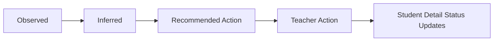

# Teacher Action Execution Loop Implementation Plan

> **For agentic workers:** REQUIRED SUB-SKILL: Use superpowers:subagent-driven-development (recommended) or superpowers:executing-plans to implement this plan task-by-task. Steps use checkbox (`- [ ]`) syntax for tracking.

**Goal:** Let teachers convert student and small-group recommendations into structured in-product teacher actions that can be created, viewed, and status-updated without building a full assignment-delivery system.

**Architecture:** This feature extends the current dashboard insight contract with a lightweight `teacher_actions` record, stored inside the existing dashboard/evidence boundary. The backend adds bounded create/read/update endpoints and attaches action summaries to the teacher-insight payload, while the frontend adds action-creation flows on student and small-group cards plus a `Teacher actions` section on student detail. The implementation must preserve the current evidence-first insight flow and stay out of runtime-policy or classroom-ops expansion.

**Tech Stack:** FastAPI, SQLite session/evidence services, pytest, Next.js App Router, React client components, TypeScript, Tailwind CSS, existing dashboard REST client

---

### Task 1: Define And Test The Backend Teacher-Action Contract

**Files:**
- Modify: `web/lib/dashboard-api.ts`
- Test: `tests/api/test_dashboard_router.py`

- [ ] **Step 1: Add failing TypeScript contract definitions for teacher actions**

Extend `web/lib/dashboard-api.ts` with the planned shape before wiring the UI:

```ts
export type TeacherActionType =
  | "reteach_concept"
  | "scaffolded_practice"
  | "review_prerequisite"
  | "small_group_remediation";

export type TeacherActionStatus = "draft" | "planned" | "done" | "dismissed";

export type TeacherActionPriority = "low" | "medium" | "high";

export interface TeacherActionRecord {
  id: string;
  target_type: "student" | "small_group";
  target_id: string;
  source_recommendation_id: string;
  action_type: TeacherActionType;
  topic: string;
  teacher_instruction: string;
  priority: TeacherActionPriority;
  status: TeacherActionStatus;
  created_at: number;
  updated_at: number;
}
```

Also extend:
- `TeacherInsightStudent` with `teacher_actions?: TeacherActionRecord[]`
- `DashboardInsights["small_groups"]` rows with optional `teacher_action?: TeacherActionRecord | null`

- [ ] **Step 2: Add failing API tests for create/read/update teacher actions**

Add three tests to `tests/api/test_dashboard_router.py`:

```python
@pytest.mark.asyncio
async def test_dashboard_teacher_action_create_round_trip(tmp_path, monkeypatch: pytest.MonkeyPatch) -> None:
    store = SQLiteSessionStore(tmp_path / "chat_history.db")
    await _seed_session(
        store,
        session_id="student-a-session",
        capability="deep_question",
        message="Generate a quiz on fractions",
        knowledge_bases=["fractions-pack"],
    )
    await store.update_session_preferences(
        "student-a-session",
        {
            "student_id": "student-a",
            "knowledge_bases": ["fractions-pack"],
            "capability": "deep_question",
        },
    )
    await store.add_message(
        "student-a-session",
        "user",
        "[Quiz Performance]\n"
        "1. [q1] Q: Solve fractions subtraction 3/4 - 1/2 -> Answered: 1/5 (Incorrect, correct: 1/4, time: 48s)\n"
        "Score: 0/1 (0%)",
        capability="deep_question",
    )

    with TestClient(_build_app(store, monkeypatch)) as client:
        insights = client.get("/api/v1/dashboard/insights")
        student = insights.json()["students"][0]
        recommendation_id = student["recommended_actions"][0]["action_id"]

        create_resp = client.post(
            "/api/v1/dashboard/teacher-actions",
            json={
                "target_type": "student",
                "target_id": "student-a",
                "source_recommendation_id": recommendation_id,
                "action_type": "reteach_concept",
                "topic": "fractions subtraction",
                "teacher_instruction": "Reteach subtraction with one visual fraction model.",
                "priority": "high",
            },
        )

        assert create_resp.status_code == 200
        created = create_resp.json()
        assert created["target_type"] == "student"
        assert created["status"] == "planned"

        refreshed = client.get("/api/v1/dashboard/insights").json()
        refreshed_student = next(row for row in refreshed["students"] if row["student_id"] == "student-a")
        assert refreshed_student["teacher_actions"][0]["source_recommendation_id"] == recommendation_id
```

```python
@pytest.mark.asyncio
async def test_dashboard_teacher_action_small_group_summary_attaches_to_group_card(tmp_path, monkeypatch: pytest.MonkeyPatch) -> None:
    store = SQLiteSessionStore(tmp_path / "chat_history.db")
    await _seed_session(
        store,
        session_id="student-a-session",
        capability="deep_question",
        message="Generate a quiz on fractions",
        knowledge_bases=["fractions-pack"],
    )
    await store.update_session_preferences(
        "student-a-session",
        {"student_id": "student-a", "knowledge_bases": ["fractions-pack"], "capability": "deep_question"},
    )
    await store.add_message(
        "student-a-session",
        "user",
        "[Quiz Performance]\n1. [q1] Q: fractions subtraction -> Answered: 1/5 (Incorrect, correct: 1/4)\nScore: 0/1 (0%)",
        capability="deep_question",
    )

    await _seed_session(
        store,
        session_id="student-b-session",
        capability="deep_question",
        message="Generate a quiz on fractions",
        knowledge_bases=["fractions-pack"],
    )
    await store.update_session_preferences(
        "student-b-session",
        {"student_id": "student-b", "knowledge_bases": ["fractions-pack"], "capability": "deep_question"},
    )
    await store.add_message(
        "student-b-session",
        "user",
        "[Quiz Performance]\n1. [q1] Q: fractions subtraction -> Answered: 1/6 (Incorrect, correct: 1/2)\nScore: 0/1 (0%)",
        capability="deep_question",
    )

    with TestClient(_build_app(store, monkeypatch)) as client:
        insights = client.get("/api/v1/dashboard/insights").json()
        group = insights["small_groups"][0]

        create_resp = client.post(
            "/api/v1/dashboard/teacher-actions",
            json={
                "target_type": "small_group",
                "target_id": "fractions subtraction::concept_gap::small_group_support",
                "source_recommendation_id": f"group:{group['topic']}:{group['diagnosis_type']}",
                "action_type": "small_group_remediation",
                "topic": group["topic"],
                "teacher_instruction": "Pull these students into one reteach mini-group.",
                "priority": "high",
            },
        )

        assert create_resp.status_code == 200

        refreshed = client.get("/api/v1/dashboard/insights").json()
        refreshed_group = refreshed["small_groups"][0]
        assert refreshed_group["teacher_action"]["target_type"] == "small_group"
        assert refreshed_group["teacher_action"]["action_type"] == "small_group_remediation"
```

```python
@pytest.mark.asyncio
async def test_dashboard_teacher_action_status_update_round_trip(tmp_path, monkeypatch: pytest.MonkeyPatch) -> None:
    store = SQLiteSessionStore(tmp_path / "chat_history.db")
    await _seed_session(
        store,
        session_id="student-a-session",
        capability="deep_question",
        message="Generate a quiz on fractions",
        knowledge_bases=["fractions-pack"],
    )
    await store.update_session_preferences(
        "student-a-session",
        {"student_id": "student-a", "knowledge_bases": ["fractions-pack"], "capability": "deep_question"},
    )
    await store.add_message(
        "student-a-session",
        "user",
        "[Quiz Performance]\n1. [q1] Q: fractions subtraction -> Answered: 1/5 (Incorrect, correct: 1/4)\nScore: 0/1 (0%)",
        capability="deep_question",
    )

    with TestClient(_build_app(store, monkeypatch)) as client:
        insights = client.get("/api/v1/dashboard/insights").json()
        recommendation_id = insights["students"][0]["recommended_actions"][0]["action_id"]
        created = client.post(
            "/api/v1/dashboard/teacher-actions",
            json={
                "target_type": "student",
                "target_id": "student-a",
                "source_recommendation_id": recommendation_id,
                "action_type": "scaffolded_practice",
                "topic": "fractions subtraction",
                "teacher_instruction": "Give one more scaffolded practice item.",
                "priority": "medium",
            },
        ).json()

        update_resp = client.patch(
            f"/api/v1/dashboard/teacher-actions/{created['id']}",
            json={"status": "done"},
        )

        assert update_resp.status_code == 200
        assert update_resp.json()["status"] == "done"
```

- [ ] **Step 3: Run targeted tests to verify failure**

Run:
```bash
pytest tests/api/test_dashboard_router.py::test_dashboard_teacher_action_create_round_trip \
  tests/api/test_dashboard_router.py::test_dashboard_teacher_action_small_group_summary_attaches_to_group_card \
  tests/api/test_dashboard_router.py::test_dashboard_teacher_action_status_update_round_trip -q
```

Expected: FAIL because `/api/v1/dashboard/teacher-actions` endpoints and action fields do not exist yet.

- [ ] **Step 4: Commit the failing contract tests if you want a strict TDD checkpoint**

```bash
git add web/lib/dashboard-api.ts tests/api/test_dashboard_router.py
git commit -m "test(dashboard): define teacher action loop contract [F101]"
```

### Task 2: Implement Backend Storage And Dashboard API For Teacher Actions

**Files:**
- Create: `deeptutor/services/evidence/teacher_actions.py`
- Modify: `deeptutor/services/evidence/__init__.py`
- Modify: `deeptutor/services/evidence/teacher_insights.py`
- Modify: `deeptutor/api/routers/dashboard.py`
- Test: `tests/api/test_dashboard_router.py`

- [ ] **Step 1: Create the lightweight teacher-action service**

Add `deeptutor/services/evidence/teacher_actions.py` with a small file-scoped persistence layer that stores action records in the existing SQLite `workspace` bucket to avoid creating a brand-new subsystem.

Use this implementation shape:

```python
from __future__ import annotations

from copy import deepcopy
from datetime import datetime, timezone
from typing import Any
from uuid import uuid4

_TEACHER_ACTIONS_KEY = "teacher_actions"
_ALLOWED_ACTION_TYPES = {
    "reteach_concept",
    "scaffolded_practice",
    "review_prerequisite",
    "small_group_remediation",
}
_ALLOWED_PRIORITIES = {"low", "medium", "high"}
_ALLOWED_STATUSES = {"draft", "planned", "done", "dismissed"}


def _now_ts() -> int:
    return int(datetime.now(tz=timezone.utc).timestamp())


def _workspace_payload(store: Any) -> dict[str, Any]:
    payload = store.get_workspace_state() or {}
    if not isinstance(payload, dict):
        return {}
    return payload


def list_teacher_actions(store: Any) -> list[dict[str, Any]]:
    payload = _workspace_payload(store)
    raw = payload.get(_TEACHER_ACTIONS_KEY, [])
    if not isinstance(raw, list):
        return []
    return [deepcopy(item) for item in raw if isinstance(item, dict)]


def create_teacher_action(
    store: Any,
    *,
    target_type: str,
    target_id: str,
    source_recommendation_id: str,
    action_type: str,
    topic: str,
    teacher_instruction: str,
    priority: str,
) -> dict[str, Any]:
    if target_type not in {"student", "small_group"}:
        raise ValueError("invalid target_type")
    if action_type not in _ALLOWED_ACTION_TYPES:
        raise ValueError("invalid action_type")
    if priority not in _ALLOWED_PRIORITIES:
        raise ValueError("invalid priority")
    now = _now_ts()
    record = {
        "id": f"teacher-action:{uuid4().hex}",
        "target_type": target_type,
        "target_id": target_id,
        "source_recommendation_id": source_recommendation_id,
        "action_type": action_type,
        "topic": topic.strip(),
        "teacher_instruction": teacher_instruction.strip(),
        "priority": priority,
        "status": "planned",
        "created_at": now,
        "updated_at": now,
    }
    payload = _workspace_payload(store)
    items = list_teacher_actions(store)
    items.insert(0, record)
    payload[_TEACHER_ACTIONS_KEY] = items
    store.save_workspace_state(payload)
    return deepcopy(record)


def update_teacher_action_status(store: Any, action_id: str, *, status: str) -> dict[str, Any]:
    if status not in _ALLOWED_STATUSES:
        raise ValueError("invalid status")
    payload = _workspace_payload(store)
    items = list_teacher_actions(store)
    for item in items:
        if item.get("id") == action_id:
            item["status"] = status
            item["updated_at"] = _now_ts()
            payload[_TEACHER_ACTIONS_KEY] = items
            store.save_workspace_state(payload)
            return deepcopy(item)
    raise KeyError(action_id)
```

- [ ] **Step 2: Export the new service helpers**

Update `deeptutor/services/evidence/__init__.py` to export:

```python
from .teacher_actions import create_teacher_action, list_teacher_actions, update_teacher_action_status

__all__ = [
    "build_teacher_insights_payload",
    "build_student_diagnosis",
    "create_teacher_action",
    "list_teacher_actions",
    "update_teacher_action_status",
]
```

- [ ] **Step 3: Extend teacher-insight payload shaping with action attachments**

Update `deeptutor/services/evidence/teacher_insights.py` so it can attach actions back onto students and small groups.

Refactor the public function to accept actions:

```python
def build_teacher_insights_payload(
    *,
    student_payloads: list[dict[str, Any]],
    teacher_actions: list[dict[str, Any]] | None = None,
) -> dict[str, Any]:
```

Add helper functions along these lines:

```python
def _student_actions(student_id: str, actions: list[dict[str, Any]]) -> list[dict[str, Any]]:
    rows = [
        action for action in actions
        if action.get("target_type") == "student" and action.get("target_id") == student_id
    ]
    return sorted(rows, key=lambda row: row.get("updated_at", 0), reverse=True)


def _small_group_target_id(topic: str, diagnosis_type: str, source_action_type: str) -> str:
    return f"{topic}::{diagnosis_type}::{source_action_type}"
```

Then attach data in the returned payload:

```python
students = []
for payload in student_payloads:
    row = dict(payload)
    row["teacher_actions"] = _student_actions(str(payload.get("student_id") or "unknown"), teacher_actions or [])
    students.append(row)
```

And when building each small-group row:

```python
small_group_target_id = _small_group_target_id(topic, diagnosis_type, action_type)
matching_group_action = next(
    (
        action for action in teacher_actions or []
        if action.get("target_type") == "small_group" and action.get("target_id") == small_group_target_id
    ),
    None,
)
small_groups.append(
    {
        "topic": topic,
        "diagnosis_type": diagnosis_type,
        "student_ids": student_ids,
        "recommended_action": "small_group_support",
        "source_action_type": action_type,
        "confidence_tag": "high" if avg_confidence >= 2.5 else "medium",
        "target_id": small_group_target_id,
        "teacher_action": matching_group_action,
    }
)
```

- [ ] **Step 4: Add create and update endpoints in the dashboard router**

Update `deeptutor/api/routers/dashboard.py` with Pydantic request models and endpoints.

Add imports:

```python
from pydantic import BaseModel
from deeptutor.services.evidence.teacher_actions import (
    create_teacher_action,
    list_teacher_actions,
    update_teacher_action_status,
)
```

Add models near the top of the file:

```python
class TeacherActionCreateRequest(BaseModel):
    target_type: str
    target_id: str
    source_recommendation_id: str
    action_type: str
    topic: str
    teacher_instruction: str
    priority: str


class TeacherActionStatusUpdateRequest(BaseModel):
    status: str
```

Add endpoints:

```python
@router.post("/teacher-actions")
async def create_dashboard_teacher_action(payload: TeacherActionCreateRequest) -> dict[str, Any]:
    store = get_sqlite_session_store()
    try:
        return create_teacher_action(
            store,
            target_type=payload.target_type,
            target_id=payload.target_id,
            source_recommendation_id=payload.source_recommendation_id,
            action_type=payload.action_type,
            topic=payload.topic,
            teacher_instruction=payload.teacher_instruction,
            priority=payload.priority,
        )
    except ValueError as exc:
        raise HTTPException(status_code=400, detail=str(exc)) from exc


@router.patch("/teacher-actions/{action_id}")
async def update_dashboard_teacher_action_status(
    action_id: str,
    payload: TeacherActionStatusUpdateRequest,
) -> dict[str, Any]:
    store = get_sqlite_session_store()
    try:
        return update_teacher_action_status(store, action_id, status=payload.status)
    except ValueError as exc:
        raise HTTPException(status_code=400, detail=str(exc)) from exc
    except KeyError as exc:
        raise HTTPException(status_code=404, detail="teacher action not found") from exc
```

- [ ] **Step 5: Wire teacher actions into `/api/v1/dashboard/insights`**

Inside `get_dashboard_insights`, load actions and pass them through:

```python
teacher_actions = list_teacher_actions(store)
return build_teacher_insights_payload(
    student_payloads=student_payloads,
    teacher_actions=teacher_actions,
)
```

- [ ] **Step 6: Run targeted backend tests**

Run:
```bash
pytest tests/api/test_dashboard_router.py::test_dashboard_teacher_action_create_round_trip \
  tests/api/test_dashboard_router.py::test_dashboard_teacher_action_small_group_summary_attaches_to_group_card \
  tests/api/test_dashboard_router.py::test_dashboard_teacher_action_status_update_round_trip \
  tests/api/test_dashboard_router.py::test_dashboard_insights_returns_students_and_small_groups -q
```

Expected: PASS.

- [ ] **Step 7: Commit the backend slice**

```bash
git add deeptutor/services/evidence/teacher_actions.py deeptutor/services/evidence/__init__.py deeptutor/services/evidence/teacher_insights.py deeptutor/api/routers/dashboard.py tests/api/test_dashboard_router.py web/lib/dashboard-api.ts
git commit -m "feat(dashboard): add teacher action backend loop [F101]"
```

### Task 3: Implement The Teacher-Action UI On Dashboard Overview

**Files:**
- Create: `web/components/dashboard/TeacherActionComposer.tsx`
- Modify: `web/components/dashboard/StudentInsightCard.tsx`
- Modify: `web/components/dashboard/SmallGroupInsightCard.tsx`
- Modify: `web/components/dashboard/TeacherInsightPanel.tsx`
- Modify: `web/lib/dashboard-api.ts`
- Test: `web/components/dashboard/TeacherActionComposer.tsx` via lint

- [ ] **Step 1: Add REST helpers for create and status update**

Extend `web/lib/dashboard-api.ts` with:

```ts
export interface CreateTeacherActionRequest {
  target_type: "student" | "small_group";
  target_id: string;
  source_recommendation_id: string;
  action_type: TeacherActionType;
  topic: string;
  teacher_instruction: string;
  priority: TeacherActionPriority;
}

export async function createTeacherAction(payload: CreateTeacherActionRequest): Promise<TeacherActionRecord> {
  const response = await fetch(apiUrl("/api/v1/dashboard/teacher-actions"), {
    method: "POST",
    headers: { "Content-Type": "application/json" },
    body: JSON.stringify(payload),
  });
  return expectJson<TeacherActionRecord>(response);
}

export async function updateTeacherActionStatus(
  actionId: string,
  status: TeacherActionStatus,
): Promise<TeacherActionRecord> {
  const response = await fetch(apiUrl(`/api/v1/dashboard/teacher-actions/${actionId}`), {
    method: "PATCH",
    headers: { "Content-Type": "application/json" },
    body: JSON.stringify({ status }),
  });
  return expectJson<TeacherActionRecord>(response);
}
```

- [ ] **Step 2: Create a reusable teacher-action composer component**

Create `web/components/dashboard/TeacherActionComposer.tsx`:

```tsx
"use client";

import { useState } from "react";
import type {
  CreateTeacherActionRequest,
  TeacherActionPriority,
  TeacherActionRecord,
  TeacherActionType,
} from "@/lib/dashboard-api";
import { createTeacherAction } from "@/lib/dashboard-api";

const ACTION_TYPES: TeacherActionType[] = [
  "reteach_concept",
  "scaffolded_practice",
  "review_prerequisite",
  "small_group_remediation",
];
const PRIORITIES: TeacherActionPriority[] = ["low", "medium", "high"];

export function TeacherActionComposer({
  triggerLabel,
  defaultPayload,
  onCreated,
}: {
  triggerLabel: string;
  defaultPayload: Omit<CreateTeacherActionRequest, "teacher_instruction" | "priority" | "action_type"> & {
    defaultActionType: TeacherActionType;
  };
  onCreated: (record: TeacherActionRecord) => void;
}) {
  const [open, setOpen] = useState(false);
  const [actionType, setActionType] = useState<TeacherActionType>(defaultPayload.defaultActionType);
  const [topic, setTopic] = useState(defaultPayload.topic);
  const [teacherInstruction, setTeacherInstruction] = useState("");
  const [priority, setPriority] = useState<TeacherActionPriority>("medium");
  const [submitting, setSubmitting] = useState(false);

  async function handleSubmit() {
    setSubmitting(true);
    try {
      const record = await createTeacherAction({
        target_type: defaultPayload.target_type,
        target_id: defaultPayload.target_id,
        source_recommendation_id: defaultPayload.source_recommendation_id,
        action_type: actionType,
        topic,
        teacher_instruction: teacherInstruction,
        priority,
      });
      onCreated(record);
      setOpen(false);
      setTeacherInstruction("");
      setPriority("medium");
    } finally {
      setSubmitting(false);
    }
  }

  return (
    <div className="space-y-3">
      <button
        type="button"
        onClick={() => setOpen((value) => !value)}
        className="inline-flex items-center rounded-full border border-[var(--border)] px-3 py-1 text-[12px] font-medium text-[var(--foreground)] transition hover:border-[var(--foreground)]"
      >
        {triggerLabel}
      </button>
      {open ? (
        <div className="rounded-2xl border border-[var(--border)] bg-[var(--card)] p-3">
          <div className="grid gap-3">
            <label className="text-[12px] text-[var(--muted-foreground)]">
              Action type
              <select value={actionType} onChange={(e) => setActionType(e.target.value as TeacherActionType)} className="mt-1 w-full rounded-xl border border-[var(--border)] bg-[var(--background)] px-3 py-2 text-[13px] text-[var(--foreground)]">
                {ACTION_TYPES.map((value) => (
                  <option key={value} value={value}>{value}</option>
                ))}
              </select>
            </label>
            <label className="text-[12px] text-[var(--muted-foreground)]">
              Topic
              <input value={topic} onChange={(e) => setTopic(e.target.value)} className="mt-1 w-full rounded-xl border border-[var(--border)] bg-[var(--background)] px-3 py-2 text-[13px] text-[var(--foreground)]" />
            </label>
            <label className="text-[12px] text-[var(--muted-foreground)]">
              Teacher instruction
              <textarea value={teacherInstruction} onChange={(e) => setTeacherInstruction(e.target.value)} className="mt-1 min-h-[96px] w-full rounded-xl border border-[var(--border)] bg-[var(--background)] px-3 py-2 text-[13px] text-[var(--foreground)]" />
            </label>
            <label className="text-[12px] text-[var(--muted-foreground)]">
              Priority
              <select value={priority} onChange={(e) => setPriority(e.target.value as TeacherActionPriority)} className="mt-1 w-full rounded-xl border border-[var(--border)] bg-[var(--background)] px-3 py-2 text-[13px] text-[var(--foreground)]">
                {PRIORITIES.map((value) => (
                  <option key={value} value={value}>{value}</option>
                ))}
              </select>
            </label>
            <button type="button" disabled={submitting || teacherInstruction.trim().length === 0} onClick={handleSubmit} className="rounded-xl bg-[var(--foreground)] px-3 py-2 text-[13px] font-medium text-[var(--background)] disabled:opacity-60">
              {submitting ? "Saving..." : "Create action"}
            </button>
          </div>
        </div>
      ) : null}
    </div>
  );
}
```

- [ ] **Step 3: Wire the composer into student cards**

Update `web/components/dashboard/StudentInsightCard.tsx`:
- import `useState`, `TeacherActionComposer`, and `TeacherActionRecord`
- keep local state seeded from `student.teacher_actions ?? []`
- show the newest action summary when present
- compute a recommendation-backed default payload

Use this pattern inside the component:

```tsx
const [teacherActions, setTeacherActions] = useState<TeacherActionRecord[]>(student.teacher_actions ?? []);
const latestAction = teacherActions[0] ?? null;
```

Add to the teacher-move section:

```tsx
<TeacherActionComposer
  triggerLabel={t("Create action")}
  defaultPayload={{
    target_type: "student",
    target_id: student.student_id,
    source_recommendation_id: recommendation?.action_id ?? `student:${student.student_id}`,
    topic: recommendation?.topic ?? diagnosis?.topic ?? student.observed?.topic ?? "general",
    defaultActionType: "reteach_concept",
  }}
  onCreated={(record) => setTeacherActions((current) => [record, ...current])}
/>
{latestAction ? (
  <div className="mt-3 rounded-2xl bg-white/70 p-3 text-[12px] text-emerald-900/80">
    <div className="font-medium">{latestAction.action_type}</div>
    <div className="mt-1">{latestAction.teacher_instruction}</div>
    <div className="mt-2 text-[11px] text-emerald-900/70">Status: {latestAction.status} • Priority: {latestAction.priority}</div>
  </div>
) : null}
```

- [ ] **Step 4: Wire the composer into small-group cards**

Update `web/components/dashboard/SmallGroupInsightCard.tsx`:
- extend the `SmallGroupInsight` type usage to read `target_id` and `teacher_action`
- show the existing action summary when present
- add `TeacherActionComposer` with a `small_group` target

Use this pattern:

```tsx
const [teacherAction, setTeacherAction] = useState(group.teacher_action ?? null);
```

And in the card body:

```tsx
<TeacherActionComposer
  triggerLabel={t("Create group action")}
  defaultPayload={{
    target_type: "small_group",
    target_id: group.target_id,
    source_recommendation_id: `group:${group.topic}:${group.diagnosis_type}`,
    topic: group.topic,
    defaultActionType: "small_group_remediation",
  }}
  onCreated={(record) => setTeacherAction(record)}
/>
{teacherAction ? (
  <div className="mt-3 rounded-2xl bg-white/70 p-3 text-[12px] text-emerald-900/80">
    <div className="font-medium">{teacherAction.action_type}</div>
    <div className="mt-1">{teacherAction.teacher_instruction}</div>
    <div className="mt-2 text-[11px] text-emerald-900/70">Status: {teacherAction.status} • Priority: {teacherAction.priority}</div>
  </div>
) : null}
```

- [ ] **Step 5: Verify the overview container needs no extra orchestration**

Keep `TeacherInsightPanel.tsx` mostly unchanged. Only touch it if a prop pass-through is truly required. This keeps the action loop local to the cards and avoids unnecessary state lifting.

- [ ] **Step 6: Run targeted frontend lint**

Run:
```bash
cd web && ./node_modules/.bin/eslint --config eslint.config.mjs components/dashboard/TeacherActionComposer.tsx components/dashboard/StudentInsightCard.tsx components/dashboard/SmallGroupInsightCard.tsx lib/dashboard-api.ts
```

Expected: exit `0`.

- [ ] **Step 7: Commit the overview UI slice**

```bash
git add web/components/dashboard/TeacherActionComposer.tsx web/components/dashboard/StudentInsightCard.tsx web/components/dashboard/SmallGroupInsightCard.tsx web/lib/dashboard-api.ts
git commit -m "feat(dashboard): add teacher action creation UI [F101]"
```

### Task 4: Add Student Detail Action List And Status Updates

**Files:**
- Modify: `web/components/dashboard/StudentInsightDetail.tsx`
- Modify: `web/app/(workspace)/dashboard/student/page.tsx` only if needed to preserve the active student insight payload usage
- Modify: `web/lib/dashboard-api.ts`
- Test: frontend lint for detail files

- [ ] **Step 1: Extend the student detail component to render teacher actions**

In `web/components/dashboard/StudentInsightDetail.tsx`, import `useState`, `TeacherActionRecord`, and `updateTeacherActionStatus`.

Add local state:

```tsx
const [teacherActions, setTeacherActions] = useState<TeacherActionRecord[]>(student.teacher_actions ?? []);
```

Render a new section below the teacher-move panel:

```tsx
<section className="rounded-[28px] border border-[var(--border)] bg-[var(--card)] p-5 shadow-sm">
  <InsightSectionLabel eyebrow={t("Teacher actions")} title={teacherActions.length ? t("{{count}} recorded actions", { count: teacherActions.length }) : t("No actions yet")} />
  <div className="mt-4 space-y-3">
    {teacherActions.length ? (
      teacherActions.map((action) => (
        <div key={action.id} className="rounded-2xl bg-[var(--muted)]/50 p-4">
          <div className="flex flex-wrap items-center justify-between gap-2">
            <div>
              <div className="text-[13px] font-medium text-[var(--foreground)]">{action.action_type}</div>
              <div className="mt-1 text-[12px] text-[var(--muted-foreground)]">{action.topic}</div>
            </div>
            <select
              value={action.status}
              onChange={async (e) => {
                const updated = await updateTeacherActionStatus(action.id, e.target.value as TeacherActionStatus);
                setTeacherActions((current) => current.map((row) => (row.id === updated.id ? updated : row)));
              }}
              className="rounded-xl border border-[var(--border)] bg-[var(--background)] px-3 py-2 text-[12px] text-[var(--foreground)]"
            >
              <option value="planned">planned</option>
              <option value="done">done</option>
              <option value="dismissed">dismissed</option>
            </select>
          </div>
          <div className="mt-3 text-[13px] text-[var(--foreground)]">{action.teacher_instruction}</div>
          <div className="mt-2 text-[11px] text-[var(--muted-foreground)]">Priority: {action.priority}</div>
        </div>
      ))
    ) : (
      <div className="rounded-2xl bg-[var(--muted)]/50 p-4 text-[13px] text-[var(--muted-foreground)]">
        {t("Create a teacher action from the dashboard overview to track a concrete remediation move here.")}
      </div>
    )}
  </div>
</section>
```

- [ ] **Step 2: Keep the detail page routing stable**

Inspect `web/app/(workspace)/dashboard/student/page.tsx` and only change it if the current `activeStudent` plumbing drops `teacher_actions`. If no extra work is needed, leave the route file untouched.

- [ ] **Step 3: Run targeted frontend lint for detail flow**

Run:
```bash
cd web && ./node_modules/.bin/eslint --config eslint.config.mjs components/dashboard/StudentInsightDetail.tsx app/'(workspace)'/dashboard/student/page.tsx lib/dashboard-api.ts
```

Expected: exit `0`.

- [ ] **Step 4: Commit the detail UI slice**

```bash
git add web/components/dashboard/StudentInsightDetail.tsx web/app/'(workspace)'/dashboard/student/page.tsx web/lib/dashboard-api.ts
git commit -m "feat(dashboard): show teacher actions in student detail [F101]"
```

### Task 5: Sync Control Plane, Add PR Note, And Run Final Verification

**Files:**
- Modify: `ai_first/ACTIVE_ASSIGNMENTS.md`
- Modify: `ai_first/TASK_REGISTRY.json`
- Modify: `ai_first/daily/2026-04-26.md`
- Create: `docs/superpowers/tasks/2026-04-26-f101-teacher-action-execution-loop.md`
- Create: `docs/superpowers/pr-notes/2026-04-26-f101-teacher-action-execution-loop.md`
- Test: combined backend/frontend validation and git diff hygiene

- [ ] **Step 1: Create the concrete F101 task packet**

Add `docs/superpowers/tasks/2026-04-26-f101-teacher-action-execution-loop.md` with:
- `Task ID: F101_TEACHER_ACTION_EXECUTION_LOOP`
- `Commit tag: F101`
- owned files and do-not-touch files from the approved spec
- validation commands used in this plan
- startup and handoff notes for Session A

- [ ] **Step 2: Mark the task active in AI-first tracking**

Update:
- `ai_first/ACTIVE_ASSIGNMENTS.md` with a single active assignment for this branch/worktree
- `ai_first/TASK_REGISTRY.json` so `F101_TEACHER_ACTION_EXECUTION_LOOP` becomes `in-progress`

- [ ] **Step 3: Write the PR note with Mermaid diagram**

Create `docs/superpowers/pr-notes/2026-04-26-f101-teacher-action-execution-loop.md` and include a diagram like:



State explicitly whether `ai_first/architecture/MAIN_SYSTEM_MAP.md` changed.

- [ ] **Step 4: Append the daily-log entry**

Add a section to `ai_first/daily/2026-04-26.md` recording:
- branch/worktree
- task id
- what the teacher-action loop now does
- validation commands run
- blockers or follow-up tasks (`F102`, `F103`, `F108`)

- [ ] **Step 5: Run final verification**

Run:
```bash
pytest tests/api/test_dashboard_router.py::test_dashboard_teacher_action_create_round_trip \
  tests/api/test_dashboard_router.py::test_dashboard_teacher_action_small_group_summary_attaches_to_group_card \
  tests/api/test_dashboard_router.py::test_dashboard_teacher_action_status_update_round_trip \
  tests/api/test_dashboard_router.py::test_dashboard_insights_returns_students_and_small_groups -q
cd web && ./node_modules/.bin/eslint --config eslint.config.mjs components/dashboard/TeacherActionComposer.tsx components/dashboard/StudentInsightCard.tsx components/dashboard/SmallGroupInsightCard.tsx components/dashboard/StudentInsightDetail.tsx app/'(workspace)'/dashboard/student/page.tsx lib/dashboard-api.ts
cd .. && git diff --check
```

Expected:
- targeted dashboard pytest slice passes
- targeted frontend lint passes
- `git diff --check` exits `0`

- [ ] **Step 6: Commit the control-plane and handoff slice**

```bash
git add ai_first/ACTIVE_ASSIGNMENTS.md ai_first/TASK_REGISTRY.json ai_first/daily/2026-04-26.md docs/superpowers/tasks/2026-04-26-f101-teacher-action-execution-loop.md docs/superpowers/pr-notes/2026-04-26-f101-teacher-action-execution-loop.md
git commit -m "docs(ai-first): track teacher action loop task [F101]"
```

- [ ] **Step 7: Confirm branch status before PR**

Run:
```bash
git status --short --branch
```

Expected: clean `pod-a/teacher-action-loop` branch with intended commits only.

## Spec Coverage Check

Spec requirements covered:
- structured teacher-action object: Tasks 1 and 2
- per-student and small-group creation: Tasks 2 and 3
- immediate action visibility in dashboard flow: Task 3
- student detail action section and status updates: Task 4
- bounded backend storage inside dashboard/evidence layer: Task 2
- control-plane and handoff updates: Task 5

No spec gaps remain.

## Placeholder Scan

The plan contains no `TBD`, `TODO`, or vague “implement later” steps. Every code-edit task includes concrete file paths, commands, and code shapes.

## Type Consistency Check

Consistent identifiers used throughout:
- `TeacherActionRecord`
- `TeacherActionType`
- `TeacherActionStatus`
- `TeacherActionPriority`
- `target_type` values `student | small_group`
- API paths `/api/v1/dashboard/teacher-actions` and `/api/v1/dashboard/teacher-actions/{action_id}`
