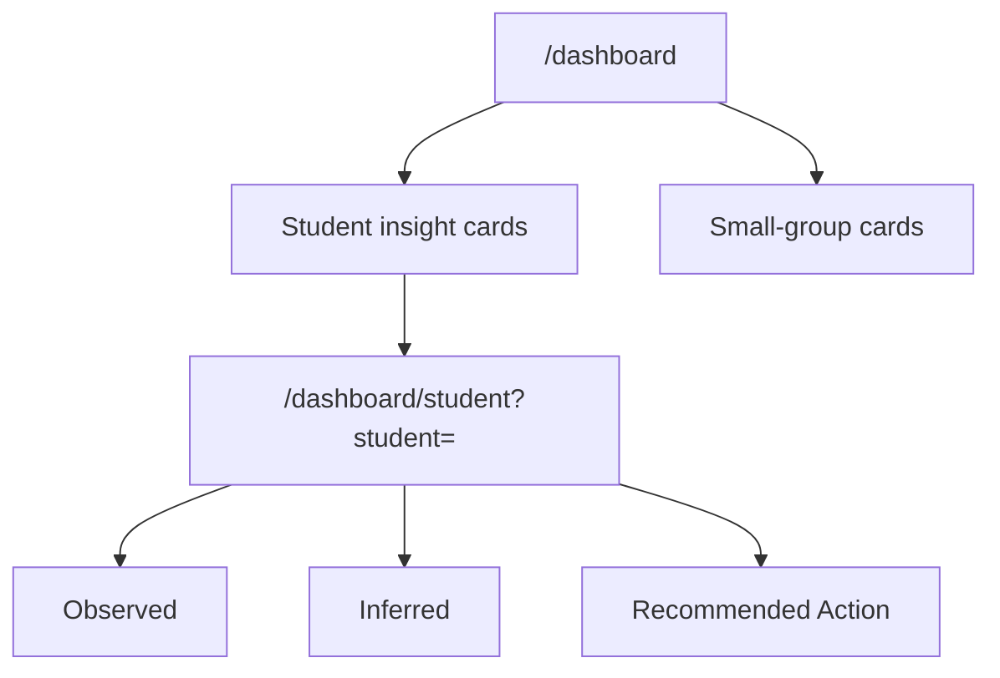

# Lane 5 Teacher Insight UI Implementation Plan

> **For agentic workers:** REQUIRED SUB-SKILL: Use superpowers:subagent-driven-development (recommended) or superpowers:executing-plans to implement this plan task-by-task. Steps use checkbox (`- [ ]`) syntax for tracking.

**Goal:** Turn the current teacher dashboard into an evidence-first workflow that clearly separates observed facts, inferred diagnosis, and recommended actions at both overview and student-detail levels.

**Architecture:** Keep the existing dashboard data contract intact and focus this lane on presentation structure. Extract small display components from the current teacher insight panel, tighten dashboard hierarchy around `Observed -> Inferred -> Recommended Action`, and repurpose the student detail page into a drill-down surface that uses the already merged payloads without inventing frontend diagnosis logic.

**Tech Stack:** Next.js App Router, React client components, TypeScript, Tailwind utility classes, `react-i18next`, existing dashboard REST client in `web/lib/dashboard-api.ts`

---

## File Structure

- Modify: `web/app/(workspace)/dashboard/page.tsx`
  - Keep page-level data fetching and filter state.
  - Reframe the page so the hero copy, summary cards, and teacher insight section follow the evidence-first workflow.
- Modify: `web/app/(workspace)/dashboard/student/page.tsx`
  - Convert the current student progress page into a teacher-facing student detail drill-down.
  - Reuse existing student progress data where useful, but prioritize evidence/diagnosis/action presentation.
- Modify: `web/components/dashboard/TeacherInsightPanel.tsx`
  - Shrink into a composition surface instead of a single large rendering file.
- Create: `web/components/dashboard/InsightSectionLabel.tsx`
  - Shared section heading for `Observed`, `Inferred`, and `Recommended Action`.
- Create: `web/components/dashboard/StudentInsightCard.tsx`
  - Overview card for one student, evidence-first and mobile-safe.
- Create: `web/components/dashboard/SmallGroupInsightCard.tsx`
  - Overview card for one small-group recommendation.
- Create: `web/components/dashboard/StudentInsightDetail.tsx`
  - Detail layout for a single student’s evidence, diagnosis, and action stack.
- Modify: `web/lib/dashboard-api.ts`
  - Add small helper types or selectors only if needed to keep components simple and typed.
- Modify: `docs/superpowers/pr-notes/2026-04-26-lane-5-teacher-insight-ui.md`
  - Record architecture note with Mermaid diagram for the PR.

### Task 1: Freeze the Lane 5 UI contract in focused presentational components

**Files:**
- Create: `web/components/dashboard/InsightSectionLabel.tsx`
- Create: `web/components/dashboard/StudentInsightCard.tsx`
- Create: `web/components/dashboard/SmallGroupInsightCard.tsx`
- Modify: `web/components/dashboard/TeacherInsightPanel.tsx`
- Test: `web/components/dashboard/TeacherInsightPanel.tsx`

- [ ] **Step 1: Write the failing lint target expectation by introducing imports that do not exist yet**

```tsx
import { InsightSectionLabel } from "@/components/dashboard/InsightSectionLabel";
import { SmallGroupInsightCard } from "@/components/dashboard/SmallGroupInsightCard";
import { StudentInsightCard } from "@/components/dashboard/StudentInsightCard";
```

Expected failure after wiring:
- `Module not found` for the three new components until they are created.

- [ ] **Step 2: Run lint on the panel file to verify the missing-component failure**

Run:

```bash
cd /Users/nguyenhuuloc/Documents/Multiagent-learning-platform/.worktrees/lane2/web
./node_modules/.bin/eslint --config eslint.config.mjs components/dashboard/TeacherInsightPanel.tsx
```

Expected:
- FAIL with unresolved imports for the new dashboard components.

- [ ] **Step 3: Create the shared section label component**

```tsx
import type { ReactNode } from "react";

export function InsightSectionLabel({
  eyebrow,
  title,
  toneClassName = "text-[var(--muted-foreground)]",
  children,
}: {
  eyebrow: string;
  title: string;
  toneClassName?: string;
  children?: ReactNode;
}) {
  return (
    <div className="space-y-1">
      <div className={`text-[11px] font-semibold uppercase tracking-[0.12em] ${toneClassName}`}>
        {eyebrow}
      </div>
      <div className="text-[14px] font-medium text-[var(--foreground)]">{title}</div>
      {children ? <div className="text-[12px] text-[var(--muted-foreground)]">{children}</div> : null}
    </div>
  );
}
```

- [ ] **Step 4: Create the student insight card component**

```tsx
import Link from "next/link";
import type { TeacherInsightStudent } from "@/lib/dashboard-api";
import { InsightSectionLabel } from "@/components/dashboard/InsightSectionLabel";

export function StudentInsightCard({
  student,
  detailHref,
  t,
}: {
  student: TeacherInsightStudent;
  detailHref: string;
  t: (value: string, options?: Record<string, string | number>) => string;
}) {
  const diagnosis = student.inferred[0];
  const recommendation = student.recommended_actions[0];

  return (
    <article className="rounded-3xl border border-[var(--border)] bg-[var(--background)] p-4">
      <div className="flex items-start justify-between gap-3">
        <div>
          <div className="text-[12px] font-semibold uppercase tracking-[0.08em] text-[var(--muted-foreground)]">
            {student.student_id}
          </div>
          <div className="mt-1 text-[16px] font-semibold text-[var(--foreground)]">
            {student.observed?.topic ?? t("No dominant topic")}
          </div>
        </div>
        <Link href={detailHref} className="text-[12px] font-medium text-[var(--foreground)] underline-offset-4 hover:underline">
          {t("Open detail")}
        </Link>
      </div>

      <div className="mt-4 grid gap-3 md:grid-cols-3">
        <section className="rounded-2xl bg-[var(--muted)]/45 p-3">
          <InsightSectionLabel eyebrow={t("Observed")} title={student.observed?.topic ?? t("No recent evidence")} />
          <ul className="mt-3 space-y-1 text-[12px] text-[var(--foreground)]">
            <li>{t("Misses: {{count}}", { count: student.observed?.miss_count ?? 0 })}</li>
            <li>{t("Latency: {{value}}", { value: student.observed?.avg_latency_seconds ?? 0 })}</li>
          </ul>
        </section>

        <section className="rounded-2xl bg-amber-50 p-3">
          <InsightSectionLabel
            eyebrow={t("Inferred")}
            title={diagnosis?.diagnosis_type ?? t("No diagnosis")}
            toneClassName="text-amber-700"
          >
            {t("Confidence: {{value}}", { value: diagnosis?.confidence_tag ?? "N/A" })}
          </InsightSectionLabel>
        </section>

        <section className="rounded-2xl bg-emerald-50 p-3">
          <InsightSectionLabel
            eyebrow={t("Recommended Action")}
            title={recommendation?.action_type ?? t("No action yet")}
            toneClassName="text-emerald-700"
          >
            {recommendation?.rationale ?? t("No recommendation available")}
          </InsightSectionLabel>
        </section>
      </div>
    </article>
  );
}
```

- [ ] **Step 5: Create the small-group card component**

```tsx
import { InsightSectionLabel } from "@/components/dashboard/InsightSectionLabel";
import type { DashboardInsights } from "@/lib/dashboard-api";

type SmallGroup = DashboardInsights["small_groups"][number];

export function SmallGroupInsightCard({
  group,
  t,
}: {
  group: SmallGroup;
  t: (value: string, options?: Record<string, string | number>) => string;
}) {
  return (
    <article className="rounded-3xl border border-[var(--border)] bg-[var(--background)] p-4">
      <InsightSectionLabel eyebrow={t("Small Group")} title={group.topic} />
      <div className="mt-3 text-[12px] text-[var(--muted-foreground)]">{group.diagnosis_type}</div>
      <div className="mt-4 rounded-2xl bg-[var(--muted)]/45 p-3">
        <InsightSectionLabel eyebrow={t("Recommended Action")} title={group.recommended_action} toneClassName="text-emerald-700" />
        <div className="mt-2 text-[12px] text-[var(--muted-foreground)]">
          {t("Students: {{students}}", { students: group.student_ids.join(", ") })}
        </div>
      </div>
    </article>
  );
}
```

- [ ] **Step 6: Refactor the panel to compose the new card components**

```tsx
import { SmallGroupInsightCard } from "@/components/dashboard/SmallGroupInsightCard";
import { StudentInsightCard } from "@/components/dashboard/StudentInsightCard";

// inside the render
<div className="space-y-4">
  {insights.students.map((student) => (
    <StudentInsightCard
      key={student.student_id}
      student={student}
      detailHref={`/dashboard/student?student=${encodeURIComponent(student.student_id)}`}
      t={t}
    />
  ))}
</div>

<div className="space-y-4">
  {insights.small_groups.map((group) => (
    <SmallGroupInsightCard key={`${group.topic}:${group.diagnosis_type}`} group={group} t={t} />
  ))}
</div>
```

- [ ] **Step 7: Run lint to verify the panel and new components pass**

Run:

```bash
cd /Users/nguyenhuuloc/Documents/Multiagent-learning-platform/.worktrees/lane2/web
./node_modules/.bin/eslint --config eslint.config.mjs components/dashboard/TeacherInsightPanel.tsx components/dashboard/InsightSectionLabel.tsx components/dashboard/StudentInsightCard.tsx components/dashboard/SmallGroupInsightCard.tsx
```

Expected:
- PASS with no lint errors in the owned component files.

- [ ] **Step 8: Commit the component extraction**

```bash
cd /Users/nguyenhuuloc/Documents/Multiagent-learning-platform/.worktrees/lane2
git add web/components/dashboard/TeacherInsightPanel.tsx web/components/dashboard/InsightSectionLabel.tsx web/components/dashboard/StudentInsightCard.tsx web/components/dashboard/SmallGroupInsightCard.tsx
git commit -m "feat(dashboard): split teacher insight cards by evidence layer [L5]"
```

### Task 2: Reframe the dashboard overview around teacher workflow instead of activity summary

**Files:**
- Modify: `web/app/(workspace)/dashboard/page.tsx`
- Modify: `web/components/dashboard/TeacherInsightPanel.tsx`
- Modify: `web/lib/dashboard-api.ts`
- Test: `web/app/(workspace)/dashboard/page.tsx`

- [ ] **Step 1: Write the failing view-level expectation by wiring the new hero copy and section order**

```tsx
<p className="text-[12px] font-semibold uppercase tracking-[0.12em] text-[var(--muted-foreground)]">
  {t("Teacher Workflow")}
</p>
<h1 className="mt-2 text-[28px] font-semibold tracking-tight text-[var(--foreground)]">
  {t("Observed, diagnosed, and ready for action")}
</h1>
```

Expected failure:
- The page renders old class-activity framing until the file is updated.

- [ ] **Step 2: Run targeted lint to confirm the page still builds after the first markup change**

Run:

```bash
cd /Users/nguyenhuuloc/Documents/Multiagent-learning-platform/.worktrees/lane2/web
./node_modules/.bin/eslint --config eslint.config.mjs app/'(workspace)'/dashboard/page.tsx
```

Expected:
- PASS or actionable lint output only in the page file being edited.

- [ ] **Step 3: Replace the current hero summary with evidence-first teacher workflow copy**

```tsx
const nextActionLabel =
  insights?.students?.[0]?.recommended_actions?.[0]?.rationale ??
  t("Review evidence-backed recommendations and confirm the next intervention.");

// inside header
<p className="text-[12px] font-semibold uppercase tracking-[0.12em] text-[var(--muted-foreground)]">
  {t("Teacher Workflow")}
</p>
<h1 className="mt-2 text-[28px] font-semibold tracking-tight text-[var(--foreground)]">
  {t("Observed, diagnosed, and ready for action")}
</h1>
<p className="mt-2 max-w-[680px] text-[14px] leading-6 text-[var(--muted-foreground)]">
  {t("Review observed facts first, then inspect diagnosis and next-step recommendations for each student or group.")}
</p>
```

- [ ] **Step 4: Move the teacher insight panel higher in the overview layout**

```tsx
{insights ? <TeacherInsightPanel insights={insights} /> : null}

<section className="grid gap-4 xl:grid-cols-[1.3fr_0.7fr]">
  {/* recent activity and knowledge-pack activity stay below the insight surface */}
</section>
```

- [ ] **Step 5: Reduce summary cards that do not help the teacher workflow**

```tsx
const cards = useMemo(
  () => [
    { label: t("Students with signals"), value: insights?.students.length ?? 0, icon: Users },
    { label: t("Small-group actions"), value: insights?.small_groups.length ?? 0, icon: BookOpen },
    { label: t("Recent assessments"), value: totals?.assessments ?? 0, icon: PenLine },
    { label: t("Active sessions"), value: totals?.running ?? 0, icon: Activity },
  ],
  [insights, t, totals],
);
```

- [ ] **Step 6: Keep the existing history filters but visually demote them below the insight hero**

```tsx
<section className="rounded-2xl border border-[var(--border)] bg-[var(--card)] p-4 shadow-sm">
  <div className="mb-3 flex items-center justify-between gap-3">
    <div className="flex items-center gap-2 text-[13px] font-medium text-[var(--muted-foreground)]">
      <Filter size={14} />
      {t("History filters")}
    </div>
  </div>
</section>
```

- [ ] **Step 7: Run lint for the overview page and panel together**

Run:

```bash
cd /Users/nguyenhuuloc/Documents/Multiagent-learning-platform/.worktrees/lane2/web
./node_modules/.bin/eslint --config eslint.config.mjs app/'(workspace)'/dashboard/page.tsx components/dashboard/TeacherInsightPanel.tsx
```

Expected:
- PASS with no new lint errors in the owned files.

- [ ] **Step 8: Commit the overview workflow reshape**

```bash
cd /Users/nguyenhuuloc/Documents/Multiagent-learning-platform/.worktrees/lane2
git add web/app/'(workspace)'/dashboard/page.tsx web/components/dashboard/TeacherInsightPanel.tsx web/lib/dashboard-api.ts
git commit -m "feat(dashboard): reframe teacher overview around evidence workflow [L5]"
```

### Task 3: Turn the student page into an evidence-first teacher drill-down

**Files:**
- Create: `web/components/dashboard/StudentInsightDetail.tsx`
- Modify: `web/app/(workspace)/dashboard/student/page.tsx`
- Modify: `web/lib/dashboard-api.ts`
- Test: `web/app/(workspace)/dashboard/student/page.tsx`

- [ ] **Step 1: Write the failing drill-down contract by reading the `student` query param**

```tsx
import { useSearchParams } from "next/navigation";

const searchParams = useSearchParams();
const studentId = searchParams.get("student") ?? "";
```

Expected failure:
- The current page ignores the selected student and still behaves like a generic student progress dashboard.

- [ ] **Step 2: Run lint to verify the page can parse the new route state**

Run:

```bash
cd /Users/nguyenhuuloc/Documents/Multiagent-learning-platform/.worktrees/lane2/web
./node_modules/.bin/eslint --config eslint.config.mjs app/'(workspace)'/dashboard/student/page.tsx
```

Expected:
- PASS or actionable lint feedback only in the student page.

- [ ] **Step 3: Add a detail component that stacks evidence, diagnosis, and action**

```tsx
import type { TeacherInsightStudent } from "@/lib/dashboard-api";
import { InsightSectionLabel } from "@/components/dashboard/InsightSectionLabel";

export function StudentInsightDetail({
  student,
  t,
}: {
  student: TeacherInsightStudent | null;
  t: (value: string, options?: Record<string, string | number>) => string;
}) {
  const diagnosis = student?.inferred[0];
  const recommendation = student?.recommended_actions[0];

  if (!student) {
    return (
      <section className="rounded-[28px] border border-dashed border-[var(--border)] bg-[var(--card)] px-5 py-8 text-center text-[13px] text-[var(--muted-foreground)]">
        {t("Choose a student from the dashboard to inspect evidence and next steps.")}
      </section>
    );
  }

  return (
    <section className="space-y-4">
      <div className="rounded-[28px] border border-[var(--border)] bg-[var(--card)] p-5">
        <InsightSectionLabel eyebrow={t("Observed")} title={student.observed?.topic ?? t("No recent evidence")} />
      </div>
      <div className="rounded-[28px] border border-[var(--border)] bg-[var(--card)] p-5">
        <InsightSectionLabel eyebrow={t("Inferred")} title={diagnosis?.diagnosis_type ?? t("No diagnosis")} toneClassName="text-amber-700" />
      </div>
      <div className="rounded-[28px] border border-[var(--border)] bg-[var(--card)] p-5">
        <InsightSectionLabel eyebrow={t("Recommended Action")} title={recommendation?.action_type ?? t("No action")} toneClassName="text-emerald-700" />
      </div>
    </section>
  );
}
```

- [ ] **Step 4: Fetch the same dashboard insights payload and select the active student**

```tsx
import { getDashboardInsights, getStudentProgress } from "@/lib/dashboard-api";

const [insights, setInsights] = useState<DashboardInsights | null>(null);

useEffect(() => {
  let cancelled = false;
  Promise.all([getStudentProgress(), getDashboardInsights(100)])
    .then(([progressData, insightData]) => {
      if (!cancelled) {
        setOverview(progressData);
        setInsights(insightData);
      }
    })
    .finally(() => {
      if (!cancelled) setLoading(false);
    });
  return () => {
    cancelled = true;
  };
}, []);

const activeStudent = insights?.students.find((row) => row.student_id === studentId) ?? null;
```

- [ ] **Step 5: Replace the page hero and body with teacher drill-down structure**

```tsx
<header className="rounded-[32px] border border-[var(--border)] bg-[var(--card)] p-6">
  <Link href="/dashboard" className="inline-flex items-center gap-2 text-[13px] text-[var(--muted-foreground)]">
    <ArrowLeft size={14} />
    {t("Back to dashboard")}
  </Link>
  <h1 className="mt-4 text-[28px] font-semibold tracking-tight text-[var(--foreground)]">
    {activeStudent?.student_id ?? t("Student detail")}
  </h1>
  <p className="mt-2 max-w-[640px] text-[14px] leading-6 text-[var(--muted-foreground)]">
    {t("Review observed evidence first, then inspect diagnosis and the recommended next move.")}
  </p>
</header>

<StudentInsightDetail student={activeStudent} t={t} />
```

- [ ] **Step 6: Keep the existing progress sections below the new detail block as supporting context**

```tsx
<div className="grid gap-4 xl:grid-cols-2">
  <TopicList ... />
  <LearningPathCard ... />
</div>
```

- [ ] **Step 7: Run lint on the student page and new detail component**

Run:

```bash
cd /Users/nguyenhuuloc/Documents/Multiagent-learning-platform/.worktrees/lane2/web
./node_modules/.bin/eslint --config eslint.config.mjs app/'(workspace)'/dashboard/student/page.tsx components/dashboard/StudentInsightDetail.tsx components/dashboard/InsightSectionLabel.tsx
```

Expected:
- PASS with no lint errors in the student detail surface.

- [ ] **Step 8: Commit the student drill-down**

```bash
cd /Users/nguyenhuuloc/Documents/Multiagent-learning-platform/.worktrees/lane2
git add web/app/'(workspace)'/dashboard/student/page.tsx web/components/dashboard/StudentInsightDetail.tsx web/lib/dashboard-api.ts
git commit -m "feat(dashboard): add evidence-first student insight detail [L5]"
```

### Task 4: Add lane documentation, validation notes, and final verification

**Files:**
- Modify: `docs/superpowers/pr-notes/2026-04-26-lane-5-teacher-insight-ui.md`
- Modify: `docs/superpowers/tasks/2026-04-26-lane-5-teacher-insight-ui.md`
- Modify: `ai_first/daily/2026-04-26.md`
- Test: owned dashboard files plus docs updates

- [ ] **Step 1: Write the PR architecture note with the final UI flow**

```md
# Lane 5 Teacher Insight UI

## Summary
- reshaped `/dashboard` around teacher insight workflow
- split student and group insight rendering into focused components
- added evidence-first student drill-down on `/dashboard/student`

## Main System Map
- not updated; workflow surface changed within the existing teacher dashboard boundary


```

- [ ] **Step 2: Update the task packet handoff notes with any payload gaps or explicit non-goals**

```md
## Handoff notes

- Implemented the evidence-first layout without changing backend diagnosis semantics.
- Student detail reuses existing dashboard insight payload plus student-progress context.
- If future UX needs richer evidence traces, extend the backend contract in a new lane instead of growing frontend inference logic.
```

- [ ] **Step 3: Record the lane in the daily log**

```md
## Lane 5

- Branch: `pod-a/teacher-insight-ui`
- Task: `L5_TEACHER_INSIGHT_UI`
- Done: Reworked the teacher dashboard into an evidence-first workflow with per-student and small-group cards plus a drill-down detail page.
- Tests: `./node_modules/.bin/eslint --config eslint.config.mjs app/'(workspace)'/dashboard/page.tsx app/'(workspace)'/dashboard/student/page.tsx components/dashboard/TeacherInsightPanel.tsx components/dashboard/InsightSectionLabel.tsx components/dashboard/StudentInsightCard.tsx components/dashboard/SmallGroupInsightCard.tsx components/dashboard/StudentInsightDetail.tsx`; `git diff --check`
- Blockers: None.
- Next: Open Draft PR, wait for CI, then move to Ready if green.
```

- [ ] **Step 4: Run final scoped lint and diff checks**

Run:

```bash
cd /Users/nguyenhuuloc/Documents/Multiagent-learning-platform/.worktrees/lane2/web
./node_modules/.bin/eslint --config eslint.config.mjs app/'(workspace)'/dashboard/page.tsx app/'(workspace)'/dashboard/student/page.tsx components/dashboard/TeacherInsightPanel.tsx components/dashboard/InsightSectionLabel.tsx components/dashboard/StudentInsightCard.tsx components/dashboard/SmallGroupInsightCard.tsx components/dashboard/StudentInsightDetail.tsx lib/dashboard-api.ts

cd /Users/nguyenhuuloc/Documents/Multiagent-learning-platform/.worktrees/lane2
git diff --check -- web/app/'(workspace)'/dashboard/page.tsx web/app/'(workspace)'/dashboard/student/page.tsx web/components/dashboard/TeacherInsightPanel.tsx web/components/dashboard/InsightSectionLabel.tsx web/components/dashboard/StudentInsightCard.tsx web/components/dashboard/SmallGroupInsightCard.tsx web/components/dashboard/StudentInsightDetail.tsx web/lib/dashboard-api.ts docs/superpowers/pr-notes/2026-04-26-lane-5-teacher-insight-ui.md docs/superpowers/tasks/2026-04-26-lane-5-teacher-insight-ui.md ai_first/daily/2026-04-26.md
```

Expected:
- PASS with no lint or diff-format errors in owned Lane 5 files.

- [ ] **Step 5: Commit docs and verification notes**

```bash
cd /Users/nguyenhuuloc/Documents/Multiagent-learning-platform/.worktrees/lane2
git add docs/superpowers/pr-notes/2026-04-26-lane-5-teacher-insight-ui.md docs/superpowers/tasks/2026-04-26-lane-5-teacher-insight-ui.md ai_first/daily/2026-04-26.md
git commit -m "docs(dashboard): record lane 5 insight workflow handoff [L5]"
```

## Self-Review

### Spec coverage

- Evidence-first hierarchy: covered in Tasks 1, 2, and 3.
- Overview-to-detail flow: covered in Tasks 2 and 3.
- Grouped-card small-group surface: covered in Task 1.
- Mobile-safe stacked layout: covered in Tasks 1 and 3 through card-based rendering and no table layout.
- No backend diagnosis logic in frontend: enforced in Tasks 1, 2, and 4 by reusing existing payload fields only.

### Placeholder scan

- No `TODO`, `TBD`, or “implement later” placeholders remain.
- Each task includes exact files, commands, and code anchors.

### Type consistency

- Shared payload types consistently use `DashboardInsights`, `TeacherInsightStudent`, and existing dashboard REST helpers from `web/lib/dashboard-api.ts`.
- All new components depend on the same evidence-first labels and avoid introducing parallel frontend-only diagnosis types.
