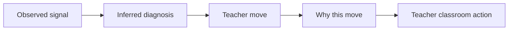

# Risk Lane 5 Dashboard Actionability Implementation Plan

> **For agentic workers:** REQUIRED SUB-SKILL: Use superpowers:subagent-driven-development (recommended) or superpowers:executing-plans to implement this plan task-by-task. Steps use checkbox (`- [ ]`) syntax for tracking.

**Goal:** Make the teacher dashboard read like a concrete decision aid by turning student and small-group recommendations into explicit teacher moves with evidence-backed reasons.

**Architecture:** Keep the existing dashboard payload and layout intact. Tighten the presentation layer in the student cards, small-group cards, and student detail view so the current `Observed -> Inferred -> Recommended Action` structure is rephrased as a teacher-facing next move without inventing new diagnosis semantics. Support the same framing in contest-facing story artifacts.

**Tech Stack:** Next.js App Router, React, TypeScript, `react-i18next`, existing dashboard components under `web/components/dashboard/`, Markdown contest docs under `docs/contest/` and `ai_first/competition/`

---

## File Map

- Modify: `web/components/dashboard/TeacherInsightPanel.tsx`
  - tighten panel intro copy so it promises concrete teacher moves
- Modify: `web/components/dashboard/StudentInsightCard.tsx`
  - reframe recommendation output as `Teacher move` plus `Why this move`
- Modify: `web/components/dashboard/SmallGroupInsightCard.tsx`
  - reframe grouped recommendations as a classroom action with explicit grouping rationale
- Modify: `web/components/dashboard/StudentInsightDetail.tsx`
  - mirror the same teacher-move hierarchy used in overview cards
- Modify: `web/app/(workspace)/dashboard/page.tsx`
  - only bounded hero/label copy updates if needed to match the new framing
- Modify: `web/app/(workspace)/dashboard/student/page.tsx`
  - only bounded copy-level support if the detail page needs matching language
- Modify: `docs/contest/DEMO_SCRIPT.md`
  - add 2-3 concise dashboard story references for presenters
- Modify: `docs/contest/README.md`
  - tighten dashboard value proposition wording around teacher moves
- Modify: `ai_first/competition/pitch-notes.md`
  - mirror the same actionability phrasing for judge defense
- Modify: `ai_first/ACTIVE_ASSIGNMENTS.md`
  - record the active lane before code starts
- Modify: `ai_first/TASK_REGISTRY.json`
  - mark `R5_DASHBOARD_ACTIONABILITY` as `in-progress` on start
- Modify: `ai_first/daily/2026-04-26.md`
  - record work and validation
- Create: `docs/superpowers/pr-notes/2026-04-26-risk-lane-5-dashboard-actionability.md`
  - required PR architecture note with Mermaid diagram

## Task 1: Start The Lane Cleanly

**Files:**
- Modify: `ai_first/ACTIVE_ASSIGNMENTS.md`
- Modify: `ai_first/TASK_REGISTRY.json`
- Test: `ai_first/TASK_REGISTRY.json`

- [ ] **Step 1: Add the active assignment entry**

Update `ai_first/ACTIVE_ASSIGNMENTS.md` so `main` no longer owns the lane and this worktree does. The entry should follow the existing template and look like:

```md
### Assignment

- Owner: Codex
- Machine: local desktop
- Worktree: `/Users/nguyenhuuloc/Documents/Multiagent-learning-platform/.worktrees/dashboard-actionability`
- Task: `R5_DASHBOARD_ACTIONABILITY`
- Status: in progress
- Branch: `pod-a/dashboard-actionability`
- Task packet: `docs/superpowers/tasks/2026-04-26-risk-lane-5-dashboard-actionability.md`
- Owned files: `web/app/(workspace)/dashboard/`, `web/components/dashboard/`, `web/lib/dashboard-api.ts`, `docs/contest/`, `ai_first/competition/`, task packet, PR note
- PR:
- Last update: 2026-04-26
- Next action: tighten student and small-group cards around teacher moves, then update contest story artifacts
- Blocker: none
```

- [ ] **Step 2: Mark `R5` in progress in the registry**

Update `ai_first/TASK_REGISTRY.json`:

- move `R5_DASHBOARD_ACTIONABILITY` into `task_categories.in_progress.tasks`
- update the `in_progress.count`
- remove it from `pending.tasks`
- update the task note to mention `pod-a/dashboard-actionability`

The task object should end with a note similar to:

```json
"status": "in-progress",
"notes": "Active on branch pod-a/dashboard-actionability. This lane tightens dashboard cards and contest artifacts around concrete teacher moves."
```

- [ ] **Step 3: Validate the registry before touching UI**

Run:

```bash
python -m json.tool ai_first/TASK_REGISTRY.json >/dev/null
```

Expected: command exits `0` with no output.

- [ ] **Step 4: Commit the control-plane start**

Run:

```bash
git add ai_first/ACTIVE_ASSIGNMENTS.md ai_first/TASK_REGISTRY.json
git commit -m "docs(ai-first): start dashboard actionability lane [R5]"
```

Expected: one small commit containing only lane-start tracking.

## Task 2: Tighten Student Cards Around Teacher Moves

**Files:**
- Modify: `web/components/dashboard/StudentInsightCard.tsx`
- Test: `web/components/dashboard/StudentInsightCard.tsx`

- [ ] **Step 1: Write the target UI wording inline before editing**

Use this target structure as the contract:

```ts
// Observed
// Teacher move
// Why this move
```

The recommendation title should stop reading like an abstract action type and start reading like a teacher move. The supporting sentence should explain why now using the current observed/inferred fields.

- [ ] **Step 2: Implement the minimal copy-only refactor**

Update `web/components/dashboard/StudentInsightCard.tsx` so the third panel reads like:

```tsx
<section className="rounded-2xl bg-emerald-50 p-3">
  <InsightSectionLabel
    eyebrow={t("Teacher move")}
    title={recommendation?.action_type ?? t("No next move yet")}
    toneClassName="text-emerald-700"
  >
    {recommendation?.rationale ?? t("No recommendation available")}
  </InsightSectionLabel>
  <div className="mt-3 text-[12px] text-emerald-900/80">
    {diagnosis?.evidence?.[0]
      ? t("Why this move: {{reason}}", { reason: diagnosis.evidence[0] })
      : t("Why this move: based on the strongest recent learning signal.")}
  </div>
</section>
```

If the actual component structure needs a slightly different expression, keep the same behavior:

- recommendation title remains sourced from existing payload
- rationale stays visible
- one short evidence-backed reason is added without inventing new backend data

- [ ] **Step 3: Keep the observed section concrete**

Make sure the observed block still reads as plain facts. If you touch it, only tighten wording like:

```tsx
<div>{t("Missed items: {{count}}", { count: student.observed?.miss_count ?? 0 })}</div>
<div>{t("Response time: {{value}}", { value: formatLatency(student.observed?.avg_latency_seconds) ?? t("Unknown") })}</div>
```

Do not add new derived metrics.

- [ ] **Step 4: Run focused lint**

Run:

```bash
/Users/nguyenhuuloc/Documents/Multiagent-learning-platform/web/node_modules/.bin/eslint --config /Users/nguyenhuuloc/Documents/Multiagent-learning-platform/web/eslint.config.mjs "/Users/nguyenhuuloc/Documents/Multiagent-learning-platform/.worktrees/dashboard-actionability/web/components/dashboard/StudentInsightCard.tsx"
```

Expected: exit `0`. If Next prints the known worktree `pages` warning, record it but treat it as non-failing.

- [ ] **Step 5: Commit the student-card pass**

Run:

```bash
git add web/components/dashboard/StudentInsightCard.tsx
git commit -m "feat(dashboard): clarify per-student teacher moves [R5]"
```

## Task 3: Tighten Small-Group And Panel Framing

**Files:**
- Modify: `web/components/dashboard/SmallGroupInsightCard.tsx`
- Modify: `web/components/dashboard/TeacherInsightPanel.tsx`
- Test: `web/components/dashboard/SmallGroupInsightCard.tsx`
- Test: `web/components/dashboard/TeacherInsightPanel.tsx`

- [ ] **Step 1: Reframe the small-group card contract**

The card should answer two questions:

1. why are these students grouped?
2. what should the teacher do with them next?

Use this target wording:

```tsx
<InsightSectionLabel eyebrow={t("Shared signal")} title={group.topic}>
  {group.diagnosis_type}
</InsightSectionLabel>
```

and:

```tsx
<InsightSectionLabel
  eyebrow={t("Teacher move")}
  title={group.recommended_action}
  toneClassName="text-emerald-700"
/>
```

- [ ] **Step 2: Implement the group rationale line**

Add a short line under the action block like:

```tsx
<div className="mt-3 text-[12px] text-emerald-900/80">
  {t("Why these students are grouped: they show the same dominant learning signal.")}
</div>
```

Keep the student list visible as the lightweight trace.

- [ ] **Step 3: Tighten the panel intro copy**

Update `web/components/dashboard/TeacherInsightPanel.tsx` intro copy from generic insight language to explicit actionability language. Target wording:

```tsx
<p className="mt-1 text-[13px] text-[var(--muted-foreground)]">
  {t("Review the strongest signals first, then act on the clearest next move for each student or small group.")}
</p>
```

If needed, also tighten the empty-state message to mention concrete next steps unlock after assessment evidence exists.

- [ ] **Step 4: Run focused lint**

Run:

```bash
/Users/nguyenhuuloc/Documents/Multiagent-learning-platform/web/node_modules/.bin/eslint --config /Users/nguyenhuuloc/Documents/Multiagent-learning-platform/web/eslint.config.mjs "/Users/nguyenhuuloc/Documents/Multiagent-learning-platform/.worktrees/dashboard-actionability/web/components/dashboard/SmallGroupInsightCard.tsx" "/Users/nguyenhuuloc/Documents/Multiagent-learning-platform/.worktrees/dashboard-actionability/web/components/dashboard/TeacherInsightPanel.tsx"
```

Expected: exit `0`, with the same known non-failing worktree warning if emitted.

- [ ] **Step 5: Commit the group/panel pass**

Run:

```bash
git add web/components/dashboard/SmallGroupInsightCard.tsx web/components/dashboard/TeacherInsightPanel.tsx
git commit -m "feat(dashboard): clarify small-group teacher moves [R5]"
```

## Task 4: Align Student Detail With Overview

**Files:**
- Modify: `web/components/dashboard/StudentInsightDetail.tsx`
- Modify: `web/app/(workspace)/dashboard/page.tsx`
- Modify: `web/app/(workspace)/dashboard/student/page.tsx`
- Test: `web/components/dashboard/StudentInsightDetail.tsx`

- [ ] **Step 1: Inspect the current detail labels and mirror the overview hierarchy**

Before editing, confirm the detail view currently exposes the same evidence blocks. The new hierarchy must read:

1. `Observed`
2. `Teacher move`
3. `Why this move`

Do not add a different interpretation model here.

- [ ] **Step 2: Implement bounded copy changes in detail**

Update `web/components/dashboard/StudentInsightDetail.tsx` so the recommendation section uses the same teacher-facing wording as the overview card. If there is already a recommendation block, rename its eyebrow/title wording instead of restructuring the whole component.

Use wording consistent with:

```tsx
eyebrow={t("Teacher move")}
```

and a short explanatory line:

```tsx
{t("Why this move: {{reason}}", { reason: ... })}
```

- [ ] **Step 3: Align page-level helper copy only if necessary**

If `web/app/(workspace)/dashboard/page.tsx` or `web/app/(workspace)/dashboard/student/page.tsx` still present the dashboard as generic analytics, tighten only the top helper sentence. Example:

```tsx
{t("Review the strongest signals first, then decide the next classroom move.")}
```

Do not redesign the hero or filters.

- [ ] **Step 4: Run focused lint on the touched dashboard files**

Run:

```bash
/Users/nguyenhuuloc/Documents/Multiagent-learning-platform/web/node_modules/.bin/eslint --config /Users/nguyenhuuloc/Documents/Multiagent-learning-platform/web/eslint.config.mjs "/Users/nguyenhuuloc/Documents/Multiagent-learning-platform/.worktrees/dashboard-actionability/web/components/dashboard/StudentInsightDetail.tsx" "/Users/nguyenhuuloc/Documents/Multiagent-learning-platform/.worktrees/dashboard-actionability/web/app/(workspace)/dashboard/page.tsx" "/Users/nguyenhuuloc/Documents/Multiagent-learning-platform/.worktrees/dashboard-actionability/web/app/(workspace)/dashboard/student/page.tsx"
```

Expected: exit `0`.

- [ ] **Step 5: Commit the detail-alignment pass**

Run:

```bash
git add web/components/dashboard/StudentInsightDetail.tsx web/app/'(workspace)'/dashboard/page.tsx web/app/'(workspace)'/dashboard/student/page.tsx
git commit -m "feat(dashboard): align detail view with teacher moves [R5]"
```

## Task 5: Add Contest Story Artifacts

**Files:**
- Modify: `docs/contest/README.md`
- Modify: `docs/contest/DEMO_SCRIPT.md`
- Modify: `ai_first/competition/pitch-notes.md`
- Test: docs files

- [ ] **Step 1: Add 2-3 concise story patterns to contest docs**

Update contest docs so they reuse the same wording as the UI. Add examples like:

```md
1. Student A missed multiple items on the same topic and needed repeated hints, so the teacher move is to reteach one prerequisite with one more scaffolded example.
2. Student B answered quickly but unreliably, so the teacher move is to slow the next check and ask for one reasoning step before another hint.
3. A small group shares the same misconception, so the teacher move is to pull them into one remediation mini-group before the next assessment.
```

- [ ] **Step 2: Keep the wording claim-safe**

Make sure every story reads as:

- evidence-backed
- teacher-reviewable
- non-private

Do not introduce any benchmarked-accuracy or autonomous-teacher claims.

- [ ] **Step 3: Run a focused text scan**

Run:

```bash
rg -n "Teacher move|Why this move|small group|reteach|scaffold|reasoning step" docs/contest ai_first/competition -S
```

Expected: the new story language is present in the intended docs only.

- [ ] **Step 4: Commit the contest-story pass**

Run:

```bash
git add docs/contest/README.md docs/contest/DEMO_SCRIPT.md ai_first/competition/pitch-notes.md
git commit -m "docs(contest): add dashboard actionability stories [R5]"
```

## Task 6: Finish The Lane For Review

**Files:**
- Modify: `ai_first/daily/2026-04-26.md`
- Create: `docs/superpowers/pr-notes/2026-04-26-risk-lane-5-dashboard-actionability.md`
- Test: full lane diff

- [ ] **Step 1: Write the PR architecture note**

Create `docs/superpowers/pr-notes/2026-04-26-risk-lane-5-dashboard-actionability.md` with:

- short summary
- statement that `ai_first/architecture/MAIN_SYSTEM_MAP.md` was not updated unless workflow boundaries truly changed
- Mermaid diagram like:

```md

```

- [ ] **Step 2: Update the daily log**

Append an `R5_DASHBOARD_ACTIONABILITY` section to `ai_first/daily/2026-04-26.md` including:

- branch/worktree
- UI files changed
- docs changed
- validation commands

- [ ] **Step 3: Run final lane validation**

Run:

```bash
/Users/nguyenhuuloc/Documents/Multiagent-learning-platform/web/node_modules/.bin/eslint --config /Users/nguyenhuuloc/Documents/Multiagent-learning-platform/web/eslint.config.mjs "/Users/nguyenhuuloc/Documents/Multiagent-learning-platform/.worktrees/dashboard-actionability/web/components/dashboard/TeacherInsightPanel.tsx" "/Users/nguyenhuuloc/Documents/Multiagent-learning-platform/.worktrees/dashboard-actionability/web/components/dashboard/StudentInsightCard.tsx" "/Users/nguyenhuuloc/Documents/Multiagent-learning-platform/.worktrees/dashboard-actionability/web/components/dashboard/SmallGroupInsightCard.tsx" "/Users/nguyenhuuloc/Documents/Multiagent-learning-platform/.worktrees/dashboard-actionability/web/components/dashboard/StudentInsightDetail.tsx" "/Users/nguyenhuuloc/Documents/Multiagent-learning-platform/.worktrees/dashboard-actionability/web/app/(workspace)/dashboard/page.tsx" "/Users/nguyenhuuloc/Documents/Multiagent-learning-platform/.worktrees/dashboard-actionability/web/app/(workspace)/dashboard/student/page.tsx"
python -m json.tool ai_first/TASK_REGISTRY.json >/dev/null
git diff --check
```

Expected:

- eslint exits `0`
- JSON validation exits `0`
- `git diff --check` prints nothing

- [ ] **Step 4: Open the review PR**

Run:

```bash
git status --short --branch
git push -u origin pod-a/dashboard-actionability
gh pr create --draft --base main --head pod-a/dashboard-actionability --title "feat(dashboard): harden teacher actionability [R5]"
```

Expected: Draft PR opened with validation notes and architecture note linked.

## Self-Review

### Spec Coverage

- student cards gain explicit `Teacher move` and `Why this move`
- small-group cards gain concrete grouped action and rationale
- student detail mirrors overview wording
- contest artifacts reuse the same classroom-action language
- no backend/runtime scope has been added

No spec gaps found.

### Placeholder Scan

The plan avoids `TBD`, `TODO`, and vague “implement later” instructions. Commands, files, and wording targets are explicit.

### Type Consistency

The plan assumes existing dashboard payload fields already used in the current components:

- `student.observed`
- `student.inferred`
- `student.recommended_actions`
- `group.topic`
- `group.diagnosis_type`
- `group.recommended_action`

No new backend property names were introduced.
