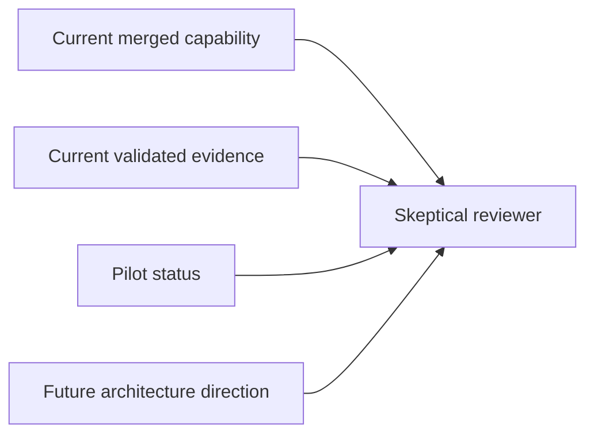

# Risk Lane 6 Claim Calibration And Pilot Implementation Plan

> **For agentic workers:** REQUIRED SUB-SKILL: Use superpowers:subagent-driven-development (recommended) or superpowers:executing-plans to implement this plan task-by-task. Steps use checkbox (`- [ ]`) syntax for tracking.

**Goal:** Tighten contest-facing claims, add an honest pilot-status artifact, and align compatibility snapshots so the project reads as a validated prototype rather than an overclaimed multi-agent deployment.

**Architecture:** This lane is docs-only. It does not strengthen the product by adding new proof; it strengthens the contest defense by aligning wording across contest docs, competition narratives, and AI-first compatibility surfaces. The implementation hinges on a single source of truth for pilot/external-feedback status and scoped language for current capability versus future architecture direction.

**Tech Stack:** Markdown docs under `docs/contest/`, AI-first narrative files under `ai_first/competition/`, compatibility snapshots under `ai_first/`, git/PR workflow

---

## File Map

- Modify: `ai_first/ACTIVE_ASSIGNMENTS.md`
  - mark lane start while work is active
- Modify: `ai_first/TASK_REGISTRY.json`
  - mark `R6_CLAIM_CALIBRATION_PILOT` in progress at start, completed after merge in a later sync PR
- Modify: `docs/contest/README.md`
  - calibrate top-level contest narrative and multi-agent wording
- Modify: `docs/contest/SUBMISSION_PACKAGE.md`
  - calibrate current-proof versus future-direction framing
- Modify: `docs/contest/HUMAN_REVIEW_HANDOFF.md`
  - make the shortest remaining manual review path claim-safe
- Modify: `docs/contest/VALIDATION_REPORT.md`
  - ensure validation evidence is clearly prototype-level and artifact-backed
- Create: `docs/contest/PILOT_STATUS.md`
  - dedicated pilot/external-feedback artifact or explicit no-pilot-yet note
- Modify: `ai_first/competition/pitch-notes.md`
  - contest pitch calibration
- Modify: `ai_first/competition/product-description.md`
  - public-facing description calibration
- Modify: `ai_first/CURRENT_STATE.md`
  - compatibility snapshot alignment
- Modify: `ai_first/NEXT_ACTIONS.md`
  - compatibility snapshot alignment
- Modify: `ai_first/daily/2026-04-26.md`
  - daily log
- Create: `docs/superpowers/pr-notes/2026-04-26-risk-lane-6-claim-calibration-and-pilot.md`
  - required architecture note with Mermaid diagram

## Task 1: Start The Lane In Control Plane

**Files:**
- Modify: `ai_first/ACTIVE_ASSIGNMENTS.md`
- Modify: `ai_first/TASK_REGISTRY.json`
- Test: `ai_first/TASK_REGISTRY.json`

- [ ] **Step 1: Add the active assignment**

Replace the idle state in `ai_first/ACTIVE_ASSIGNMENTS.md` with:

```md
### Assignment

- Owner: Codex
- Machine: local desktop
- Worktree: `/Users/nguyenhuuloc/Documents/Multiagent-learning-platform/.worktrees/claim-calibration-pilot`
- Task: `R6_CLAIM_CALIBRATION_PILOT`
- Status: in progress
- Branch: `docs/claim-calibration-pilot`
- Task packet: `docs/superpowers/tasks/2026-04-26-risk-lane-6-claim-calibration-and-pilot.md`
- Owned files: `docs/contest/`, `ai_first/competition/`, `ai_first/CURRENT_STATE.md`, `ai_first/NEXT_ACTIONS.md`, task packet, PR note
- PR:
- Last update: 2026-04-26
- Next action: calibrate contest wording and add pilot-status artifact, then validate and open Draft PR
- Blocker: none
```

- [ ] **Step 2: Mark `R6` in progress**

Update `ai_first/TASK_REGISTRY.json`:

- move `R6_CLAIM_CALIBRATION_PILOT` from `pending` to `in_progress`
- update the counts
- change the task note to mention `docs/claim-calibration-pilot`

Use a note like:

```json
"status": "in-progress",
"notes": "Active on branch docs/claim-calibration-pilot. This lane calibrates prototype claims and adds a pilot-status artifact."
```

- [ ] **Step 3: Validate JSON**

Run:

```bash
python -m json.tool ai_first/TASK_REGISTRY.json >/dev/null
```

Expected: exit `0`.

- [ ] **Step 4: Commit lane start**

Run:

```bash
git add ai_first/ACTIVE_ASSIGNMENTS.md ai_first/TASK_REGISTRY.json
git commit -m "docs(ai-first): start claim calibration lane [R6]"
```

## Task 2: Sweep Contest Docs For Claim Calibration

**Files:**
- Modify: `docs/contest/README.md`
- Modify: `docs/contest/SUBMISSION_PACKAGE.md`
- Modify: `docs/contest/HUMAN_REVIEW_HANDOFF.md`
- Modify: `docs/contest/VALIDATION_REPORT.md`
- Test: contest docs text scan

- [ ] **Step 1: Search for risky wording before editing**

Run:

```bash
rg -n "multi-agent|production|deployment|classroom-ready|validated in classrooms|user study|pilot|real users|staged" docs/contest -S
```

Expected: identify every phrase that could overstate proof or imply stronger validation than the repo supports.

- [ ] **Step 2: Calibrate `README.md`**

Update `docs/contest/README.md` so:

- current capability reads as `validated prototype`
- architecture direction reads as `agent-native` or `multi-agent by design`
- evidence wording points to current artifacts rather than ambition

Keep sentences like:

```md
The current repository is a validated prototype with smoke-backed evidence, contest screenshots, and bounded runtime-binding proof for the shipped Tutor flow.
```

and avoid lines that imply broad deployment readiness.

- [ ] **Step 3: Calibrate `SUBMISSION_PACKAGE.md`**

Make the submission package explicitly separate:

1. current merged capability
2. current proof
3. future direction

Use wording like:

```md
Current status: validated prototype.
Architecture direction: agent-native today, prepared for deeper multi-agent role separation later.
```

If `multi-agent` is present, qualify it in the same paragraph.

- [ ] **Step 4: Calibrate `HUMAN_REVIEW_HANDOFF.md` and `VALIDATION_REPORT.md`**

In `HUMAN_REVIEW_HANDOFF.md`, ensure human review tasks do not imply that classroom validation already exists.

In `VALIDATION_REPORT.md`, ensure the report says the strongest current evidence is smoke-backed validation and recaptured UI artifacts, not deployment data.

If needed, add a compact note such as:

```md
This report validates prototype behavior and demo evidence only. It is not a classroom outcome study.
```

- [ ] **Step 5: Run a focused text scan**

Run:

```bash
rg -n "multi-agent|validated prototype|future direction|classroom|deployment|user study|smoke-backed|bounded runtime-binding proof" docs/contest -S
```

Expected: risky wording is either gone or explicitly qualified.

- [ ] **Step 6: Commit the contest-doc sweep**

Run:

```bash
git add docs/contest/README.md docs/contest/SUBMISSION_PACKAGE.md docs/contest/HUMAN_REVIEW_HANDOFF.md docs/contest/VALIDATION_REPORT.md
git commit -m "docs(contest): calibrate prototype claims [R6]"
```

## Task 3: Add The Pilot Status Artifact

**Files:**
- Create: `docs/contest/PILOT_STATUS.md`
- Modify: `docs/contest/SUBMISSION_PACKAGE.md`
- Test: new artifact readability

- [ ] **Step 1: Create `PILOT_STATUS.md` with the honest default**

Create `docs/contest/PILOT_STATUS.md` with this structure:

```md
# Pilot Status

## Current Status

No pilot evidence yet is included in this repository.

## What Exists Instead

- structured walkthrough validation
- smoke-backed command evidence
- contest screenshot bundle
- diagnosis case studies and teacher-review framing

## Why This Is Still Useful

These artifacts show current merged capability and repeatable demo behavior, but they are not a substitute for classroom deployment evidence.

## Next Stronger Validation Step

The next stronger step after the contest would be a small teacher walkthrough or limited pilot with clearly documented feedback and scope.
```

If a real artifact is already present in the repository, adapt the file to describe it narrowly rather than using the default “none yet” language.

- [ ] **Step 2: Link the artifact from the submission package**

Add one line to `docs/contest/SUBMISSION_PACKAGE.md` under evidence or review materials:

```md
- Pilot / external feedback status | Ready | [`PILOT_STATUS.md`](./PILOT_STATUS.md)
```

Keep the wording neutral.

- [ ] **Step 3: Sanity-check the artifact**

Run:

```bash
sed -n '1,220p' docs/contest/PILOT_STATUS.md
```

Expected: the file clearly answers “who used this?” without exaggeration or apology.

- [ ] **Step 4: Commit the pilot-status artifact**

Run:

```bash
git add docs/contest/PILOT_STATUS.md docs/contest/SUBMISSION_PACKAGE.md
git commit -m "docs(contest): add pilot status artifact [R6]"
```

## Task 4: Align Competition And Compatibility Surfaces

**Files:**
- Modify: `ai_first/competition/pitch-notes.md`
- Modify: `ai_first/competition/product-description.md`
- Modify: `ai_first/CURRENT_STATE.md`
- Modify: `ai_first/NEXT_ACTIONS.md`
- Test: cross-file wording scan

- [ ] **Step 1: Calibrate competition narratives**

Update `ai_first/competition/pitch-notes.md` and `ai_first/competition/product-description.md` so they:

- describe the product as a validated prototype
- keep `multi-agent` scoped to architecture direction or design intent
- avoid implying real classroom deployment unless an artifact backs it

Target wording:

```md
The product is a validated prototype with teacher-defined tutoring, smoke-backed demo evidence, and a future path toward deeper role separation.
```

- [ ] **Step 2: Align compatibility snapshots**

Update `ai_first/CURRENT_STATE.md` and `ai_first/NEXT_ACTIONS.md` so they do not reintroduce stronger claims than the contest docs. Keep them short and consistent with the lane outcome.

If one file still says “multi-agent system” without qualification, replace it with scoped language like:

```md
agent-native platform with future multi-agent role separation
```

- [ ] **Step 3: Run a cross-file scan**

Run:

```bash
rg -n "multi-agent|validated prototype|future direction|deployment|pilot|user study|classroom" docs/contest ai_first/competition ai_first/CURRENT_STATE.md ai_first/NEXT_ACTIONS.md -S
```

Expected: the wording is consistent and properly scoped across all touched surfaces.

- [ ] **Step 4: Commit the narrative alignment**

Run:

```bash
git add ai_first/competition/pitch-notes.md ai_first/competition/product-description.md ai_first/CURRENT_STATE.md ai_first/NEXT_ACTIONS.md
git commit -m "docs(ai-first): align narrative with current proof [R6]"
```

## Task 5: Finish The Lane For Review

**Files:**
- Modify: `ai_first/daily/2026-04-26.md`
- Create: `docs/superpowers/pr-notes/2026-04-26-risk-lane-6-claim-calibration-and-pilot.md`
- Test: full lane diff

- [ ] **Step 1: Write the PR architecture note**

Create `docs/superpowers/pr-notes/2026-04-26-risk-lane-6-claim-calibration-and-pilot.md` with:

- summary
- list of wording surfaces updated
- statement that `ai_first/architecture/MAIN_SYSTEM_MAP.md` was not updated
- Mermaid diagram like:

```md

```

- [ ] **Step 2: Update the daily log**

Append a `R6_CLAIM_CALIBRATION_PILOT` section to `ai_first/daily/2026-04-26.md` including:

- branch/worktree
- wording surfaces changed
- pilot-status artifact added
- validation commands

- [ ] **Step 3: Run final lane validation**

Run:

```bash
python -m json.tool ai_first/TASK_REGISTRY.json >/dev/null
rg -n "multi-agent|validated prototype|future direction|pilot|user study|deployment|smoke-backed|structured walkthrough" docs/contest ai_first/competition ai_first/CURRENT_STATE.md ai_first/NEXT_ACTIONS.md -S
git diff --check
```

Expected:

- JSON validation exits `0`
- the wording scan shows only intentionally scoped matches
- `git diff --check` prints nothing

- [ ] **Step 4: Open the review PR**

Run:

```bash
git status --short --branch
git push -u origin docs/claim-calibration-pilot
gh pr create --draft --base main --head docs/claim-calibration-pilot --title "docs(contest): calibrate claims and pilot status [R6]"
```

Expected: Draft PR created with validation notes and the new pilot-status artifact.

## Self-Review

### Spec Coverage

- contest docs are swept for overclaim
- pilot status gets one dedicated artifact
- competition and compatibility surfaces align with current proof
- no runtime/product code changes are introduced

No spec gaps found.

### Placeholder Scan

The plan avoids placeholders and uses concrete file paths, wording targets, and commands.

### Consistency Check

The plan uses one consistent framing:

- current product = validated prototype
- current evidence = smoke-backed + structured walkthrough artifacts
- future role separation = scoped architecture direction
- pilot status = explicit artifact, no fabricated evidence
