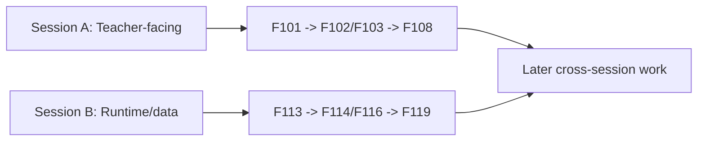

# Two-Session Future Backlog Implementation Plan

> **For agentic workers:** REQUIRED SUB-SKILL: Use superpowers:subagent-driven-development (recommended) or superpowers:executing-plans to implement this plan task-by-task. Steps use checkbox (`- [ ]`) syntax for tracking.

**Goal:** Extend the AI-first control plane with a long-range `F101-F124` backlog, explicit dependencies, and a two-session startup packet without reopening completed contest lanes.

**Architecture:** This is a docs-and-registry change. The authoritative source remains `ai_first/TASK_REGISTRY.json`, while a new task packet explains how future AI workers should split the backlog into `Session A` and `Session B`. Control-plane mirrors are updated only enough to reflect the new backlog slice without claiming any implementation task is active.

**Tech Stack:** JSON registry editing, Markdown task packet authoring, AI-first control-plane docs

---

### Task 1: Extend The Task Registry With F101-F124

**Files:**
- Modify: `ai_first/TASK_REGISTRY.json`
- Test: `ai_first/TASK_REGISTRY.json`

- [ ] **Step 1: Add the new future task IDs to the pending category summary**

Update `task_categories.pending` so it lists `F101_F124` tasks in the intended order and increments the pending count.

Expected task ID block:
```json
[
  "F101_TEACHER_ACTION_EXECUTION_LOOP",
  "F102_INTERVENTION_ASSIGNMENT_FLOW",
  "F103_RECOMMENDATION_ACKNOWLEDGEMENT_AND_STATUS",
  "F104_SMALL_GROUP_MANAGEMENT_SURFACE",
  "F105_CLASS_INTERVENTION_QUEUE",
  "F106_STUDENT_INSIGHT_TIMELINE",
  "F107_INTERVENTION_HISTORY_VIEW",
  "F108_DIAGNOSIS_FEEDBACK_CAPTURE",
  "F109_RECOMMENDATION_FEEDBACK_CAPTURE",
  "F110_TEACHER_OVERRIDE_LOG",
  "F111_ASSESSMENT_REVIEW_RUBRIC_CONTROLS",
  "F112_PROVENANCE_AND_REASON_TRACE_SURFACES",
  "F113_CAPABILITY_WIDE_RUNTIME_BINDING_COVERAGE",
  "F114_SPEC_VERSION_PINNING_PER_SESSION",
  "F115_RUNTIME_POLICY_AUDIT_TRACE",
  "F116_STUDENT_MODEL_ENRICHMENT",
  "F117_CONFIDENCE_CALIBRATION_REFINEMENT",
  "F118_MISCONCEPTION_TAXONOMY_EXPANSION",
  "F119_ABSTAIN_AND_WEAK_EVIDENCE_REFINEMENT",
  "F120_INTERVENTION_EFFECTIVENESS_TRACKING",
  "F121_CLASS_ROSTER_AND_GROUP_FOUNDATION",
  "F122_PILOT_FEEDBACK_INGESTION_PATH",
  "F123_CASEPACK_AND_EVALUATION_DATASET_EXPANSION",
  "F124_EVIDENCE_AUTOMATION_REFRESH"
]
```

- [ ] **Step 2: Append full task entries for F101-F124**

Add 24 new task objects after `R6_CLAIM_CALIBRATION_PILOT` using the spec as source of truth. Each entry must include:
```json
{
  "id": "F101_TEACHER_ACTION_EXECUTION_LOOP",
  "category": "Future Expansion",
  "priority": 50,
  "title": "Teacher Action Execution Loop",
  "description": "Turn dashboard recommendations into explicit teacher moves that can be executed, tracked, and revisited.",
  "scope": {
    "frontend": "web/components/dashboard/, web/app/(workspace)/dashboard/",
    "backend": "deeptutor/api/routers/dashboard.py and related evidence services if needed",
    "docs": "docs/superpowers/tasks/, docs/superpowers/pr-notes/"
  },
  "affected_features": [
    "Teacher Dashboard",
    "Teacher Workflow"
  ],
  "complexity": "High",
  "estimated_hours": 6,
  "dependencies": [
    "R5_DASHBOARD_ACTIONABILITY"
  ],
  "status": "not-started",
  "recommended_session_bucket": "session-a-teacher-facing",
  "layer": "teacher-workflow",
  "notes": "First recommended task for a new teacher-facing session after the contest MVP closes."
}
```

Use the same field order for every `F` task so future diffs stay easy to scan.

- [ ] **Step 3: Update registry metadata totals**

Change `metadata.total_tasks` from `49` to `73` and refresh `metadata.last_updated` to the current UTC timestamp.

Expected metadata pattern:
```json
"metadata": {
  "last_updated": "2026-04-26Txx:xx:xxZ",
  "project": "Multiagent Learning Platform - VnExpress Contest MVP",
  "status": "Active Development",
  "total_tasks": 73
}
```

- [ ] **Step 4: Run JSON validation**

Run: `python -m json.tool ai_first/TASK_REGISTRY.json >/dev/null`

Expected: exit `0` with no output.

- [ ] **Step 5: Run a focused registry sanity scan**

Run: `rg -n 'F10[1-9]|F11[0-9]|F12[0-4]|recommended_session_bucket|layer|"status": "not-started"' ai_first/TASK_REGISTRY.json -n -S`

Expected: matches for every new `F101-F124` task and the new coordination fields.

- [ ] **Step 6: Commit the registry slice**

```bash
git add ai_first/TASK_REGISTRY.json
git commit -m "docs(backlog): add two-session future tasks [OPS-BACKLOG]"
```

### Task 2: Add The Two-Session Coordination Packet

**Files:**
- Create: `docs/superpowers/tasks/2026-04-26-two-session-future-backlog.md`
- Test: `docs/superpowers/tasks/2026-04-26-two-session-future-backlog.md`

- [ ] **Step 1: Write the packet header and execution contract**

Create the packet with these required sections:
```md
# Two-Session Future Backlog

- Task ID: `OPS_TWO_SESSION_BACKLOG`
- Commit tag: `OPS-BACKLOG`
- Status: `Ready for future session startup`
- Branch recommendation:
  - `pod-a/<teacher-facing-task>`
  - `pod-b/<runtime-data-task>`
```

- [ ] **Step 2: Document the two session buckets and first-start order**

Add explicit guidance for:
- `Session A — Teacher-facing workflow`
- `Session B — Runtime, evidence, and data contracts`
- recommended first pair:
  - `F101_TEACHER_ACTION_EXECUTION_LOOP`
  - `F113_CAPABILITY_WIDE_RUNTIME_BINDING_COVERAGE`

- [ ] **Step 3: Add owned-scope and do-not-touch guidance for each bucket**

Use a compact structure like:
```md
## Session A Scope
- Typical owned files:
  - `web/components/dashboard/`
  - `web/app/(workspace)/dashboard/`
  - bounded dashboard APIs if the packet explicitly allows them
- Do not touch by default:
  - `deeptutor/services/runtime_policy/`
  - learner-model schema files owned by Session B
```

Repeat the same pattern for Session B.

- [ ] **Step 4: Add Now / Next / Later recommendations**

Summarize the startup order from the spec so future AI workers do not need to reconstruct sequencing from the registry alone.

- [ ] **Step 5: Add a handoff-oriented close**

End the packet with:
- what to read first
- how to choose a task when only one session is available
- when to stop and ask the human because of overlap

- [ ] **Step 6: Run a placeholder scan on the new packet**

Run: `rg -n 'TODO|TBD|implement later|ad hoc|<teacher-facing-task>|<runtime-data-task>' docs/superpowers/tasks/2026-04-26-two-session-future-backlog.md -S`

Expected: exit `1` after real branch examples replace the angle-bracket placeholders.

- [ ] **Step 7: Commit the packet**

```bash
git add docs/superpowers/tasks/2026-04-26-two-session-future-backlog.md
git commit -m "docs(backlog): add two-session startup packet [OPS-BACKLOG]"
```

### Task 3: Sync AI-First Mirrors For The New Backlog Slice

**Files:**
- Modify: `ai_first/AI_OPERATING_PROMPT.md`
- Modify: `ai_first/NEXT_ACTIONS.md`
- Modify: `ai_first/CURRENT_STATE.md`
- Modify: `ai_first/daily/2026-04-26.md`
- Test: `ai_first/AI_OPERATING_PROMPT.md`, `ai_first/NEXT_ACTIONS.md`, `ai_first/CURRENT_STATE.md`

- [ ] **Step 1: Update the operating prompt current snapshot**

Add one short sentence in `ai_first/AI_OPERATING_PROMPT.md` saying the repo now includes a post-contest `F101-F124` future backlog and a two-session coordination packet.

Target style:
```md
- Latest operating status: ... the optional post-contest future backlog is now defined in `ai_first/TASK_REGISTRY.json` and coordinated through `docs/superpowers/tasks/2026-04-26-two-session-future-backlog.md`.
```

- [ ] **Step 2: Update the compact next-actions mirror**

In `ai_first/NEXT_ACTIONS.md`, replace the purely terminal wording with a conditional mirror:
- human-only submission work remains current
- if more AI work is opened, the new future backlog packet is the preferred starting point

- [ ] **Step 3: Update the current-state mirror**

In `ai_first/CURRENT_STATE.md`, add a compact note that the repository now contains a long-range future backlog for two-session startup, while no implementation task is active by default.

- [ ] **Step 4: Append a daily-log entry**

Add a dated bullet block to `ai_first/daily/2026-04-26.md` noting:
- spec written and approved
- future backlog registry slice added
- two-session startup packet added
- no active implementation task opened automatically

- [ ] **Step 5: Run a focused mirror scan**

Run: `rg -n 'F101|F124|two-session future backlog|two-session startup packet|future backlog packet' ai_first/AI_OPERATING_PROMPT.md ai_first/CURRENT_STATE.md ai_first/NEXT_ACTIONS.md ai_first/daily/2026-04-26.md -S`

Expected: matches in all intended mirror files.

- [ ] **Step 6: Run diff hygiene check**

Run: `git diff --check`

Expected: exit `0`.

- [ ] **Step 7: Commit the mirror sync**

```bash
git add ai_first/AI_OPERATING_PROMPT.md ai_first/CURRENT_STATE.md ai_first/NEXT_ACTIONS.md ai_first/daily/2026-04-26.md
git commit -m "docs(ai-first): advertise future backlog packet [OPS-BACKLOG]"
```

### Task 4: Write PR Handoff And Final Validation

**Files:**
- Create: `docs/superpowers/pr-notes/2026-04-26-two-session-future-backlog.md`
- Modify: `ai_first/ACTIVE_ASSIGNMENTS.md` only if this docs lane needs a recorded assignment snapshot during execution
- Test: repository diff and note file

- [ ] **Step 1: Write the PR note with a Mermaid coordination diagram**

Create a note that covers:
- what changed in the registry
- what the two session buckets are
- how dependencies should flow

Include a Mermaid diagram like:


- [ ] **Step 2: Verify main system map does not need updating**

Add one explicit sentence in the PR note that this PR changes task planning only and does not alter product/runtime architecture, so `ai_first/architecture/MAIN_SYSTEM_MAP.md` stays unchanged.

- [ ] **Step 3: Run final validation commands**

Run:
```bash
python -m json.tool ai_first/TASK_REGISTRY.json >/dev/null
rg -n 'F10[1-9]|F11[0-9]|F12[0-4]|session-a-teacher-facing|session-b-runtime-data' ai_first/TASK_REGISTRY.json docs/superpowers/tasks/2026-04-26-two-session-future-backlog.md -S
git diff --check
```

Expected:
- JSON validation exits `0`
- `rg` returns matches for registry and packet
- `git diff --check` exits `0`

- [ ] **Step 4: Commit the PR note and final docs slice**

```bash
git add docs/superpowers/pr-notes/2026-04-26-two-session-future-backlog.md
git commit -m "docs(backlog): add two-session handoff note [OPS-BACKLOG]"
```

- [ ] **Step 5: Prepare the branch for Draft PR**

Run:
```bash
git status --short --branch
```

Expected: clean branch on `docs/two-session-future-backlog` with only intended docs/control-plane commits.

## Spec Coverage Check

Spec requirements covered:
- add 20+ new machine-readable tasks: Task 1
- include `recommended_session_bucket` and `layer`: Task 1
- preserve current contest/risk history: Task 1 appends without rewriting completed entries
- create a two-session coordination document: Task 2
- keep mirrors honest and terminal-by-default: Task 3
- provide PR/handoff documentation with Mermaid: Task 4

No spec gaps remain.

## Placeholder Scan

The plan contains no `TBD`, `TODO`, or “implement later” instructions. The packet task explicitly requires replacement of example branch placeholders before validation passes.

## Type Consistency Check

Consistent identifiers used throughout:
- `F101-F124` for future tasks
- `session-a-teacher-facing`
- `session-b-runtime-data`
- `OPS-BACKLOG` for this docs lane
- packet path `docs/superpowers/tasks/2026-04-26-two-session-future-backlog.md`
