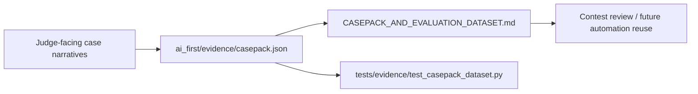

# F123 Casepack And Evaluation Dataset Expansion Implementation Plan

> **For agentic workers:** REQUIRED SUB-SKILL: Use superpowers:subagent-driven-development (recommended) or superpowers:executing-plans to implement this plan task-by-task. Steps use checkbox (`- [ ]`) syntax for tracking.

**Goal:** Build a reusable, machine-readable validation casepack and contest-facing guide that expands the current diagnosis examples into a structured dataset for future evidence review and automation.

**Architecture:** Keep the work fully inside validation assets. A JSON casepack under `ai_first/evidence/` becomes the structured source-of-truth, while a contest-facing Markdown guide explains how judges and future AI workers should use it. A bounded test validates schema completeness so later work can reuse the pack safely.

**Tech Stack:** Markdown, JSON, Python `json`/`pathlib`, pytest

---

### Task 1: Establish the F123 control-plane slice

**Files:**
- Modify: `ai_first/ACTIVE_ASSIGNMENTS.md`
- Modify: `ai_first/TASK_REGISTRY.json`
- Modify: `ai_first/daily/2026-04-28.md`
- Create: `docs/superpowers/tasks/2026-04-28-f123-casepack-and-evaluation-dataset-expansion.md`
- Create: `docs/superpowers/specs/2026-04-28-f123-casepack-and-evaluation-dataset-expansion-design.md`
- Create: `docs/superpowers/plans/2026-04-28-f123-casepack-and-evaluation-dataset-expansion.md`

- [ ] **Step 1: Mark the lane active in AI-first tracking**

Update `ai_first/TASK_REGISTRY.json` so `F123_CASEPACK_AND_EVALUATION_DATASET_EXPANSION` becomes `in-progress`, and keep `ACTIVE_ASSIGNMENTS.md` aligned with the new Session B worktree and branch.

- [ ] **Step 2: Run JSON validation on the registry**

Run: `python -m json.tool ai_first/TASK_REGISTRY.json >/dev/null`
Expected: no output, exit code `0`

- [ ] **Step 3: Record the planning start in the daily log**

Append a short `## Session B Casepack And Evaluation Dataset Expansion` entry in `ai_first/daily/2026-04-28.md` noting the branch, task, and planning scope.

- [ ] **Step 4: Commit the control-plane and planning artifacts**

```bash
git add ai_first/ACTIVE_ASSIGNMENTS.md ai_first/TASK_REGISTRY.json ai_first/daily/2026-04-28.md docs/superpowers/tasks/2026-04-28-f123-casepack-and-evaluation-dataset-expansion.md docs/superpowers/specs/2026-04-28-f123-casepack-and-evaluation-dataset-expansion-design.md docs/superpowers/plans/2026-04-28-f123-casepack-and-evaluation-dataset-expansion.md
git commit -m "docs(validation): scaffold F123 casepack work [F123]"
```

### Task 2: Add the structured casepack source-of-truth

**Files:**
- Create: `ai_first/evidence/casepack.json`
- Modify: `docs/contest/DIAGNOSIS_CASE_STUDIES.md`
- Modify: `docs/contest/README.md`
- Modify: `docs/contest/VALIDATION_REPORT.md`
- Modify: `docs/contest/SUBMISSION_PACKAGE.md`

- [ ] **Step 1: Define the casepack schema in JSON**

Create `ai_first/evidence/casepack.json` with a top-level object:

```json
{
  "version": "2026-04-28",
  "categories": [
    "diagnosis_credibility",
    "recommendation_actionability",
    "abstain_behavior",
    "teacher_execution_loop",
    "trust_trace"
  ],
  "cases": []
}
```

- [ ] **Step 2: Populate at least five bounded validation cases**

Each case must include:

```json
{
  "id": "case_slug",
  "category": "diagnosis_credibility",
  "title": "Short human-readable title",
  "objective": "What this case validates",
  "product_surface": ["teacher_dashboard"],
  "observed": ["signal 1", "signal 2"],
  "inferred": {
    "diagnosis": "concept_gap",
    "confidence": "medium",
    "abstain_reason": null
  },
  "recommended_action": "review_prerequisite",
  "teacher_review_framing": "Safe teacher-facing interpretation",
  "unsafe_overclaim": "What the system must not claim",
  "expected_artifacts": ["docs/contest/DIAGNOSIS_CASE_STUDIES.md"]
}
```

Minimum required coverage:
- one diagnosis credibility case
- one recommendation actionability case
- one abstain case
- one teacher execution loop case
- one trust trace case

- [ ] **Step 3: Keep diagnosis prose aligned with the new pack**

Update `docs/contest/DIAGNOSIS_CASE_STUDIES.md` so it explicitly references `ai_first/evidence/casepack.json` as the structured source and keeps the prose examples aligned with the shared case IDs where relevant.

- [ ] **Step 4: Point contest-facing docs at the casepack**

Add short references in:
- `docs/contest/README.md`
- `docs/contest/VALIDATION_REPORT.md`
- `docs/contest/SUBMISSION_PACKAGE.md`

Use wording that emphasizes:
- judge-safe structured examples
- no benchmark accuracy claims
- future automation reuse

- [ ] **Step 5: Validate the JSON file parses**

Run: `python -m json.tool ai_first/evidence/casepack.json >/dev/null`
Expected: no output, exit code `0`

- [ ] **Step 6: Commit the casepack and doc updates**

```bash
git add ai_first/evidence/casepack.json docs/contest/DIAGNOSIS_CASE_STUDIES.md docs/contest/README.md docs/contest/VALIDATION_REPORT.md docs/contest/SUBMISSION_PACKAGE.md
git commit -m "feat(validation): add reusable evaluation casepack [F123]"
```

### Task 3: Add a bounded validation test and contest guide

**Files:**
- Create: `docs/contest/CASEPACK_AND_EVALUATION_DATASET.md`
- Create: `tests/evidence/test_casepack_dataset.py`
- Modify: `docs/superpowers/pr-notes/2026-04-28-f123-casepack-and-evaluation-dataset-expansion.md`

- [ ] **Step 1: Write the failing casepack validation test**

Create `tests/evidence/test_casepack_dataset.py` with:

```python
import json
from pathlib import Path


def test_casepack_has_required_top_level_shape():
    payload = json.loads(Path("ai_first/evidence/casepack.json").read_text())
    assert payload["version"]
    assert isinstance(payload["categories"], list)
    assert isinstance(payload["cases"], list)
    assert payload["cases"]


def test_every_case_has_required_fields_and_known_category():
    payload = json.loads(Path("ai_first/evidence/casepack.json").read_text())
    allowed = set(payload["categories"])
    required = {
        "id",
        "category",
        "title",
        "objective",
        "product_surface",
        "observed",
        "inferred",
        "recommended_action",
        "teacher_review_framing",
        "unsafe_overclaim",
        "expected_artifacts",
    }
    for case in payload["cases"]:
        assert required.issubset(case.keys())
        assert case["category"] in allowed
        assert case["expected_artifacts"]
```

- [ ] **Step 2: Run the test to verify the new dataset shape**

Run: `pytest tests/evidence/test_casepack_dataset.py -q`
Expected: `2 passed`

- [ ] **Step 3: Write the contest-facing guide**

Create `docs/contest/CASEPACK_AND_EVALUATION_DATASET.md` with:
- purpose of the casepack
- category list
- how judges should read it
- how future AI workers can reuse it
- explicit note that it is a structured validation pack, not a benchmark leaderboard

- [ ] **Step 4: Add the required PR note with Mermaid**

Create `docs/superpowers/pr-notes/2026-04-28-f123-casepack-and-evaluation-dataset-expansion.md` and include:



State whether `ai_first/architecture/MAIN_SYSTEM_MAP.md` changed. For this lane, it should normally remain unchanged.

- [ ] **Step 5: Commit the validation harness and guide**

```bash
git add docs/contest/CASEPACK_AND_EVALUATION_DATASET.md tests/evidence/test_casepack_dataset.py docs/superpowers/pr-notes/2026-04-28-f123-casepack-and-evaluation-dataset-expansion.md
git commit -m "test(validation): verify casepack dataset integrity [F123]"
```

### Task 4: Final lane validation and PR prep

**Files:**
- Modify: `ai_first/daily/2026-04-28.md`
- Modify: `ai_first/ACTIVE_ASSIGNMENTS.md`
- Modify: `ai_first/TASK_REGISTRY.json`

- [ ] **Step 1: Run the lane validation bundle**

Run:

```bash
python -m json.tool ai_first/TASK_REGISTRY.json >/dev/null
python -m json.tool ai_first/evidence/casepack.json >/dev/null
pytest tests/evidence/test_casepack_dataset.py -q
git diff --check
```

Expected:
- JSON validation exits `0`
- pytest prints `2 passed`
- `git diff --check` prints nothing

- [ ] **Step 2: Update AI-first tracking to draft-PR-open**

Refresh:
- `ai_first/ACTIVE_ASSIGNMENTS.md`
- `ai_first/TASK_REGISTRY.json`
- `ai_first/daily/2026-04-28.md`

Set `F123` to `in-progress` with draft PR metadata until merge time.

- [ ] **Step 3: Create the Draft PR**

```bash
git push -u origin pod-b/casepack-eval-dataset
gh pr create --repo Creative-Science-Contest-2026/Multiagent-learning-platform --base main --head pod-b/casepack-eval-dataset --title "feat(validation): expand casepack evaluation dataset [F123]" --body-file <prepared-body-file> --draft
```

- [ ] **Step 4: Commit the final tracking updates**

```bash
git add ai_first/ACTIVE_ASSIGNMENTS.md ai_first/TASK_REGISTRY.json ai_first/daily/2026-04-28.md
git commit -m "chore(ai-first): record F123 draft PR state [F123]"
```
