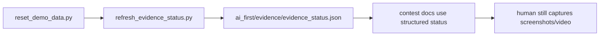

# F124 Evidence Automation Refresh Implementation Plan

> **For agentic workers:** REQUIRED SUB-SKILL: Use superpowers:subagent-driven-development (recommended) or superpowers:executing-plans to implement this plan task-by-task. Steps use checkbox (`- [ ]`) syntax for tracking.

**Goal:** Build a bounded automation helper that refreshes command-backed contest evidence status into a reusable machine-readable artifact without changing proof level or pretending manual evidence is automated.

**Architecture:** Add one orchestration script under `scripts/contest/` that reuses the existing reset flow, runs a fixed set of command-backed checks, and writes `ai_first/evidence/evidence_status.json`. Contest docs then point to that artifact for command evidence while keeping screenshots and video explicitly manual.

**Tech Stack:** Python, JSON, pytest, existing local CLI and HTTP checks

---

### Task 1: Establish the F124 control-plane slice

**Files:**
- Modify: `ai_first/ACTIVE_ASSIGNMENTS.md`
- Modify: `ai_first/TASK_REGISTRY.json`
- Modify: `ai_first/daily/2026-04-28.md`
- Create: `docs/superpowers/tasks/2026-04-28-f124-evidence-automation-refresh.md`
- Create: `docs/superpowers/specs/2026-04-28-f124-evidence-automation-refresh-design.md`
- Create: `docs/superpowers/plans/2026-04-28-f124-evidence-automation-refresh.md`

- [ ] **Step 1: Mark F124 active in AI-first tracking**

Set `F124_EVIDENCE_AUTOMATION_REFRESH` to `in-progress` in `ai_first/TASK_REGISTRY.json` and record the active worktree/branch in `ai_first/ACTIVE_ASSIGNMENTS.md`.

- [ ] **Step 2: Validate the registry update**

Run: `python -m json.tool ai_first/TASK_REGISTRY.json >/dev/null`
Expected: no output, exit code `0`

- [ ] **Step 3: Record lane start in the daily log**

Add a short section to `ai_first/daily/2026-04-28.md` noting that this lane is automating command-backed evidence refresh only.

- [ ] **Step 4: Commit the planning/control-plane setup**

```bash
git add ai_first/ACTIVE_ASSIGNMENTS.md ai_first/TASK_REGISTRY.json ai_first/daily/2026-04-28.md docs/superpowers/tasks/2026-04-28-f124-evidence-automation-refresh.md docs/superpowers/specs/2026-04-28-f124-evidence-automation-refresh-design.md docs/superpowers/plans/2026-04-28-f124-evidence-automation-refresh.md
git commit -m "docs(validation): scaffold F124 evidence automation lane [F124]"
```

### Task 2: Build the bounded orchestration helper

**Files:**
- Create: `scripts/contest/refresh_evidence_status.py`
- Create: `ai_first/evidence/evidence_status.json`
- Test: `tests/scripts/test_refresh_evidence_status.py`

- [ ] **Step 1: Write the failing tests for plan assembly and artifact shape**

Create `tests/scripts/test_refresh_evidence_status.py` with:

```python
from scripts.contest.refresh_evidence_status import build_check_plan, build_status_artifact


def test_build_check_plan_contains_expected_core_checks():
    plan = build_check_plan(api_base="http://localhost:8001", include_frontend=False)
    names = [item["name"] for item in plan]
    assert names == [
        "demo_reset",
        "system_status",
        "knowledge_list",
        "dashboard_overview",
        "dashboard_recent",
        "assessment_session",
        "tutor_session",
    ]


def test_build_status_artifact_marks_manual_followups():
    checks = [
        {"name": "system_status", "command": "curl ...", "status": "passed", "summary": "ok"},
    ]
    artifact = build_status_artifact(
        project_root=".",
        api_base="http://localhost:8001",
        checks=checks,
    )
    assert artifact["checks"][0]["manual_followup_required"] is False
    assert artifact["manual_artifacts"]["screenshots"] == "manual"
    assert artifact["manual_artifacts"]["video"] == "manual"
```

- [ ] **Step 2: Run the tests to verify they fail**

Run: `pytest tests/scripts/test_refresh_evidence_status.py -q`
Expected: fail because the helper does not exist yet

- [ ] **Step 3: Implement the helper with pure functions first**

Create `scripts/contest/refresh_evidence_status.py` with:
- `build_check_plan(api_base: str, include_frontend: bool) -> list[dict]`
- `build_status_artifact(project_root: str, api_base: str, checks: list[dict]) -> dict`
- `main()` CLI that can:
  - optionally run reset first
  - run the command checks
  - write `ai_first/evidence/evidence_status.json`

Reuse the existing safety style from `scripts/contest/reset_demo_data.py` for local API validation.

- [ ] **Step 4: Seed an initial artifact file**

Write `ai_first/evidence/evidence_status.json` using the same output shape the helper produces. The seeded artifact should clearly indicate it is a local automation snapshot, not a deployment proof.

- [ ] **Step 5: Re-run the helper tests**

Run: `pytest tests/scripts/test_refresh_evidence_status.py -q`
Expected: `2 passed`

- [ ] **Step 6: Commit the helper and test**

```bash
git add scripts/contest/refresh_evidence_status.py ai_first/evidence/evidence_status.json tests/scripts/test_refresh_evidence_status.py
git commit -m "feat(validation): add evidence refresh helper [F124]"
```

### Task 3: Wire contest docs to the new artifact

**Files:**
- Modify: `docs/contest/README.md`
- Modify: `docs/contest/VALIDATION_REPORT.md`
- Modify: `docs/contest/EVIDENCE_CHECKLIST.md`
- Modify: `docs/contest/SMOKE_RUNBOOK.md`
- Modify: `docs/contest/DEMO_DATA_RESET.md`
- Create: `docs/superpowers/pr-notes/2026-04-28-f124-evidence-automation-refresh.md`

- [ ] **Step 1: Add the artifact to contest evidence docs**

Update docs so they reference `ai_first/evidence/evidence_status.json` as the source-of-truth for command-backed evidence refresh status.

- [ ] **Step 2: Preserve the auto/manual boundary**

In `README.md`, `VALIDATION_REPORT.md`, and `EVIDENCE_CHECKLIST.md`, make the distinction explicit:
- command evidence = automation-supported
- screenshots = manual capture
- video = manual capture

- [ ] **Step 3: Update runbooks to mention the helper**

In `SMOKE_RUNBOOK.md` and `DEMO_DATA_RESET.md`, add a short note showing how the new helper fits after reset/smoke:

```bash
python3 -m scripts.contest.refresh_evidence_status --project-root . --api-base http://localhost:8001
```

- [ ] **Step 4: Add the required PR note with Mermaid**

Create `docs/superpowers/pr-notes/2026-04-28-f124-evidence-automation-refresh.md` with a Mermaid diagram such as:



State whether `ai_first/architecture/MAIN_SYSTEM_MAP.md` changed. For this lane it should normally remain unchanged.

- [ ] **Step 5: Commit the docs integration**

```bash
git add docs/contest/README.md docs/contest/VALIDATION_REPORT.md docs/contest/EVIDENCE_CHECKLIST.md docs/contest/SMOKE_RUNBOOK.md docs/contest/DEMO_DATA_RESET.md docs/superpowers/pr-notes/2026-04-28-f124-evidence-automation-refresh.md
git commit -m "docs(validation): wire evidence automation artifact [F124]"
```

### Task 4: Final validation and Draft PR

**Files:**
- Modify: `ai_first/ACTIVE_ASSIGNMENTS.md`
- Modify: `ai_first/TASK_REGISTRY.json`
- Modify: `ai_first/daily/2026-04-28.md`

- [ ] **Step 1: Run the lane validation bundle**

Run:

```bash
python -m json.tool ai_first/TASK_REGISTRY.json >/dev/null
python -m json.tool ai_first/evidence/evidence_status.json >/dev/null
pytest tests/scripts/test_refresh_evidence_status.py -q
git diff --check
```

Expected:
- JSON commands exit `0`
- pytest prints `2 passed`
- `git diff --check` prints nothing

- [ ] **Step 2: Update tracking to draft-PR-open**

Refresh `ACTIVE_ASSIGNMENTS.md`, `TASK_REGISTRY.json`, and the daily log so `F124` is clearly active with a Draft PR.

- [ ] **Step 3: Push and open the Draft PR**

```bash
git push -u origin pod-b/evidence-automation-refresh
gh pr create --repo Creative-Science-Contest-2026/Multiagent-learning-platform --base main --head pod-b/evidence-automation-refresh --title "feat(validation): automate evidence refresh status [F124]" --body-file <prepared-body-file> --draft
```

- [ ] **Step 4: Commit the final tracking update**

```bash
git add ai_first/ACTIVE_ASSIGNMENTS.md ai_first/TASK_REGISTRY.json ai_first/daily/2026-04-28.md
git commit -m "chore(ai-first): record F124 draft PR state [F124]"
```
