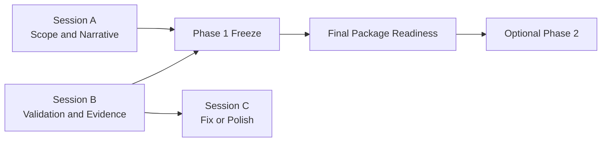

# Three-Session Submission Close Implementation Plan

> **For agentic workers:** REQUIRED SUB-SKILL: Use superpowers:subagent-driven-development (recommended) or superpowers:executing-plans to implement this plan task-by-task. Steps use checkbox (`- [ ]`) syntax for tracking.

**Goal:** Create the final three-session execution package that lets three parallel AI sessions close the contest submission with minimal file conflicts and a clean Phase 1 to Phase 2 gate.

**Architecture:** This is a docs-first coordination implementation. One master coordination packet defines the submission-close train, three session task packets define ownership and boundaries, and the AI-first control-plane mirrors are updated only where they materially affect the handoff path. Runtime code changes are not planned here; any runtime mismatch found later must be handled by a separate narrow fix PR.

**Tech Stack:** Markdown, Mermaid, git worktrees, existing `ai_first/` control-plane docs, existing `docs/contest/` evidence package, existing `docs/superpowers/tasks/` packet conventions.

---

## Scope Notes

This plan implements the execution layer for the approved spec at `docs/superpowers/specs/2026-04-28-three-session-submission-close-design.md`.

This plan does not:

- perform the submission-close work itself;
- update runtime or product code;
- recapture evidence;
- rewrite the contest package directly.

Instead, it creates the exact planning artifacts needed so three AI sessions can start immediately with bounded ownership.

The current worktree already contains unrelated untracked files:

```text
?? "ai_first/contest-product-differentiation (1).md"
?? docs/superpowers/specs/2026-04-28-three-session-submission-close-design.md
```

Workers implementing this plan must not delete or rename those files.

## File Structure

Create or modify these files:

- Create: `docs/superpowers/plans/2026-04-28-three-session-submission-close.md`  
  Responsibility: master implementation plan for the approved three-session submission-close design.

- Create: `docs/superpowers/tasks/2026-04-28-submission-close-master-coordination.md`  
  Responsibility: top-level coordination packet defining Phase 1/Phase 2 order, branch names, worktrees, dependencies, and merge policy.

- Create: `docs/superpowers/tasks/2026-04-28-session-a-submission-scope-and-narrative.md`  
  Responsibility: Session A packet for scope freeze, claim framing, narrative pack, operator skeleton, and manual-gate structure.

- Create: `docs/superpowers/tasks/2026-04-28-session-b-validation-and-evidence.md`  
  Responsibility: Session B packet for runtime revalidation, demo data contract, smoke refresh, and evidence bundle refresh.

- Create: `docs/superpowers/tasks/2026-04-28-session-c-runtime-fix-and-polish.md`  
  Responsibility: Session C packet for narrow runtime fixes on demand and optional Phase 2 product polish.

- Create: `docs/superpowers/pr-notes/three-session-submission-close-plan.md`  
  Responsibility: architecture note for the planning PR with Mermaid diagram for the session and dependency split.

- Modify: `ai_first/ACTIVE_ASSIGNMENTS.md`  
  Responsibility: add three pre-scoped assignment entries and startup instructions for the three session worktrees.

- Modify: `ai_first/EXECUTION_QUEUE.md`  
  Responsibility: add one concise next-task note pointing future workers to the new master coordination packet.

- Modify: `ai_first/NEXT_ACTIONS.md`  
  Responsibility: reflect the new three-session submission-close sequence as the current recommended path.

- Modify: `ai_first/daily/2026-04-28.md`  
  Responsibility: log that the three-session submission-close plan and packets were created.

## Branch and Worktree Model

The implementation created by this plan must recommend these exact lanes:

- Session A branch: `docs/submission-close-session-a`
- Session B branch: `docs/submission-close-session-b`
- Session C branch: `fix/submission-close-session-c`

Recommended worktrees:

- Session A worktree: `.worktrees/submission-close-a`
- Session B worktree: `.worktrees/submission-close-b`
- Session C worktree: `.worktrees/submission-close-c`

Session C remains mostly idle until Session B reports either:

- a concrete runtime blocker that needs a narrow fix PR; or
- Phase 1 is near complete and optional Phase 2 polish is approved.

## Task 1: Create the Master Coordination Packet

**Files:**
- Create: `docs/superpowers/tasks/2026-04-28-submission-close-master-coordination.md`
- Test: `docs/superpowers/specs/2026-04-28-three-session-submission-close-design.md`

- [ ] **Step 1: Re-read the approved spec before drafting the packet**

Run:

```bash
sed -n '1,260p' docs/superpowers/specs/2026-04-28-three-session-submission-close-design.md
```

Expected: the spec includes the 14-PR train, the Phase 1/Phase 2 split, and the three-session conflict-minimizing model.

- [ ] **Step 2: Create the master coordination packet with exact metadata**

Write this header and opening structure into `docs/superpowers/tasks/2026-04-28-submission-close-master-coordination.md`:

```markdown
# Feature Pod Task: Three-Session Submission Close Master Coordination

Task ID: `OPS_SUBMISSION_CLOSE_MASTER`
Commit tag: `OPS-SUBMIT`
Owner: Coordination lane
Branch: `docs/submission-close-master`
GitHub Issue:
Active assignment: `ai_first/ACTIVE_ASSIGNMENTS.md`

## Goal

Turn the approved three-session submission-close design into one execution contract that three parallel AI sessions can follow without colliding on the same files or rediscovering submission context.

## User-visible outcome

- Three session packets exist with explicit owned files.
- Phase 1 and Phase 2 are separated.
- Session startup order and merge order are explicit.
- The submission-close path is discoverable from one coordination document.
```

- [ ] **Step 3: Add the exact owned-files, do-not-touch, and execution-order sections**

Append these sections:

```markdown
## Owned files/modules

- `docs/superpowers/tasks/2026-04-28-submission-close-master-coordination.md`
- `docs/superpowers/tasks/2026-04-28-session-a-submission-scope-and-narrative.md`
- `docs/superpowers/tasks/2026-04-28-session-b-validation-and-evidence.md`
- `docs/superpowers/tasks/2026-04-28-session-c-runtime-fix-and-polish.md`
- `docs/superpowers/pr-notes/three-session-submission-close-plan.md`
- `ai_first/ACTIVE_ASSIGNMENTS.md`
- `ai_first/EXECUTION_QUEUE.md`
- `ai_first/NEXT_ACTIONS.md`
- `ai_first/daily/2026-04-28.md`

## Do-not-touch files/modules

- `deeptutor/`
- `web/`
- `.github/workflows/`
- `requirements/`
- `package-lock.json`
- `docs/package-lock.json`
- `web/package-lock.json`
- `web/next-env.d.ts`
- `.env*`
- committed `data/` files

## Session startup order

1. Session A starts first on scope and narrative.
2. Session B starts in parallel on validation and evidence.
3. Session C starts only in standby analysis mode until Session B reports a blocker fix or the human explicitly opens Phase 2 polish.

## Merge order

1. Coordination packet PR
2. Session A and Session B PRs in parallel
3. Any narrow Session C fix PRs
4. Session A or Session B closure PRs
5. Optional Phase 2 Session C polish PRs
```

- [ ] **Step 4: Add the exact Phase 1 and Phase 2 PR mapping**

Append:

```markdown
## PR train mapping

### Phase 1

- `PR-CLOSE-01` -> Session A
- `PR-CLOSE-02` -> Session A
- `PR-CLOSE-03` -> Session B
- `PR-CLOSE-04` -> Session B
- `PR-CLOSE-05` -> Session B
- `PR-CLOSE-06` -> Session A
- `PR-CLOSE-07` -> Session A
- `PR-CLOSE-08` -> Session A
- `PR-CLOSE-09` -> Session A after Session B outputs are merged

### Phase 2

- `PR-POLISH-01` -> Session C
- `PR-POLISH-02` -> Session C
- `PR-POLISH-03` -> Session C
- `PR-POLISH-04` -> Session A or Session C depending on whether the change is doc-only or product-facing
- `PR-POLISH-05` -> Session B
```

- [ ] **Step 5: Verify the packet is searchable and self-contained**

Run:

```bash
rg -n "OPS_SUBMISSION_CLOSE_MASTER|Session startup order|PR train mapping|Phase 1|Phase 2" docs/superpowers/tasks/2026-04-28-submission-close-master-coordination.md
```

Expected: all key sections are present and discoverable.

- [ ] **Step 6: Commit**

Run:

```bash
git add docs/superpowers/tasks/2026-04-28-submission-close-master-coordination.md
git commit -m "docs(submission): add master three-session coordination packet [OPS-SUBMIT]"
```

Expected: commit succeeds with only the master coordination packet staged.

---

## Task 2: Create Session A Packet for Scope, Claims, and Narrative

**Files:**
- Create: `docs/superpowers/tasks/2026-04-28-session-a-submission-scope-and-narrative.md`
- Test: `ai_first/competition/product-description.md`
- Test: `docs/contest/README.md`

- [ ] **Step 1: Inspect the current submission-facing docs Session A will control**

Run:

```bash
sed -n '1,220p' ai_first/competition/product-description.md
sed -n '1,220p' docs/contest/README.md
```

Expected: the files already contain contest-facing wording that Session A will later tighten, not replace blindly.

- [ ] **Step 2: Create the Session A packet header and scope**

Write this content into `docs/superpowers/tasks/2026-04-28-session-a-submission-scope-and-narrative.md`:

```markdown
# Feature Pod Task: Session A Submission Scope and Narrative

Task ID: `OPS_SUBMISSION_CLOSE_A`
Commit tag: `OPS-A`
Owner: Session A
Branch: `docs/submission-close-session-a`
GitHub Issue:
Active assignment: `ai_first/ACTIVE_ASSIGNMENTS.md`

## Goal

Freeze the contest submission story, claims, operator-facing read path, and manual-review skeleton without editing validation-owned files.

## User-visible outcome

- The repo says one clear thing about the product.
- The submission package has one authoritative read path.
- Manual review gates are explicit instead of implied.
```

- [ ] **Step 3: Add the exact ownership boundaries for Session A**

Append:

```markdown
## Owned files/modules

- `ai_first/competition/product-description.md`
- `ai_first/competition/fork-modifications.md`
- `ai_first/competition/pitch-notes.md`
- `docs/contest/README.md`
- `docs/contest/SUBMISSION_PACKAGE.md`
- `docs/contest/HUMAN_REVIEW_HANDOFF.md`
- `docs/superpowers/tasks/2026-04-28-session-a-submission-scope-and-narrative.md`

## Do-not-touch files/modules

- `docs/contest/VALIDATION_REPORT.md`
- `docs/contest/SMOKE_RUNBOOK.md`
- `docs/contest/DEMO_DATA_RESET.md`
- `docs/contest/EVIDENCE_CHECKLIST.md`
- `ai_first/evidence/`
- `deeptutor/`
- `web/`
```

- [ ] **Step 4: Add the exact PR mapping and dependency notes for Session A**

Append:

```markdown
## PR ownership

- `PR-CLOSE-01 Submission Scope Freeze`
- `PR-CLOSE-02 Claim and Proof Contract Freeze`
- `PR-CLOSE-06 Submission Narrative Pack`
- `PR-CLOSE-07 Submission Operator Pack`
- `PR-CLOSE-08 Human Review Gates`
- `PR-CLOSE-09 Final Package Readiness`

## Dependency notes

- Start `PR-CLOSE-01` immediately.
- Start `PR-CLOSE-02` after `PR-CLOSE-01`.
- Draft `PR-CLOSE-06` in parallel, but do not finalize wording that depends on validation status until Session B lands its proof updates.
- Start `PR-CLOSE-09` only after Session B finishes `PR-CLOSE-05`.
```

- [ ] **Step 5: Verify the packet protects Session B's files**

Run:

```bash
rg -n "VALIDATION_REPORT|SMOKE_RUNBOOK|DEMO_DATA_RESET|EVIDENCE_CHECKLIST|Do-not-touch" docs/superpowers/tasks/2026-04-28-session-a-submission-scope-and-narrative.md
```

Expected: the packet explicitly blocks Session A from editing Session B's validation files.

- [ ] **Step 6: Commit**

Run:

```bash
git add docs/superpowers/tasks/2026-04-28-session-a-submission-scope-and-narrative.md
git commit -m "docs(submission): add session A scope and narrative packet [OPS-A]"
```

Expected: commit succeeds with only the Session A packet staged.

---

## Task 3: Create Session B Packet for Validation and Evidence

**Files:**
- Create: `docs/superpowers/tasks/2026-04-28-session-b-validation-and-evidence.md`
- Test: `docs/contest/VALIDATION_REPORT.md`
- Test: `docs/contest/EVIDENCE_CHECKLIST.md`
- Test: `ai_first/evidence/evidence_status.json`

- [ ] **Step 1: Inspect the current validation and evidence sources**

Run:

```bash
sed -n '1,220p' docs/contest/VALIDATION_REPORT.md
sed -n '1,220p' docs/contest/EVIDENCE_CHECKLIST.md
sed -n '1,220p' docs/contest/SMOKE_RUNBOOK.md
```

Expected: these files already define the evidence system Session B must refresh rather than replace.

- [ ] **Step 2: Create the Session B packet header and scope**

Write this content into `docs/superpowers/tasks/2026-04-28-session-b-validation-and-evidence.md`:

```markdown
# Feature Pod Task: Session B Validation and Evidence

Task ID: `OPS_SUBMISSION_CLOSE_B`
Commit tag: `OPS-B`
Owner: Session B
Branch: `docs/submission-close-session-b`
GitHub Issue:
Active assignment: `ai_first/ACTIVE_ASSIGNMENTS.md`

## Goal

Validate the current contest loop on `main`, refresh the demo-data and smoke contract, and keep all evidence status honest and current.

## User-visible outcome

- The team knows which contest claims are currently proven.
- Evidence artifacts are marked current, pending, or optional.
- Validation failures become explicit blockers rather than silent doc drift.
```

- [ ] **Step 3: Add the exact ownership boundaries for Session B**

Append:

```markdown
## Owned files/modules

- `docs/contest/VALIDATION_REPORT.md`
- `docs/contest/SMOKE_RUNBOOK.md`
- `docs/contest/DEMO_DATA_RESET.md`
- `docs/contest/EVIDENCE_CHECKLIST.md`
- `ai_first/evidence/demo-script.md`
- `ai_first/evidence/screenshots.md`
- `ai_first/evidence/evidence_status.json`
- `docs/superpowers/tasks/2026-04-28-session-b-validation-and-evidence.md`

## Do-not-touch files/modules

- `ai_first/competition/product-description.md`
- `docs/contest/README.md`
- `docs/contest/SUBMISSION_PACKAGE.md`
- `docs/contest/HUMAN_REVIEW_HANDOFF.md`
- `deeptutor/`
- `web/`
```

- [ ] **Step 4: Add the exact PR mapping and blocker escalation rule**

Append:

```markdown
## PR ownership

- `PR-CLOSE-03 Core Loop Runtime Revalidation`
- `PR-CLOSE-04 Demo Data and Smoke Contract Refresh`
- `PR-CLOSE-05 Evidence Bundle Refresh`
- `PR-POLISH-05 Post-Polish Evidence Recapture`

## Blocker escalation rule

- If the contest loop fails in a way that breaks `Knowledge Pack -> Assessment -> Tutor -> Diagnosis -> Intervention`, stop the docs-only lane and request a narrow Session C fix PR.
- Do not patch runtime behavior from Session B.
- Do not soften the wording to hide a failing proof point.
```

- [ ] **Step 5: Verify the packet points to the correct proof loop**

Run:

```bash
rg -n "Knowledge Pack -> Assessment -> Tutor -> Diagnosis -> Intervention|Blocker escalation rule|PR-CLOSE-03|PR-CLOSE-05" docs/superpowers/tasks/2026-04-28-session-b-validation-and-evidence.md
```

Expected: the packet contains the exact contest loop and the escalation rule.

- [ ] **Step 6: Commit**

Run:

```bash
git add docs/superpowers/tasks/2026-04-28-session-b-validation-and-evidence.md
git commit -m "docs(submission): add session B validation and evidence packet [OPS-B]"
```

Expected: commit succeeds with only the Session B packet staged.

---

## Task 4: Create Session C Packet for Runtime Fixes and Optional Polish

**Files:**
- Create: `docs/superpowers/tasks/2026-04-28-session-c-runtime-fix-and-polish.md`
- Test: `docs/contest/README.md`
- Test: `docs/superpowers/specs/2026-04-28-three-session-submission-close-design.md`

- [ ] **Step 1: Re-check the spec sections governing Session C**

Run:

```bash
rg -n "Session C|PR-POLISH|Runtime fix rule|Phase 2" docs/superpowers/specs/2026-04-28-three-session-submission-close-design.md
```

Expected: the spec shows Session C as fix-on-demand first and optional polish second.

- [ ] **Step 2: Create the Session C packet header and scope**

Write this content into `docs/superpowers/tasks/2026-04-28-session-c-runtime-fix-and-polish.md`:

```markdown
# Feature Pod Task: Session C Runtime Fix and Optional Polish

Task ID: `OPS_SUBMISSION_CLOSE_C`
Commit tag: `OPS-C`
Owner: Session C
Branch: `fix/submission-close-session-c`
GitHub Issue:
Active assignment: `ai_first/ACTIVE_ASSIGNMENTS.md`

## Goal

Absorb any narrow runtime blocker found during validation and, only after Phase 1 is safe, execute optional Phase 2 polish with minimal impact on the submission package.

## User-visible outcome

- Real contest blockers can be fixed without cross-lane file collisions.
- Optional polish work is isolated from the submission-closing docs lanes.
```

- [ ] **Step 3: Add the exact ownership boundaries for Session C**

Append:

```markdown
## Owned files/modules

- contest-facing `web/app/` screens directly involved in the core loop
- contest-facing `web/components/` surfaces directly involved in the core loop
- any narrow `deeptutor/` runtime file required to fix a proven contest blocker
- `docs/superpowers/tasks/2026-04-28-session-c-runtime-fix-and-polish.md`

## Do-not-touch files/modules

- `docs/contest/VALIDATION_REPORT.md`
- `docs/contest/SMOKE_RUNBOOK.md`
- `docs/contest/DEMO_DATA_RESET.md`
- `docs/contest/EVIDENCE_CHECKLIST.md`
- `ai_first/competition/`
- `docs/contest/SUBMISSION_PACKAGE.md`
```

- [ ] **Step 4: Add the exact trigger conditions for Session C**

Append:

```markdown
## Trigger conditions

Session C should only move from standby into active implementation when at least one of these is true:

1. Session B reports a concrete blocker in the contest loop that requires a product fix.
2. Phase 1 is effectively complete and the human explicitly approves Phase 2 polish.

## PR ownership

- narrow fix PRs derived from `PR-CLOSE-03`
- `PR-POLISH-01 Teacher-First Entry Polish`
- `PR-POLISH-02 Core Loop Visibility Polish`
- `PR-POLISH-03 Differentiation Wording Sweep`
- product-facing portions of `PR-POLISH-04 Judge-Facing Visual Asset Polish`
```

- [ ] **Step 5: Verify the packet keeps Session C out of Phase 1 docs**

Run:

```bash
rg -n "standby|Trigger conditions|Do-not-touch|VALIDATION_REPORT|ai_first/competition" docs/superpowers/tasks/2026-04-28-session-c-runtime-fix-and-polish.md
```

Expected: the packet clearly shows that Session C does not own submission-doc files.

- [ ] **Step 6: Commit**

Run:

```bash
git add docs/superpowers/tasks/2026-04-28-session-c-runtime-fix-and-polish.md
git commit -m "docs(submission): add session C runtime fix and polish packet [OPS-C]"
```

Expected: commit succeeds with only the Session C packet staged.

---

## Task 5: Update Control-Plane Mirrors and the Planning PR Note

**Files:**
- Create: `docs/superpowers/pr-notes/three-session-submission-close-plan.md`
- Modify: `ai_first/ACTIVE_ASSIGNMENTS.md`
- Modify: `ai_first/EXECUTION_QUEUE.md`
- Modify: `ai_first/NEXT_ACTIONS.md`
- Modify: `ai_first/daily/2026-04-28.md`

- [ ] **Step 1: Create the planning PR note with Mermaid**

Write this content into `docs/superpowers/pr-notes/three-session-submission-close-plan.md`:

~~~markdown
# PR Note: Three-Session Submission Close Plan

## Summary

- add a master coordination packet for the submission-close train
- add three session packets with low-conflict file ownership
- point AI-first mirrors to the new execution path

## Mermaid



## Main System Map

- Not updated. This planning PR changes coordination and documentation workflow, not runtime/product architecture.
~~~

- [ ] **Step 2: Add a three-session startup block to `ai_first/ACTIVE_ASSIGNMENTS.md`**

Append this exact block under `## Active` if no active entries exist:

```markdown
### Planned Assignment

- Owner: Session A
- Machine:
- Worktree: `.worktrees/submission-close-a`
- Task: `OPS_SUBMISSION_CLOSE_A`
- Status: planned
- Branch: `docs/submission-close-session-a`
- Task packet: `docs/superpowers/tasks/2026-04-28-session-a-submission-scope-and-narrative.md`
- Owned files: submission narrative and package docs
- PR:
- Last update: 2026-04-28
- Next action: start `PR-CLOSE-01`
- Blocker:

### Planned Assignment

- Owner: Session B
- Machine:
- Worktree: `.worktrees/submission-close-b`
- Task: `OPS_SUBMISSION_CLOSE_B`
- Status: planned
- Branch: `docs/submission-close-session-b`
- Task packet: `docs/superpowers/tasks/2026-04-28-session-b-validation-and-evidence.md`
- Owned files: validation, smoke, demo-data, and evidence docs
- PR:
- Last update: 2026-04-28
- Next action: start `PR-CLOSE-03`
- Blocker:

### Planned Assignment

- Owner: Session C
- Machine:
- Worktree: `.worktrees/submission-close-c`
- Task: `OPS_SUBMISSION_CLOSE_C`
- Status: planned
- Branch: `fix/submission-close-session-c`
- Task packet: `docs/superpowers/tasks/2026-04-28-session-c-runtime-fix-and-polish.md`
- Owned files: runtime fixes and optional polish only
- PR:
- Last update: 2026-04-28
- Next action: remain on standby until blocker fix or Phase 2 approval
- Blocker:
```

- [ ] **Step 3: Update `ai_first/EXECUTION_QUEUE.md`, `ai_first/NEXT_ACTIONS.md`, and `ai_first/daily/2026-04-28.md`**

Add these exact ideas in the smallest useful edits:

```markdown
- Next recommended task: follow `docs/superpowers/tasks/2026-04-28-submission-close-master-coordination.md` and launch Session A plus Session B in parallel, with Session C reserved for blocker fixes or optional polish.
```

```markdown
1. Launch Session A on submission scope and narrative freeze.
2. Launch Session B on runtime revalidation and evidence refresh.
3. Keep Session C reserved for narrow blocker fixes or optional Phase 2 polish.
```

```markdown
- Added the three-session submission-close master coordination packet and per-session task packets.
- Set the recommended worktree split to `.worktrees/submission-close-a`, `.worktrees/submission-close-b`, and `.worktrees/submission-close-c`.
```

- [ ] **Step 4: Verify mirrors and PR note are aligned**

Run:

```bash
rg -n "submission-close-master|submission-close-session-a|submission-close-session-b|submission-close-session-c|Phase 2|standby" ai_first/ACTIVE_ASSIGNMENTS.md ai_first/EXECUTION_QUEUE.md ai_first/NEXT_ACTIONS.md ai_first/daily/2026-04-28.md docs/superpowers/pr-notes/three-session-submission-close-plan.md
```

Expected: all three session names, the standby rule, and the new coordination path appear consistently.

- [ ] **Step 5: Commit**

Run:

```bash
git add docs/superpowers/pr-notes/three-session-submission-close-plan.md ai_first/ACTIVE_ASSIGNMENTS.md ai_first/EXECUTION_QUEUE.md ai_first/NEXT_ACTIONS.md ai_first/daily/2026-04-28.md
git commit -m "docs(ai-first): wire three-session submission-close control plane [OPS-SUBMIT]"
```

Expected: commit succeeds and includes only the control-plane mirror updates plus the PR note.

---

## Task 6: Final Validation of the Planning Layer

**Files:**
- Test: `docs/superpowers/tasks/2026-04-28-submission-close-master-coordination.md`
- Test: `docs/superpowers/tasks/2026-04-28-session-a-submission-scope-and-narrative.md`
- Test: `docs/superpowers/tasks/2026-04-28-session-b-validation-and-evidence.md`
- Test: `docs/superpowers/tasks/2026-04-28-session-c-runtime-fix-and-polish.md`
- Test: `docs/superpowers/pr-notes/three-session-submission-close-plan.md`

- [ ] **Step 1: Run repository-text validation**

Run:

```bash
rg -n "OPS_SUBMISSION_CLOSE|OPS-SUBMIT|OPS-A|OPS-B|OPS-C|PR-CLOSE|PR-POLISH|submission-close-session" docs/superpowers/tasks docs/superpowers/pr-notes ai_first
```

Expected: all three packets, the master coordination packet, and mirror references resolve with no missing task IDs.

- [ ] **Step 2: Run diff hygiene**

Run:

```bash
git diff --check
```

Expected: no whitespace errors or malformed Markdown fences.

- [ ] **Step 3: Manually inspect the read path**

Run:

```bash
sed -n '1,260p' docs/superpowers/tasks/2026-04-28-submission-close-master-coordination.md
sed -n '1,220p' docs/superpowers/tasks/2026-04-28-session-a-submission-scope-and-narrative.md
sed -n '1,220p' docs/superpowers/tasks/2026-04-28-session-b-validation-and-evidence.md
sed -n '1,220p' docs/superpowers/tasks/2026-04-28-session-c-runtime-fix-and-polish.md
```

Expected: a new worker can tell:

- which session owns which files;
- which tasks are Phase 1 vs Phase 2;
- when Session C is allowed to start;
- when a runtime blocker should become a fix PR instead of a docs edit.

- [ ] **Step 4: Commit any final wording-only cleanup**

Run:

```bash
git add docs/superpowers/tasks/2026-04-28-submission-close-master-coordination.md docs/superpowers/tasks/2026-04-28-session-a-submission-scope-and-narrative.md docs/superpowers/tasks/2026-04-28-session-b-validation-and-evidence.md docs/superpowers/tasks/2026-04-28-session-c-runtime-fix-and-polish.md docs/superpowers/pr-notes/three-session-submission-close-plan.md ai_first/ACTIVE_ASSIGNMENTS.md ai_first/EXECUTION_QUEUE.md ai_first/NEXT_ACTIONS.md ai_first/daily/2026-04-28.md
git commit -m "docs(submission): finalize three-session submission-close planning layer [OPS-SUBMIT]"
```

Expected: commit is needed only if manual cleanup happened after the earlier commits. If nothing changed, skip this step.

## Self-Review

### Spec coverage

- The plan creates a master coordination packet for the 14-PR train.
- The plan creates three low-conflict session packets with explicit ownership.
- The plan defines branch names, worktree names, dependency edges, and the Session C standby rule.
- The plan updates the AI-first mirrors so future workers can discover the new path.

No approved spec requirement is intentionally omitted.

### Placeholder scan

- No `TODO`, `TBD`, or deferred placeholders are used in task instructions.
- Commands, file paths, branch names, worktree names, task IDs, and commit tags are explicit.

### Type consistency

- Task IDs consistently use `OPS_SUBMISSION_CLOSE_*`.
- Commit tags consistently use `OPS-SUBMIT`, `OPS-A`, `OPS-B`, and `OPS-C`.
- Session names, branch names, and worktree paths are consistent across all tasks.
