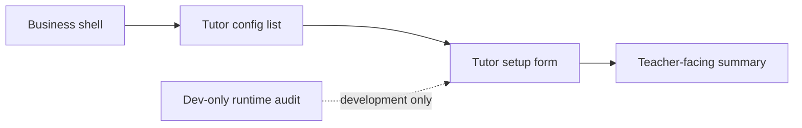

# Agents Tutor Setup Cleanup Implementation Plan

> **For agentic workers:** REQUIRED SUB-SKILL: Use superpowers:subagent-driven-development (recommended) or superpowers:executing-plans to implement this plan task-by-task. Steps use checkbox (`- [ ]`) syntax for tracking.

**Goal:** Clean up only the `Gia sư lớp học / Tutor setup` tab on `/agents` so it hides internal tooling, uses teacher-facing labels and controls, removes duplicate linked-pack context, and stops showing the chat-history rail on this route.

**Architecture:** Keep the existing agent-spec data model and route structure, but refactor the tutor-setup presentation layer. The lane will use a production-only cleanup strategy: gate runtime-audit UI behind development checks, move `/agents` onto the calmer business shell mode, and simplify the form into teacher-facing sections without changing the other `/agents` tabs.

**Tech Stack:** Next.js App Router, React client components, TypeScript, i18next locale JSON, node:test source-level UI tests, ESLint

---

### Task 1: Lock the route shell and hide internal tooling

**Files:**
- Modify: `web/components/sidebar/WorkspaceSidebar.tsx`
- Modify: `web/components/agents/SpecPackAuthoringTab.tsx`
- Test: `web/tests/sidebar-shell-layout.test.ts`

- [ ] **Step 1: Extend the failing source-level shell test for `/agents`**

```ts
test("workspace sidebar keeps /playground chat-first and sends /agents to business mode", () => {
  const workspaceSource = readWorkspaceSidebar();

  assert.match(workspaceSource, /pathname\.startsWith\("\/playground"\) \? "chat" : "business"/);
});
```

- [ ] **Step 2: Run the shell test to verify the current route contract is still source-driven**

Run:

```bash
cd web && node --test tests/sidebar-shell-layout.test.ts
```

Expected: PASS for current shell assertions before the next UI cleanup changes.

- [ ] **Step 3: Gate runtime tooling in `SpecPackAuthoringTab` behind development-only rendering**

```tsx
const isDevToolsVisible = process.env.NODE_ENV === "development";

{isDevToolsVisible ? (
  <div className="min-w-0 rounded-2xl border border-[var(--border)] bg-[var(--card)]/40 p-4">
    {/* existing runtime audit block */}
  </div>
) : null}
```

- [ ] **Step 4: Keep `/agents` on the business shell mode by relying on the existing workspace route split**

```tsx
const shellMode = pathname.startsWith("/playground") ? "chat" : "business";
```

Expected result: `/agents` stays in business mode and no longer shows the dominant conversation-history block.

- [ ] **Step 5: Re-run the focused shell test**

Run:

```bash
cd web && node --test tests/sidebar-shell-layout.test.ts
```

Expected: PASS

- [ ] **Step 6: Commit**

```bash
git add web/components/sidebar/WorkspaceSidebar.tsx web/components/agents/SpecPackAuthoringTab.tsx web/tests/sidebar-shell-layout.test.ts
git commit -m "fix(agents): hide tutor setup debug tooling [UI-AGENTS-TUTOR]"
```

### Task 2: Replace technical headings and broken form semantics

**Files:**
- Modify: `web/components/agents/SpecPackAuthoringTab.tsx`
- Modify: `web/locales/vi/app.json`
- Modify: `web/locales/en/app.json`
- Test: `web/tests/contest-terminology.test.ts`

- [ ] **Step 1: Add failing terminology assertions for teacher-facing section labels**

```ts
assert.equal(vi["Tutor identity section"], "Thông tin gia sư");
assert.equal(vi["Tutor teaching style section"], "Phong cách giảng dạy");
assert.equal(vi["Tutor rules section"], "Quy tắc và giới hạn");
```

- [ ] **Step 2: Run the terminology test to verify the new keys fail first**

Run:

```bash
cd web && node --test tests/contest-terminology.test.ts
```

Expected: FAIL on missing locale keys.

- [ ] **Step 3: Add locale keys for the section labels and clearer actions**

```json
"Tutor identity section": "Thông tin gia sư",
"Tutor teaching style section": "Phong cách giảng dạy",
"Tutor rules section": "Quy tắc và giới hạn",
"Export tutor configuration": "Xuất cấu hình",
"Save and create tutor": "Lưu & tạo gia sư",
"Save tutor changes": "Lưu thay đổi"
```

- [ ] **Step 4: Rename the form sections and replace the boolean text field with a toggle**

```tsx
<StructuredSection
  title={t("Tutor identity section")}
  description={t("Set who this tutor is for and how students should experience the linked pack in class.")}
>
```

```tsx
<BooleanField
  label={t("Do not solve directly")}
  checked={draft.structured.rules.do_not_solve_directly === "yes"}
  onChange={(checked) =>
    setDraft((current) => ({
      ...current,
      structured: {
        ...current.structured,
        rules: {
          ...current.structured.rules,
          do_not_solve_directly: checked ? "yes" : "no",
        },
      },
    }))
  }
/>
```

- [ ] **Step 5: Add the local helper component for boolean rows**

```tsx
function BooleanField({
  label,
  checked,
  onChange,
}: {
  label: string;
  checked: boolean;
  onChange: (checked: boolean) => void;
}) {
  return (
    <label className="flex items-center justify-between rounded-xl border border-[var(--border)] px-3 py-2.5">
      <div>
        <p className="text-[12px] font-medium text-[var(--foreground)]">{label}</p>
        <p className="text-[11px] text-[var(--muted-foreground)]">{checked ? "Bật" : "Tắt"}</p>
      </div>
      <button
        type="button"
        role="switch"
        aria-checked={checked}
        onClick={() => onChange(!checked)}
        className={`relative h-6 w-11 rounded-full transition-colors ${checked ? "bg-[var(--primary)]" : "bg-[var(--muted)]"}`}
      >
        <span
          className={`absolute top-0.5 h-5 w-5 rounded-full bg-white transition-transform ${checked ? "translate-x-5" : "translate-x-0.5"}`}
        />
      </button>
    </label>
  );
}
```

- [ ] **Step 6: Re-run the terminology test**

Run:

```bash
cd web && node --test tests/contest-terminology.test.ts
```

Expected: PASS

- [ ] **Step 7: Commit**

```bash
git add web/components/agents/SpecPackAuthoringTab.tsx web/locales/vi/app.json web/locales/en/app.json web/tests/contest-terminology.test.ts
git commit -m "fix(agents): replace technical tutor setup labels [UI-AGENTS-TUTOR]"
```

### Task 3: Clean linked-pack UX, empty states, textarea content, and actions

**Files:**
- Modify: `web/components/agents/SpecPackAuthoringTab.tsx`
- Modify: `web/components/agents/class-tutor-pack-presenters.ts`
- Test: `web/tests/class-tutor-pack-presenters.test.ts`

- [ ] **Step 1: Add failing presenter tests for searchable pack labels and empty-state cleanup**

```ts
assert.deepEqual(options[0], {
  value: "algebra-pack",
  label: "algebra-pack",
});
```

```ts
assert.equal(viewModel.packName, "fractions-pack");
assert.equal(viewModel.statusLabel, "Đã gắn");
```

- [ ] **Step 2: Run the presenter test suite**

Run:

```bash
cd web && node --test tests/class-tutor-pack-presenters.test.ts
```

Expected: PASS for current helper behavior before refactoring the component structure.

- [ ] **Step 3: Remove the duplicate top linked-pack summary block and keep the teacher-facing summary rail as the single source of truth**

```tsx
<div className="rounded-2xl border border-[var(--border)] bg-[var(--background)]/60 p-4">
  <div className="flex items-center gap-2 text-[13px] font-medium text-[var(--foreground)]">
    <BookOpen className="h-4 w-4 text-[var(--primary)]" />
    {t("Choose or change the linked pack")}
  </div>
  {/* combobox and helper copy only */}
</div>
```

- [ ] **Step 4: Replace the native `<select>` with a searchable combobox**

```tsx
const [packQuery, setPackQuery] = useState("");
const filteredPackOptions = knowledgePackOptions.filter((option) =>
  option.label.toLowerCase().includes(packQuery.trim().toLowerCase()),
);
```

```tsx
<div className="rounded-xl border border-[var(--border)] bg-[var(--background)]/80 p-3">
  <label className="mb-2 block text-[12px] font-medium text-[var(--muted-foreground)]">
    {t("Knowledge Pack")}
  </label>
  <input
    value={packQuery}
    onChange={(event) => setPackQuery(event.target.value)}
    placeholder={t("Search or choose a Knowledge Pack…")}
    className="w-full rounded-lg border border-[var(--border)] bg-transparent px-3 py-2 text-[13px]"
  />
  <div className="mt-2 max-h-52 overflow-y-auto">
    {filteredPackOptions.map((option) => (
      <button
        key={option.value}
        type="button"
        onClick={() =>
          setDraft((current) => ({
            ...current,
            linked_knowledge_pack: option.value,
          }))
        }
        className="flex w-full items-center justify-between rounded-lg px-3 py-2 text-left hover:bg-[var(--muted)]"
      >
        <span>{option.label}</span>
      </button>
    ))}
  </div>
</div>
```

- [ ] **Step 5: Decode escaped curriculum values before rendering the textarea**

```tsx
function decodeHtmlEntities(value: string): string {
  return value
    .replaceAll("&lt;", "<")
    .replaceAll("&gt;", ">")
    .replaceAll("&amp;", "&")
    .replaceAll("&quot;", "\"")
    .replaceAll("&#39;", "'");
}
```

```tsx
value={decodeHtmlEntities(draft.files[activeManualFile] ?? "")}
```

- [ ] **Step 6: Improve the left-rail empty state and action labels**

```tsx
<div className="rounded-2xl border border-dashed border-[var(--border)] px-4 py-8 text-center">
  <GraduationCap className="mx-auto h-8 w-8 text-[var(--muted-foreground)]" />
  <h3 className="mt-3 text-[15px] font-semibold text-[var(--foreground)]">
    {t("No tutors set up yet")}
  </h3>
  <p className="mt-2 text-[13px] text-[var(--muted-foreground)]">
    {t("Create the first class tutor to define how this classroom should be guided.")}
  </p>
  <button
    type="button"
    onClick={beginNewPack}
    className="mt-4 inline-flex items-center gap-2 rounded-lg bg-[var(--primary)] px-3 py-2 text-[13px] font-medium text-[var(--primary-foreground)]"
  >
    <Plus className="h-4 w-4" />
    {t("Create the first tutor")}
  </button>
</div>
```

- [ ] **Step 7: Clarify button labels and disabled states**

```tsx
const canPersistDraft = Boolean(draft.linked_knowledge_pack && (draft.display_name.trim() || draft.agent_id.trim()));
```

```tsx
<button
  onClick={() => void exportDraft()}
  disabled={exporting || !draft.agent_id}
>
  <Download className="h-3.5 w-3.5" />
  {t("Export tutor configuration")}
</button>
```

```tsx
<button
  onClick={() => void saveDraft()}
  disabled={saving || !canPersistDraft}
>
  <Save className="h-3.5 w-3.5" />
  {draft.version > 0 ? t("Save tutor changes") : t("Save and create tutor")}
</button>
```

- [ ] **Step 8: Re-run the presenter/source tests**

Run:

```bash
cd web && node --test tests/class-tutor-pack-presenters.test.ts tests/sidebar-shell-layout.test.ts
```

Expected: PASS

- [ ] **Step 9: Commit**

```bash
git add web/components/agents/SpecPackAuthoringTab.tsx web/components/agents/class-tutor-pack-presenters.ts web/tests/class-tutor-pack-presenters.test.ts web/tests/sidebar-shell-layout.test.ts
git commit -m "feat(agents): streamline tutor setup flow [UI-AGENTS-TUTOR]"
```

### Task 4: Final verification and handoff artifacts

**Files:**
- Modify: `ai_first/ACTIVE_ASSIGNMENTS.md`
- Modify: `ai_first/daily/2026-04-30.md`
- Modify: `docs/superpowers/tasks/2026-04-30-agents-tutor-setup-cleanup.md`
- Create: `docs/superpowers/pr-notes/2026-04-30-agents-tutor-setup-cleanup.md`

- [ ] **Step 1: Update packet and daily log with implementation notes**

```md
- Done: removed chat-history rail from `/agents` by relying on the business shell mode
- Done: hid runtime policy audit from the production tutor-setup surface
- Done: replaced raw file-name headings and boolean text input semantics
```

- [ ] **Step 2: Add the PR note with a Mermaid diagram**

```md

```

- [ ] **Step 3: Run the full focused validation suite**

Run:

```bash
cd web && node --test tests/contest-terminology.test.ts tests/class-tutor-pack-presenters.test.ts tests/sidebar-shell-layout.test.ts tests/sidebar-nav-groups.test.ts
cd web && npx eslint 'app/(workspace)/agents/page.tsx' 'components/agents/SpecPackAuthoringTab.tsx' 'components/agents/class-tutor-pack-presenters.ts' 'components/sidebar/SidebarShell.tsx' 'components/sidebar/WorkspaceSidebar.tsx' 'tests/contest-terminology.test.ts' 'tests/class-tutor-pack-presenters.test.ts' 'tests/sidebar-shell-layout.test.ts' 'tests/sidebar-nav-groups.test.ts'
cd web && npm run build
git diff --check
```

Expected: all commands pass.

- [ ] **Step 4: Commit**

```bash
git add ai_first/ACTIVE_ASSIGNMENTS.md ai_first/daily/2026-04-30.md docs/superpowers/tasks/2026-04-30-agents-tutor-setup-cleanup.md docs/superpowers/pr-notes/2026-04-30-agents-tutor-setup-cleanup.md
git commit -m "docs(agents): record tutor setup cleanup lane [UI-AGENTS-TUTOR]"
```
