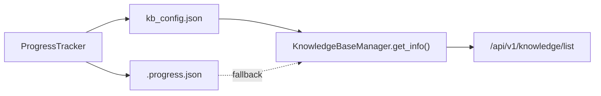

# Knowledge Progress Persistence Implementation Plan

> **For agentic workers:** REQUIRED SUB-SKILL: Use superpowers:subagent-driven-development (recommended) or superpowers:executing-plans to implement this plan task-by-task. Steps use checkbox (`- [ ]`) syntax for tracking.

**Goal:** Keep knowledge-base indexing `status/progress` stable across config updates and recover correct API output from `.progress.json` when config entries are stale.

**Architecture:** Fix the writer-side race by making `KnowledgeBaseConfigService` reload and merge the latest on-disk KB entry before saving. Then harden the read path in `KnowledgeBaseManager.get_info()` so `status/progress` can fall back to `.progress.json` when config data is missing or stale. Keep the FE contract unchanged.

**Tech Stack:** Python 3.11, FastAPI router tests, pytest, JSON-backed KB config, ProgressTracker

---

### Task 1: Lock the bug with regression tests

**Files:**
- Modify: `tests/knowledge/test_progress_tracker.py`
- Modify: `tests/api/test_knowledge_router.py`

- [ ] **Step 1: Add a writer-side regression test for preserving runtime status**

```python
from deeptutor.services.config.knowledge_base_config import KnowledgeBaseConfigService
from deeptutor.knowledge.manager import KnowledgeBaseManager


def test_set_kb_config_preserves_existing_runtime_status_and_progress(tmp_path) -> None:
    kb_base_dir = tmp_path / "knowledge_bases"
    kb_base_dir.mkdir(parents=True, exist_ok=True)

    manager = KnowledgeBaseManager(base_dir=str(kb_base_dir))
    manager.update_kb_status(
        name="demo-kb",
        status="ready",
        progress={
            "stage": "completed",
            "message": "Indexed successfully",
            "percent": 100,
            "task_id": "task-123",
        },
    )

    service = KnowledgeBaseConfigService(config_path=kb_base_dir / "kb_config.json")
    service.set_kb_config(
        "demo-kb",
        {
            "subject": "Toán",
            "difficulty": "beginner",
        },
    )

    reloaded = KnowledgeBaseManager(base_dir=str(kb_base_dir)).get_info("demo-kb")

    assert reloaded["status"] == "ready"
    assert reloaded["progress"]["stage"] == "completed"
    assert reloaded["progress"]["percent"] == 100
```

- [ ] **Step 2: Add an API fallback regression test for stale config plus live `.progress.json`**

```python
def test_list_knowledge_bases_falls_back_to_progress_file_when_config_progress_missing(
    monkeypatch, tmp_path: Path
) -> None:
    knowledge_module = _import_knowledge_router(monkeypatch, tmp_path)
    kb_base_dir = tmp_path / "knowledge_bases"
    manager = _FakeKBManager(kb_base_dir)
    manager.config["knowledge_bases"]["demo-kb"] = {
        "path": "demo-kb",
        "description": "Knowledge base: demo-kb",
        "rag_provider": "llamaindex",
    }

    kb_dir = kb_base_dir / "demo-kb"
    kb_dir.mkdir(parents=True, exist_ok=True)
    (kb_dir / ".progress.json").write_text(
        json.dumps(
            {
                "kb_name": "demo-kb",
                "stage": "completed",
                "message": "Knowledge base initialization complete!",
                "progress_percent": 100,
                "task_id": "task-abc",
                "timestamp": "2026-04-30T13:00:00",
            }
        ),
        encoding="utf-8",
    )

    monkeypatch.setattr(knowledge_module, "get_kb_manager", lambda: manager)

    with TestClient(_build_app(knowledge_module)) as client:
        response = client.get("/api/v1/knowledge/list")

    assert response.status_code == 200
    payload = response.json()
    assert payload[0]["status"] == "ready"
    assert payload[0]["progress"]["stage"] == "completed"
    assert payload[0]["progress"]["progress_percent"] == 100
```

- [ ] **Step 3: Run the focused tests to see them fail first**

Run:

```bash
pytest tests/knowledge/test_progress_tracker.py tests/api/test_knowledge_router.py -q
```

Expected: FAIL on missing preservation/fallback behavior.

- [ ] **Step 4: Commit the failing-test checkpoint only if the repo convention allows it; otherwise keep changes unstaged**

```bash
git status --short
```

Expected: only the two test files are modified at this checkpoint.

### Task 2: Make KB config writes reload-safe

**Files:**
- Modify: `deeptutor/services/config/knowledge_base_config.py`
- Test: `tests/knowledge/test_progress_tracker.py`

- [ ] **Step 1: Add a private reload helper and use it before writes**

```python
    def _reload(self) -> None:
        self._config = self._load_config()
```

```python
    def set_kb_config(self, kb_name: str, config: dict[str, Any]) -> None:
        self._reload()
        entry = self._ensure_kb(kb_name)
        entry.update(config)
        self._save()
```

- [ ] **Step 2: Preserve existing runtime fields explicitly during metadata merges**

```python
    def set_kb_config(self, kb_name: str, config: dict[str, Any]) -> None:
        self._reload()
        current_entry = dict(self._config.get("knowledge_bases", {}).get(kb_name, {}))
        entry = self._ensure_kb(kb_name)

        runtime_fields = {
            "status": current_entry.get("status"),
            "progress": current_entry.get("progress"),
            "updated_at": current_entry.get("updated_at"),
        }

        entry.update(config)
        for field, value in runtime_fields.items():
            if value is not None and field not in config:
                entry[field] = value

        self._save()
```

- [ ] **Step 3: Run the writer-side regression test**

Run:

```bash
pytest tests/knowledge/test_progress_tracker.py -q
```

Expected: PASS for the new preservation test.

- [ ] **Step 4: Commit**

```bash
git add deeptutor/services/config/knowledge_base_config.py tests/knowledge/test_progress_tracker.py
git commit -m "fix(knowledge): preserve progress across config saves [BUG-KB-PROGRESS]"
```

### Task 3: Add `.progress.json` fallback on the read path

**Files:**
- Modify: `deeptutor/knowledge/manager.py`
- Test: `tests/api/test_knowledge_router.py`

- [ ] **Step 1: Add a small helper to read local progress files safely**

```python
    def _read_progress_file(self, kb_dir: Path) -> dict | None:
        progress_file = kb_dir / ".progress.json"
        if not progress_file.exists():
            return None
        try:
            with open(progress_file, encoding="utf-8") as handle:
                data = json.load(handle)
            return data if isinstance(data, dict) else None
        except Exception:
            return None
```

- [ ] **Step 2: Add a helper to derive runtime status from progress stage**

```python
    @staticmethod
    def _status_from_progress(progress: dict | None) -> str | None:
        if not progress:
            return None
        stage = progress.get("stage")
        if stage == "completed":
            return "ready"
        if stage == "error":
            return "error"
        if stage in {"initializing", "processing_documents", "processing_file", "extracting_items"}:
            return "processing"
        return None
```

- [ ] **Step 3: Use fallback progress in `get_info()` when config is stale**

```python
        fallback_progress = self._read_progress_file(kb_dir) if dir_exists else None
        if not progress and fallback_progress:
            progress = fallback_progress

        if (not status or status == "unknown") and fallback_progress:
            derived_status = self._status_from_progress(fallback_progress)
            if derived_status:
                status = derived_status
```

- [ ] **Step 4: Run the router regression tests**

Run:

```bash
pytest tests/api/test_knowledge_router.py -q
```

Expected: PASS for the stale-config fallback case.

- [ ] **Step 5: Commit**

```bash
git add deeptutor/knowledge/manager.py tests/api/test_knowledge_router.py
git commit -m "fix(knowledge): recover status from progress files [BUG-KB-PROGRESS]"
```

### Task 4: Final verification and handoff artifacts

**Files:**
- Modify: `ai_first/ACTIVE_ASSIGNMENTS.md`
- Modify: `ai_first/daily/2026-04-30.md`
- Modify: `docs/superpowers/tasks/2026-04-30-knowledge-progress-persistence.md`
- Create: `docs/superpowers/pr-notes/2026-04-30-knowledge-progress-persistence.md`

- [ ] **Step 1: Update packet and daily log with implementation notes**

```md
- Done: made KB config writes reload-safe so metadata updates no longer erase runtime progress
- Done: added `.progress.json` fallback on the KB info path so stale config entries still return usable status
- Done: kept the `/knowledge` frontend untouched because the existing route recovers automatically once the API returns stable progress again
```

- [ ] **Step 2: Add the PR note with a Mermaid diagram**

```md

```

- [ ] **Step 3: Run the full focused backend validation suite**

Run:

```bash
pytest tests/knowledge/test_progress_tracker.py tests/api/test_knowledge_router.py -q
git diff --check
```

Expected: all commands pass.

- [ ] **Step 4: Commit**

```bash
git add ai_first/ACTIVE_ASSIGNMENTS.md ai_first/daily/2026-04-30.md docs/superpowers/tasks/2026-04-30-knowledge-progress-persistence.md docs/superpowers/specs/2026-04-30-knowledge-progress-persistence-design.md docs/superpowers/plans/2026-04-30-knowledge-progress-persistence.md docs/superpowers/pr-notes/2026-04-30-knowledge-progress-persistence.md
git commit -m "docs(knowledge): record progress persistence fix [BUG-KB-PROGRESS]"
```
