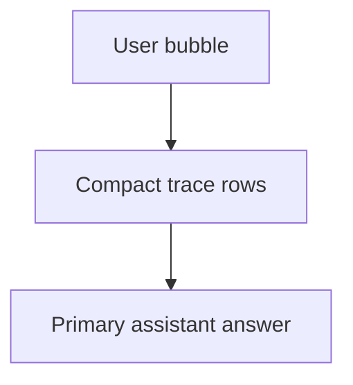

# Playground Chat Consumer Trace Implementation Plan

> **For agentic workers:** REQUIRED SUB-SKILL: Use superpowers:subagent-driven-development (recommended) or superpowers:executing-plans to implement this plan task-by-task. Steps use checkbox (`- [ ]`) syntax for tracking.

**Goal:** Restore `/playground` chat turns to a lighter consumer-chat presentation with compact visible trace stages, smaller user bubbles, and no end-user metadata panel.

**Architecture:** Keep the existing `/playground` shell and data flow, but replace the local boxed trace treatment with a compact trace summary patterned after the original chat UI. Collapse duplicate assistant-turn surfaces in the page layer so end users see one compact trace block and one primary answer block per turn.

**Tech Stack:** Next.js App Router, React, TypeScript, Tailwind utility classes, i18next locale strings, existing `StreamEvent` chat payloads.

---

### Task 1: Replace heavyweight `/playground` trace blocks with compact consumer-style trace rows

**Files:**
- Modify: `web/app/(workspace)/playground/page.tsx`
- Reference only: `web/components/chat/home/TracePanels.tsx`
- Test: `web` build + ESLint validation

- [ ] **Step 1: Locate the local `/playground` trace renderer and the assistant-turn call sites**

Read the current page sections that define and render the local `TracePanel`, trace wrappers, and metadata/result stacks:

```tsx
function TracePanel({ events }: { events: StreamEvent[] }) {
  // current local accordion implementation to replace
}

{renderTraceEvents.length > 0 ? (
  <div className="rounded-[30px] border ...">
    <TracePanel events={renderTraceEvents} />
  </div>
) : null}
```

- [ ] **Step 2: Reshape the trace renderer to a compact row treatment**

Replace the current boxed accordion style with a lighter row-based structure:

```tsx
function TracePanel({ events }: { events: StreamEvent[] }) {
  const { t } = useTranslation();
  if (!events.length) return null;

  const grouped = new Map<string, StreamEvent[]>();
  for (const ev of events) {
    const key = ev.stage || "session";
    const list = grouped.get(key) ?? [];
    list.push(ev);
    grouped.set(key, list);
  }

  return (
    <div className="space-y-1.5">
      {Array.from(grouped.entries()).map(([stage, stageEvents]) => {
        const renderable = stageEvents.filter((e) =>
          ["thinking", "progress", "tool_call", "tool_result", "error"].includes(e.type),
        );
        if (!renderable.length) return null;

        return (
          <details key={stage} className="group rounded-2xl">
            <summary className="flex cursor-pointer list-none items-center gap-2 py-1 text-[12px] font-medium text-[var(--muted-foreground)] [&::-webkit-details-marker]:hidden">
              <ChevronDown size={12} className="transition-transform group-open:rotate-180" />
              <span>{stage === "session" ? t("Chi tiết") : titleCase(stage)}</span>
            </summary>
            <div className="ml-5 space-y-1.5 border-l border-[var(--border)]/35 pl-3">
              {/* compact trace body rows */}
            </div>
          </details>
        );
      })}
    </div>
  );
}
```

- [ ] **Step 3: Remove the large outer trace card wrapper from assistant turns**

Change the assistant-turn call sites so `TracePanel` renders inline without an extra enclosing card:

```tsx
{renderTraceEvents.length > 0 ? (
  <div className="mb-3">
    <TracePanel events={renderTraceEvents} />
  </div>
) : null}
```

- [ ] **Step 4: Run lint focused on the modified page**

Run: `cd /Users/nguyenhuuloc/Documents/Multiagent-learning-platform/web && npx eslint "app/(workspace)/playground/page.tsx"`

Expected: `0 problems`

- [ ] **Step 5: Commit the trace-layout slice**

```bash
git add web/app/'(workspace)'/playground/page.tsx
git commit -m "feat(playground): compact chat trace rows [UI-PLAYGROUND-CONSUMER-TRACE]"
```

### Task 2: Shrink chat-turn visual weight and remove duplicate technical surfaces

**Files:**
- Modify: `web/app/(workspace)/playground/page.tsx`
- Modify: `web/components/common/AssistantResponse.tsx`
- Modify: `web/components/common/ProcessLogs.tsx`
- Test: `web` build + ESLint validation

- [ ] **Step 1: Tighten the user bubble proportions**

Update the user message container from a broad capsule to a narrower consumer-chat bubble:

```tsx
className={cn(
  "max-w-[min(42rem,68%)] rounded-[22px] border border-[var(--border)]/45 bg-[var(--muted)]/78 px-5 py-3 text-[15px] leading-7 text-[var(--foreground)] shadow-[0_10px_28px_rgba(15,23,42,0.04)]",
  isLatestUserTurn ? "ring-1 ring-[var(--border)]/20" : "",
)}
```

- [ ] **Step 2: Remove metadata from end-user assistant turns**

Delete or gate the metadata panel so it does not render in `/playground`:

```tsx
// remove this block from the end-user assistant surface
{result.metadata ? (
  <details>
    <summary>{t("Metadata")}</summary>
    ...
  </details>
) : null}
```

- [ ] **Step 3: Collapse duplicated answer/result layers**

Ensure only one primary answer block is shown for a normal assistant turn:

```tsx
const finalResponse =
  typeof result?.response === "string" && result.response.trim()
    ? result.response.trim()
    : content.trim();

const shouldRenderStandaloneResult = Boolean(result) && !finalResponse;
```

Then render either the answer or the non-text result surface, not both.

- [ ] **Step 4: De-emphasize or suppress debug-style process logs**

Either stop rendering `ProcessLogs` for normal `/playground` turns or reduce it to a very light inline status strip:

```tsx
{processLogs.length > 0 && showCompactLogs ? (
  <ProcessLogs logs={processLogs} compact />
) : null}
```

And update `ProcessLogs` styling so it no longer looks like a debug panel:

```tsx
className="rounded-xl border border-[var(--border)]/35 bg-[var(--background)]/55 px-3 py-2 text-[11px] text-[var(--muted-foreground)]"
```

- [ ] **Step 5: Keep assistant copy typographic rather than card-heavy**

Lighten the shared assistant response renderer:

```tsx
<div className="text-[15px] leading-[1.85] text-[var(--foreground)]">
  <MarkdownRenderer content={content} className="[&_p]:my-0 [&_p+*]:mt-3" />
</div>
```

- [ ] **Step 6: Run focused lint for the shared components**

Run: `cd /Users/nguyenhuuloc/Documents/Multiagent-learning-platform/web && npx eslint "app/(workspace)/playground/page.tsx" "components/common/AssistantResponse.tsx" "components/common/ProcessLogs.tsx"`

Expected: `0 problems`

- [ ] **Step 7: Commit the turn-surface cleanup**

```bash
git add web/app/'(workspace)'/playground/page.tsx web/components/common/AssistantResponse.tsx web/components/common/ProcessLogs.tsx
git commit -m "feat(playground): simplify consumer chat turns [UI-PLAYGROUND-CONSUMER-TRACE]"
```

### Task 3: Validate the surface and update handoff docs

**Files:**
- Modify: `ai_first/daily/2026-04-30.md`
- Create: `docs/superpowers/pr-notes/2026-04-30-playground-chat-consumer-trace.md`
- Test: full build and diff checks

- [ ] **Step 1: Run the full validation commands**

Run:

```bash
cd /Users/nguyenhuuloc/Documents/Multiagent-learning-platform/web && npm run build
cd /Users/nguyenhuuloc/Documents/Multiagent-learning-platform && git diff --check
```

Expected:

```text
Next.js build completes successfully
git diff --check returns no output
```

- [ ] **Step 2: Record the lane outcome in the daily log**

Append a short entry to `ai_first/daily/2026-04-30.md` covering the UI reset, files changed, and validation run.

```md
## UI-PLAYGROUND-CONSUMER-TRACE

- Restored `/playground` chat turns toward the original consumer-chat style.
- Kept visible stage traces but reduced them to compact rows.
- Hid end-user metadata and removed duplicate answer surfaces.
```

- [ ] **Step 3: Write the required PR architecture note**

Create `docs/superpowers/pr-notes/2026-04-30-playground-chat-consumer-trace.md` with a concise explanation and one Mermaid diagram:

```md
# PR Note: Playground Chat Consumer Trace


```

- [ ] **Step 4: Commit the docs and handoff slice**

```bash
git add ai_first/daily/2026-04-30.md docs/superpowers/pr-notes/2026-04-30-playground-chat-consumer-trace.md
git commit -m "docs(playground): record consumer trace reset [UI-PLAYGROUND-CONSUMER-TRACE]"
```

## Self-Review

- Spec coverage:
  - compact visible stages: Task 1
  - smaller light-gray user bubble: Task 2
  - hide metadata: Task 2
  - remove duplicated oversized surfaces: Task 2
  - validation and PR-note updates: Task 3
- Placeholder scan: no `TODO`, `TBD`, or deferred implementation placeholders remain.
- Type consistency: all referenced files, components, and commands match the current codebase survey.
