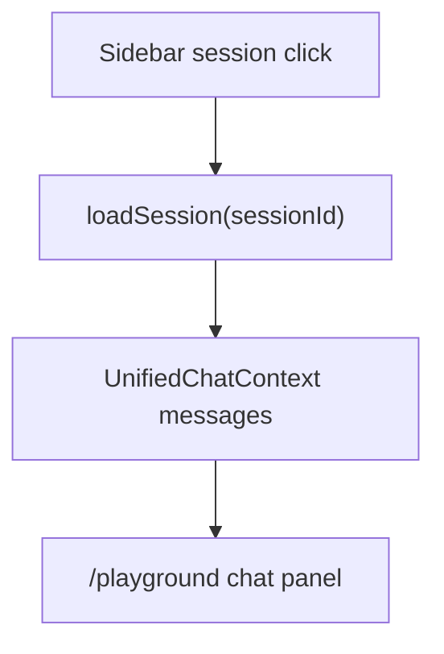

# Playground Chat History Restore Implementation Plan

> **For agentic workers:** REQUIRED SUB-SKILL: Use superpowers:subagent-driven-development (recommended) or superpowers:executing-plans to implement this plan task-by-task. Steps use checkbox (`- [ ]`) syntax for tracking.

**Goal:** Restore history replay on `/playground` for the standard `chat` capability by reconnecting the page to `UnifiedChatContext`.

**Architecture:** Keep the current `/playground` shell and the local tester state for non-chat capabilities, but route only the `chat` capability back through the shared `UnifiedChatContext` state and actions. This restores sidebar-driven session hydration without broadening the scope to capability cleanup or backend changes.

**Tech Stack:** Next.js App Router, React, TypeScript, existing `UnifiedChatContext`, Tailwind CSS, i18next.

---

### Task 1: Reconnect `/playground` chat mode to shared session state

**Files:**
- Modify: `web/app/(workspace)/playground/page.tsx`
- Reference only: `web/context/UnifiedChatContext.tsx`
- Reference only: `web/components/chat/home/ChatMessages.tsx`
- Reference only: `web/components/chat/home/ChatComposer.tsx`
- Test: `web` build and ESLint

- [ ] **Step 1: Locate the chat-mode render branch and current local state**

Read the current `chat` capability branch inside `/playground` and identify the local `messages` state that currently blocks session hydration:

```tsx
const [messages, setMessages] = useState<TesterMessage[]>([]);

return activeCapability ? (
  activeCapability.name === "deep_question" ? (
    <DeepQuestionTester ... />
  ) : activeCapability.name === "deep_research" ? (
    <DeepResearchTester ... />
  ) : (
    <CapabilityTester capability={activeCapability} ... />
  )
) : null;
```

- [ ] **Step 2: Pull shared chat state and actions from `useUnifiedChat()`**

Add the context hook to `/playground` and read the shared chat state only once near the top-level page component:

```tsx
import { useUnifiedChat } from "@/context/UnifiedChatContext";

const {
  state: unifiedChatState,
  sendMessage,
  cancelStreamingTurn,
  setTools,
  setCapability,
  setKBs,
  setLanguage,
} = useUnifiedChat();
```

- [ ] **Step 3: Keep playground configuration synced into the shared chat context when `chat` is active**

Inside the `/playground` page, add a focused effect that mirrors the active chat playground config into context:

```tsx
useEffect(() => {
  if (!activeCapability || activeCapability.name !== "chat" || !activeCapabilityConfig) return;
  setCapability("chat");
  setTools(activeCapabilityConfig.enabledTools);
  setKBs(activeCapabilityConfig.knowledgeBase ? [activeCapabilityConfig.knowledgeBase] : []);
}, [activeCapability, activeCapabilityConfig, setCapability, setKBs, setTools]);
```

And keep language aligned:

```tsx
useEffect(() => {
  setLanguage(i18n.language);
}, [i18n.language, setLanguage]);
```

- [ ] **Step 4: Add a dedicated `/playground` chat panel that renders from context messages**

Create a small local component in `web/app/(workspace)/playground/page.tsx` that maps `UnifiedChatContext` messages into the existing visual surface:

```tsx
function PlaygroundChatCapability({
  messages,
  isStreaming,
  onSend,
  onCancel,
}: {
  messages: MessageItem[];
  isStreaming: boolean;
  onSend: (content: string) => void;
  onCancel: () => void;
}) {
  // render context-backed chat turns here
}
```

This component should render `messages` from context instead of maintaining a local `useState(messages)` copy.

- [ ] **Step 5: Route only the `chat` capability through the new context-backed panel**

Replace the generic fallback branch so `chat` uses the shared context-backed component and the other capabilities stay local:

```tsx
{activeCapability.name === "chat" ? (
  <PlaygroundChatCapability
    messages={unifiedChatState.messages}
    isStreaming={unifiedChatState.isStreaming}
    onSend={(content) => sendMessage(content)}
    onCancel={cancelStreamingTurn}
  />
) : (
  <CapabilityTester capability={activeCapability} ... />
)}
```

- [ ] **Step 6: Preserve the current consumer-style visual treatment for restored history**

Use the existing compact turn renderer for the chat capability so restored sessions match the latest `/playground` style rather than falling back to the older generic chat page.

```tsx
<PlaygroundChatTurn
  key={`${msg.role}-${i}`}
  msg={msg}
  isStreaming={isStreaming}
  isLatestAssistant={i === messages.length - 1}
/>
```

But feed it data transformed from `UnifiedChatContext` message items.

- [ ] **Step 7: Run focused lint for the page**

Run: `cd /Users/nguyenhuuloc/Documents/Multiagent-learning-platform/web && npx eslint "app/(workspace)/playground/page.tsx"`

Expected: `0 problems`

- [ ] **Step 8: Commit the runtime fix**

```bash
git add web/app/'(workspace)'/playground/page.tsx
git commit -m "fix(playground): restore chat history hydration [BUG-PLAYGROUND-CHAT-HISTORY-RESTORE]"
```

### Task 2: Validate and document the bugfix lane

**Files:**
- Modify: `ai_first/daily/2026-04-30.md`
- Create: `docs/superpowers/pr-notes/2026-04-30-playground-chat-history-restore.md`
- Test: build and diff checks

- [ ] **Step 1: Run the verification commands**

Run:

```bash
cd /Users/nguyenhuuloc/Documents/Multiagent-learning-platform/web && npm run build
cd /Users/nguyenhuuloc/Documents/Multiagent-learning-platform && git diff --check
```

Expected:

```text
Next.js build completes successfully
git diff --check returns no output
```

- [ ] **Step 2: Record the bugfix in the daily log**

Append a compact entry to `ai_first/daily/2026-04-30.md`:

```md
## BUG-PLAYGROUND-CHAT-HISTORY-RESTORE

- Reconnected `/playground` chat mode to `UnifiedChatContext`.
- Restored sidebar-selected session replay for standard chat.
- Left non-chat playground capability testers unchanged.
```

- [ ] **Step 3: Write the PR note with a Mermaid diagram**

Create `docs/superpowers/pr-notes/2026-04-30-playground-chat-history-restore.md`:

```md
# PR Note: Playground Chat History Restore


```

- [ ] **Step 4: Commit the docs slice**

```bash
git add ai_first/daily/2026-04-30.md docs/superpowers/pr-notes/2026-04-30-playground-chat-history-restore.md
git commit -m "docs(playground): record chat history restore fix [BUG-PLAYGROUND-CHAT-HISTORY-RESTORE]"
```

## Self-Review

- Spec coverage:
  - reconnect `chat` mode to context: Task 1
  - restore sidebar-selected history: Task 1
  - keep non-chat capabilities unchanged: Task 1
  - validation and PR note: Task 2
- Placeholder scan: no `TODO`, `TBD`, or deferred placeholders remain.
- Type consistency: all named hooks, files, and commands exist in the surveyed codebase.
