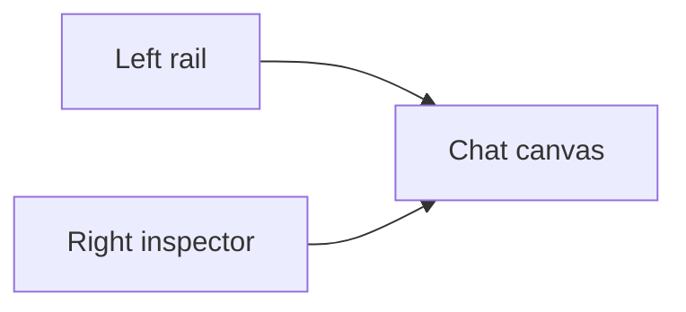

# Playground Chat Workspace Implementation Plan

> **For agentic workers:** REQUIRED SUB-SKILL: Use superpowers:subagent-driven-development (recommended) or superpowers:executing-plans to implement this plan task-by-task. Steps use checkbox (`- [ ]`) syntax for tracking.

**Goal:** Replace the current `/playground` demo-style layout with a full-screen, three-column chat workspace that is Vietnamese-first, icon-forward, and compatible with the existing session and streaming flow.

**Architecture:** Keep the current `/playground` route, capability state, and websocket/chat seams, but recompose the route into a workspace shell with a left rail, main conversation canvas, and right context panel. Reuse `SessionList`, `ChatMessages`, `ChatComposer`, and sidebar helpers where possible, extracting small presentational helpers only when the route file becomes too large to read safely.

**Tech Stack:** Next.js App Router, React client components, TypeScript, Tailwind utility classes, `react-i18next`, `lucide-react`, Node test runner

---

## File Structure

- Modify: `web/app/(workspace)/playground/page.tsx`
  - Replace the centered playground card layout with the new workspace shell and manage left/right panel state.
- Create: `web/components/chat/home/PlaygroundWorkspaceShell.tsx`
  - Hold the top-level three-column presentational layout if `page.tsx` becomes too large.
- Create: `web/components/chat/home/PlaygroundRightPanel.tsx`
  - Hold capability summary, tool chips, KB selector, and trace/process panel sections.
- Modify: `web/components/chat/home/ChatComposer.tsx`
  - Make the composer denser, larger, and suitable for a docked chat workspace input.
- Modify: `web/components/chat/home/ChatMessages.tsx`
  - Increase message scale and align inline actions/tool traces with the new workspace hierarchy.
- Modify: `web/components/SessionList.tsx`
  - Render Vietnamese recency labels and left-rail-friendly session rows.
- Modify: `web/components/sidebar/SidebarShell.tsx`
  - Add tooltip/`title` support for icon-only collapsed controls and ensure `/playground` sits correctly in the secondary tools rail.
- Modify: `web/locales/vi/app.json`
  - Add or replace Vietnamese-first strings used by the playground workspace and touched chat/session controls.
- Modify: `web/locales/en/app.json`
  - Keep matching keys present for shared components and tests.
- Modify: `web/tests/contest-vietnamese-coverage.test.ts`
  - Add assertions for the new Vietnamese workspace copy.
- Modify: `web/tests/sidebar-nav-groups.test.ts`
  - Extend coverage only if sidebar grouping or route visibility changes.

### Task 1: Lock Vietnamese copy and session-label coverage

**Files:**
- Modify: `web/locales/vi/app.json`
- Modify: `web/locales/en/app.json`
- Modify: `web/components/SessionList.tsx`
- Test: `web/tests/contest-vietnamese-coverage.test.ts`

- [ ] **Step 1: Add the new locale keys before touching layout code**

```json
{
  "Playground workspace": "Không gian trò chuyện",
  "Conversation workspace": "Không gian hội thoại",
  "Conversation history": "Lịch sử cuộc trò chuyện",
  "Context panel": "Bảng ngữ cảnh",
  "Collapse context panel": "Thu gọn bảng ngữ cảnh",
  "Expand context panel": "Mở rộng bảng ngữ cảnh",
  "Collapse conversation rail": "Thu gọn cột cuộc trò chuyện",
  "Expand conversation rail": "Mở rộng cột cuộc trò chuyện",
  "New conversation": "Cuộc trò chuyện mới",
  "Today": "Hôm nay",
  "Yesterday": "Hôm qua",
  "Last 7 days": "7 ngày qua",
  "Earlier": "Cũ hơn",
  "Untitled chat": "Cuộc trò chuyện chưa có tiêu đề",
  "Open tools and context": "Mở công cụ và ngữ cảnh",
  "Hide tools and context": "Ẩn công cụ và ngữ cảnh",
  "Knowledge source": "Nguồn tri thức",
  "Enabled tools": "Công cụ đang bật",
  "Activity trace": "Luồng xử lý",
  "Type your message...": "Nhập nội dung cần trao đổi..."
}
```

- [ ] **Step 2: Add a failing locale test for the new Vietnamese strings**

```ts
test("playground workspace Vietnamese labels exist", () => {
  const vi = readLocale("vi");

  assert.equal(vi["Conversation workspace"], "Không gian hội thoại");
  assert.equal(vi["Conversation history"], "Lịch sử cuộc trò chuyện");
  assert.equal(vi["Today"], "Hôm nay");
  assert.equal(vi["Yesterday"], "Hôm qua");
  assert.equal(vi["Untitled chat"], "Cuộc trò chuyện chưa có tiêu đề");
});
```

- [ ] **Step 3: Run the focused locale test and verify the new assertions fail before implementation**

Run:

```bash
cd web && node --test tests/contest-vietnamese-coverage.test.ts
```

Expected: FAIL because the new locale keys or translated values do not exist yet.

- [ ] **Step 4: Implement the locale keys and Vietnamese session-group labels**

```ts
function groupLabel(timestamp: number, t: (key: string) => string): string {
  const now = new Date();
  const date = new Date(timestamp * 1000);
  const startOfToday = new Date(now.getFullYear(), now.getMonth(), now.getDate()).getTime();
  const startOfItemDay = new Date(date.getFullYear(), date.getMonth(), date.getDate()).getTime();
  const diffDays = Math.floor((startOfToday - startOfItemDay) / 86400000);
  if (diffDays <= 0) return t("Today");
  if (diffDays === 1) return t("Yesterday");
  if (diffDays < 7) return t("Last 7 days");
  return t("Earlier");
}
```

- [ ] **Step 5: Re-run the locale test and verify it passes**

Run:

```bash
cd web && node --test tests/contest-vietnamese-coverage.test.ts
```

Expected: PASS for the new Vietnamese assertions.

- [ ] **Step 6: Commit the localization checkpoint**

```bash
git add web/locales/vi/app.json web/locales/en/app.json web/components/SessionList.tsx web/tests/contest-vietnamese-coverage.test.ts
git commit -m "feat(playground): add workspace localization surface [UI-CHAT-WORKSPACE]"
```

### Task 2: Replace `/playground` with the three-column workspace shell

**Files:**
- Modify: `web/app/(workspace)/playground/page.tsx`
- Create: `web/components/chat/home/PlaygroundWorkspaceShell.tsx`
- Create: `web/components/chat/home/PlaygroundRightPanel.tsx`

- [ ] **Step 1: Add a route-level shell test target by introducing stable section labels and `aria-label`s**

```tsx
<aside aria-label={t("Conversation history")}>...</aside>
<main aria-label={t("Conversation workspace")}>...</main>
<aside aria-label={t("Context panel")}>...</aside>
```

- [ ] **Step 2: Implement a focused presentational shell instead of growing `page.tsx` inline**

```tsx
export function PlaygroundWorkspaceShell({
  leftCollapsed,
  rightCollapsed,
  onToggleLeft,
  onToggleRight,
  left,
  center,
  right,
}: PlaygroundWorkspaceShellProps) {
  return (
    <div className="flex h-[calc(100vh-3rem)] min-h-0 w-full bg-[var(--background)] text-[var(--foreground)]">
      <aside className={leftCollapsed ? "w-20" : "w-[320px]"}>{left}</aside>
      <main className="min-w-0 flex-1">{center}</main>
      <aside className={rightCollapsed ? "w-0 overflow-hidden" : "w-[360px]"}>{right}</aside>
    </div>
  );
}
```

- [ ] **Step 3: Refactor `page.tsx` so it feeds the shell instead of rendering card-based panels**

```tsx
return (
  <PlaygroundWorkspaceShell
    leftCollapsed={leftRailCollapsed}
    rightCollapsed={rightPanelCollapsed}
    onToggleLeft={() => setLeftRailCollapsed((prev) => !prev)}
    onToggleRight={() => setRightPanelCollapsed((prev) => !prev)}
    left={leftRail}
    center={chatCanvas}
    right={contextPanel}
  />
);
```

- [ ] **Step 4: Implement the new right panel as a compact inspector instead of a second primary page**

```tsx
export function PlaygroundRightPanel({
  title,
  capabilityLabel,
  knowledgeBase,
  toolChips,
  traceContent,
}: PlaygroundRightPanelProps) {
  return (
    <div className="flex h-full flex-col border-l border-[var(--border)] bg-[var(--secondary)]/35">
      <div className="border-b border-[var(--border)] px-4 py-4">
        <p className="text-xs font-semibold uppercase tracking-[0.16em] text-[var(--muted-foreground)]">
          {title}
        </p>
        <h2 className="mt-2 text-lg font-semibold">{capabilityLabel}</h2>
      </div>
      <div className="flex-1 space-y-6 overflow-y-auto px-4 py-4">{traceContent}</div>
    </div>
  );
}
```

- [ ] **Step 5: Run a focused build check on the route and new shell components**

Run:

```bash
cd web && npx eslint "app/(workspace)/playground/page.tsx" "components/chat/home/PlaygroundWorkspaceShell.tsx" "components/chat/home/PlaygroundRightPanel.tsx"
```

Expected: no new ESLint errors in the touched route and shell files.

- [ ] **Step 6: Commit the shell-layout checkpoint**

```bash
git add web/app/\(workspace\)/playground/page.tsx web/components/chat/home/PlaygroundWorkspaceShell.tsx web/components/chat/home/PlaygroundRightPanel.tsx
git commit -m "feat(playground): replace demo cards with workspace shell [UI-CHAT-WORKSPACE]"
```

### Task 3: Resize the chat canvas, composer, and message presentation

**Files:**
- Modify: `web/components/chat/home/ChatComposer.tsx`
- Modify: `web/components/chat/home/ChatMessages.tsx`
- Modify: `web/components/chat/home/TracePanels.tsx`

- [ ] **Step 1: Make the composer look and behave like a docked workspace input**

```tsx
<div className="sticky bottom-0 border-t border-[var(--border)] bg-[var(--background)]/92 px-5 pb-5 pt-4 backdrop-blur">
  <div className="rounded-[28px] border border-[var(--border)] bg-[var(--secondary)]/55 shadow-sm">
    <textarea
      placeholder={t("Type your message...")}
      className="min-h-[120px] w-full resize-none bg-transparent px-5 py-4 text-[15px] leading-7 outline-none"
    />
  </div>
</div>
```

- [ ] **Step 2: Increase the visual hierarchy of chat messages and inline metadata**

```tsx
<div className="mx-auto flex w-full max-w-4xl flex-col gap-6 px-6 py-8">
  <article className="rounded-3xl bg-[var(--secondary)]/55 px-6 py-5 text-[15px] leading-7 shadow-sm">
    {content}
  </article>
</div>
```

- [ ] **Step 3: Keep trace content available but visually subordinate**

```tsx
<div className="rounded-2xl border border-[var(--border)] bg-[var(--background)]/65 p-3">
  <CallTracePanel events={events} isStreaming={isStreaming} />
</div>
```

- [ ] **Step 4: Add Vietnamese `aria-label` and `title` text for icon-only actions**

```tsx
<button
  type="button"
  title={t("Open tools and context")}
  aria-label={t("Open tools and context")}
  className="rounded-full p-2 text-[var(--muted-foreground)] transition hover:text-[var(--foreground)]"
>
  <Sparkles size={16} />
</button>
```

- [ ] **Step 5: Run lint on the touched chat components**

Run:

```bash
cd web && npx eslint "components/chat/home/ChatComposer.tsx" "components/chat/home/ChatMessages.tsx" "components/chat/home/TracePanels.tsx"
```

Expected: no new ESLint errors in the touched chat components.

- [ ] **Step 6: Commit the chat-presentation checkpoint**

```bash
git add web/components/chat/home/ChatComposer.tsx web/components/chat/home/ChatMessages.tsx web/components/chat/home/TracePanels.tsx
git commit -m "feat(playground): enlarge chat canvas and composer [UI-CHAT-WORKSPACE]"
```

### Task 4: Finish left-rail polish, tooltip behavior, and regression coverage

**Files:**
- Modify: `web/components/SessionList.tsx`
- Modify: `web/components/sidebar/SidebarShell.tsx`
- Modify: `web/tests/sidebar-nav-groups.test.ts`
- Modify: `web/tests/contest-vietnamese-coverage.test.ts`

- [ ] **Step 1: Make session rows read like a workspace conversation rail**

```tsx
<button
  type="button"
  className={`group w-full rounded-2xl px-3 py-3 text-left transition ${
    active ? "bg-[var(--background)] text-[var(--foreground)] shadow-sm" : "hover:bg-[var(--background)]/60"
  }`}
>
  <div className="flex items-center justify-between gap-3">
    <span className="line-clamp-2 text-[13.5px] font-medium">
      {session.title || t("Untitled chat")}
    </span>
    <span className="shrink-0 text-[11px] text-[var(--muted-foreground)]">
      {relativeTime(session.updated_at)}
    </span>
  </div>
</button>
```

- [ ] **Step 2: Add `title`/`aria-label` support for collapsed sidebar icons**

```tsx
<Link
  href={item.href}
  title={t(getContestLabel(item.label))}
  aria-label={t(getContestLabel(item.label))}
  className="rounded-lg p-2 transition-colors"
>
  <Icon size={16} />
</Link>
```

- [ ] **Step 3: Extend tests only where behavior changed**

```ts
test("collapsed sidebar still hides secondary tools by default", () => {
  const items = getCollapsedSidebarNav();
  assert.equal(items.some((item) => item.href === "/playground"), false);
});
```

- [ ] **Step 4: Run the focused frontend regression suite**

Run:

```bash
cd web && node --test tests/contest-vietnamese-coverage.test.ts tests/sidebar-nav-groups.test.ts
```

Expected: PASS for all targeted tests.

- [ ] **Step 5: Commit the rail and tooltip checkpoint**

```bash
git add web/components/SessionList.tsx web/components/sidebar/SidebarShell.tsx web/tests/sidebar-nav-groups.test.ts web/tests/contest-vietnamese-coverage.test.ts
git commit -m "feat(playground): polish workspace rail and tooltips [UI-CHAT-WORKSPACE]"
```

### Task 5: Full verification, docs, and handoff

**Files:**
- Modify: `ai_first/daily/2026-04-30.md`
- Create: `docs/superpowers/pr-notes/2026-04-30-playground-chat-workspace.md`

- [ ] **Step 1: Run the bounded verification set**

Run:

```bash
cd web && npx eslint "app/(workspace)/playground/page.tsx" "components/chat/home/PlaygroundWorkspaceShell.tsx" "components/chat/home/PlaygroundRightPanel.tsx" "components/chat/home/ChatComposer.tsx" "components/chat/home/ChatMessages.tsx" "components/chat/home/TracePanels.tsx" "components/SessionList.tsx" "components/sidebar/SidebarShell.tsx"
cd web && node --test tests/contest-vietnamese-coverage.test.ts tests/sidebar-nav-groups.test.ts
cd web && npm run build
git diff --check
```

Expected: lint, focused tests, and production build pass; `git diff --check` is clean.

- [ ] **Step 2: Record implementation results in the daily log**

```md
## Playground Chat Workspace Implementation

- Branch: `fix/playground-chat-workspace`
- Task: `UI_PLAYGROUND_CHAT_WORKSPACE`
- Done: replaced `/playground` with a three-column chat workspace shell
- Done: enlarged the conversation canvas and docked composer
- Done: localized the touched route surface to Vietnamese-first copy
- Tests: ...
```

- [ ] **Step 3: Write the required PR architecture note with a Mermaid diagram**

```md
# Playground Chat Workspace PR Note


```

- [ ] **Step 4: Commit the verification and handoff docs**

```bash
git add ai_first/daily/2026-04-30.md docs/superpowers/pr-notes/2026-04-30-playground-chat-workspace.md
git commit -m "docs(playground): record workspace implementation evidence [UI-CHAT-WORKSPACE]"
```

## Self-Review

- Spec coverage:
  - three-column full-screen shell: Task 2
  - larger chat canvas and docked composer: Task 3
  - icon-first controls with tooltip/`aria-label`: Tasks 3 and 4
  - Vietnamese-first route copy and session labels: Tasks 1 and 4
  - bounded validation and handoff: Task 5
- Placeholder scan:
  - no `TODO`, `TBD`, or undefined steps remain
- Type consistency:
  - new shell components use explicit props and reuse current route/component contracts instead of inventing a second chat state model
