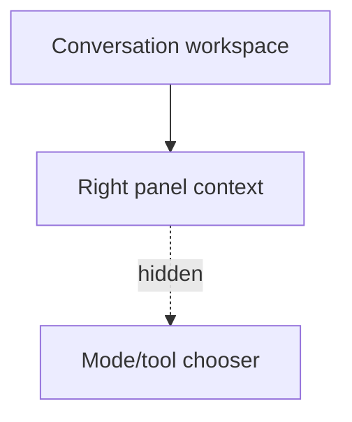

# Playground Hide Mode Switcher Implementation Plan

> **For agentic workers:** REQUIRED SUB-SKILL: Use superpowers:subagent-driven-development (recommended) or superpowers:executing-plans to implement this plan task-by-task. Steps use checkbox (`- [ ]`) syntax for tracking.

**Goal:** Remove the visible `Năng lực / Công cụ` chooser from the `/playground` right panel while keeping the underlying state and runtime logic intact.

**Architecture:** Leave the capability and tool selection logic in `/playground` untouched, but stop mounting the chooser block into the right panel. This keeps future reactivation cheap while delivering a cleaner, locked-down FE surface now.

**Tech Stack:** Next.js App Router, React, TypeScript, Tailwind CSS.

---

### Task 1: Stop rendering the right-panel chooser

**Files:**
- Modify: `web/app/(workspace)/playground/page.tsx`
- Reference only: `web/components/chat/home/PlaygroundRightPanel.tsx`
- Test: `web` lint and build

- [ ] **Step 1: Identify the chooser block and its right-panel insertion point**

Read the `selectionPanel` definition and the place where it is rendered in the right panel:

```tsx
const selectionPanel = (
  <section>
    {/* Switch mode chooser */}
  </section>
);

<PlaygroundRightPanel ...>
  {selectionPanel}
  ...
</PlaygroundRightPanel>
```

- [ ] **Step 2: Remove the chooser block from the visible right-panel composition**

Update the right-panel children so the chooser no longer renders:

```tsx
<PlaygroundRightPanel ...>
  {/* chooser intentionally hidden for current product version */}
  {otherContextPanels}
</PlaygroundRightPanel>
```

If `selectionPanel` becomes fully unused, delete the local constant and any imports or helper text used only by that block.

- [ ] **Step 3: Keep capability logic intact**

Do not remove state like `activeKind`, `activeName`, or capability config persistence unless lint proves a symbol is truly unused and safe to drop. The runtime selection logic must remain available for future reactivation.

- [ ] **Step 4: Run focused lint**

Run: `cd /Users/nguyenhuuloc/Documents/Multiagent-learning-platform/web && npx eslint "app/(workspace)/playground/page.tsx" "components/chat/home/PlaygroundRightPanel.tsx"`

Expected: `0 problems`

- [ ] **Step 5: Commit the runtime UI hide**

```bash
git add web/app/'(workspace)'/playground/page.tsx
git commit -m "feat(playground): hide mode switcher panel [UI-PLAYGROUND-HIDE-MODE-SWITCHER]"
```

### Task 2: Validate and document the lane

**Files:**
- Modify: `ai_first/daily/2026-04-30.md`
- Create: `docs/superpowers/pr-notes/2026-04-30-playground-hide-mode-switcher.md`
- Test: build and diff checks

- [ ] **Step 1: Run verification**

Run:

```bash
cd /Users/nguyenhuuloc/Documents/Multiagent-learning-platform/web && npm run build
cd /Users/nguyenhuuloc/Documents/Multiagent-learning-platform && git diff --check
```

Expected:

```text
Next.js build completes successfully
git diff --check returns no output
```

- [ ] **Step 2: Record the lane in the daily log**

Append:

```md
## UI-PLAYGROUND-HIDE-MODE-SWITCHER

- Hid the right-panel `Năng lực / Công cụ` chooser on `/playground`.
- Kept underlying capability and tool logic intact for later reactivation.
```

- [ ] **Step 3: Write the PR note**

Create `docs/superpowers/pr-notes/2026-04-30-playground-hide-mode-switcher.md`:

```md
# PR Note: Playground Hide Mode Switcher


```

- [ ] **Step 4: Commit the docs slice**

```bash
git add ai_first/daily/2026-04-30.md docs/superpowers/pr-notes/2026-04-30-playground-hide-mode-switcher.md
git commit -m "docs(playground): record hidden mode switcher lane [UI-PLAYGROUND-HIDE-MODE-SWITCHER]"
```

## Self-Review

- Spec coverage:
  - hide right-panel chooser: Task 1
  - keep underlying logic intact: Task 1
  - validation and PR note: Task 2
- Placeholder scan: no `TODO`, `TBD`, or deferred placeholders remain.
- Type consistency: all referenced files and commands exist in the current codebase.
