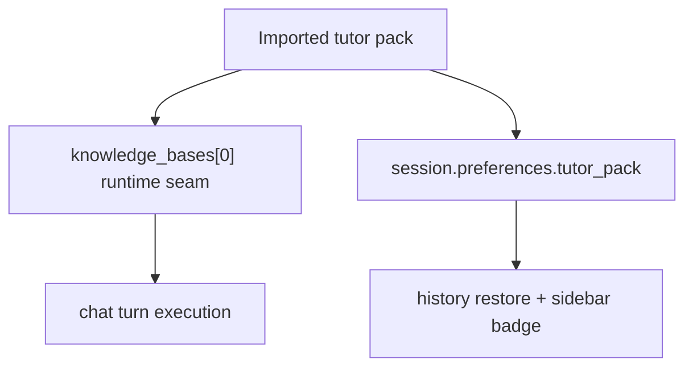

# Playground Tutor Pack Chat Implementation Plan

> **For agentic workers:** REQUIRED SUB-SKILL: Use superpowers:subagent-driven-development (recommended) or superpowers:executing-plans to implement this plan task-by-task. Steps use checkbox (`- [ ]`) syntax for tracking.

**Goal:** Bind each `/playground` chat session to exactly one imported `Gói gia sư`, restore that binding from history, and block new sends when the bound pack becomes unavailable.

**Architecture:** Extend session preferences with a thin `tutor_pack` object while keeping runtime requests mapped to `knowledge_bases: [knowledge_base]`. The frontend will treat `Gói gia sư` as the product-level concept for session creation, restoration, composer gating, and sidebar badging, while the backend persists additive preference metadata through the existing session store.

**Tech Stack:** Next.js App Router, React, TypeScript, FastAPI, Python session runtime, SQLite-backed session preferences.

---

### Task 1: Extend session contracts to carry `tutor_pack`

**Files:**
- Modify: `web/lib/session-api.ts`
- Modify: `deeptutor/api/routers/sessions.py`
- Modify: `deeptutor/services/session/turn_runtime.py`
- Reference only: `deeptutor/services/session/sqlite_store.py`
- Test: session contract smoke via frontend build and backend import sanity

- [ ] **Step 1: Add FE types for tutor-pack preferences**

Update `web/lib/session-api.ts` so `SessionSummary.preferences` and `SessionDetail.preferences` can carry a tutor-pack object:

```ts
export interface SessionTutorPackPreference {
  name: string;
  knowledge_base: string;
  status?: "available" | "missing";
}

export interface SessionPreferences {
  capability?: string;
  tools?: string[];
  knowledge_bases?: string[];
  language?: string;
  tutor_pack?: SessionTutorPackPreference;
}
```

Then reuse `SessionPreferences` in both `SessionSummary` and `SessionDetail`.

- [ ] **Step 2: Add backend serializer helper for tutor-pack preferences**

In `deeptutor/api/routers/sessions.py`, add a small helper that normalizes a tutor-pack object out of `session["preferences"]`:

```python
def _session_tutor_pack(session: dict[str, Any]) -> dict[str, Any] | None:
    preferences = session.get("preferences")
    if not isinstance(preferences, dict):
        return None
    raw = preferences.get("tutor_pack")
    if not isinstance(raw, dict):
        return None
    name = str(raw.get("name") or "").strip()
    knowledge_base = str(raw.get("knowledge_base") or "").strip()
    if not name or not knowledge_base:
        return None
    status = str(raw.get("status") or "available").strip() or "available"
    return {
        "name": name,
        "knowledge_base": knowledge_base,
        "status": "missing" if status == "missing" else "available",
    }
```

- [ ] **Step 3: Surface tutor-pack preferences in session responses**

Still in `deeptutor/api/routers/sessions.py`, ensure both session detail and context-support helpers can return the normalized `tutor_pack` inside `preferences` without altering the rest of the session payload:

```python
@router.get("/{session_id}")
async def get_session(session_id: str):
    store = get_sqlite_session_store()
    session = await store.get_session_with_messages(session_id)
    if session is None:
        raise HTTPException(status_code=404, detail="Session not found")
    tutor_pack = _session_tutor_pack(session)
    preferences = dict(session.get("preferences") or {})
    if tutor_pack is not None:
        preferences["tutor_pack"] = tutor_pack
    return {
        **session,
        "preferences": preferences,
        "context_support": _build_context_support(session),
    }
```

Keep `list_sessions()` passthrough behavior intact because the store already returns `preferences`.

- [ ] **Step 4: Persist tutor-pack metadata when a turn starts**

In `deeptutor/services/session/turn_runtime.py`, extend the `update_session_preferences()` call in `start_turn()` to persist tutor-pack metadata coming from the client config:

```python
tutor_pack = payload.get("tutor_pack")
normalized_tutor_pack = None
if isinstance(tutor_pack, dict):
    name = str(tutor_pack.get("name") or "").strip()
    knowledge_base = str(tutor_pack.get("knowledge_base") or "").strip()
    if name and knowledge_base:
        normalized_tutor_pack = {
            "name": name,
            "knowledge_base": knowledge_base,
            "status": "missing" if str(tutor_pack.get("status") or "") == "missing" else "available",
        }

await self.store.update_session_preferences(
    session["id"],
    {
        "capability": capability,
        "tools": list(payload.get("tools") or []),
        "knowledge_bases": list(payload.get("knowledge_bases") or []),
        "language": str(payload.get("language") or "en"),
        **({"tutor_pack": normalized_tutor_pack} if normalized_tutor_pack else {}),
    },
)
```

- [ ] **Step 5: Run contract sanity checks**

Run:

```bash
cd /Users/nguyenhuuloc/Documents/Multiagent-learning-platform/web && npx eslint "lib/session-api.ts"
cd /Users/nguyenhuuloc/Documents/Multiagent-learning-platform/web && npm run build
```

Expected:

```text
ESLint reports 0 problems for lib/session-api.ts
Next.js build completes successfully
```

- [ ] **Step 6: Commit contract updates**

```bash
git add web/lib/session-api.ts deeptutor/api/routers/sessions.py deeptutor/services/session/turn_runtime.py
git commit -m "feat(chat): persist tutor pack session binding [UI-PLAYGROUND-TUTOR-PACK-CHAT]"
```

### Task 2: Teach `UnifiedChatContext` to store and restore tutor-pack state

**Files:**
- Modify: `web/context/UnifiedChatContext.tsx`
- Modify: `web/lib/session-api.ts`
- Test: focused lint and build

- [ ] **Step 1: Extend chat-state types with tutor-pack session state**

In `web/context/UnifiedChatContext.tsx`, add explicit tutor-pack types and state:

```ts
export interface TutorPackBinding {
  name: string;
  knowledgeBase: string;
  status: "available" | "missing";
}

export interface ChatState {
  sessionId: string | null;
  enabledTools: string[];
  activeCapability: string | null;
  knowledgeBases: string[];
  tutorPack: TutorPackBinding | null;
  messages: MessageItem[];
  isStreaming: boolean;
  currentStage: string;
  language: string;
}
```

Also add `tutorPack` to `createSessionEntry()`.

- [ ] **Step 2: Add reducer actions for tutor-pack state**

Add actions for setting and loading tutor-pack data:

```ts
type Action =
  | { type: "SET_TUTOR_PACK"; tutorPack: TutorPackBinding | null }
  | {
      type: "LOAD_SESSION";
      key: string;
      sessionId: string;
      messages: MessageItem[];
      tutorPack?: TutorPackBinding | null;
      ...
    };
```

Reducer handling should mirror the existing `SET_KB` and `LOAD_SESSION` behavior:

```ts
case "SET_TUTOR_PACK":
  return updateSelectedSession(state, (session) => ({
    ...session,
    tutorPack: action.tutorPack,
    knowledgeBases: action.tutorPack ? [action.tutorPack.knowledgeBase] : session.knowledgeBases,
  }));
```

- [ ] **Step 3: Expose `setTutorPack` on the context API**

Extend `ChatContextValue` and the provider return value:

```ts
interface ChatContextValue {
  state: ChatState;
  setTutorPack: (tutorPack: TutorPackBinding | null) => void;
  ...
}
```

Implementation:

```ts
const setTutorPack = useCallback((tutorPack: TutorPackBinding | null) => {
  dispatch({ type: "SET_TUTOR_PACK", tutorPack });
}, []);
```

- [ ] **Step 4: Hydrate tutor-pack state from session detail**

In `loadSession()`, normalize `session.preferences?.tutor_pack` into the frontend type:

```ts
const tutorPack = session.preferences?.tutor_pack
  ? {
      name: session.preferences.tutor_pack.name,
      knowledgeBase: session.preferences.tutor_pack.knowledge_base,
      status: session.preferences.tutor_pack.status === "missing" ? "missing" : "available",
    }
  : null;

dispatch({
  type: "LOAD_SESSION",
  key: sessionId,
  sessionId,
  messages: hydrateMessages(session.messages),
  capability: session.preferences?.capability ?? null,
  tools: session.preferences?.tools ?? [],
  knowledgeBases: Array.isArray(session.preferences?.knowledge_bases)
    ? session.preferences!.knowledge_bases!
    : tutorPack
      ? [tutorPack.knowledgeBase]
      : [],
  tutorPack,
  language: session.preferences?.language ?? readStoredLanguage(),
  status: session.status ?? "idle",
  activeTurnId: session.active_turn_id ?? null,
});
```

- [ ] **Step 5: Include tutor-pack metadata in outgoing turn payloads**

In `sendMessage()`, include the bound tutor pack when building the request payload for `UnifiedWSClient`:

```ts
const tutorPackPayload = session.tutorPack
  ? {
      name: session.tutorPack.name,
      knowledge_base: session.tutorPack.knowledgeBase,
      status: session.tutorPack.status,
    }
  : undefined;

client.send({
  type: "message",
  ...
  knowledge_bases: shouldSendKnowledgeBases ? [...effectiveKnowledgeBases] : [],
  ...(tutorPackPayload ? { tutor_pack: tutorPackPayload } : {}),
});
```

Keep `knowledge_bases` as the runtime seam for actual retrieval.

- [ ] **Step 6: Run focused validation**

Run:

```bash
cd /Users/nguyenhuuloc/Documents/Multiagent-learning-platform/web && npx eslint "context/UnifiedChatContext.tsx"
cd /Users/nguyenhuuloc/Documents/Multiagent-learning-platform/web && npm run build
```

Expected:

```text
ESLint reports 0 problems for UnifiedChatContext.tsx
Next.js build completes successfully
```

- [ ] **Step 7: Commit context hydration changes**

```bash
git add web/context/UnifiedChatContext.tsx
git commit -m "feat(chat): hydrate tutor pack state in unified context [UI-PLAYGROUND-TUTOR-PACK-CHAT]"
```

### Task 3: Add tutor-pack selection and unavailable-state gating to `/playground`

**Files:**
- Modify: `web/app/(workspace)/playground/page.tsx`
- Modify: `web/lib/marketplace-api.ts`
- Reference only: `web/app/(utility)/knowledge/page.tsx`
- Test: focused lint and build

- [ ] **Step 1: Add a tutor-pack listing adapter on the frontend**

In `web/lib/marketplace-api.ts`, add a lightweight imported-pack shape and loader that reuses current APIs:

```ts
export interface ImportedTutorPack {
  name: string;
  knowledgeBase: string;
  subject?: string | null;
  grade?: string | null;
  owner?: string | null;
  language?: string | null;
}
```

If there is no dedicated imported-pack endpoint yet, plan to derive these from `listKnowledgeBases()` inside `/playground` instead of over-designing a new API helper. Keep this file unchanged if that path proves cleaner during implementation.

- [ ] **Step 2: Add tutor-pack selection state to the chat-mode shell**

In `web/app/(workspace)/playground/page.tsx`, read tutor-pack state from the chat context:

```ts
const {
  state: { messages, isStreaming, currentStage, enabledTools, knowledgeBases: selectedKbs, tutorPack },
  sendMessage,
  cancelStreamingTurn,
  setTools,
  setKBs,
  setCapability,
  setTutorPack,
  selectedSessionId,
} = useUnifiedChat();
```

Also derive:

```ts
const [availableTutorPacks, setAvailableTutorPacks] = useState<ImportedTutorPack[]>([]);
const [pendingTutorPackName, setPendingTutorPackName] = useState("");
const selectedTutorPack = tutorPack;
const missingTutorPack = tutorPack?.status === "missing";
const requiresTutorPackSelection = !selectedSessionId && availableTutorPacks.length > 1 && !selectedTutorPack;
```

- [ ] **Step 3: Populate tutor-pack candidates from imported knowledge bases**

Use `listKnowledgeBases()` to compute imported tutor-pack candidates from ready/imported knowledge bases:

```ts
useEffect(() => {
  let cancelled = false;
  void (async () => {
    const items = await listKnowledgeBases();
    if (cancelled) return;
    const packs = items
      .filter((kb) => kb.status === "ready")
      .map((kb) => ({
        name: kb.metadata?.display_name || kb.name,
        knowledgeBase: kb.name,
        subject: kb.metadata?.subject ?? null,
        grade: kb.metadata?.grade ?? null,
        owner: kb.metadata?.owner ?? null,
        language: kb.metadata?.language ?? null,
      }));
    setAvailableTutorPacks(packs);
  })();
  return () => {
    cancelled = true;
  };
}, []);
```

If `availableTutorPacks.length === 1` and there is no active tutor-pack binding yet for a draft session, auto-call:

```ts
setTutorPack({
  name: packs[0].name,
  knowledgeBase: packs[0].knowledgeBase,
  status: "available",
});
setKBs([packs[0].knowledgeBase]);
```

- [ ] **Step 4: Gate composer sends on tutor-pack selection and availability**

Wrap the chat send handler so it refuses to send when there is no selected pack or the pack is missing:

```ts
const canSendInChat =
  !!selectedTutorPack &&
  selectedTutorPack.status === "available" &&
  (!availableTutorPacks.length || availableTutorPacks.some((pack) => pack.knowledgeBase === selectedTutorPack.knowledgeBase));

const handleChatSubmit = (content: string) => {
  if (!selectedTutorPack || selectedTutorPack.status !== "available") {
    return;
  }
  sendMessage(content, undefined, undefined, undefined, undefined);
};
```

Update the composer props so the disabled state and helper text reflect:
- “Chọn Gói gia sư trước khi bắt đầu”
- “Gói gia sư này không còn khả dụng”

- [ ] **Step 5: Render the tutor-pack picker for new chat sessions**

In the chat-specific right panel or top-of-chat context, add a small selection card only for draft/new chat:

```tsx
{!selectedSessionId && availableTutorPacks.length > 1 ? (
  <section className="rounded-2xl border border-[var(--border)] bg-[var(--background)]/78 px-4 py-4">
    <h3 className="text-[11px] font-semibold uppercase tracking-[0.16em] text-[var(--muted-foreground)]">
      {t("Gói gia sư")}
    </h3>
    <select
      value={pendingTutorPackName}
      onChange={(event) => {
        const pack = availableTutorPacks.find((item) => item.knowledgeBase === event.target.value);
        setPendingTutorPackName(event.target.value);
        if (pack) {
          setTutorPack({ name: pack.name, knowledgeBase: pack.knowledgeBase, status: "available" });
          setKBs([pack.knowledgeBase]);
        }
      }}
      className="mt-3 w-full rounded-xl border border-[var(--border)] bg-[var(--background)] px-3 py-2 text-sm"
    >
      <option value="">{t("Chọn gói gia sư")}</option>
      {availableTutorPacks.map((pack) => (
        <option key={pack.knowledgeBase} value={pack.knowledgeBase}>
          {pack.name}
        </option>
      ))}
    </select>
  </section>
) : null}
```

- [ ] **Step 6: Render the bound pack and missing-state warning in chat UI**

Add a compact tutor-pack card in the chat context surface:

```tsx
<section className="rounded-2xl border border-[var(--border)] bg-[var(--background)]/78 px-4 py-4">
  <h3 className="text-[11px] font-semibold uppercase tracking-[0.16em] text-[var(--muted-foreground)]">
    {t("Gói gia sư")}
  </h3>
  {selectedTutorPack ? (
    <>
      <p className="mt-2 text-sm font-medium text-[var(--foreground)]">{selectedTutorPack.name}</p>
      {selectedTutorPack.status === "missing" ? (
        <p className="mt-2 text-[12px] leading-5 text-amber-700">
          {t("Gói gia sư này không còn khả dụng. Bạn vẫn có thể xem lịch sử nhưng chưa thể gửi thêm tin nhắn.")}
        </p>
      ) : null}
    </>
  ) : (
    <p className="mt-2 text-[12px] leading-5 text-[var(--muted-foreground)]">
      {t("Chọn một gói gia sư để bắt đầu cuộc trò chuyện này.")}
    </p>
  )}
</section>
```

- [ ] **Step 7: Validate the `/playground` UI slice**

Run:

```bash
cd /Users/nguyenhuuloc/Documents/Multiagent-learning-platform/web && npx eslint "app/(workspace)/playground/page.tsx" "lib/marketplace-api.ts"
cd /Users/nguyenhuuloc/Documents/Multiagent-learning-platform/web && npm run build
```

Expected:

```text
ESLint reports 0 problems for the touched files
Next.js build completes successfully
```

- [ ] **Step 8: Commit chat-surface changes**

```bash
git add web/app/'(workspace)'/playground/page.tsx web/lib/marketplace-api.ts
git commit -m "feat(playground): lock chat sessions to tutor packs [UI-PLAYGROUND-TUTOR-PACK-CHAT]"
```

### Task 4: Show tutor-pack badges in session history

**Files:**
- Modify: `web/components/sidebar/WorkspaceSidebar.tsx`
- Modify: `web/lib/session-api.ts`
- Test: focused lint and build

- [ ] **Step 1: Extend sidebar session row rendering with a tutor-pack badge**

Locate the session-item render path in `web/components/sidebar/WorkspaceSidebar.tsx` and add a compact second-line badge when `session.preferences?.tutor_pack` exists:

```tsx
{session.preferences?.tutor_pack ? (
  <div className="mt-1 flex items-center gap-2">
    <span className="inline-flex max-w-full items-center truncate rounded-full bg-[var(--muted)] px-2 py-0.5 text-[10px] font-medium text-[var(--muted-foreground)]">
      {session.preferences.tutor_pack.name}
    </span>
    {session.preferences.tutor_pack.status === "missing" ? (
      <span className="text-[10px] text-amber-700">{t("Không khả dụng")}</span>
    ) : null}
  </div>
) : null}
```

- [ ] **Step 2: Keep the session row compact**

Adjust any existing `line-clamp`, gap, or title spacing so the session list still reads cleanly with the added badge:

```tsx
<div className="min-w-0">
  <p className="truncate text-sm font-medium text-[var(--foreground)]">{session.title}</p>
  {/* tutor pack badge */}
</div>
```

Do not redesign the whole sidebar in this lane.

- [ ] **Step 3: Verify sidebar rendering stays clean**

Run:

```bash
cd /Users/nguyenhuuloc/Documents/Multiagent-learning-platform/web && npx eslint "components/sidebar/WorkspaceSidebar.tsx"
cd /Users/nguyenhuuloc/Documents/Multiagent-learning-platform/web && npm run build
```

Expected:

```text
ESLint reports 0 problems for WorkspaceSidebar.tsx
Next.js build completes successfully
```

- [ ] **Step 4: Commit sidebar badge changes**

```bash
git add web/components/sidebar/WorkspaceSidebar.tsx
git commit -m "feat(sidebar): show tutor pack badges on chat history [UI-PLAYGROUND-TUTOR-PACK-CHAT]"
```

### Task 5: Document, verify, and prepare PR handoff

**Files:**
- Modify: `ai_first/daily/2026-04-30.md`
- Create: `docs/superpowers/pr-notes/2026-04-30-playground-tutor-pack-chat.md`
- Test: final lint/build/diff checks

- [ ] **Step 1: Run final validation**

Run:

```bash
cd /Users/nguyenhuuloc/Documents/Multiagent-learning-platform/web && npx eslint "app/(workspace)/playground/page.tsx" "context/UnifiedChatContext.tsx" "components/sidebar/WorkspaceSidebar.tsx" "lib/session-api.ts"
cd /Users/nguyenhuuloc/Documents/Multiagent-learning-platform/web && npm run build
cd /Users/nguyenhuuloc/Documents/Multiagent-learning-platform && git diff --check
```

Expected:

```text
ESLint reports 0 problems
Next.js build completes successfully
git diff --check returns no output
```

- [ ] **Step 2: Record the lane in the daily log**

Append to `ai_first/daily/2026-04-30.md`:

```md
## UI-PLAYGROUND-TUTOR-PACK-CHAT

- Added `Gói gia sư` binding for `/playground` chat sessions.
- Locked each session to one imported tutor pack from creation through history restore.
- Blocked new sends when the bound tutor pack is no longer available while preserving readable history.
```

- [ ] **Step 3: Write the PR architecture note**

Create `docs/superpowers/pr-notes/2026-04-30-playground-tutor-pack-chat.md`:

```md
# PR Note: Playground Tutor Pack Chat

## Summary

This lane adds a product-level `Gói gia sư` concept to `/playground` chat sessions by storing a thin tutor-pack binding in session preferences while preserving the existing `knowledge_bases` runtime contract.



## MAIN_SYSTEM_MAP

Update `ai_first/architecture/MAIN_SYSTEM_MAP.md` only if the final implementation introduces a new durable product concept that should be reflected in the architecture map. If the implementation stays as a thin session-preference extension on top of existing chat/runtime edges, note explicitly in the PR that the architecture map was not changed.
```

- [ ] **Step 4: Commit docs and handoff artifacts**

```bash
git add ai_first/daily/2026-04-30.md docs/superpowers/pr-notes/2026-04-30-playground-tutor-pack-chat.md
git commit -m "docs(playground): record tutor pack chat lane [UI-PLAYGROUND-TUTOR-PACK-CHAT]"
```

## Self-Review

- Spec coverage:
  - tutor-pack product framing and one-pack-per-session model: Tasks 1-3
  - history restore and unavailable-state blocking: Tasks 2-3
  - sidebar badge: Task 4
  - docs and PR note: Task 5
- Placeholder scan:
  - no `TODO`, `TBD`, or deferred implementation placeholders remain in tasks
- Type consistency:
  - use `tutor_pack` in backend/session contracts
  - use `TutorPackBinding` and `knowledgeBase` in frontend state
  - keep runtime request payload mapped to `knowledge_bases`
