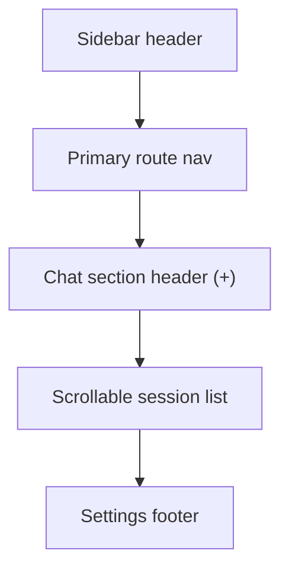

# Sidebar Shell Rebalance Implementation Plan

> **For agentic workers:** REQUIRED SUB-SKILL: Use superpowers:subagent-driven-development (recommended) or superpowers:executing-plans to implement this plan task-by-task. Steps use checkbox (`- [ ]`) syntax for tracking.

**Goal:** Rebalance the shared expanded sidebar so the route nav stays compact at the top, the chat section owns the new-chat action and most of the middle height, and the shell is about 20% wider.

**Architecture:** Keep the existing `WorkspaceSidebar -> SidebarShell -> SessionList` contract intact where possible. Make the hierarchy change inside `SidebarShell`, use source-level FE tests to lock the new shell shape first, and only touch `SessionList` if the wider shell exposes weak row density or empty-state presentation.

**Tech Stack:** Next.js App Router, React client components, existing sidebar/session components, Node `node:test` source-level FE regression tests

---

### Task 1: Lock The Sidebar Hierarchy Expectations In FE Tests

**Files:**
- Review: `web/components/sidebar/SidebarShell.tsx`
- Review: `web/components/SessionList.tsx`
- Modify: `web/tests/sidebar-nav-groups.test.ts`
- Create: `web/tests/sidebar-shell-layout.test.ts`

- [ ] **Step 1: Add the failing shell-shape test**

```ts
import test from "node:test";
import assert from "node:assert/strict";
import { readFileSync } from "node:fs";
import { resolve } from "node:path";

const SIDEBAR_SHELL_PATH = resolve(process.cwd(), "components/sidebar/SidebarShell.tsx");

function readSidebarShell(): string {
  return readFileSync(SIDEBAR_SHELL_PATH, "utf8");
}

test("expanded sidebar uses wider shell and chat-owned new-chat action", () => {
  const source = readSidebarShell();

  assert.match(source, /w-\\[264px\\]/);
  assert.doesNotMatch(source, /New Chat"[\\s\\S]*expandedNavGroups/);
  assert.match(source, /Trò chuyện|t\\("Chat"\)/);
  assert.match(source, /Plus/);
  assert.doesNotMatch(source, /max-h-\\[112px\\]/);
});
```

- [ ] **Step 2: Run the FE shell test to verify it fails**

Run: `cd web && node --test tests/sidebar-shell-layout.test.ts`
Expected: FAIL because `SidebarShell.tsx` still uses `w-[220px]`, keeps the detached `New Chat` row, and still caps the compact session viewport.

- [ ] **Step 3: Keep the existing nav-group regression green**

Run: `cd web && node --test tests/sidebar-nav-groups.test.ts`
Expected: PASS so the task starts from a known-good grouping baseline.

- [ ] **Step 4: Commit the failing-test checkpoint**

```bash
git add web/tests/sidebar-shell-layout.test.ts web/tests/sidebar-nav-groups.test.ts
git commit -m "test(sidebar): lock shell rebalance expectations [UI_SIDEBAR_SHELL_REBALANCE]"
```

### Task 2: Rebalance The Expanded Sidebar Layout Inside SidebarShell

**Files:**
- Modify: `web/components/sidebar/SidebarShell.tsx`

- [ ] **Step 1: Increase the expanded shell width and reduce nav density**

```tsx
return (
  <aside className="flex h-screen w-[264px] shrink-0 flex-col bg-[var(--secondary)] transition-all duration-200">
```

Also tighten the expanded nav item spacing:

```tsx
className={`flex items-center gap-2.5 rounded-lg px-3 py-1.5 text-[13.5px] transition-colors ${
  active
    ? "bg-[var(--background)]/70 font-medium text-[var(--foreground)]"
    : "text-[var(--muted-foreground)] hover:bg-[var(--background)]/50 hover:text-[var(--foreground)]"
}`}
```

- [ ] **Step 2: Remove the detached top-level new-chat row**

Delete the current expanded-mode block:

```tsx
<button
  onClick={handleNewChat}
  className="flex w-full items-center gap-2.5 rounded-lg px-3 py-2 text-[13.5px] text-[var(--muted-foreground)] transition-colors hover:bg-[var(--background)]/60 hover:text-[var(--foreground)]"
>
  <Plus size={16} strokeWidth={2} />
  <span>{t("New Chat")}</span>
</button>
```

- [ ] **Step 3: Stop nesting the session list under the `/playground` nav item**

Replace the current `hasSessionsBelow` path so `/playground` renders as a normal nav item only:

```tsx
const hasBots = item.href === "/agents";
```

and remove:

```tsx
{hasSessionsBelow && (
  <div className={`${sessionViewportClassName} overflow-y-auto`}>
    <SessionList ... compact />
  </div>
)}
```

- [ ] **Step 4: Add a dedicated chat section below the route groups**

Insert a middle section after the primary nav:

```tsx
<div className="min-h-0 flex-1 px-2 pb-2 pt-3">
  <div className="flex items-center justify-between px-3 pb-2">
    <div className="text-[11px] font-semibold uppercase tracking-[0.12em] text-[var(--muted-foreground)]/80">
      {t("Chat")}
    </div>
    <button
      onClick={handleNewChat}
      className="rounded-md p-1 text-[var(--muted-foreground)] transition-colors hover:bg-[var(--background)]/60 hover:text-[var(--foreground)]"
      aria-label={t("New Chat")}
    >
      <Plus size={15} strokeWidth={2} />
    </button>
  </div>
  <div className="min-h-0 overflow-y-auto rounded-2xl bg-[var(--background)]/35 p-1">
    <SessionList
      sessions={sessions}
      activeSessionId={activeSessionId}
      loading={loadingSessions}
      onSelect={onSelectSession!}
      onRename={onRenameSession!}
      onDelete={onDeleteSession!}
    />
  </div>
</div>
```

- [ ] **Step 5: Keep the footer pinned after the chat section**

Preserve the settings footer after the new `flex-1` chat section:

```tsx
<div className="border-t border-[var(--border)]/40 px-2 py-2">
```

- [ ] **Step 6: Run the shell FE tests**

Run: `cd web && node --test tests/sidebar-shell-layout.test.ts tests/sidebar-nav-groups.test.ts`
Expected: PASS once the width, detached-action removal, and chat-owned section are in place.

- [ ] **Step 7: Commit the shell rebalance**

```bash
git add web/components/sidebar/SidebarShell.tsx web/tests/sidebar-shell-layout.test.ts web/tests/sidebar-nav-groups.test.ts
git commit -m "feat(sidebar): rebalance expanded shell layout [UI_SIDEBAR_SHELL_REBALANCE]"
```

### Task 3: Refine SessionList Only If The Wider Shell Exposes Weak Rows

**Files:**
- Review: `web/components/SessionList.tsx`
- Modify if needed: `web/components/SessionList.tsx`
- Modify if needed: `web/tests/sidebar-shell-layout.test.ts`

- [ ] **Step 1: Inspect whether the default SessionList rows already fit the new shell**

Review these current branches:

```tsx
if (sessions.length === 0) {
  if (compact) return null;
  return (
    <div className="px-3 py-4 text-center text-[11px] text-[var(--muted-foreground)]/70">
      {t("No conversations yet")}
    </div>
  );
}
```

and:

```tsx
if (compact) {
  return (
    <div className="ml-4 border-l border-[var(--border)]/30 py-2">
```

Expected: if the new dedicated chat section uses the non-compact path cleanly, `SessionList.tsx` may not need any runtime change.

- [ ] **Step 2: If the empty state feels too weak, tighten only the non-compact empty state**

Minimal allowed adjustment:

```tsx
return (
  <div className="px-3 py-6 text-center text-[12px] text-[var(--muted-foreground)]/75">
    <div>{t("No conversations yet")}</div>
    <div className="mt-1 text-[11px]">{t("Click + to start a new chat")}</div>
  </div>
);
```

- [ ] **Step 3: If no SessionList runtime change is needed, record that by leaving the file untouched**

Run: `git diff -- web/components/SessionList.tsx`
Expected: no output when the shell-only implementation is sufficient.

- [ ] **Step 4: Re-run the FE shell tests after any SessionList adjustment**

Run: `cd web && node --test tests/sidebar-shell-layout.test.ts tests/sidebar-nav-groups.test.ts`
Expected: PASS.

- [ ] **Step 5: Commit only if SessionList changed**

```bash
git add web/components/SessionList.tsx web/tests/sidebar-shell-layout.test.ts
git commit -m "feat(sidebar): polish session list presentation [UI_SIDEBAR_SHELL_REBALANCE]"
```

### Task 4: Final Verification And Handoff Docs

**Files:**
- Modify: `ai_first/daily/2026-04-30.md`
- Create: `docs/superpowers/pr-notes/2026-04-30-sidebar-shell-rebalance.md`
- Update if needed: `ai_first/architecture/MAIN_SYSTEM_MAP.md`

- [ ] **Step 1: Write the PR note with the final shell hierarchy**

```md
# PR Note: Sidebar Shell Rebalance

This PR rebalances the shared expanded sidebar so route navigation stays compact at the top, chat actions and chat history live in one section, and the shell is wider and less cramped.


```

- [ ] **Step 2: Update the daily log with actual verification**

Add an entry summarizing:

```md
- Done: widened the expanded sidebar to about 264px, moved `New Chat` into the chat section header, and let session history take the main middle height.
- Tests: `cd web && node --test tests/sidebar-shell-layout.test.ts tests/sidebar-nav-groups.test.ts`
```

- [ ] **Step 3: Check whether the main system map needs an update**

Run: inspect `ai_first/architecture/MAIN_SYSTEM_MAP.md`
Expected: likely no change, because this is shell/layout refinement rather than a new subsystem boundary. If unchanged, state that in the PR note.

- [ ] **Step 4: Run final verification**

Run:
- `cd web && node --test tests/sidebar-shell-layout.test.ts tests/sidebar-nav-groups.test.ts`
- `git diff --check`

Expected: PASS.

- [ ] **Step 5: Commit the final docs and handoff**

```bash
git add ai_first/daily/2026-04-30.md docs/superpowers/pr-notes/2026-04-30-sidebar-shell-rebalance.md
git commit -m "docs(sidebar): capture shell rebalance handoff [UI_SIDEBAR_SHELL_REBALANCE]"
```
