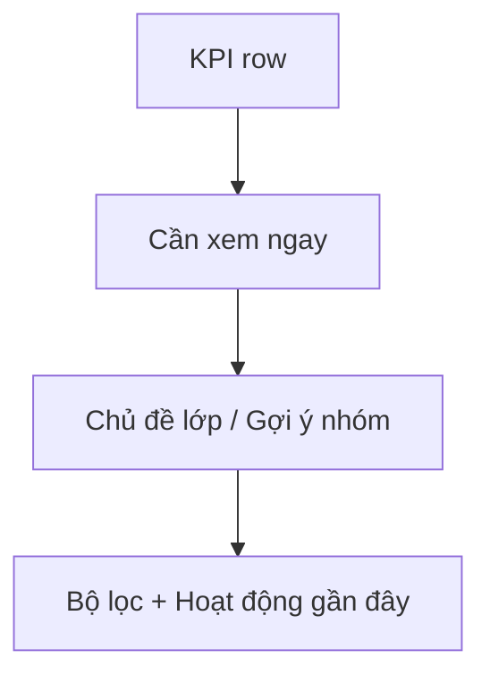

# Teacher Dashboard Decision Flow Implementation Plan

> **For agentic workers:** REQUIRED SUB-SKILL: Use superpowers:subagent-driven-development (recommended) or superpowers:executing-plans to implement this plan task-by-task. Steps use checkbox (`- [ ]`) syntax for tracking.

**Goal:** Refactor `Bảng điều khiển giáo viên` into a decision-first dashboard where urgent intervention cards dominate the first screenful, supporting topic/group summaries live beside them, and raw/debug strings are removed from the default teacher view.

**Architecture:** Keep the current route and backend contracts, but reorganize the FE into four clearer layers: KPI summary, intervention-first insight zone, supporting topic/group cards, and a calmer lower activity/history section. Use `dashboard-presenters.ts` as the single mapping boundary for teacher-facing copy so raw IDs, debug values, and unfinished English do not leak through the page or student cards.

**Tech Stack:** Next.js App Router, React client components, existing dashboard FE components, locale JSON files, Node `node:test` FE tests, existing dashboard API wrappers

---

### Task 1: Lock Teacher-Facing Presenter Expectations Before Layout Refactor

**Files:**
- Review: `web/components/dashboard/dashboard-presenters.ts`
- Review: `web/tests/teacher-dashboard-copy.test.ts`
- Review: `web/components/dashboard/StudentInsightCard.tsx`
- Create or modify: `web/tests/teacher-dashboard-copy.test.ts`

- [ ] **Step 1: Extend the presenter-focused test with the raw-to-teacher-friendly mappings**

```ts
import test from "node:test";
import assert from "node:assert/strict";
import {
  buildDashboardPrioritySummary,
  formatConfidenceLabel,
  formatDiagnosisLabel,
  formatSupportLevelLabel,
  formatTeacherFacingLabel,
  formatTeacherMoveLabel,
} from "../components/dashboard/dashboard-presenters.ts";

test("dashboard presenters hide raw technical tokens behind teacher-friendly labels", () => {
  assert.equal(formatDiagnosisLabel("careless_error"), "Dễ sai do bất cẩn");
  assert.equal(formatSupportLevelLabel("guided"), "Có hướng dẫn");
  assert.equal(formatTeacherMoveLabel("retry_easier"), "Luyện lại với mức dễ hơn");
  assert.equal(formatConfidenceLabel("low"), "Cần giáo viên kiểm tra thêm");
  assert.equal(formatTeacherFacingLabel("acknowledged"), "Acknowledged");
});

test("priority summary stays decision-first and non-technical", () => {
  const summary = buildDashboardPrioritySummary({
    nextActionRationale: "",
    focusTopic: "Nhân tử chung",
    masteredTopic: "Cộng phân số",
  });

  assert.equal(summary.priorityTitle, "Việc giáo viên nên xem trước");
  assert.equal(summary.focusBody, "Nhân tử chung");
  assert.equal(summary.strengthBody, "Cộng phân số");
});
```

- [ ] **Step 2: Run the presenter test to capture the baseline**

Run: `cd web && node --test tests/teacher-dashboard-copy.test.ts`
Expected: PASS or narrowly failing only where the new wording still needs to be added; this test becomes the guardrail for the later UI refactor.

- [ ] **Step 3: Tighten any missing presenter mapping before touching layout**

```ts
export function formatDiagnosisLabel(value?: string | null): string {
  switch ((value || "").toLowerCase()) {
    case "careless_error":
      return "Dễ sai do bất cẩn";
    case "knowledge_gap":
      return "Hổng kiến thức nền";
    case "misconception":
      return "Hiểu sai khái niệm";
    default:
      return value ? humanizeToken(value) : "Chưa có nhận định";
  }
}
```

- [ ] **Step 4: Re-run the presenter test**

Run: `cd web && node --test tests/teacher-dashboard-copy.test.ts`
Expected: PASS

- [ ] **Step 5: Commit the presenter guardrail checkpoint**

```bash
git add web/components/dashboard/dashboard-presenters.ts web/tests/teacher-dashboard-copy.test.ts
git commit -m "test(dashboard): lock teacher-facing presenter mappings [UI_TEACHER_DASHBOARD_DECISION_FLOW]"
```

### Task 2: Restructure The Dashboard Page Into Four Visual Zones

**Files:**
- Modify: `web/app/(workspace)/dashboard/page.tsx`
- Review: `web/components/dashboard/TeacherInsightPanel.tsx`

- [ ] **Step 1: Replace the mixed hero-plus-summary stack with a compact KPI-first top section**

```tsx
<section className="grid gap-3 md:grid-cols-2 xl:grid-cols-4">
  {cards.map((card) => (
    <div
      key={card.label}
      className="rounded-2xl border border-[var(--border)] bg-[var(--card)] px-4 py-4 shadow-sm"
    >
      <div className="flex items-center justify-between gap-3">
        <span className="text-[12px] font-medium text-[var(--muted-foreground)]">
          {card.label}
        </span>
        <card.icon size={16} className="text-[var(--muted-foreground)]" />
      </div>
      <div className="mt-3 text-[30px] font-semibold text-[var(--foreground)]">
        {loading ? "-" : card.value}
      </div>
    </div>
  ))}
</section>
```

- [ ] **Step 2: Move the teacher decision layer directly under the KPI row**

```tsx
<section className="grid gap-4 xl:grid-cols-[1.35fr_0.85fr]">
  <TeacherInsightPanel insights={insights} />
  <aside className="space-y-4">
    {/* topic support cards */}
    {/* mastered topic cards */}
    {/* group recommendation cards */}
  </aside>
</section>
```

- [ ] **Step 3: Demote history and filters into a lower follow-up layer**

```tsx
<section className="rounded-2xl border border-[var(--border)] bg-[var(--card)] p-4 shadow-sm">
  <div className="flex items-center justify-between gap-3">
    <h2 className="text-[16px] font-semibold text-[var(--foreground)]">
      {t("Hoạt động gần đây")}
    </h2>
    <Filter size={16} className="text-[var(--muted-foreground)]" />
  </div>
  {/* compact filter toolbar */}
  {/* compact recent activity list */}
</section>
```

- [ ] **Step 4: Run a focused FE test or source-level shell test for the new page hierarchy**

Run: `cd web && node --test tests/teacher-dashboard-copy.test.ts`
Expected: PASS for copy-level safeguards while the page hierarchy is updated

- [ ] **Step 5: Run targeted eslint on the dashboard page**

Run: `cd web && ./node_modules/.bin/eslint "app/(workspace)/dashboard/page.tsx"`
Expected: PASS

- [ ] **Step 6: Commit the page-shell refactor**

```bash
git add web/app/'(workspace)'/dashboard/page.tsx
git commit -m "feat(dashboard): restructure decision-first page shell [UI_TEACHER_DASHBOARD_DECISION_FLOW]"
```

### Task 3: Refactor TeacherInsightPanel Into A True “Cần Xem Ngay” Surface

**Files:**
- Modify: `web/components/dashboard/TeacherInsightPanel.tsx`
- Review: `web/lib/dashboard-api.ts`

- [ ] **Step 1: Rename the section into an intervention-first teacher review surface**

```tsx
<section className="rounded-2xl border border-[var(--border)] bg-[var(--card)] p-4 shadow-sm">
  <div className="flex items-center justify-between gap-3">
    <div>
      <p className="text-[12px] font-semibold uppercase tracking-[0.08em] text-[var(--muted-foreground)]">
        {t("Cần xem ngay")}
      </p>
      <h2 className="mt-1 text-[20px] font-semibold text-[var(--foreground)]">
        {t("Học sinh cần giáo viên xem trước")}
      </h2>
    </div>
  </div>
</section>
```

- [ ] **Step 2: Ensure only urgent, decision-relevant supporting text stays visible by default**

```tsx
<p className="mt-2 text-[13px] leading-6 text-[var(--muted-foreground)]">
  {t("Xem nhanh học sinh đang vướng nhiều nhất, xác nhận gợi ý can thiệp, rồi mới xuống phần lịch sử và số liệu chi tiết.")}
</p>
```

- [ ] **Step 3: Keep group recommendation and empty-state behavior bounded inside the panel**

```tsx
{!insights?.students?.length ? (
  <div className="rounded-2xl border border-dashed border-[var(--border)] bg-[var(--background)] px-4 py-8 text-center">
    <div className="text-[14px] font-medium text-[var(--foreground)]">
      {t("Chưa có học sinh cần ưu tiên")}
    </div>
    <div className="mt-1 text-[12px] text-[var(--muted-foreground)]">
      {t("Khi hệ thống phát hiện tín hiệu cần giáo viên xem trước, danh sách sẽ xuất hiện ở đây.")}
    </div>
  </div>
) : null}
```

- [ ] **Step 4: Run targeted eslint on the insight panel**

Run: `cd web && ./node_modules/.bin/eslint "components/dashboard/TeacherInsightPanel.tsx"`
Expected: PASS

- [ ] **Step 5: Commit the panel hierarchy change**

```bash
git add web/components/dashboard/TeacherInsightPanel.tsx
git commit -m "feat(dashboard): promote urgent teacher review panel [UI_TEACHER_DASHBOARD_DECISION_FLOW]"
```

### Task 4: Redesign StudentInsightCard For Fast Teacher Decisions

**Files:**
- Modify: `web/components/dashboard/StudentInsightCard.tsx`
- Review: `web/components/dashboard/InsightSectionLabel.tsx`
- Review: `web/components/dashboard/dashboard-presenters.ts`

- [ ] **Step 1: Replace the current multi-block narrative with a compact five-row decision card**

```tsx
<article className="rounded-3xl border border-[var(--border)] bg-[var(--background)] p-4 shadow-sm">
  <div className="flex items-start justify-between gap-3">
    <div>
      <div className="text-[16px] font-semibold text-[var(--foreground)]">
        {studentDisplayName}
      </div>
      <div className="mt-1 flex flex-wrap gap-2">
        <span className="rounded-full bg-amber-50 px-2.5 py-1 text-[11px] font-medium text-amber-700">
          {priorityLabel}
        </span>
        <span className="rounded-full bg-[var(--muted)] px-2.5 py-1 text-[11px] text-[var(--muted-foreground)]">
          {confidenceLabel}
        </span>
      </div>
    </div>
    <Link href={studentHref} className="inline-flex items-center gap-1 rounded-full border border-[var(--border)] px-3 py-1 text-[11px] font-medium">
      {t("Xem hồ sơ học sinh")}
      <ArrowRight size={12} />
    </Link>
  </div>
</article>
```

- [ ] **Step 2: Reduce visible evidence into short chips instead of raw variable dumps**

```tsx
<div className="mt-3 flex flex-wrap gap-2">
  <span className="rounded-full bg-[var(--muted)] px-2.5 py-1 text-[11px] text-[var(--muted-foreground)]">
    {t("{{count}} câu cần xem lại", { count: student.observed?.miss_count ?? 0 })}
  </span>
  <span className="rounded-full bg-[var(--muted)] px-2.5 py-1 text-[11px] text-[var(--muted-foreground)]">
    {t("Hỗ trợ hiện tại: {{value}}", { value: supportLevelLabel })}
  </span>
</div>
```

- [ ] **Step 3: Collapse optional technical/system detail behind disclosure instead of default body text**

```tsx
<details className="mt-4 rounded-2xl border border-[var(--border)] bg-[var(--card)]/60 p-3">
  <summary className="cursor-pointer text-[12px] font-medium text-[var(--muted-foreground)]">
    {t("Chi tiết hệ thống")}
  </summary>
  <div className="mt-2 text-[12px] leading-6 text-[var(--muted-foreground)]">
    {systemTraceSummary}
  </div>
</details>
```

- [ ] **Step 4: Group the teacher actions into one intentional action row**

```tsx
<div className="mt-4 flex flex-wrap gap-2">
  <Link
    href={studentHref}
    className="inline-flex items-center justify-center rounded-full bg-[var(--foreground)] px-4 py-2 text-[12px] font-medium text-[var(--background)]"
  >
    {t("Xem hồ sơ học sinh")}
  </Link>
  <RecommendationAckComposer
    triggerLabel={recommendationAck ? t("Cập nhật trạng thái đã xem") : t("Đánh dấu đã xem")}
    defaultPayload={ackPayload}
    existingAck={recommendationAck}
    onSaved={setRecommendationAck}
    t={t}
  />
</div>
```

- [ ] **Step 5: Run targeted eslint on the student card**

Run: `cd web && ./node_modules/.bin/eslint "components/dashboard/StudentInsightCard.tsx"`
Expected: PASS

- [ ] **Step 6: Commit the card redesign**

```bash
git add web/components/dashboard/StudentInsightCard.tsx
git commit -m "feat(dashboard): simplify student decision cards [UI_TEACHER_DASHBOARD_DECISION_FLOW]"
```

### Task 5: Build The Supporting Topic, Group, And Activity Layers

**Files:**
- Modify: `web/app/(workspace)/dashboard/page.tsx`
- Modify if needed: `web/components/dashboard/dashboard-presenters.ts`

- [ ] **Step 1: Render supporting topic cards with count-based, short summaries**

```tsx
<div className="rounded-2xl border border-[var(--border)] bg-[var(--card)] p-4 shadow-sm">
  <h3 className="text-[14px] font-semibold text-[var(--foreground)]">
    {t("Chủ đề cần hỗ trợ")}
  </h3>
  <div className="mt-3 space-y-2">
    {focusTopics.map((topic) => (
      <div
        key={`focus-${topic.topic}`}
        className="flex items-center justify-between rounded-xl bg-[var(--background)] px-3 py-3"
      >
        <span className="text-[13px] text-[var(--foreground)]">{topic.topic}</span>
        <span className="rounded-full bg-rose-50 px-2.5 py-1 text-[11px] font-medium text-rose-700">
          {topic.student_count ?? 0}
        </span>
      </div>
    ))}
  </div>
</div>
```

- [ ] **Step 2: Tighten the recent-activity list into denser rows**

```tsx
<div className="divide-y divide-[var(--border)]">
  {recentActivity.map((item) => (
    <div key={item.session_id} className="grid gap-2 px-1 py-3 md:grid-cols-[1.2fr_0.8fr_0.7fr]">
      <div>
        <div className="text-[13px] font-medium text-[var(--foreground)]">
          {item.title}
        </div>
        <div className="mt-1 text-[12px] text-[var(--muted-foreground)]">
          {formatTime(item.updated_at)}
        </div>
      </div>
      <div className="text-[12px] text-[var(--muted-foreground)]">
        {formatActivityTypeLabel(item.type)}
      </div>
      <div className="text-[12px] text-[var(--muted-foreground)]">
        {formatActivityStatusLabel(item.status)}
      </div>
    </div>
  ))}
</div>
```

- [ ] **Step 3: Keep filter controls in one toolbar row instead of scattered form blocks**

```tsx
<div className="mt-4 grid gap-3 lg:grid-cols-[1.2fr_0.8fr_0.8fr_0.6fr_auto]">
  {/* search */}
  {/* activity type */}
  {/* knowledge base */}
  {/* min score */}
  {/* clear filters */}
</div>
```

- [ ] **Step 4: Run targeted eslint on the dashboard page again**

Run: `cd web && ./node_modules/.bin/eslint "app/(workspace)/dashboard/page.tsx"`
Expected: PASS

- [ ] **Step 5: Commit the supporting-layer refactor**

```bash
git add web/app/'(workspace)'/dashboard/page.tsx web/components/dashboard/dashboard-presenters.ts
git commit -m "feat(dashboard): add supporting topic and activity layers [UI_TEACHER_DASHBOARD_DECISION_FLOW]"
```

### Task 6: Finish Locale Coverage, Verification, And Handoff

**Files:**
- Modify: `web/locales/vi/app.json`
- Modify: `web/locales/en/app.json`
- Modify: `ai_first/daily/2026-04-30.md`
- Create: `docs/superpowers/pr-notes/2026-04-30-teacher-dashboard-decision-flow.md`
- Update if required: `ai_first/architecture/MAIN_SYSTEM_MAP.md`

- [ ] **Step 1: Add any missing bounded dashboard copy keys**

```json
{
  "Cần xem ngay": "Cần xem ngay",
  "Học sinh cần giáo viên xem trước": "Học sinh cần giáo viên xem trước",
  "Chi tiết hệ thống": "Chi tiết hệ thống",
  "Chưa có học sinh cần ưu tiên": "Chưa có học sinh cần ưu tiên"
}
```

- [ ] **Step 2: Run focused FE tests plus build**

Run:
- `cd web && node --test tests/teacher-dashboard-copy.test.ts`
- `cd web && ./node_modules/.bin/eslint "app/(workspace)/dashboard/page.tsx" "components/dashboard/TeacherInsightPanel.tsx" "components/dashboard/StudentInsightCard.tsx" "components/dashboard/dashboard-presenters.ts"`
- `cd web && npm run build`
Expected: PASS

- [ ] **Step 3: Write the PR note with Mermaid diagram**

```md
# PR Note: Teacher Dashboard Decision Flow


```

- [ ] **Step 4: Update the daily log and architecture note decision**

```text
Record:
- first-screen intervention-first hierarchy
- presenter-based debug/raw string suppression
- whether `MAIN_SYSTEM_MAP.md` stayed unchanged
```

- [ ] **Step 5: Commit the final verification and handoff docs**

```bash
git add web/locales ai_first/daily/2026-04-30.md docs/superpowers/pr-notes/2026-04-30-teacher-dashboard-decision-flow.md
git commit -m "docs(dashboard): capture decision-flow handoff [UI_TEACHER_DASHBOARD_DECISION_FLOW]"
```
