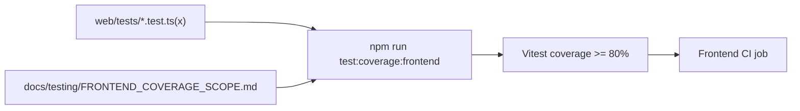

# Frontend Test Coverage Gate Implementation Plan

> **For agentic workers:** REQUIRED SUB-SKILL: Use superpowers:subagent-driven-development (recommended) or superpowers:executing-plans to implement this plan task-by-task. Steps use checkbox (`- [ ]`) syntax for tracking.

**Goal:** Add a truthful frontend `unit/component` coverage gate at `>=80%` for the teacher-first contest path, enforce it in CI, and document the explicit frontend omit list.

**Architecture:** Add `vitest` as the authoritative frontend coverage runner, keep Playwright as a separate audit layer, and gate only the current teacher-first contest path plus the shared presenters/helpers it uses. The implementation should first stabilize the runner and scope contract, then migrate/expand tests on the highest-value in-scope modules, and finally wire the exact same command into CI.

**Tech Stack:** Next.js 16, React 19, TypeScript 5, Vitest, Testing Library, jsdom, npm, GitHub Actions

---

### Task 1: Establish the frontend coverage runner and local command

**Files:**
- Modify: `web/package.json`
- Create: `web/vitest.config.ts`
- Create: `web/tests/setup-vitest.ts`
- Test: `web/tests/teacher-dashboard-copy.test.ts`

- [ ] **Step 1: Write the failing runner smoke test contract**

```ts
import { describe, expect, it } from "vitest";
import {
  formatConfidenceLabel,
  formatTeacherFacingLabel,
} from "../components/dashboard/dashboard-presenters";

describe("frontend vitest smoke contract", () => {
  it("can import in-scope dashboard presenters under vitest", () => {
    expect(formatConfidenceLabel("high")).toBe("Khá chắc chắn");
    expect(formatTeacherFacingLabel("acknowledged")).toBe("Đã ghi nhận");
  });
});
```

- [ ] **Step 2: Run the test command before adding Vitest support**

Run: `cd web && npm run test:coverage:frontend`  
Expected: FAIL with missing script or missing `vitest` binary/config.

- [ ] **Step 3: Add the minimal Vitest command and config**

```json
{
  "scripts": {
    "test:frontend": "vitest run",
    "test:coverage:frontend": "vitest run --coverage"
  },
  "devDependencies": {
    "@testing-library/react": "^16.3.0",
    "@testing-library/jest-dom": "^6.9.1",
    "jsdom": "^27.0.1",
    "@vitest/coverage-v8": "^3.2.4",
    "vitest": "^3.2.4"
  }
}
```

```ts
// web/vitest.config.ts
import { defineConfig } from "vitest/config";
import path from "node:path";

export default defineConfig({
  test: {
    environment: "jsdom",
    globals: true,
    setupFiles: ["./tests/setup-vitest.ts"],
    include: ["tests/**/*.test.ts", "tests/**/*.test.tsx"],
    coverage: {
      provider: "v8",
      reporter: ["text", "json-summary"],
      reportsDirectory: "./coverage",
      thresholds: {
        lines: 80,
        statements: 80,
        functions: 80,
        branches: 70,
      },
    },
  },
  resolve: {
    alias: {
      "@": path.resolve(__dirname, "."),
    },
  },
});
```

```ts
// web/tests/setup-vitest.ts
import "@testing-library/jest-dom/vitest";
```

- [ ] **Step 4: Migrate the presenter smoke test to Vitest format and verify it passes**

Run: `cd web && npx vitest run web/tests/teacher-dashboard-copy.test.ts`  
Expected: PASS with the migrated presenter assertions.

- [ ] **Step 5: Commit**

```bash
git add web/package.json web/vitest.config.ts web/tests/setup-vitest.ts web/tests/teacher-dashboard-copy.test.ts
git commit -m "test(frontend): add vitest coverage runner [T053-COVERAGE]"
```

### Task 2: Define the frontend denominator and omit-list contract

**Files:**
- Create: `docs/testing/FRONTEND_COVERAGE_SCOPE.md`
- Modify: `docs/superpowers/tasks/2026-05-02-frontend-test-coverage-gate.md`
- Test: `web/package.json`

- [ ] **Step 1: Write the failing scope expectation into the doc skeleton**

```md
# Frontend Coverage Scope

The authoritative frontend coverage gate for this repository is:

```bash
cd web && npm run test:coverage:frontend
```

This document is intentionally incomplete at this step and should still be missing the explicit in-scope teacher-first modules and omission rationale.
```
```

- [ ] **Step 2: Review the current frontend shell and enumerate the audited denominator**

Run: `find web/app web/components web/lib -maxdepth 3 -type f | sort`  
Expected: a concrete list that can be split into:
- `Knowledge`
- `Marketplace`
- `Dashboard`
- `Agents`
- `Playground`
- shared shell/presenter/client helpers used by those surfaces

- [ ] **Step 3: Replace the placeholder doc with the explicit in-scope and omitted contract**

```md
## In-Scope Frontend Surface

- `web/app/(utility)/knowledge/page.tsx`
- `web/app/(utility)/marketplace/page.tsx`
- `web/app/(workspace)/dashboard/page.tsx`
- `web/app/(workspace)/agents/page.tsx`
- `web/app/(workspace)/playground/page.tsx`
- `web/components/dashboard/**`
- `web/components/agents/**`
- `web/components/sidebar/**`
- `web/components/contest/**`
- selected `web/lib/**` helpers directly used by the above surfaces

## Explicitly Omitted Frontend Areas

- `web/app/(workspace)/guide/**`
- `web/app/(workspace)/co-writer/**`
- `web/app/(utility)/memory/**`
- `web/components/math-animator/**`
- `web/components/research/**`
- `web/components/visualize/**`
- notebook-only helpers not used on the teacher-first contest path

Reason: these are hidden, optional, dormant, or not part of the supported teacher-first contest flow being gated in this task.
```

- [ ] **Step 4: Update the task packet handoff note to reference the final scope document**

```md
- The implementation lane must keep `docs/testing/FRONTEND_COVERAGE_SCOPE.md` and the Vitest include/coverage contract in sync.
```

- [ ] **Step 5: Commit**

```bash
git add docs/testing/FRONTEND_COVERAGE_SCOPE.md docs/superpowers/tasks/2026-05-02-frontend-test-coverage-gate.md
git commit -m "docs(frontend): define coverage scope contract [T053-COVERAGE]"
```

### Task 3: Migrate existing in-scope frontend tests into real coverage-producing slices

**Files:**
- Modify: `web/tests/teacher-dashboard-copy.test.ts`
- Modify: `web/tests/teacher-dashboard-decision-flow.test.ts`
- Modify: `web/tests/class-tutor-pack-presenters.test.ts`
- Modify: `web/tests/contest-terminology.test.ts`
- Modify: `web/tests/sidebar-nav-groups.test.ts`
- Test: `web/components/dashboard/dashboard-presenters.ts`

- [ ] **Step 1: Convert a current `node:test` file to Vitest and keep the behavior assertions intact**

```ts
import { describe, expect, it } from "vitest";
import {
  buildDashboardPrioritySummary,
  formatConfidenceLabel,
} from "../components/dashboard/dashboard-presenters";

describe("dashboard presenters", () => {
  it("prefers recommendation rationale in the priority summary", () => {
    const summary = buildDashboardPrioritySummary({
      nextActionRationale: "Ưu tiên ôn lại phép biến đổi cơ bản trước khi giao bài mới.",
      focusTopic: "Phương trình bậc hai",
      masteredTopic: "Biểu đồ hàm số",
    });

    expect(summary.priorityBody).toBe(
      "Ưu tiên ôn lại phép biến đổi cơ bản trước khi giao bài mới.",
    );
    expect(formatConfidenceLabel("medium")).toBe("Tạm đủ cơ sở");
  });
});
```

- [ ] **Step 2: Run the migrated file and verify it fails only on import or assertion mismatches**

Run: `cd web && npx vitest run tests/teacher-dashboard-copy.test.ts`  
Expected: FAIL if any test syntax/import needs migration; otherwise PASS and move to the next file.

- [ ] **Step 3: Migrate the remaining in-scope helper/presenter tests without widening scope**

```ts
import { describe, expect, it } from "vitest";
import { buildWorkspaceNavGroups } from "../components/sidebar/nav-groups";

describe("sidebar nav groups", () => {
  it("keeps the contest-facing workspace groups in teacher-first order", () => {
    const groups = buildWorkspaceNavGroups({ pathname: "/dashboard" });
    expect(groups.map((group) => group.label)).toContain("Lớp học của tôi");
  });
});
```

- [ ] **Step 4: Run the focused migrated test set and keep only in-scope files green**

Run: `cd web && npx vitest run tests/teacher-dashboard-copy.test.ts tests/teacher-dashboard-decision-flow.test.ts tests/class-tutor-pack-presenters.test.ts tests/contest-terminology.test.ts tests/sidebar-nav-groups.test.ts`  
Expected: PASS with all migrated files producing real coverage.

- [ ] **Step 5: Commit**

```bash
git add web/tests/teacher-dashboard-copy.test.ts web/tests/teacher-dashboard-decision-flow.test.ts web/tests/class-tutor-pack-presenters.test.ts web/tests/contest-terminology.test.ts web/tests/sidebar-nav-groups.test.ts
git commit -m "test(frontend): migrate teacher-first helper coverage [T053-COVERAGE]"
```

### Task 4: Add route-shell and component behavior coverage for the teacher-first path

**Files:**
- Modify: `web/tests/knowledge-page-wizard-shell.test.ts`
- Create: `web/tests/marketplace-page-shell.test.ts`
- Create: `web/tests/dashboard-page-shell.test.ts`
- Create: `web/tests/agents-page-shell.test.ts`
- Create: `web/tests/playground-page-shell.test.ts`
- Test: `web/app/(utility)/knowledge/page.tsx`

- [ ] **Step 1: Replace static-source-only tests with bounded route-shell behavior checks where practical**

```ts
import { describe, expect, it } from "vitest";
import { readFileSync } from "node:fs";
import { resolve } from "node:path";

const KNOWLEDGE_PAGE_PATH = resolve(process.cwd(), "app/(utility)/knowledge/page.tsx");

describe("knowledge page shell invariants", () => {
  it("keeps the wizard stages and hides notebook/provider controls", () => {
    const source = readFileSync(KNOWLEDGE_PAGE_PATH, "utf8");
    expect(source).toContain("Thông tin");
    expect(source).toContain("Tài liệu");
    expect(source).not.toContain("selectedProvider");
  });
});
```

- [ ] **Step 2: Add one focused shell test per in-scope route with a behavior-bearing assertion**

```ts
import { describe, expect, it } from "vitest";
import { readFileSync } from "node:fs";
import { resolve } from "node:path";

describe("marketplace page shell", () => {
  it("keeps the teacher-first import and search surfaces visible", () => {
    const source = readFileSync(resolve(process.cwd(), "app/(utility)/marketplace/page.tsx"), "utf8");
    expect(source).toContain("Marketplace");
    expect(source).toMatch(/import/i);
  });
});
```

- [ ] **Step 3: Add/expand tests for dashboard, agents, and playground shell seams that encode the current supported path**

```ts
describe("agents page shell", () => {
  it("keeps the tutor setup path inside the teacher-first workspace", () => {
    const source = readFileSync(resolve(process.cwd(), "app/(workspace)/agents/page.tsx"), "utf8");
    expect(source).toContain("Gia sư");
  });
});
```

- [ ] **Step 4: Run the route-shell coverage slice and inspect the coverage report**

Run: `cd web && npx vitest run tests/knowledge-page-wizard-shell.test.ts tests/marketplace-page-shell.test.ts tests/dashboard-page-shell.test.ts tests/agents-page-shell.test.ts tests/playground-page-shell.test.ts --coverage`  
Expected: PASS and visible coverage growth on the in-scope route files.

- [ ] **Step 5: Commit**

```bash
git add web/tests/knowledge-page-wizard-shell.test.ts web/tests/marketplace-page-shell.test.ts web/tests/dashboard-page-shell.test.ts web/tests/agents-page-shell.test.ts web/tests/playground-page-shell.test.ts
git commit -m "test(frontend): cover teacher-first route shells [T053-COVERAGE]"
```

### Task 5: Close the coverage gap with bounded logic fixes and full frontend gate wiring

**Files:**
- Modify: `web/package.json`
- Modify: `.github/workflows/tests.yml`
- Create: `web/scripts/run_frontend_coverage_gate.mjs`
- Modify: selected `web/**/*.ts` and `web/**/*.tsx` only if truthful test authoring exposes logic defects
- Test: `docs/testing/FRONTEND_COVERAGE_SCOPE.md`

- [ ] **Step 1: Add one authoritative frontend gate script that CI and local development both use**

```js
// web/scripts/run_frontend_coverage_gate.mjs
import { spawnSync } from "node:child_process";

const result = spawnSync(
  "npx",
  ["vitest", "run", "--coverage"],
  { stdio: "inherit", shell: true },
);

if (result.status !== 0) {
  process.exit(result.status ?? 1);
}
```

```json
{
  "scripts": {
    "test:coverage:frontend": "node ./scripts/run_frontend_coverage_gate.mjs"
  }
}
```

- [ ] **Step 2: Run the full gate before CI wiring and inspect which in-scope files still drag the percentage below 80**

Run: `cd web && npm run test:coverage:frontend`  
Expected: either PASS at `>=80%` or FAIL with a concrete list of remaining in-scope gaps.

- [ ] **Step 3: Add the smallest truthful tests or bounded frontend logic fixes needed to cross the threshold**

```ts
describe("playground config", () => {
  it("filters frontend-hidden tools from capability tool lists", () => {
    expect(filterFrontendTools(["rag", "geogebra_analysis", "reason"])).toEqual([
      "rag",
      "reason",
    ]);
  });
});
```

```ts
export function filterFrontendTools(tools: string[]): string[] {
  return tools.filter((tool) => !FRONTEND_HIDDEN_TOOLS.has(tool));
}
```

- [ ] **Step 4: Wire CI to the same command and keep `next build` as a separate frontend validation step**

```yaml
- name: Run frontend coverage gate
  working-directory: web
  run: npm run test:coverage:frontend

- name: Build frontend
  working-directory: web
  env:
    NEXT_PUBLIC_API_BASE: http://localhost:8001
  run: npm run build
```

- [ ] **Step 5: Commit**

```bash
git add web/package.json web/scripts/run_frontend_coverage_gate.mjs .github/workflows/tests.yml web/tests docs/testing/FRONTEND_COVERAGE_SCOPE.md
git commit -m "test(frontend): enforce coverage gate [T053-COVERAGE]"
```

### Task 6: Final verification, control-plane updates, and PR handoff

**Files:**
- Modify: `ai_first/daily/2026-05-02.md`
- Modify: `ai_first/ACTIVE_ASSIGNMENTS.md`
- Create: `docs/superpowers/pr-notes/2026-05-02-t053-frontend-coverage-gate.md`
- Test: `web/package.json`

- [ ] **Step 1: Run the authoritative verification commands and record the exact result**

Run: `cd web && npm run test:coverage:frontend`  
Expected: PASS with `>=80%` in-scope frontend coverage.

Run: `cd web && npm run build`  
Expected: PASS with production build success.

Run: `git diff --check`  
Expected: no output.

- [ ] **Step 2: Write the required PR note with Mermaid and state whether the main system map changed**

```md
# PR Note: T053 Frontend Coverage Gate

## Summary

- add one authoritative frontend coverage gate
- keep Playwright outside the denominator
- document the teacher-first in-scope frontend surface

## Mermaid


```

- [ ] **Step 3: Update the daily log and active-assignment board to reflect implementation status**

```md
- Done: wired frontend coverage gate through Vitest and CI.
- Tests: `cd web && npm run test:coverage:frontend`; `cd web && npm run build`; `git diff --check`
```

- [ ] **Step 4: Open the PR as Draft, move it to Ready after self-review, and wait for CI before merge**

Run: `gh pr create --draft ...`  
Expected: Draft PR URL returned.

Run: `gh pr ready <number>`  
Expected: PR marked ready for review after local verification.

- [ ] **Step 5: Commit any final control-plane updates**

```bash
git add ai_first/daily/2026-05-02.md ai_first/ACTIVE_ASSIGNMENTS.md docs/superpowers/pr-notes/2026-05-02-t053-frontend-coverage-gate.md
git commit -m "docs(frontend): record coverage gate handoff [T053-COVERAGE]"
```
