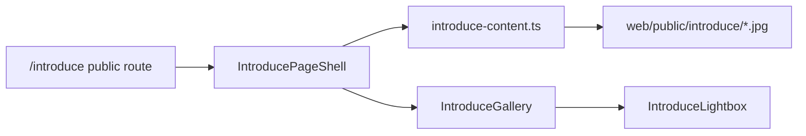

# Public Introduce Docs Page Implementation Plan

> **For agentic workers:** REQUIRED SUB-SKILL: Use superpowers:subagent-driven-development (recommended) or superpowers:executing-plans to implement this plan task-by-task. Steps use checkbox (`- [ ]`) syntax for tracking.

**Goal:** Build a standalone public `/introduce` docs route with a fixed left sidebar, bilingual structured content, a real screenshot gallery with click-to-enlarge behavior, and a judge-first product overview outside the internal app shells.

**Architecture:** Keep `/introduce` as a shell-independent route under `web/app/introduce/page.tsx`. Put long-form bilingual content and screenshot metadata in one route-local content module, build introduce-only UI components under `web/components/introduce/`, and serve the seven approved screenshots from `web/public/introduce/` because the current Next app does not allow direct image imports from the repo-root `assets/` directory.

**Tech Stack:** Next.js App Router, React 19, TypeScript, Tailwind CSS, Testing Library, Vitest

---

## File Structure

- Create: `web/app/introduce/page.tsx`
- Create: `web/components/introduce/introduce-content.ts`
- Create: `web/components/introduce/IntroducePageShell.tsx`
- Create: `web/components/introduce/IntroduceSidebar.tsx`
- Create: `web/components/introduce/IntroduceHero.tsx`
- Create: `web/components/introduce/IntroduceCoreLoop.tsx`
- Create: `web/components/introduce/IntroduceGallery.tsx`
- Create: `web/components/introduce/IntroduceLightbox.tsx`
- Create: `web/components/introduce/IntroduceSection.tsx`
- Create: `web/tests/introduce-content.test.ts`
- Create: `web/tests/introduce-gallery.test.tsx`
- Create: `web/tests/introduce-page-source.test.ts`
- Create: `web/public/introduce/anh1_goi_kien_thuc.jpg`
- Create: `web/public/introduce/anh2_bang_dieu_khien_giao_vien.jpg`
- Create: `web/public/introduce/anh3_gia_su.jpg`
- Create: `web/public/introduce/anh4_thi_truong.jpg`
- Create: `web/public/introduce/anh5_tro_chuyen.jpg`
- Create: `web/public/introduce/anh6_bo_nho.jpg`
- Create: `web/public/introduce/anh7_cai_dat.jpg`
- Modify: `web/vitest.config.ts`
- Modify: `ai_first/ACTIVE_ASSIGNMENTS.md`
- Modify: `ai_first/daily/2026-05-02.md`
- Create: `docs/superpowers/pr-notes/2026-05-02-introduce-public-docs-page.md`
- Modify if required: `ai_first/architecture/MAIN_SYSTEM_MAP.md`

### Task 1: Open The Runtime Lane Safely

**Files:**
- Modify: `ai_first/ACTIVE_ASSIGNMENTS.md`
- Modify: `ai_first/daily/2026-05-02.md`

- [ ] **Step 1: Resolve the current ownership conflict before touching `web/**`**

Read `ai_first/ACTIVE_ASSIGNMENTS.md` and confirm the current `fix/frontend-test-coverage-gate` lane still owns `web/**`.

Expected outcome:

- either that lane has merged/closed and ownership is gone, or
- the human explicitly reassigns the `/introduce` scope before runtime code starts

- [ ] **Step 2: Create the dedicated runtime worktree**

Run:

```bash
git fetch origin main
git worktree add .worktrees/fix-introduce-public-docs-page -b fix/introduce-public-docs-page origin/main
```

Expected:

- a clean dedicated worktree at `.worktrees/fix-introduce-public-docs-page`
- branch `fix/introduce-public-docs-page` created from `origin/main`

- [ ] **Step 3: Record the live assignment before code starts**

Append a new live assignment in `ai_first/ACTIVE_ASSIGNMENTS.md` with this exact shape:

```md
### Assignment

- Owner: Codex session
- Machine: local desktop
- Worktree: `/Users/nguyenhuuloc/Documents/Multiagent-learning-platform/.worktrees/fix-introduce-public-docs-page`
- Task: Build a standalone public `/introduce` docs route with a fixed sidebar, bilingual content, and screenshot gallery
- Status: implementing
- Branch: `fix/introduce-public-docs-page`
- Task packet: `docs/superpowers/tasks/2026-05-02-introduce-public-docs-page.md`
- Owned files: `web/app/introduce/**`, `web/components/introduce/**`, `web/public/introduce/**`, `web/tests/introduce-*.test.ts*`, `web/vitest.config.ts`, `ai_first/ACTIVE_ASSIGNMENTS.md`, `ai_first/daily/2026-05-02.md`, `docs/superpowers/pr-notes/2026-05-02-introduce-public-docs-page.md`, `ai_first/architecture/MAIN_SYSTEM_MAP.md` only if the new route materially changes the documented product surface
- PR: uncreated
- Last update: 2026-05-02
- Next action: stage screenshot assets and route-local content before assembling the public docs page
- Blocker: none
```

- [ ] **Step 4: Record the lane start in the daily log**

Append this entry to `ai_first/daily/2026-05-02.md`:

```md
## UI_PUBLIC_INTRODUCE_DOCS_PAGE Implementation

- Branch: `fix/introduce-public-docs-page`
- Task: `UI_PUBLIC_INTRODUCE_DOCS_PAGE`
- Done: Opened the dedicated runtime worktree and recorded the live assignment for the standalone `/introduce` docs route.
- Tests: `git worktree list`; `git status --short --branch`
```

- [ ] **Step 5: Verify the lane starts cleanly**

Run:

```bash
git -C .worktrees/fix-introduce-public-docs-page status --short --branch
git worktree list
```

Expected:

- the new worktree is listed
- the runtime lane starts from a clean checkout

### Task 2: Stage Public Screenshot Assets And Structured Content

**Files:**
- Create: `web/public/introduce/anh1_goi_kien_thuc.jpg`
- Create: `web/public/introduce/anh2_bang_dieu_khien_giao_vien.jpg`
- Create: `web/public/introduce/anh3_gia_su.jpg`
- Create: `web/public/introduce/anh4_thi_truong.jpg`
- Create: `web/public/introduce/anh5_tro_chuyen.jpg`
- Create: `web/public/introduce/anh6_bo_nho.jpg`
- Create: `web/public/introduce/anh7_cai_dat.jpg`
- Create: `web/components/introduce/introduce-content.ts`
- Create: `web/tests/introduce-content.test.ts`
- Modify: `web/vitest.config.ts`

- [ ] **Step 1: Write the failing content test**

Create `web/tests/introduce-content.test.ts`:

```ts
import { describe, expect, it } from "vitest";
import {
  INTRODUCE_GALLERY_ITEMS,
  INTRODUCE_SECTIONS,
  INTRODUCE_QUICK_FACTS,
} from "../components/introduce/introduce-content";

describe("introduce content", () => {
  it("keeps the seven approved screenshots in the expected order", () => {
    expect(INTRODUCE_GALLERY_ITEMS.map((item) => item.src)).toEqual([
      "/introduce/anh1_goi_kien_thuc.jpg",
      "/introduce/anh2_bang_dieu_khien_giao_vien.jpg",
      "/introduce/anh3_gia_su.jpg",
      "/introduce/anh4_thi_truong.jpg",
      "/introduce/anh5_tro_chuyen.jpg",
      "/introduce/anh6_bo_nho.jpg",
      "/introduce/anh7_cai_dat.jpg",
    ]);
  });

  it("keeps the page sections aligned with the approved docs sitemap", () => {
    expect(INTRODUCE_SECTIONS.map((section) => section.id)).toEqual([
      "overview",
      "core-loop",
      "evidence-gallery",
      "for-educators",
      "technical-documentation",
      "faq",
      "resources",
    ]);
  });

  it("keeps the quick facts bounded to honest prototype claims", () => {
    expect(INTRODUCE_QUICK_FACTS.some((fact) => /prototype/i.test(fact.vi))).toBe(true);
    expect(INTRODUCE_QUICK_FACTS.some((fact) => /Giáo dục/.test(fact.vi))).toBe(true);
  });
});
```

- [ ] **Step 2: Register the new tests in Vitest**

Modify `web/vitest.config.ts`:

```ts
include: [
  "tests/api-base-url.test.ts",
  "tests/class-tutor-pack-presenters.test.ts",
  "tests/introduce-content.test.ts",
  "tests/introduce-gallery.test.tsx",
  "tests/introduce-page-source.test.ts",
  "tests/knowledge-page-wizard-shell.test.ts",
  "tests/markdown-display.test.ts",
  "tests/playground-trace.test.ts",
  "tests/sidebar-nav-groups.test.ts",
  "tests/teacher-cockpit-content.test.ts",
  "tests/teacher-dashboard-copy.test.ts",
  "tests/teacher-dashboard-decision-flow.test.ts",
],
```

- [ ] **Step 3: Run the content test and confirm it fails**

Run:

```bash
cd web && npx vitest run tests/introduce-content.test.ts
```

Expected:

- FAIL because `components/introduce/introduce-content.ts` does not exist yet

- [ ] **Step 4: Copy the approved screenshots into `web/public/introduce/`**

Run:

```bash
mkdir -p web/public/introduce
cp assets/anh1_goi_kien_thuc.jpg web/public/introduce/anh1_goi_kien_thuc.jpg
cp assets/anh2_bang_dieu_khien_giao_vien.jpg web/public/introduce/anh2_bang_dieu_khien_giao_vien.jpg
cp assets/anh3_gia_su.jpg web/public/introduce/anh3_gia_su.jpg
cp assets/anh4_thi_truong.jpg web/public/introduce/anh4_thi_truong.jpg
cp assets/anh5_tro_chuyen.jpg web/public/introduce/anh5_tro_chuyen.jpg
cp assets/anh6_bo_nho.jpg web/public/introduce/anh6_bo_nho.jpg
cp assets/anh7_cai_dat.jpg web/public/introduce/anh7_cai_dat.jpg
```

- [ ] **Step 5: Write the structured content module**

Create `web/components/introduce/introduce-content.ts`:

```ts
export interface IntroduceQuickFact {
  labelVi: string;
  labelEn: string;
  vi: string;
  en: string;
}

export interface IntroduceSectionLink {
  id: string;
  labelVi: string;
  labelEn: string;
}

export interface IntroduceGalleryItem {
  id: string;
  src: string;
  titleVi: string;
  titleEn: string;
  captionVi: string;
  captionEn: string;
  tagVi: string;
  tagEn: string;
}

export const INTRODUCE_SECTIONS: IntroduceSectionLink[] = [
  { id: "overview", labelVi: "Tổng quan", labelEn: "Overview" },
  { id: "core-loop", labelVi: "Luồng sản phẩm", labelEn: "Core Loop" },
  { id: "evidence-gallery", labelVi: "Hình ảnh thực tế", labelEn: "Evidence Gallery" },
  { id: "for-educators", labelVi: "Dành cho người dùng không chuyên kỹ thuật", labelEn: "For Educators" },
  { id: "technical-documentation", labelVi: "Tài liệu kỹ thuật", labelEn: "Technical Documentation" },
  { id: "faq", labelVi: "Câu hỏi thường gặp", labelEn: "FAQ" },
  { id: "resources", labelVi: "Tài nguyên", labelEn: "Resources" },
];

export const INTRODUCE_QUICK_FACTS: IntroduceQuickFact[] = [
  {
    labelVi: "Giai đoạn hiện tại",
    labelEn: "Current stage",
    vi: "Prototype/demo đã có minh chứng chạy thử",
    en: "Validated prototype/demo with working proof",
  },
  {
    labelVi: "Lĩnh vực",
    labelEn: "Field",
    vi: "Giáo dục",
    en: "Education",
  },
  {
    labelVi: "Định vị sản phẩm",
    labelEn: "Product framing",
    vi: "Gia sư học tập thích ứng do giáo viên kiểm soát",
    en: "Teacher-controlled adaptive tutoring",
  },
];

export const INTRODUCE_GALLERY_ITEMS: IntroduceGalleryItem[] = [
  {
    id: "knowledge-pack",
    src: "/introduce/anh1_goi_kien_thuc.jpg",
    titleVi: "Gói kiến thức",
    titleEn: "Knowledge Pack",
    captionVi: "Giáo viên tạo bối cảnh học tập tin cậy từ học liệu của mình.",
    captionEn: "Teachers establish trusted learning context from their own materials.",
    tagVi: "Thiết lập giáo viên",
    tagEn: "Teacher setup",
  },
  {
    id: "teacher-dashboard",
    src: "/introduce/anh2_bang_dieu_khien_giao_vien.jpg",
    titleVi: "Bảng điều khiển giáo viên",
    titleEn: "Teacher dashboard",
    captionVi: "Giáo viên xem tín hiệu học tập và quyết định bước can thiệp tiếp theo.",
    captionEn: "Teachers review learning signals and choose the next intervention.",
    tagVi: "Bằng chứng",
    tagEn: "Evidence",
  },
  {
    id: "tutor",
    src: "/introduce/anh3_gia_su.jpg",
    titleVi: "Gia sư AI",
    titleEn: "AI tutor",
    captionVi: "Học sinh tiếp tục hỏi đáp trên cùng ngữ cảnh học tập.",
    captionEn: "Students continue guided Q&A in the same learning context.",
    tagVi: "Học tập",
    tagEn: "Learning",
  },
  {
    id: "marketplace",
    src: "/introduce/anh4_thi_truong.jpg",
    titleVi: "Thị trường gói kiến thức",
    titleEn: "Knowledge marketplace",
    captionVi: "Giáo viên duyệt, xem trước và nhập các gói kiến thức dùng lại.",
    captionEn: "Teachers browse, preview, and import reusable knowledge packs.",
    tagVi: "Tái sử dụng",
    tagEn: "Reuse",
  },
  {
    id: "chat-workspace",
    src: "/introduce/anh5_tro_chuyen.jpg",
    titleVi: "Không gian trò chuyện",
    titleEn: "Chat workspace",
    captionVi: "Không gian hỗ trợ hỏi đáp và theo dõi trao đổi học tập.",
    captionEn: "A guided workspace for tutoring dialogue and follow-up.",
    tagVi: "Tương tác",
    tagEn: "Interaction",
  },
  {
    id: "memory-surface",
    src: "/introduce/anh6_bo_nho.jpg",
    titleVi: "Bề mặt bộ nhớ",
    titleEn: "Memory surface",
    captionVi: "Bề mặt mở rộng cho việc theo dõi và lưu dấu ngữ cảnh học tập.",
    captionEn: "An extended surface for preserving and inspecting learning context.",
    tagVi: "Bổ trợ",
    tagEn: "Support",
  },
  {
    id: "settings",
    src: "/introduce/anh7_cai_dat.jpg",
    titleVi: "Cài đặt hệ thống",
    titleEn: "System settings",
    captionVi: "Không gian cấu hình phục vụ vận hành và triển khai kỹ thuật.",
    captionEn: "Configuration space for technical setup and deployment.",
    tagVi: "Kỹ thuật",
    tagEn: "Technical",
  },
];
```

- [ ] **Step 6: Run the content test and verify it passes**

Run:

```bash
cd web && npx vitest run tests/introduce-content.test.ts
```

Expected:

- PASS

- [ ] **Step 7: Commit the asset and content foundation**

Run:

```bash
git add web/public/introduce web/components/introduce/introduce-content.ts web/tests/introduce-content.test.ts web/vitest.config.ts ai_first/ACTIVE_ASSIGNMENTS.md ai_first/daily/2026-05-02.md
git commit -m "feat(introduce): stage public docs assets and content [UI_PUBLIC_INTRODUCE_DOCS_PAGE]"
```

### Task 3: Build The Public Route Shell And Judge-First Docs Structure

**Files:**
- Create: `web/app/introduce/page.tsx`
- Create: `web/components/introduce/IntroducePageShell.tsx`
- Create: `web/components/introduce/IntroduceSidebar.tsx`
- Create: `web/components/introduce/IntroduceHero.tsx`
- Create: `web/components/introduce/IntroduceCoreLoop.tsx`
- Create: `web/components/introduce/IntroduceSection.tsx`
- Create: `web/tests/introduce-page-source.test.ts`

- [ ] **Step 1: Write the failing route-structure test**

Create `web/tests/introduce-page-source.test.ts`:

```ts
import { readFileSync } from "node:fs";
import { resolve } from "node:path";
import { describe, expect, it } from "vitest";

const INTRODUCE_PAGE_PATH = resolve(process.cwd(), "app/introduce/page.tsx");

function readIntroducePage(): string {
  return readFileSync(INTRODUCE_PAGE_PATH, "utf8");
}

describe("introduce page source", () => {
  it("stays outside the workspace and utility shells", () => {
    const source = readIntroducePage();

    expect(source).not.toMatch(/WorkspaceSidebar/);
    expect(source).not.toMatch(/UtilitySidebar/);
    expect(source).not.toMatch(/UnifiedChatProvider/);
  });

  it("renders the approved docs sections and screenshot gallery entry", () => {
    const source = readIntroducePage();

    expect(source).toMatch(/overview/);
    expect(source).toMatch(/core-loop/);
    expect(source).toMatch(/evidence-gallery/);
    expect(source).toMatch(/technical-documentation/);
    expect(source).toMatch(/IntroduceGallery/);
  });
});
```

- [ ] **Step 2: Run the route-structure test and confirm it fails**

Run:

```bash
cd web && npx vitest run tests/introduce-page-source.test.ts
```

Expected:

- FAIL because `app/introduce/page.tsx` does not exist yet

- [ ] **Step 3: Write the route page entry**

Create `web/app/introduce/page.tsx`:

```tsx
import type { Metadata } from "next";
import { IntroducePageShell } from "@/components/introduce/IntroducePageShell";

export const metadata: Metadata = {
  title: "Introduce | Multiagent Learning Platform",
  description:
    "Public overview, usage guide, and technical documentation for the contest-ready education prototype.",
};

export default function IntroducePage() {
  return <IntroducePageShell />;
}
```

- [ ] **Step 4: Write the reusable section wrapper**

Create `web/components/introduce/IntroduceSection.tsx`:

```tsx
interface IntroduceSectionProps {
  id: string;
  eyebrow?: string;
  title: string;
  subtitle?: string;
  children: React.ReactNode;
}

export function IntroduceSection({
  id,
  eyebrow,
  title,
  subtitle,
  children,
}: IntroduceSectionProps) {
  return (
    <section id={id} className="scroll-mt-24 border-b border-[var(--border)] pb-12 last:border-b-0">
      <div className="max-w-[860px]">
        {eyebrow ? (
          <p className="text-[12px] font-semibold uppercase tracking-[0.14em] text-[var(--muted-foreground)]">
            {eyebrow}
          </p>
        ) : null}
        <h2 className="mt-2 text-[32px] font-semibold tracking-tight text-[var(--foreground)]">
          {title}
        </h2>
        {subtitle ? (
          <p className="mt-3 max-w-[720px] text-[15px] leading-7 text-[var(--muted-foreground)]">
            {subtitle}
          </p>
        ) : null}
        <div className="mt-8">{children}</div>
      </div>
    </section>
  );
}
```

- [ ] **Step 5: Write the sidebar and hero components**

Create `web/components/introduce/IntroduceSidebar.tsx`:

```tsx
import { INTRODUCE_SECTIONS } from "@/components/introduce/introduce-content";

export function IntroduceSidebar() {
  return (
    <aside className="sticky top-0 hidden h-screen w-[280px] shrink-0 border-r border-[var(--border)] bg-[var(--card)]/80 px-6 py-8 backdrop-blur md:block">
      <div className="space-y-6">
        <div>
          <p className="text-[12px] font-semibold uppercase tracking-[0.14em] text-[var(--muted-foreground)]">
            Multiagent Learning Platform
          </p>
          <h1 className="mt-2 text-[20px] font-semibold tracking-tight text-[var(--foreground)]">
            Introduce
          </h1>
        </div>
        <nav className="space-y-2">
          {INTRODUCE_SECTIONS.map((section) => (
            <a
              key={section.id}
              href={`#${section.id}`}
              className="block rounded-lg px-3 py-2 text-[13px] text-[var(--muted-foreground)] transition hover:bg-[var(--secondary)] hover:text-[var(--foreground)]"
            >
              <div className="font-medium text-[var(--foreground)]">{section.labelVi}</div>
              <div className="mt-0.5 text-[12px]">{section.labelEn}</div>
            </a>
          ))}
        </nav>
      </div>
    </aside>
  );
}
```

Create `web/components/introduce/IntroduceHero.tsx`:

```tsx
import Image from "next/image";
import { INTRODUCE_QUICK_FACTS } from "@/components/introduce/introduce-content";

export function IntroduceHero() {
  return (
    <section className="grid gap-8 rounded-[28px] border border-[var(--border)] bg-[var(--card)] p-6 md:grid-cols-[1.15fr_0.85fr] md:p-8">
      <div>
        <p className="text-[12px] font-semibold uppercase tracking-[0.14em] text-[var(--muted-foreground)]">
          Education prototype / Nguyên mẫu giáo dục
        </p>
        <h1 className="mt-3 text-[40px] font-semibold leading-[1.08] tracking-tight text-[var(--foreground)]">
          Nền tảng gia sư học tập thích ứng do giáo viên kiểm soát
        </h1>
        <p className="mt-4 max-w-[680px] text-[16px] leading-8 text-[var(--muted-foreground)]">
          A teacher-controlled adaptive tutoring platform that turns classroom materials into grounded assessment, tutoring, diagnosis review, and follow-up intervention.
        </p>
        <div className="mt-6 grid gap-3 sm:grid-cols-3">
          {INTRODUCE_QUICK_FACTS.map((fact) => (
            <div key={fact.labelEn} className="rounded-2xl border border-[var(--border)] bg-[var(--background)] px-4 py-4">
              <div className="text-[11px] font-semibold uppercase tracking-[0.12em] text-[var(--muted-foreground)]">
                {fact.labelVi}
              </div>
              <div className="mt-2 text-[14px] font-medium text-[var(--foreground)]">{fact.vi}</div>
              <div className="mt-1 text-[13px] leading-6 text-[var(--muted-foreground)]">{fact.en}</div>
            </div>
          ))}
        </div>
      </div>
      <div className="overflow-hidden rounded-[24px] border border-[var(--border)] bg-[var(--background)]">
        <Image
          src="/introduce/anh1_goi_kien_thuc.jpg"
          alt="Knowledge Pack screen"
          width={1600}
          height={1000}
          className="h-full w-full object-cover"
          priority
        />
      </div>
    </section>
  );
}
```

- [ ] **Step 6: Write the core-loop component and page shell**

Create `web/components/introduce/IntroduceCoreLoop.tsx`:

```tsx
const LOOP_ITEMS = [
  {
    step: "01",
    vi: "Gói kiến thức",
    en: "Knowledge Pack",
    copy: "Giáo viên chốt nguồn tri thức và bối cảnh lớp học.",
  },
  {
    step: "02",
    vi: "Bài đánh giá",
    en: "Assessment",
    copy: "Hệ thống tạo bài đánh giá từ chính gói kiến thức đó.",
  },
  {
    step: "03",
    vi: "Gia sư",
    en: "Tutor",
    copy: "Học sinh tiếp tục hỏi đáp trong cùng ngữ cảnh học tập.",
  },
  {
    step: "04",
    vi: "Chẩn đoán",
    en: "Diagnosis",
    copy: "Tín hiệu học tập được tổng hợp để giáo viên xem xét.",
  },
  {
    step: "05",
    vi: "Can thiệp",
    en: "Intervention",
    copy: "Giáo viên quyết định bước hỗ trợ tiếp theo.",
  },
];

export function IntroduceCoreLoop() {
  return (
    <div className="grid gap-4 lg:grid-cols-5">
      {LOOP_ITEMS.map((item) => (
        <div key={item.step} className="rounded-2xl border border-[var(--border)] bg-[var(--background)] px-4 py-4">
          <div className="text-[11px] font-semibold uppercase tracking-[0.12em] text-[var(--muted-foreground)]">
            {item.step}
          </div>
          <div className="mt-2 text-[15px] font-semibold text-[var(--foreground)]">{item.vi}</div>
          <div className="text-[13px] text-[var(--muted-foreground)]">{item.en}</div>
          <p className="mt-3 text-[13px] leading-6 text-[var(--muted-foreground)]">{item.copy}</p>
        </div>
      ))}
    </div>
  );
}
```

Create `web/components/introduce/IntroducePageShell.tsx` with these required elements:

```tsx
import { IntroduceSidebar } from "@/components/introduce/IntroduceSidebar";
import { IntroduceHero } from "@/components/introduce/IntroduceHero";
import { IntroduceCoreLoop } from "@/components/introduce/IntroduceCoreLoop";
import { IntroduceGallery } from "@/components/introduce/IntroduceGallery";
import { IntroduceSection } from "@/components/introduce/IntroduceSection";

export function IntroducePageShell() {
  return (
    <main className="min-h-screen bg-[var(--background)] text-[var(--foreground)]">
      <div className="mx-auto flex max-w-[1600px]">
        <IntroduceSidebar />
        <div className="min-w-0 flex-1 px-5 py-6 md:px-10 md:py-8">
          <div className="space-y-14">
            <IntroduceHero />
            <IntroduceSection
              id="overview"
              eyebrow="Overview / Tổng quan"
              title="Một nền tảng học tập thích ứng bám sát cách giáo viên đang dạy"
              subtitle="A contest-ready overview for judges, partners, and operators."
            >
              <div className="max-w-[760px] space-y-4 text-[15px] leading-7 text-[var(--muted-foreground)]">
                <p>Multiagent Learning Platform helps teachers turn their own materials into reusable Knowledge Packs, AI-generated assessments, grounded tutoring, diagnosis review, and teacher-directed intervention.</p>
                <p>Nền tảng giúp giáo viên dùng chính học liệu của mình để tạo gói kiến thức, tạo bài đánh giá, hỗ trợ học sinh hỏi đáp, xem tín hiệu chẩn đoán và quyết định bước can thiệp tiếp theo.</p>
              </div>
            </IntroduceSection>
            <IntroduceSection
              id="core-loop"
              eyebrow="Core Loop / Luồng sản phẩm"
              title="Knowledge Pack -> Assessment -> Tutor -> Diagnosis -> Intervention"
              subtitle="One bounded classroom loop, kept under teacher control."
            >
              <IntroduceCoreLoop />
            </IntroduceSection>
            <IntroduceGallery />
          </div>
        </div>
      </div>
    </main>
  );
}
```

- [ ] **Step 7: Run the route-structure test and verify it passes**

Run:

```bash
cd web && npx vitest run tests/introduce-page-source.test.ts
```

Expected:

- PASS

- [ ] **Step 8: Commit the route shell**

Run:

```bash
git add web/app/introduce/page.tsx web/components/introduce/IntroducePageShell.tsx web/components/introduce/IntroduceSidebar.tsx web/components/introduce/IntroduceHero.tsx web/components/introduce/IntroduceCoreLoop.tsx web/components/introduce/IntroduceSection.tsx web/tests/introduce-page-source.test.ts web/vitest.config.ts
git commit -m "feat(introduce): add public docs route shell [UI_PUBLIC_INTRODUCE_DOCS_PAGE]"
```

### Task 4: Build The Screenshot Gallery And Lightbox Interaction

**Files:**
- Create: `web/components/introduce/IntroduceGallery.tsx`
- Create: `web/components/introduce/IntroduceLightbox.tsx`
- Create: `web/tests/introduce-gallery.test.tsx`

- [ ] **Step 1: Write the failing gallery interaction test**

Create `web/tests/introduce-gallery.test.tsx`:

```tsx
import { fireEvent, render, screen } from "@testing-library/react";
import { describe, expect, it, vi } from "vitest";
import { IntroduceGallery } from "../components/introduce/IntroduceGallery";

vi.mock("next/image", () => ({
  default: (props: React.ImgHTMLAttributes<HTMLImageElement>) => ,
}));

describe("introduce gallery", () => {
  it("opens a lightbox when a screenshot card is clicked and closes it again", () => {
    render(<IntroduceGallery />);

    fireEvent.click(screen.getByRole("button", { name: /Gói kiến thức/i }));

    expect(screen.getByRole("dialog")).toBeInTheDocument();
    expect(screen.getByText(/Giáo viên tạo bối cảnh học tập tin cậy/i)).toBeInTheDocument();

    fireEvent.click(screen.getByRole("button", { name: /Close preview/i }));

    expect(screen.queryByRole("dialog")).not.toBeInTheDocument();
  });
});
```

- [ ] **Step 2: Run the gallery test and confirm it fails**

Run:

```bash
cd web && npx vitest run tests/introduce-gallery.test.tsx
```

Expected:

- FAIL because `IntroduceGallery` does not exist yet

- [ ] **Step 3: Write the lightbox component**

Create `web/components/introduce/IntroduceLightbox.tsx`:

```tsx
import Image from "next/image";
import type { IntroduceGalleryItem } from "@/components/introduce/introduce-content";

interface IntroduceLightboxProps {
  item: IntroduceGalleryItem | null;
  onClose: () => void;
}

export function IntroduceLightbox({ item, onClose }: IntroduceLightboxProps) {
  if (!item) {
    return null;
  }

  return (
    <div className="fixed inset-0 z-50 flex items-center justify-center bg-black/70 px-4 py-6" onClick={onClose}>
      <div
        role="dialog"
        aria-modal="true"
        className="max-h-[92vh] w-full max-w-[1200px] overflow-hidden rounded-[28px] border border-white/10 bg-[var(--card)] shadow-2xl"
        onClick={(event) => event.stopPropagation()}
      >
        <div className="flex items-center justify-between border-b border-[var(--border)] px-5 py-4">
          <div>
            <div className="text-[16px] font-semibold text-[var(--foreground)]">{item.titleVi}</div>
            <div className="text-[13px] text-[var(--muted-foreground)]">{item.titleEn}</div>
          </div>
          <button
            type="button"
            onClick={onClose}
            aria-label="Close preview"
            className="rounded-lg border border-[var(--border)] px-3 py-2 text-[13px] text-[var(--foreground)] hover:bg-[var(--secondary)]"
          >
            Close preview
          </button>
        </div>
        <div className="grid gap-0 lg:grid-cols-[1.3fr_0.7fr]">
          <div className="bg-[#f3f1ed]">
            <Image src={item.src} alt={item.titleEn} width={1600} height={1000} className="h-full w-full object-contain" />
          </div>
          <div className="space-y-4 px-5 py-5">
            <div className="inline-flex rounded-full border border-[var(--border)] px-3 py-1 text-[11px] font-medium text-[var(--muted-foreground)]">
              {item.tagVi} / {item.tagEn}
            </div>
            <p className="text-[15px] leading-7 text-[var(--foreground)]">{item.captionVi}</p>
            <p className="text-[14px] leading-7 text-[var(--muted-foreground)]">{item.captionEn}</p>
          </div>
        </div>
      </div>
    </div>
  );
}
```

- [ ] **Step 4: Write the gallery component**

Create `web/components/introduce/IntroduceGallery.tsx`:

```tsx
"use client";

import Image from "next/image";
import { useState } from "react";
import {
  INTRODUCE_GALLERY_ITEMS,
  type IntroduceGalleryItem,
} from "@/components/introduce/introduce-content";
import { IntroduceLightbox } from "@/components/introduce/IntroduceLightbox";
import { IntroduceSection } from "@/components/introduce/IntroduceSection";

export function IntroduceGallery() {
  const [activeItem, setActiveItem] = useState<IntroduceGalleryItem | null>(null);

  return (
    <>
      <IntroduceSection
        id="evidence-gallery"
        eyebrow="Evidence Gallery / Hình ảnh thực tế"
        title="Các bề mặt sản phẩm thật được dùng trong hồ sơ và trình diễn"
        subtitle="Real product surfaces used to prove the contest-ready teacher workflow."
      >
        <div className="grid gap-5 md:grid-cols-2 xl:grid-cols-3">
          {INTRODUCE_GALLERY_ITEMS.map((item) => (
            <button
              key={item.id}
              type="button"
              onClick={() => setActiveItem(item)}
              aria-label={item.titleVi}
              className="overflow-hidden rounded-[24px] border border-[var(--border)] bg-[var(--card)] text-left transition hover:-translate-y-0.5 hover:shadow-lg"
            >
              <div className="aspect-[16/10] overflow-hidden bg-[var(--secondary)]">
                <Image src={item.src} alt={item.titleEn} width={1600} height={1000} className="h-full w-full object-cover" />
              </div>
              <div className="space-y-2 px-4 py-4">
                <div className="inline-flex rounded-full border border-[var(--border)] px-3 py-1 text-[11px] font-medium text-[var(--muted-foreground)]">
                  {item.tagVi}
                </div>
                <div>
                  <h3 className="text-[16px] font-semibold text-[var(--foreground)]">{item.titleVi}</h3>
                  <p className="text-[13px] text-[var(--muted-foreground)]">{item.titleEn}</p>
                </div>
                <p className="text-[13px] leading-6 text-[var(--muted-foreground)]">{item.captionVi}</p>
              </div>
            </button>
          ))}
        </div>
      </IntroduceSection>
      <IntroduceLightbox item={activeItem} onClose={() => setActiveItem(null)} />
    </>
  );
}
```

- [ ] **Step 5: Run the gallery test and verify it passes**

Run:

```bash
cd web && npx vitest run tests/introduce-gallery.test.tsx
```

Expected:

- PASS

- [ ] **Step 6: Commit the gallery behavior**

Run:

```bash
git add web/components/introduce/IntroduceGallery.tsx web/components/introduce/IntroduceLightbox.tsx web/tests/introduce-gallery.test.tsx
git commit -m "feat(introduce): add screenshot gallery and lightbox [UI_PUBLIC_INTRODUCE_DOCS_PAGE]"
```

### Task 5: Fill The Remaining Documentation Sections And Finish Validation

**Files:**
- Modify: `web/components/introduce/introduce-content.ts`
- Modify: `web/components/introduce/IntroducePageShell.tsx`
- Modify: `ai_first/daily/2026-05-02.md`
- Create: `docs/superpowers/pr-notes/2026-05-02-introduce-public-docs-page.md`
- Modify if required: `ai_first/architecture/MAIN_SYSTEM_MAP.md`

- [ ] **Step 1: Expand the route-local content with educator, technical, FAQ, and resource blocks**

Extend `web/components/introduce/introduce-content.ts` with arrays shaped like:

```ts
export interface IntroduceDocBlock {
  titleVi: string;
  titleEn: string;
  bodyVi: string;
  bodyEn: string;
}

export const INTRODUCE_EDUCATOR_BLOCKS: IntroduceDocBlock[] = [
  {
    titleVi: "Tạo Gói kiến thức từ học liệu của mình",
    titleEn: "Create a Knowledge Pack from your own materials",
    bodyVi:
      "Tải học liệu lên, điền chủ đề, mức độ khó, chương trình học và mục tiêu học tập để tạo bối cảnh lớp học mà hệ thống sẽ dùng xuyên suốt.",
    bodyEn:
      "Upload classroom materials and define subject, difficulty, curriculum, and learning objectives to create the shared context used across the workflow.",
  },
  {
    titleVi: "Tạo bài đánh giá tự động",
    titleEn: "Generate an assessment automatically",
    bodyVi:
      "Dùng cùng Gói kiến thức để tạo bài đánh giá bám sát nội dung giáo viên đã xác định trước đó.",
    bodyEn:
      "Use the same Knowledge Pack to generate an assessment grounded in the teacher-approved materials.",
  },
];

export const INTRODUCE_TECHNICAL_BLOCKS: IntroduceDocBlock[] = [
  {
    titleVi: "Yêu cầu môi trường",
    titleEn: "Environment requirements",
    bodyVi:
      "Khuyến nghị Python 3.11+, Node.js 18+, trình duyệt hiện đại và khả năng cấu hình dịch vụ AI qua biến môi trường.",
    bodyEn:
      "Recommended: Python 3.11+, Node.js 18+, a modern browser, and environment-variable based AI service configuration.",
  },
  {
    titleVi: "Cài đặt và triển khai",
    titleEn: "Installation and deployment",
    bodyVi:
      "Có thể chạy cục bộ hoặc đóng gói để triển khai trên máy chủ. Tài liệu kỹ thuật chi tiết sẽ được liên kết trong phần Resources.",
    bodyEn:
      "The system can run locally or be packaged for server deployment. Deeper technical runbooks can be linked from the Resources section.",
  },
];

export const INTRODUCE_FAQ_BLOCKS: IntroduceDocBlock[] = [
  {
    titleVi: "Sản phẩm đã triển khai rộng rãi chưa?",
    titleEn: "Is the product already widely deployed?",
    bodyVi:
      "Chưa. Ở trạng thái hiện tại, đây là prototype/demo có minh chứng chạy thử, phù hợp cho trình diễn và đánh giá giải pháp.",
    bodyEn:
      "Not yet. The current product is a validated prototype/demo suitable for demonstration and solution review.",
  },
];

export const INTRODUCE_RESOURCE_LINKS = [
  { labelVi: "Kho mã nguồn", labelEn: "Source repository", href: "https://github.com/Creative-Science-Contest-2026/Multiagent-learning-platform" },
  { labelVi: "Gói hồ sơ cuộc thi", labelEn: "Contest submission package", href: "/introduce#resources" },
];
```

- [ ] **Step 2: Render the remaining sections in the page shell**

Add these sections to `IntroducePageShell.tsx` after `<IntroduceGallery />`:

```tsx
<IntroduceSection
  id="for-educators"
  eyebrow="For Educators / Dành cho người dùng không chuyên kỹ thuật"
  title="Hướng dẫn sử dụng cho giáo viên và người vận hành"
  subtitle="A concise walkthrough for non-technical users."
>
  <div className="grid gap-4 lg:grid-cols-2">
    {INTRODUCE_EDUCATOR_BLOCKS.map((block) => (
      <article key={block.titleEn} className="rounded-2xl border border-[var(--border)] bg-[var(--card)] px-5 py-5">
        <h3 className="text-[17px] font-semibold text-[var(--foreground)]">{block.titleVi}</h3>
        <p className="mt-1 text-[13px] text-[var(--muted-foreground)]">{block.titleEn}</p>
        <p className="mt-4 text-[14px] leading-7 text-[var(--foreground)]">{block.bodyVi}</p>
        <p className="mt-3 text-[14px] leading-7 text-[var(--muted-foreground)]">{block.bodyEn}</p>
      </article>
    ))}
  </div>
</IntroduceSection>

<IntroduceSection
  id="technical-documentation"
  eyebrow="Technical Documentation / Tài liệu kỹ thuật"
  title="Gợi ý triển khai và tích hợp kỹ thuật"
  subtitle="High-level technical guidance for IT operators and developers."
>
  <div className="grid gap-4 lg:grid-cols-2">
    {INTRODUCE_TECHNICAL_BLOCKS.map((block) => (
      <article key={block.titleEn} className="rounded-2xl border border-[var(--border)] bg-[var(--background)] px-5 py-5">
        <h3 className="text-[17px] font-semibold text-[var(--foreground)]">{block.titleVi}</h3>
        <p className="mt-1 text-[13px] text-[var(--muted-foreground)]">{block.titleEn}</p>
        <p className="mt-4 text-[14px] leading-7 text-[var(--foreground)]">{block.bodyVi}</p>
        <p className="mt-3 text-[14px] leading-7 text-[var(--muted-foreground)]">{block.bodyEn}</p>
      </article>
    ))}
  </div>
</IntroduceSection>

<IntroduceSection
  id="faq"
  eyebrow="FAQ / Câu hỏi thường gặp"
  title="Một số câu hỏi ngắn cần trả lời ngay"
  subtitle="Bounded answers that help external readers calibrate the current product state."
>
  <div className="space-y-4">
    {INTRODUCE_FAQ_BLOCKS.map((block) => (
      <article key={block.titleEn} className="rounded-2xl border border-[var(--border)] bg-[var(--card)] px-5 py-5">
        <h3 className="text-[17px] font-semibold text-[var(--foreground)]">{block.titleVi}</h3>
        <p className="mt-1 text-[13px] text-[var(--muted-foreground)]">{block.titleEn}</p>
        <p className="mt-4 text-[14px] leading-7 text-[var(--foreground)]">{block.bodyVi}</p>
        <p className="mt-3 text-[14px] leading-7 text-[var(--muted-foreground)]">{block.bodyEn}</p>
      </article>
    ))}
  </div>
</IntroduceSection>

<IntroduceSection
  id="resources"
  eyebrow="Resources / Tài nguyên"
  title="Liên kết để đọc sâu hơn"
  subtitle="Repository, contest, and supporting references."
>
  <div className="grid gap-3 md:grid-cols-2">
    {INTRODUCE_RESOURCE_LINKS.map((link) => (
      <a
        key={link.href}
        href={link.href}
        className="rounded-2xl border border-[var(--border)] bg-[var(--card)] px-5 py-4 transition hover:border-[var(--foreground)]/25"
      >
        <div className="text-[15px] font-semibold text-[var(--foreground)]">{link.labelVi}</div>
        <div className="mt-1 text-[13px] text-[var(--muted-foreground)]">{link.labelEn}</div>
      </a>
    ))}
  </div>
</IntroduceSection>
```

- [ ] **Step 3: Run the focused introduce test set**

Run:

```bash
cd web && npx vitest run tests/introduce-content.test.ts tests/introduce-page-source.test.ts tests/introduce-gallery.test.tsx
```

Expected:

- PASS

- [ ] **Step 4: Run route build validation**

Run:

```bash
cd web && npm run build
```

Expected:

- successful production build with the new route included

- [ ] **Step 5: Perform a browser verification pass**

Run:

```bash
cd web && npm run dev
```

Manual checks:

- open `http://localhost:3782/introduce`
- confirm the left sidebar remains visible on desktop
- confirm the hero screenshot loads
- confirm the gallery grid shows all seven screenshots
- click three gallery cards and close the lightbox each time
- shrink to tablet/mobile width and confirm the page remains readable

- [ ] **Step 6: Update architecture docs if the new route is a material product-surface addition**

If the route is treated as a real public product/documentation entry, update `ai_first/architecture/MAIN_SYSTEM_MAP.md` with a new public-entry surface. If not, record explicitly in the PR note that the map was reviewed and intentionally left unchanged.

- [ ] **Step 7: Write the PR architecture note**

Create `docs/superpowers/pr-notes/2026-05-02-introduce-public-docs-page.md` with:

```md
# PR Note: Public Introduce Docs Page

## Summary

- adds a standalone public `/introduce` route
- keeps the route outside the workspace and utility shells
- presents bilingual product overview, screenshot evidence, and user/technical guidance

## Architecture



## System Map

- `ai_first/architecture/MAIN_SYSTEM_MAP.md`: updated or intentionally unchanged, with reason
```

- [ ] **Step 8: Record completion in the daily log**

Append to `ai_first/daily/2026-05-02.md`:

```md
- Done: Implemented the standalone public `/introduce` docs route with route-local content, screenshot gallery, and bilingual judge-first documentation flow.
- Tests: `cd web && npx vitest run tests/introduce-content.test.ts tests/introduce-page-source.test.ts tests/introduce-gallery.test.tsx`; `cd web && npm run build`
```

- [ ] **Step 9: Commit the finished route**

Run:

```bash
git add web/app/introduce web/components/introduce web/public/introduce web/tests/introduce-content.test.ts web/tests/introduce-gallery.test.tsx web/tests/introduce-page-source.test.ts web/vitest.config.ts ai_first/ACTIVE_ASSIGNMENTS.md ai_first/daily/2026-05-02.md docs/superpowers/pr-notes/2026-05-02-introduce-public-docs-page.md ai_first/architecture/MAIN_SYSTEM_MAP.md
git commit -m "feat(introduce): add public introduce docs route [UI_PUBLIC_INTRODUCE_DOCS_PAGE]"
```

## Self-Review

- Spec coverage:
  - public route: covered in Tasks 3-5
  - left sidebar docs layout: covered in Task 3
  - bilingual content: covered in Tasks 2 and 5
  - screenshot gallery and enlarge behavior: covered in Task 4
  - non-technical and technical documentation blocks: covered in Task 5
  - route-local use of `notion/DESIGN.md`: reflected in component composition and shell choices in Tasks 3-5
- Placeholder scan:
  - no deferred or unresolved implementation placeholders remain in the task steps
- Type consistency:
  - `IntroduceGalleryItem`, `IntroduceQuickFact`, `IntroduceSectionLink`, and `IntroduceDocBlock` are defined once in `introduce-content.ts` and reused consistently across the route
