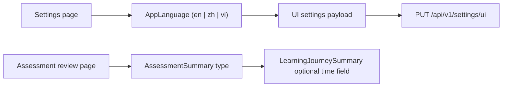

# PR Note: PR #44 Frontend Build Unblock for Vietnamese UI Types

## Summary

This follow-up isolates the frontend compile blockers discovered while reviewing PR #44.

- Aligns the settings page UI preference types with the shared `AppLanguage` union that already includes `vi`
- Extends the dashboard assessment summary type so the assessment review page can safely reference the optional `estimated_time_spent` field
- Leaves backend contracts unchanged

## Architecture

## Files

- `web/app/(utility)/settings/page.tsx`
- `web/lib/dashboard-api.ts`

## Validation

- `cd web && npm run build`

## System Map

- `ai_first/architecture/MAIN_SYSTEM_MAP.md` not updated
- Reason: this PR only aligns frontend typing/build contracts and does not change system structure
