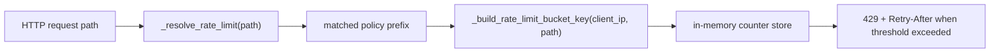

# PR Note: Rate-Limit Bucket Isolation for PR #44 Middleware

## Summary

This follow-up fixes the rate-limit key derivation added in PR #44.

- adds a dedicated bucket-key helper derived from the matched policy prefix
- updates the middleware to use that helper instead of truncating to the first three path segments
- adds regression coverage for marketplace import/list separation and stable keys within the same policy

## Architecture

## Files

- `deeptutor/api/main.py`
- `tests/api/test_rate_limit_middleware.py`

## Validation

- `/Users/nguyenhuuloc/Documents/Multiagent-learning-platform/.venv/bin/python -m pytest tests/api/test_rate_limit_middleware.py -q`
- `/Users/nguyenhuuloc/Documents/Multiagent-learning-platform/.venv/bin/python -m py_compile deeptutor/api/main.py`

## System Map

- `ai_first/architecture/MAIN_SYSTEM_MAP.md` not updated
- Reason: this PR only fixes internal middleware keying and does not change system structure
