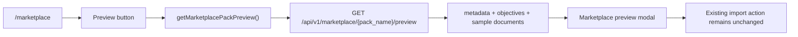

# PR Note: T013 Marketplace Pack Preview Modal

## Summary

This PR adds a compact preview flow to the marketplace so users can inspect a shared knowledge pack before importing it.

- adds `GET /api/v1/marketplace/{pack_name}/preview`
- returns metadata, learning objectives, document count, and a short list of sample documents
- adds a preview action and modal to the marketplace UI without changing the import flow

## Architecture

## Files

- `deeptutor/api/routers/marketplace.py`
- `tests/api/test_marketplace_router.py`
- `web/lib/marketplace-api.ts`
- `web/app/(utility)/marketplace/page.tsx`

## Validation

- `/Users/nguyenhuuloc/Documents/Multiagent-learning-platform/.venv/bin/python -m pytest tests/api/test_marketplace_router.py -q`
- `/Users/nguyenhuuloc/Documents/Multiagent-learning-platform/.venv/bin/python -m py_compile deeptutor/api/routers/marketplace.py`
- `cd web && npm run build`

## System Map

- `ai_first/architecture/MAIN_SYSTEM_MAP.md` updated
- Reason: the marketplace user flow now includes a dedicated preview branch, not just list/import
