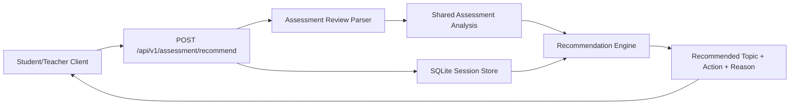

# PR Architecture Note: Assessment Recommendations

## Summary

Adds a deterministic assessment recommendation API that suggests the next focus topic from existing assessment review history.

## Scope

- `deeptutor/services/assessment/analysis.py`
- `deeptutor/services/assessment/recommendation_engine.py`
- `deeptutor/api/routers/assessment.py`
- dashboard analysis refactor to use the shared assessment analysis helper
- targeted API regression coverage

## Mermaid Diagram



## Architecture Impact

This change introduces a small assessment service layer for reusable analysis and next-assessment recommendation logic. The first version stays deterministic and reuses existing session/review data instead of adding a new analytics store or LLM dependency.

## Data/API Changes

- Adds `POST /api/v1/assessment/recommend`
- Request body:
  - `session_id` optional
  - `limit` optional
- Response includes:
  - `status`
  - `recommended_topic`
  - `suggested_action`
  - `recommended_knowledge_bases`
  - `source_session_ids`
  - `reason`
  - `history_summary`

## Tests

```bash
python3 -m pytest tests/api/test_dashboard_router.py tests/api/test_assessment_router.py -q
python3 -m py_compile deeptutor/api/routers/assessment.py deeptutor/api/routers/dashboard.py deeptutor/api/main.py deeptutor/services/assessment/analysis.py deeptutor/services/assessment/recommendation_engine.py
```

## Main System Map Update

- [x] Updated `ai_first/architecture/MAIN_SYSTEM_MAP.md`
- [ ] Not needed
