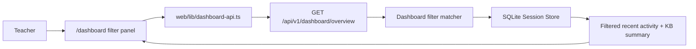

# PR Architecture Note: Dashboard Filtering

## Summary

Adds teacher dashboard filtering for activity type, knowledge pack, search term, and minimum assessment score.

## Scope

- dashboard overview filtering query params
- dashboard API client support for filters
- teacher dashboard filter panel UI
- targeted dashboard API regression coverage

## Mermaid Diagram



## Architecture Impact

This change keeps filtering inside the existing overview route instead of adding a separate dashboard sessions API. The current dashboard flow remains read-only and deterministic.

## Data/API Changes

- Extends `GET /api/v1/dashboard/overview` with:
  - `type`
  - `knowledge_base`
  - `search`
  - `min_score`
- Extends `GET /api/v1/dashboard/recent` with the same filter set for consistency

## Tests

```bash
python3 -m pytest tests/api/test_dashboard_router.py -q
python3 -m py_compile deeptutor/api/routers/dashboard.py
cd web && npm run build
```

## Main System Map Update

- [x] Updated `ai_first/architecture/MAIN_SYSTEM_MAP.md`
- [ ] Not needed
