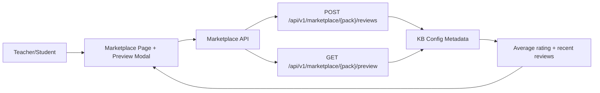

# PR Architecture Note: Marketplace Ratings & Reviews

## Summary

Adds lightweight ratings and short reviews for marketplace knowledge packs using existing pack metadata storage.

## Scope

- marketplace router review submission endpoint
- marketplace list/preview rating summary payloads
- marketplace frontend rating display and review form
- targeted marketplace API regression coverage

## Mermaid Diagram



## Architecture Impact

The first version stores ratings as lightweight `marketplace_reviews` metadata on each shared knowledge pack. This keeps the change inside the existing marketplace/config flow without introducing a new database table yet.

## Data/API Changes

- Extends marketplace list/detail/preview responses with `rating_summary`
- Extends preview/detail responses with `recent_reviews`
- Adds `POST /api/v1/marketplace/{pack_name}/reviews`

## Tests

```bash
python3 -m pytest tests/api/test_marketplace_router.py -q
python3 -m py_compile deeptutor/api/routers/marketplace.py
cd web && npm run build
```

## Main System Map Update

- [x] Updated `ai_first/architecture/MAIN_SYSTEM_MAP.md`
- [ ] Not needed
