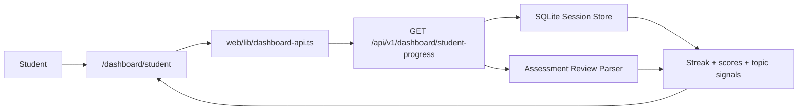

# PR Architecture Note: Student Progress Dashboard

## Summary

Adds a student-facing dashboard route that summarizes assessment performance, recent progress, and topic signals from the existing unified session store.

## Scope

- `GET /api/v1/dashboard/student-progress`
- `web/app/(workspace)/dashboard/student/page.tsx`
- shared dashboard API typings and client fetch
- dashboard router regression coverage
- teacher dashboard link to the new student route

## Mermaid Diagram



## Architecture Impact

This change extends the existing dashboard route family instead of introducing a second analytics service or persistence layer. Student progress is derived deterministically from existing sessions and assessment review messages.

## Data/API Changes

- Adds `GET /api/v1/dashboard/student-progress`
- Returns:
  - `totals`
  - `focus_topics`
  - `mastered_topics`
  - `score_trend`
  - `recent_assessments`

## Tests

```bash
python3 -m pytest tests/api/test_dashboard_router.py -q
python3 -m py_compile deeptutor/api/routers/dashboard.py
cd web && npm run build
```

## Main System Map Update

- [x] Updated `ai_first/architecture/MAIN_SYSTEM_MAP.md`
- [ ] Not needed
