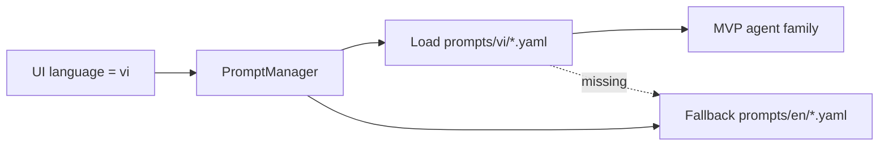

# PR Note — T018 Vietnamese LLM Prompt Variants

## Summary

- Added `vi` prompt variants for the MVP agent families:
  - `chat`
  - `solve`
  - `question`
  - `guide`
  - `co_writer`
  - `research`
- Kept the existing prompt loader unchanged because `PromptManager` already supports `vi -> en` fallback.
- Added prompt-loading regression coverage to confirm Vietnamese variants are preferred when available.

## Architecture Impact

- Runtime structure did not change.
- Prompt selection now resolves to Vietnamese content earlier in the existing language fallback chain when `language=vi`.
- `ai_first/architecture/MAIN_SYSTEM_MAP.md` was not updated because no route, data flow, or component boundary changed.

## Validation

- `python3 -m pytest tests/core/test_prompt_manager.py -q`

## Risks

- Some non-MVP prompt families still rely on the existing fallback chain.
- Several `vi` files intentionally keep some structural prompt text close to the English source to minimize behavior drift while forcing Vietnamese responses on the main flows.
