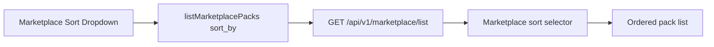

# PR Note — T019 Marketplace Sorting Options

## Summary

- Added API-backed `sort_by` support to marketplace list responses.
- Wired marketplace UI sorting to the server contract with a dedicated dropdown.
- Added regression coverage for popularity, recency, rating, and objective-count ordering.

## Architecture Impact

- No route topology or data model changed.
- `GET /api/v1/marketplace/list` now accepts an additional query parameter without breaking existing callers.
- `ai_first/architecture/MAIN_SYSTEM_MAP.md` was not updated because the change only extends an existing marketplace list flow.

## Validation

- `python3 -m pytest tests/api/test_marketplace_router.py -q`
- `python3 -m py_compile deeptutor/api/routers/marketplace.py`
- `cd web && npm run build`

## Risks

- Current popularity sorting uses review count first, then session count as a secondary signal because the existing payload does not yet expose a separate download/import counter.
