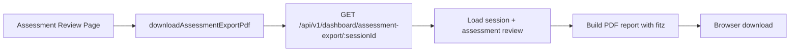

# PR Note — T020 Assessment Results Export to PDF

## Summary

- Added a dashboard export endpoint that returns a downloadable PDF assessment report.
- Wired the assessment review page with an `Export PDF` action that downloads the backend-generated report.
- Added regression coverage that validates both the PDF response contract and the generated content.

## Architecture Impact

- No route topology was removed or restructured.
- The dashboard router now exposes one additional assessment export endpoint for existing review sessions.
- `ai_first/architecture/MAIN_SYSTEM_MAP.md` was not updated because this PR extends an existing dashboard review flow without changing core system boundaries.

## Validation

- `python3 -m pytest tests/api/test_dashboard_router.py -q`
- `python3 -m py_compile deeptutor/api/routers/dashboard.py`
- `cd web && npm run build`

## Risks

- PDF layout is intentionally minimal and text-first for the first pass; longer assessments may span multiple pages without richer formatting yet.
