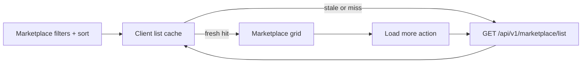

# PR Note — T023 Marketplace List Caching & Pagination Optimization

## Summary

- Added a lightweight client-side cache for marketplace list queries with a five-minute TTL.
- Updated the marketplace page to reuse cached first-page results and refresh them in the background when stale.
- Replaced previous/next replacement pagination with progressive load-more behavior so already visible cards stay on screen.

## Architecture Impact

- No backend route changes were required.
- Marketplace list state now flows through a small cache layer in `web/lib/marketplace-api.ts`.
- The marketplace page reuses cached query responses, explicitly refreshes on demand, and appends subsequent pages without replacing earlier results.
- `ai_first/architecture/MAIN_SYSTEM_MAP.md` was not updated because this PR improves an existing marketplace browse flow without changing system boundaries.

## Validation

- `cd web && npm ci && npm run build`

## Risks

- Search remains a client-side filter over the currently loaded cards, so search results still depend on how many pages have been loaded for the active query.
