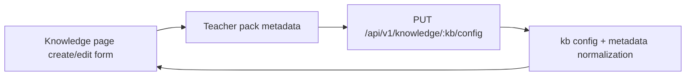

# PR Note — T024 Teacher Team Invitation & Sharing

## Summary

- Extended teacher-pack metadata to store team members and pending invite emails.
- Updated the knowledge base create/edit UI to manage collaboration details when a pack uses team sharing.
- Added regression coverage for knowledge metadata normalization and persistence of the new collaboration fields.

## Architecture Impact

- No new route family was added in this slice.
- Collaboration state now rides on the existing knowledge-base config metadata contract.
- The knowledge page remains the teacher-side control surface for pack ownership, sharing status, collaborator roster, and pending invites.
- `ai_first/architecture/MAIN_SYSTEM_MAP.md` was not updated because this PR extends the current knowledge-pack management flow without introducing a new subsystem boundary.

## Validation

- `python3 -m pytest tests/api/test_knowledge_router.py tests/knowledge/test_kb_metadata_normalization.py -q`
- `cd web && npm ci && npm run build`

## Risks

- Pending invite emails are stored as metadata only in this slice; outbound invitation delivery and access enforcement still need a later collaboration/auth pass.
