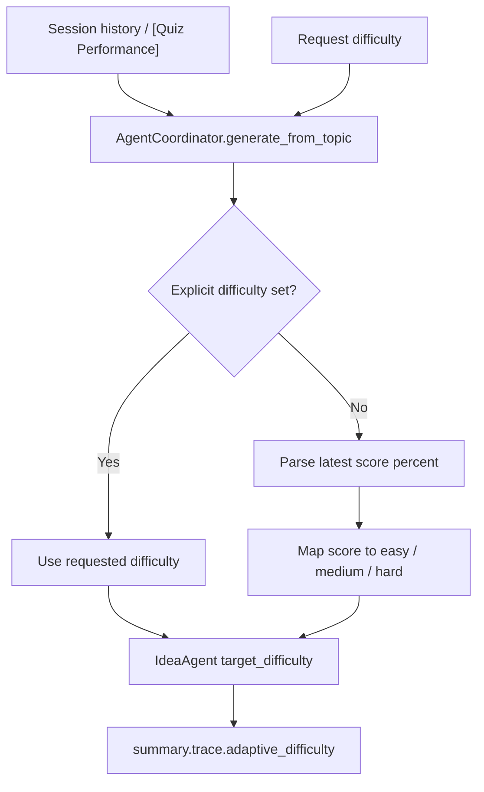

# PR Note: T025 Adaptive Difficulty

## Summary

This slice adds coordinator-side adaptive difficulty selection for `deep_question` when the request difficulty is blank or `auto`. The coordinator now inspects the most recent `[Quiz Performance]` score in session history, maps it to `easy`, `medium`, or `hard`, and records that decision in the generation summary trace.

## Architecture

## Files

- `deeptutor/agents/question/coordinator.py`
- `tests/agents/question/test_coordinator.py`
- `ai_first/architecture/MAIN_SYSTEM_MAP.md`

## Verification

- `python3 -m pytest tests/agents/question/test_generator.py tests/agents/question/test_coordinator.py -q`
- `python3 -m py_compile deeptutor/agents/question/coordinator.py`

## MAIN_SYSTEM_MAP

Updated: `yes`
